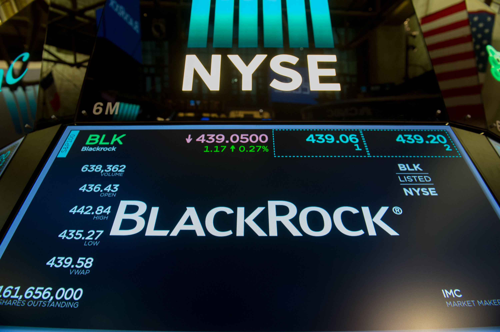

The modern financial landscape is experiencing significant transformation due to advancements in algorithmic trading, the influence of mutual funds, and the strategic operations of major banks like Bank of America. Algorithmic trading, which harnesses the power of computer algorithms to execute trades at high speeds and volumes, is revolutionizing how financial institutions operate. This method leverages sophisticated algorithms that analyze historical data and current market conditions to make optimal trading decisions, thereby enhancing the efficiency of financial markets.

Mutual funds remain crucial players in the investment sector, bringing together resources from individual and institutional investors to diversify holdings and reduce risk. Notably, these funds often hold substantial shares in large financial institutions, including Bank of America. A key example is the Vanguard Total Stock Market Index Fund, which is one of the largest shareholders in Bank of America, underscoring the intricate ties between mutual funds and major banks.

Understanding these dynamics is essential for investors navigating an increasingly complex environment. The role of major stakeholders, such as mutual funds, exerts considerable influence over market conditions and investment outcomes. In light of these developments, Bank of America exemplifies how a major financial entity positions itself strategically to capitalize on technological advancements in trading and investment. By examining Bank of America's role within this ecosystem, we gain valuable insights into broader financial trends and strategies.

In this rapidly evolving financial landscape, an investor's ability to comprehend and adapt to the interplay of technological innovation and traditional finance can significantly impact investment success. As algorithmic trading and large financial institutions continue to shape the contours of global markets, staying informed and adaptable becomes increasingly important.

## Table of Contents

## Understanding Mutual Funds and Their Shareholders

Mutual funds significantly contribute to the investment sector by aggregating capital from a diverse array of investors to acquire a variety of securities. This collective investment approach enables mutual funds to achieve diversification, thereby mitigating risk for individual investors. Diversification is a critical strategy in financial management, typically expressed by the formula:

$$
\text{Risk}_{\text{Portfolio}} = \sum_{i=1}^{n} \left( w_i^2 \cdot \sigma_i^2 \right) + \sum_{i=1}^{n} \sum_{j \neq i} w_i \cdot w_j \cdot \text{Cov}(r_i, r_j)
$$

where $w_i$ is the weight of security $i$ in the portfolio, $\sigma_i^2$ is the variance of the security's return, and $\text{Cov}(r_i, r_j)$ is the covariance between the returns of securities $i$ and $j$. By holding a mix of asset classes, mutual funds can reduce unsystematic risk, which is the portion of total risk unique to a particular company or industry.

Mutual fund shareholders represent a broad spectrum, including individual retail investors, institutional investors, and various financial entities, each contributing to the fund's pool of capital. Among these, institutional investors often hold significant equity stakes in various corporations due to their substantial capital resources. Key stakeholders such as Vanguard and SPDR exemplify this, frequently maintaining substantial positions in notable financial institutions, including Bank of America.

Vanguard, for instance, operates several mutual funds that are major shareholders in large corporations. The Vanguard Total Stock Market Index Fund is a prime example, having a significant shareholding in Bank of America. This fund tracks the CRSP US Total Market Index and represents a broad spectrum of the U.S. stock market, encompassing approximately 100% of the U.S. investable equity market.

The strategic positioning of mutual funds like Vanguard within large financial entities such as Bank of America underscores the profound impact that mutual funds have on corporate governance and financial market dynamics. By acting as large shareholders, these funds can influence corporate decisions, policy measures, and strategic directions of their portfolio companies. Consequently, their investment patterns can significantly sway stock prices and market movements, reflecting the intricate interplay between capital market participants.

## The Rise of Algorithmic Trading

Algorithmic trading, commonly referred to as algo trading, is revolutionizing the financial markets by utilizing computer programs and sophisticated algorithms to execute trades at speeds and volumes unattainable by human traders. This method employs complex algorithms that integrate both historical data and real-time market conditions to optimize trading strategies and enhance decision-making.

At its core, [algorithmic trading](/wiki/algorithmic-trading) relies on mathematical models and statistical analyses to identify trading opportunities. For instance, algorithms can be designed to follow a set of predefined instructions such as moving average crossovers or more advanced strategies like statistical [arbitrage](/wiki/arbitrage). The execution of trades using these automated systems allows for an objective, disciplined approach free from emotional biases.

The rise of algorithmic trading has markedly increased the efficiency of financial markets. By enabling rapid execution and order processing, it reduces transaction costs and improves [liquidity](/wiki/liquidity-risk-premium). Moreover, the high-frequency aspect of algo trading means that large volumes of shares can be traded with minimal market impact compared to manual trading processes. However, this efficiency comes hand in hand with enhanced market [volatility](/wiki/volatility-trading-strategies) and new challenges in risk management. The rapid entry and [exit](/wiki/exit-strategy) of positions in the market can lead to substantial price swings, potentially impacting market stability.

Financial institutions like Bank of America harness the power of algorithmic trading to refine their trading operations and develop sophisticated financial products and services for their clientele. By incorporating algorithmic strategies, they can react faster to market conditions, manage large portfolios dynamically, and mitigate risks more effectively. Furthermore, algorithmic trading supports complex investment and trading strategies that align with the bank's broader financial objectives. 

This integration of technology in trading reflects a broader trend toward digital transformation within the financial services industry. With advancements in data analytics, [artificial intelligence](/wiki/ai-artificial-intelligence), and [machine learning](/wiki/machine-learning), the scope and capability of algorithmic trading continue to expand. These technological innovations allow traders to handle vast datasets, detect patterns, and execute trades with higher precision and reduced latency.

As technology evolves, the financial sector must address both the opportunities and challenges presented by algorithmic trading. It necessitates robust regulatory frameworks to mitigate systemic risks and protect market integrity. The dynamic nature of technology dictates a continuous adaptation cycle for financial institutions to maintain competitive advantage and operational excellence in the rapidly changing landscape of global finance.

## Bank of America's Strategic Position

Bank of America stands as a prominent financial institution, securing its position as the second-largest bank by assets in the United States. Its vast operations encompass several key areas within the financial sector, notably retail banking, wealth management, and investment banking. This broad scope enables the bank to cater to diverse client needs, offering a holistic suite of financial services that reinforces its competitive edge.

One of the critical aspects of Bank of America's strategic positioning is its capacity to deploy and capitalize on algorithmic trading technologies. With substantial resources at its disposal, the bank can implement sophisticated trading algorithms that enhance operational efficiencies and provide advanced financial services to its clients. Algorithmic trading allows the bank to execute trades at high speeds and volumes, leveraging real-time data and complex algorithms to optimize outcomes.

Moreover, Bank of America's strategic alliances with major mutual funds, such as Vanguard and SPDR, underscore its influential presence in the financial ecosystem. These relationships not only exemplify the bank's integral role in financial markets but also reflect its interconnectedness with key stakeholders who hold significant positions in major financial assets. For instance, the Vanguard Total Stock Market Index Fund is a noteworthy shareholder, further reinforcing the mutual dependency and strategic alignments within the financial community.

Understanding Bank of America's strategies, particularly its incorporation of cutting-edge trading technologies, is crucial for investors aiming to make informed decisions. The bank's robust position allows it to remain at the forefront of financial services innovation, adapting to and shaping market trends. As a result, investors can benefit from insights into the bank's strategic directions and technological advancements, which can inform adaptive investment strategies aligned with modern market conditions.

## Implications for Investors

Investors must recognize the significant influence that large financial institutions and mutual funds exert on market dynamics. The implementation of algorithmic trading across these entities has transformed traditional financial landscapes, resulting in qualitative and quantitative shifts in market conditions. Particularly, algorithmic trading can alter stock prices and trading volumes, affecting liquidity and market depth. As algorithms react to market signals with unprecedented speed, the risk of flash crashes and rapid price shifts increases, challenging conventional risk management approaches.

Understanding the strategies and technologies employed by major players like Bank of America is crucial. These institutions leverage advanced trading algorithms to optimize their market positions and enhance profitability. For example, algorithmic trading strategies may include mean reversion, [trend following](/wiki/trend-following), and [statistical arbitrage](/wiki/statistical-arbitrage), each necessitating a strong grasp of both market data and the underlying mathematical models. Investors can gain an edge by examining the technological advancements implemented by these financial powerhouses, which often set industry benchmarks.

Shareholders in mutual funds should pay close attention to these funds' investment in significant financial institutions. The exposure of a mutual fund to a single entity like Bank of America can significantly influence its performance, especially in times of market volatility. Mutual funds' investment decisions, influenced by their stakes in major banks, can propagate through the markets, amplifying effects across diverse asset classes. Therefore, staying informed about these investments is essential for risk assessment and strategic planning.

The fusion of technology and traditional finance offers opportunities and challenges for investors. Technological integration, through advances in computing power and data analytics, provides tools for more informed decision-making. However, this rapidly evolving landscape demands adaptive investment strategies that consider both historical data and forward-looking technological trends. Investors should employ a dynamic approach, integrating quantitative analysis with qualitative insights, to navigate the complexities of modern financial markets effectively. 

Ultimately, an informed and flexible investment strategy, augmented by an understanding of technological and market nuances, enhances the ability to capitalize on the evolving financial environment. This preparedness is crucial as algorithmic trading and large institutional influences continue to shape the future of global markets.

## Conclusion

The intersection of mutual fund shareholders, algorithmic trading, and Bank of America's operations exemplifies the intricacies inherent in today’s financial markets. As advancements in financial technologies unfold, institutions such as Bank of America are poised to stay at the forefront by adopting innovative strategies. For investors, effectively navigating this complex landscape necessitates a comprehensive understanding of both technological advancements and traditional financial principles. Remaining informed and adaptable in investment strategies is essential to leverage the opportunities provided by this dynamic market environment. Looking ahead, the integration of algorithmic trading alongside the influential roles of large financial institutions will continue to define the global markets, shaping their evolution in unprecedented ways. Understanding this evolving framework is crucial for market participants aiming to maintain competitive advantage and investment return.

## References & Further Reading

[1]: Bergstra, J., Bardenet, R., Bengio, Y., & Kégl, B. (2011). ["Algorithms for Hyper-Parameter Optimization."](https://papers.nips.cc/paper/4443-algorithms-for-hyper-parameter-optimization) Advances in Neural Information Processing Systems 24.

[2]: ["Advances in Financial Machine Learning"](https://www.amazon.com/Advances-Financial-Machine-Learning-Marcos/dp/1119482089) by Marcos Lopez de Prado

[3]: ["Evidence-Based Technical Analysis: Applying the Scientific Method and Statistical Inference to Trading Signals"](https://www.amazon.com/Evidence-Based-Technical-Analysis-Scientific-Statistical/dp/0470008741) by David Aronson

[4]: ["Machine Learning for Algorithmic Trading"](https://github.com/stefan-jansen/machine-learning-for-trading) by Stefan Jansen

[5]: ["Quantitative Trading: How to Build Your Own Algorithmic Trading Business"](https://www.amazon.com/Quantitative-Trading-Build-Algorithmic-Business/dp/1119800064) by Ernest P. Chan