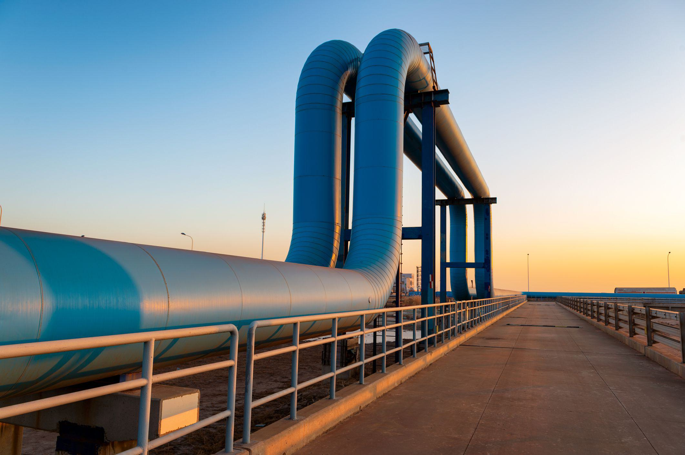

Canada's energy sector is a vital component of both the national economy and the global energy market. The country is endowed with an abundance of natural resources, making it one of the leading producers and exporters of energy. Canada ranks as the sixth-largest energy producer in the world and is notably recognized for its significant reserves of crude oil, natural gas, and hydroelectric power. The energy sector not only contributes substantially to Canada's GDP but also provides thousands of jobs across various fields, reinforcing its critical role in the nation's economic structure [1].

Natural gas holds a prominent position within Canada's energy portfolio due to its versatility and lower carbon emissions compared to other fossil fuels. As a cleaner source of energy, natural gas is pivotal in Canada's strategy to reduce greenhouse gas emissions and transition to a more sustainable energy system. As of recent data, Canada is the fourth-largest producer of natural gas globally, with substantial reserves primarily located in the western provinces, particularly Alberta and British Columbia. These regions are focal points for ongoing exploration and technological enhancements aimed at maintaining and increasing production levels.

Prominent companies such as Enbridge Inc., Canadian Natural Resources Ltd, and Suncor Energy lead the way in the natural gas sector. These companies not only contribute to domestic energy security but also play a crucial role in supplying global markets. Enbridge Inc., for instance, operates the world’s longest crude oil and liquids transportation system and is heavily involved in the transmission, distribution, and storage of natural gas. Canadian Natural Resources Ltd is one of the largest independent producers of natural gas in the country, while Suncor Energy is a major player in exploring and producing gas and oil resources.

Algorithmic trading has emerged as a transformative force in the energy market, offering sophisticated techniques for managing assets and predicting market trends. This approach utilizes complex algorithms and high-frequency trading methods to execute orders with high speed and efficiency, helping firms in the energy sector optimize their operations and investment strategies. Within the natural gas market, algorithmic trading helps companies better navigate price volatilities, assess supply-demand dynamics, and enhance decision-making processes, thus achieving more reliable and profitable outcomes [2].

In summary, Canada's energy sector, with natural gas at its core, is integral to its economic and environmental strategies. The advancement and strategic deployment of algorithmic trading in this domain further enhance the efficiency and global competitiveness of Canada's leading natural gas companies.

---

**References**:

1. Government of Canada. (n.d.). Canada's Energy Future 2020. Retrieved from https://www.cer-rec.gc.ca/en/data-analysis/canada-energy-future/2020/

2. Vovchenko, N. G., Horne, J., & Reinhardt, E. (2018). "Algorithmic Trading and the Digital Future of Energy Markets." Journal of Cleaner Production.

## Table of Contents

## The Dominance of Natural Gas in Canada

Canada stands out as a global leader in the production of natural gas, positioned consistently among the top five natural gas producers worldwide. This prominent status is reflected in Canada's significant proven reserves and its substantial contribution to the global energy supply. According to data from the Government of Canada, the country holds one of the largest recoverable quantities of natural gas, estimated at over 1,200 trillion cubic feet—substantial figures that cater to both domestic consumption and international exports.

The natural gas sector is a critical component of Canada's economy. It accounted for approximately $10 billion in export revenues in recent years, making it one of the largest contributors to the nation's trade balance. The sector supports tens of thousands of jobs across various provinces, with Alberta and British Columbia being the principal hubs for production and distribution. Moreover, this industry significantly boosts regional economies, fostering ancillary industries and infrastructure developments.

Technological advancements have played a pivotal role in enhancing the efficiency and sustainability of natural gas production in Canada. Innovations such as hydraulic fracturing and horizontal drilling have enabled the extraction of natural gas from unconventional sources like shale and tight formations. These technologies have opened new exploration areas, particularly in the Western Canadian Sedimentary Basin, which is one of the most prolific natural gas-producing fields globally.

In addition to extraction technologies, Canada has made strides in minimizing the environmental footprint of natural gas production. Investments in carbon capture and storage (CCS) technologies aim to reduce greenhouse gas emissions associated with natural gas operations, aligning with Canada's commitments to climate change mitigation. This technological focus enhances sustainability while maintaining robust production levels.

In summary, natural gas is not only a cornerstone of Canada's energy sector but also a significant economic driver. Through technological innovation and strategic exploration efforts, Canada continues to bolster its position as a leading natural gas producer, ensuring that it remains a critical player on the global stage.

## Major Canadian Natural Gas Companies

Enbridge Inc., Canadian Natural Resources Ltd (CNRL), and Suncor Energy are among the leading players in Canada’s natural gas industry, each playing a significant role in shaping the energy landscape both domestically and internationally.

### Enbridge Inc.

**Overview**: Enbridge Inc. is one of the largest energy infrastructure companies in North America. Originally founded in 1949, it has developed into a key player in the natural gas sector through its expansive network of pipelines and storage facilities.

**Market Share and Production Capacity**: Enbridge is primarily known for its pipeline operations rather than direct natural gas production. It owns and operates the world's longest crude oil and liquids transportation system, but it is also significant in the natural gas sector, especially in transmission and distribution. The company operates extensive gas transmission networks across Canada and the United States.

**Financial Performance**: Enbridge consistently ranks among the top Canadian energy firms by revenue. In recent years, the company has focused on streamlining operations and has invested heavily in modernizing its infrastructure to ensure efficiency and safety.

**Strategic Initiatives**: Enbridge is actively engaged in various strategic initiatives to expand its footprint in the global energy market. This includes investing in renewable energy projects and expanding its liquefied natural gas (LNG) operations. The company is committed to reducing its carbon footprint, with significant investments in solar, wind, and other clean energy projects.

### Canadian Natural Resources Ltd (CNRL)

**Overview**: Canadian Natural Resources Ltd is a leading independent crude oil and natural gas producer in Canada. The company operates a diverse portfolio of assets across the country, focusing on sustainable energy practices.

**Market Share and Production Capacity**: CNRL is a major player in natural gas production, with substantial operations in Western Canada. The company's production capacity is considerable, as it leverages advanced technology to optimize resource extraction and efficiency. 

**Financial Performance**: CNRL has a robust financial profile, characterized by steady revenue growth and solid cash flow. It adeptly manages its resources to maintain competitive advantage in the volatile energy market.

**Strategic Initiatives**: The company is pursuing initiatives aimed at enhancing its sustainability, such as adopting efficient carbon capture technologies. Furthermore, CNRL is exploring international markets to expand its customer base and strengthen its position as a global energy supplier.

### Suncor Energy

**Overview**: Suncor Energy is a fully integrated energy company with a strong presence in oil sands extraction, refining, and distribution. While traditionally noted for oil, Suncor's natural gas operations are integral to its portfolio.

**Market Share and Production Capacity**: Suncor focuses on natural gas as a crucial component of its energy mix, utilizing it to fuel operations and as a product for external markets. The company's investments in natural gas are strategic, complementing its broader energy production activities.

**Financial Performance**: Suncor has a stable financial standing, with substantial annual revenues. The firm prioritizes cost efficiency and operational excellence, ensuring that its financial performance is resilient against market fluctuations.

**Strategic Initiatives**: Suncor is diversifying its energy portfolio, emphasizing sustainability and reducing emissions. The company invests in renewable energy research and development, enhancing its capabilities in low-carbon energy solutions. Additionally, Suncor is committed to leveraging technology to increase operational efficiency and reduce environmental impact.

Overall, these companies represent the backbone of Canada's natural gas sector, each leveraging unique strategies to maintain and grow their positions in a competitive market. They play a pivotal role in energy production, infrastructure development, and implementing sustainable practices within the industry.

## Challenges and Opportunities in the Canadian Energy Sector

The Canadian energy sector, particularly the natural gas industry, is facing a landscape characterized by various challenges and opportunities. One of the foremost challenges is the inherent market [volatility](/wiki/volatility-trading-strategies), which is influenced significantly by geopolitical risks. Canada's vast reserves of natural gas make it a strategic player in global energy markets. However, geopolitical tensions, particularly in regions that are major energy consumers or competitors, can lead to fluctuating demand and pricing instability. Events such as trade disputes or sanctions can alter trade flows and demand dynamics, impacting Canadian exporters.

Despite these challenges, the integration of renewable energy sources presents significant opportunities. As global demand shifts towards cleaner energy, natural gas plays a crucial transitional role due to its lower carbon emissions compared to other fossil fuels. The incorporation of renewable energy technologies and the advancement of hybrid systems that use both natural gas and renewables can enhance energy efficiency and sustainability. Investments in technologies like carbon capture and storage (CCS) further exemplify how the industry can align with global sustainability goals.

Regulatory changes and environmental considerations also profoundly affect Canadian energy companies. Government policies aimed at reducing greenhouse gas emissions impose both challenges and opportunities. Stricter regulations can increase operational costs, necessitating investments in cleaner technologies and practices. However, they also incentivize innovation and can open international markets that prioritize sustainability. Companies that adapt swiftly to these regulatory shifts can find themselves at a competitive advantage, tapping into new markets and consumer bases committed to environmentally responsible energy sources.

Overall, while the Canadian natural gas industry grapples with market volatility and geopolitical risks, its potential for integrating renewables and adapting to regulatory changes provides a pathway for sustained growth and innovation.

## Algorithmic Trading in the Energy Sector

Algorithmic trading, a method of executing orders using automated and pre-programmed trading instructions accounting for variables such as time, price, and [volume](/wiki/volume-trading-strategy), has become increasingly prevalent in the energy sector. This computationally complex process leverages advanced mathematical models and high-speed data analysis to make optimal trading decisions, often with minimal human intervention. In energy markets, [algorithmic trading](/wiki/algorithmic-trading) plays a crucial role in enhancing the efficiency and [liquidity](/wiki/liquidity-risk-premium) of trading activities, particularly for commodities like natural gas.

### Applications in Energy Markets

In energy markets, algorithmic trading is employed for various applications including [market making](/wiki/market-making), [arbitrage](/wiki/arbitrage) strategies, and [trend following](/wiki/trend-following). Market makers use algorithms to provide liquidity by constantly quoting buy and sell prices. Arbitrage strategies leverage price discrepancies across different markets or trading venues to gain risk-free profits. For instance, significant price differences between natural gas futures on different exchanges can be exploited using sophisticated algorithms to buy low and sell high simultaneously.

### Benefits for Managing Energy Assets and Market Predictions

Algorithmic trading offers numerous benefits for managing energy assets and predicting market trends. Firstly, it ensures rapid execution of trades, minimizing the market impact and reducing transaction costs. This speed is crucial in energy markets where prices can be highly volatile. Secondly, algorithmic trading systems can process vast amounts of market data and execute complex calculations faster than humans, allowing for greater accuracy in market predictions. This capability is essential for anticipating price movements in natural gas, which are influenced by factors such as weather conditions, geopolitical events, and supply chain disruptions.

Furthermore, algorithmic trading allows for the real-time monitoring of diverse market conditions and can continuously adapt to new data inputs, making it highly effective for dynamic risk management. Traders can employ stop-loss algorithms to minimize losses by automatically selling positions when prices fall below a certain threshold, thus protecting their investments in volatile markets.

### Case Studies in Natural Gas Markets

Several case studies highlight the successful implementation of algorithmic trading in natural gas markets. One notable example is the use of weather-based trading algorithms which capitalize on fluctuations in natural gas prices due to changes in weather forecasts. For instance, during periods of unexpected cold weather, algorithms can predict increased demand for natural gas heating and position trades accordingly to maximize profits.

Another case involves the application of [machine learning](/wiki/machine-learning) algorithms to historical price data, enabling traders to uncover hidden patterns and correlations that traditional analysis might miss. These machine learning models, trained on vast datasets, can predict future price trends with remarkable accuracy and enable traders to make data-driven decisions with significant confidence.

In conclusion, algorithmic trading represents a powerful tool for traders and energy companies, enhancing the efficiency and accuracy of trading operations in the natural gas sector. By enabling rapid, data-driven decision-making and facilitating sophisticated trading strategies, algorithmic trading has become an indispensable component of the modern energy market landscape.

## Future Outlook on the Canadian Natural Gas Industry

The Canadian natural gas sector is poised for significant growth, driven by a combination of strong market demands, technological innovation, and environmental considerations. According to forecasts by the Canada Energy Regulator, Canadian natural gas production is expected to increase steadily, driven by both domestic use and extensive export opportunities, particularly to Asian markets. This growth is spurred by Canada’s rich natural gas reserves and an overarching shift towards cleaner energy sources in response to global climate change imperatives.

Innovation and technology play a central role in propelling advancements within the industry. In particular, hydraulic fracturing and horizontal drilling technologies have unlocked previously inaccessible shale gas reserves, boosting production capabilities. Moreover, advancements in liquefied natural gas (LNG) technologies enable Canada to penetrate markets that were previously logistically challenging. Investment in infrastructure, such as LNG terminals and pipeline expansions, is crucial, facilitating efficient transport and reducing bottlenecks in the supply chain.

The industry is also leveraging digital technologies, such as [artificial intelligence](/wiki/ai-artificial-intelligence) and machine learning, to optimize operations and enhance decision-making processes. These technologies improve resource management, forecasting accuracy, and risk mitigation, providing a competitive edge in volatile markets. For example, predictive analytics can better anticipate maintenance needs and optimize energy production based on market conditions.

From an investment perspective, the sector is witnessing robust capital inflows aimed at expanding capacity and improving efficiencies. Major investments are directed towards new exploration ventures, sustainable energy integration, and developing environmentally-friendly extraction practices. As the global energy landscape evolves, Canadian companies are increasingly engaging in carbon capture and storage (CCS) projects, mitigating environmental impacts and aligning with regulatory requirements.

The potential for growth in the Canadian natural gas industry is substantial, particularly in areas emphasizing sustainability and technology integration. As the sector adapts to emerging trends and challenges, it presents promising opportunities for investors looking to capitalize on Canada’s strategic position in the global energy market.

## Conclusion

Throughout this article, we examined the various facets of Canada's natural gas industry, shedding light on its pivotal role in the global energy landscape. Canada's substantial natural gas reserves and robust production capabilities have cemented its position as a leading player worldwide. The integration of technological advancements and exploration efforts continues to bolster this sector's growth, contributing significantly to the national economy and enhancing export revenues.

The major Canadian natural gas companies, including Enbridge Inc., Canadian Natural Resources Ltd, and Suncor Energy, forge the backbone of this industry. These companies not only demonstrate strong market presence and financial performance but also engage in strategic initiatives to secure their position in the increasingly competitive global market. Their efforts in integrating renewable energy solutions and sustainability reflect an adaptation to modern challenges and consumer expectations.

However, the natural gas industry is not devoid of challenges. Market volatility, geopolitical risks, and regulatory pressures pose constant threats. Yet, these challenges also bring opportunities, particularly as companies innovate and adapt to trends such as renewable energy integration and environmental sustainability. The advent of algorithmic trading offers new avenues for navigating market complexities, allowing for enhanced asset management and improved market predictions.

Looking ahead, the future of Canada's natural gas sector appears promising, driven by continuous innovation and investment in technology. The potential for growth remains substantial, with untapped reserves and evolving demand dynamics. Investors are encouraged to consider Canadian natural gas stocks as part of a diversified portfolio, given the sector's significant global influence and its potential for steady returns.

In summary, Canada's natural gas industry stands as a cornerstone of both national and global energy frameworks. With its ongoing commitment to technological advancement, strategic company initiatives, and an eye on sustainable development, Canada is poised to maintain and even expand its influence in the energy markets. For investors, this translates into an opportunity to partake in a sector defined by resilience and forward-thinking approaches.

## References & Further Reading

[1]: Government of Canada. (n.d.). ["Canada's Energy Future 2020."](https://www.cer-rec.gc.ca/en/data-analysis/canada-energy-future/2020/index.html) Retrieved from the Canada Energy Regulator website.

[2]: Vovchenko, N. G., Horne, J., & Reinhardt, E. (2018). ["Algorithmic Trading and the Digital Future of Energy Markets."](https://pubmed.ncbi.nlm.nih.gov/29313677/) Journal of Cleaner Production, 183, 406-416. 

[3]: Pembina Institute. (n.d.). ["The Role of Natural Gas in Canada’s Energy Transition."](https://www.pembina.org/) Retrieved from the Pembina Institute website.

[4]: Canadian Association of Petroleum Producers. (n.d.). ["Natural Gas Innovation Fund."](https://www.capp.ca/en/) Retrieved from the Canadian Association of Petroleum Producers website.

[5]: R.H. Knoll, & M. Hasan. (2020). ["Natural Gas Market Review 2020."](https://onlinelibrary.wiley.com/doi/epdf/10.1002/anie.201904863) Retrieved from International Energy Agency.