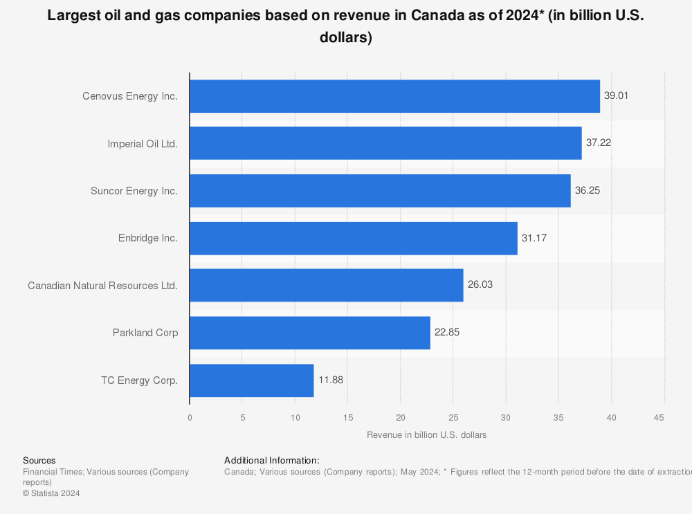

## Table of Contents

## What is natural gas and why is it important?

Natural gas is a type of fuel that comes from deep under the ground. It is made up mostly of a gas called methane, but it can also have other gases mixed in. People find natural gas by drilling into the earth, similar to how they find oil. Once it's found, it can be piped to homes and businesses where it is used for heating, cooking, and making electricity.

Natural gas is important because it is a big source of energy for many people around the world. It is cleaner than other fuels like coal and oil, which means it produces less pollution when burned. This makes it better for the environment. Also, natural gas is used in many industries to make things like plastics, fertilizers, and medicines. So, it plays a big role in our daily lives and helps keep our homes warm, our food cooked, and many products we use made.

## How is natural gas extracted and processed in Canada?

In Canada, natural gas is extracted from underground rock formations. People drill deep into the ground to reach these formations. Sometimes, they use a method called hydraulic fracturing, or "fracking," where they inject water, sand, and chemicals into the rock to break it and release the gas. Once the gas is released, it flows up the well to the surface. The gas can come from traditional gas fields or from shale gas, which is trapped in shale rock.

After the gas is extracted, it needs to be processed to remove impurities like water, sand, and other gases. This is done at gas processing plants. The main goal is to get the gas as clean as possible so it can be safely used. Once it's clean, the natural gas is sent through pipelines to where it's needed. Some of it might be stored in underground storage facilities to be used later. This whole process helps make sure that homes, businesses, and industries in Canada have a reliable supply of natural gas.

## Who are the top natural gas companies operating in Canada?

Some of the top natural gas companies in Canada are big players in the energy industry. Canadian Natural Resources Limited is one of the biggest. They find, produce, and sell natural gas and other energy products. Another big company is Enbridge Inc. They don't just produce natural gas; they also have a huge network of pipelines that move the gas all over Canada and even into the United States. Tourmaline Oil Corp is also important. They focus a lot on natural gas and are known for finding and producing it in western Canada.

These companies are important because they help make sure that people in Canada have the natural gas they need. Canadian Natural Resources Limited and Tourmaline Oil Corp work hard to find new sources of natural gas, which is really important for keeping the supply steady. Enbridge, on the other hand, makes sure that the gas can get from where it's found to where it's used, like in homes and factories. Together, these companies play a big role in Canada's energy industry.

## What is the market share of the largest natural gas companies in Canada?

In Canada, the natural gas market is shared among several big companies. Canadian Natural Resources Limited is one of the biggest players and has a significant share of the market. They are known for finding and producing a lot of natural gas. Enbridge Inc. also has a big part of the market, but they are more focused on moving the gas through their huge pipeline network rather than just producing it. Tourmaline Oil Corp is another important company, and they have a good-sized share of the market too, mainly because they work hard on finding and producing natural gas in western Canada.

It's hard to say exact numbers for how much of the market each company has because these numbers can change. But Canadian Natural Resources Limited, Enbridge Inc., and Tourmaline Oil Corp together make up a large part of the natural gas industry in Canada. They help make sure that there's enough natural gas for everyone who needs it, from people heating their homes to big factories making things.

## How do these companies contribute to the Canadian economy?

The big natural gas companies in Canada, like Canadian Natural Resources Limited, Enbridge Inc., and Tourmaline Oil Corp, help the Canadian economy a lot. They find and produce natural gas, which is important for heating homes, cooking food, and making electricity. This means that people and businesses can have the energy they need to live and work. When these companies do well, they can hire more people, which is good for jobs. They also pay taxes to the government, which helps pay for things like schools and hospitals.

These companies also help the economy by spending money on new projects. For example, they might build new wells to find more natural gas or new pipelines to move it around. This spending helps other businesses that make the equipment or do the construction work. Enbridge, with its big pipeline network, makes sure that natural gas can get from where it's found to where it's needed, which is important for keeping the economy running smoothly. Overall, these companies play a big part in making sure Canada has the energy it needs and that the economy stays strong.

## What are the key regions in Canada for natural gas production?

In Canada, the main places where natural gas comes from are in the western part of the country. Alberta is the biggest producer of natural gas. It has a lot of natural gas fields and also uses a method called fracking to get gas from shale rock. British Columbia is another important place for natural gas. It has big gas fields and is starting to use more fracking too. These two provinces together make most of Canada's natural gas.

There are other places in Canada where natural gas is found, but they are not as big as Alberta and British Columbia. For example, Saskatchewan also produces some natural gas, but not as much. The natural gas from these regions helps to keep homes warm, cook food, and make electricity all across Canada. So, even though most of the gas comes from Alberta and British Columbia, other places help too.

## What are the environmental impacts associated with natural gas production by these companies?

Natural gas production can have some effects on the environment. One big issue is methane leaks. Methane is the main part of natural gas, and if it leaks out during drilling or moving the gas, it can make the air worse. Methane is a strong greenhouse gas, which means it can make the Earth warmer. Another problem is water use. Drilling for natural gas, especially with fracking, uses a lot of water. This can be a problem in places where water is already hard to come by. Also, the water used in fracking can get mixed with chemicals and come back up to the surface as wastewater, which needs to be dealt with carefully so it doesn't harm the environment.

Another environmental impact is land disturbance. When companies drill for natural gas, they need to clear land to build wells and roads. This can hurt the plants and animals that live there. It can also change the look of the land, which some people might not like. There's also the issue of air pollution. Burning natural gas makes less pollution than burning coal or oil, but it still makes some. The pollution can affect the air we breathe and contribute to climate change. Companies like Canadian Natural Resources Limited, Enbridge Inc., and Tourmaline Oil Corp are working to make their operations better for the environment, but these issues are still important to think about.

## How have the largest natural gas companies in Canada adapted to global energy trends?

The biggest natural gas companies in Canada, like Canadian Natural Resources Limited, Enbridge Inc., and Tourmaline Oil Corp, have been paying attention to what's happening with energy around the world. One big trend is that more people want energy that's good for the environment. So, these companies are trying to make their natural gas production cleaner. They are working on new ways to stop methane from leaking and using less water when they drill. They are also looking into new technology to make their operations better for the environment. This helps them keep up with what people want and still provide the energy that Canada needs.

Another trend is that more countries want to buy natural gas from Canada. This is because natural gas is seen as a cleaner option compared to coal and oil. To meet this demand, Canadian companies are working on building new ways to get the gas to other countries. For example, they are building new pipelines and thinking about making more places to turn the gas into a liquid so it can be shipped on boats. By doing this, they can sell more natural gas and help Canada's economy grow. These companies are always trying to find new ways to stay important in the global energy market.

## What are the future projections for natural gas production and consumption in Canada?

In the future, Canada is expected to keep producing a lot of natural gas. The main reason is that there are still big reserves, especially in Alberta and British Columbia. Companies like Canadian Natural Resources Limited and Tourmaline Oil Corp are planning to keep drilling and finding new gas fields. They might also use more fracking to get gas from shale rock. This means that Canada will likely have enough natural gas to meet its own needs and also sell some to other countries. The government and these companies are working together to make sure that the production stays strong and safe for the environment.

As for how much natural gas people in Canada will use, it's expected to stay high or even grow a bit. Natural gas is important for heating homes, cooking, and making electricity. More people are choosing natural gas because it's cleaner than coal and oil. Also, industries that make things like plastics and fertilizers will keep needing natural gas. But, there's a push to use more renewable energy like wind and solar power. So, while natural gas will still be very important, Canada might start using a bit less of it as other energy options become more popular.

## How do Canadian natural gas companies compare globally in terms of production and reserves?

Canadian natural gas companies are important players in the world. Canada has a lot of natural gas, especially in places like Alberta and British Columbia. This means that Canadian companies like Canadian Natural Resources Limited and Tourmaline Oil Corp can produce a lot of natural gas. They are among the top producers in North America. Compared to other countries, Canada has big reserves of natural gas, which helps it stay a strong player in the global market. Countries like the United States and Russia also have a lot of natural gas, but Canada's reserves are still very important.

When it comes to how much natural gas Canada produces compared to other countries, it's in the top group. The United States produces the most natural gas in the world, followed by Russia. Canada is usually in the top ten, often around fifth or sixth place. This shows that Canadian companies are doing well and can compete with big players around the world. They are working hard to keep finding new gas and making sure it's clean and safe for the environment. This helps Canada stay important in the global energy market.

## What regulatory challenges do these companies face in Canada?

Canadian natural gas companies face a lot of rules that they need to follow. The government makes these rules to make sure that finding and using natural gas is safe for people and good for the environment. For example, they have to get special permission before they can start drilling. They also have to follow strict rules about how they handle the gas and what they do with the waste. These rules can make it harder and more expensive for companies to do their work. They need to spend a lot of time and money to make sure they are following all the rules.

Another big challenge is the rules about the environment. Companies have to work hard to stop methane from leaking and use less water when they drill. The government is always making new rules to make sure that natural gas companies are doing their part to help the environment. This can be tough for companies because they have to change how they do things and spend money on new technology. But these rules are important to make sure that natural gas production is as safe and clean as possible.

## What technological innovations are being implemented by these companies to enhance efficiency and reduce environmental impact?

Canadian natural gas companies are using new technology to make their work better and easier on the environment. They are using special tools to find and fix leaks of methane gas. Methane is a big part of natural gas, and if it leaks out, it can harm the air. By finding and fixing these leaks quickly, companies like Canadian Natural Resources Limited and Tourmaline Oil Corp can make their operations cleaner. They are also using new ways to drill that use less water. This is important because water is precious, and using less of it helps the environment.

Another way these companies are getting better is by using technology to make their work more efficient. They use computers and special software to plan where to drill and how to move the gas. This helps them find more natural gas without wasting time and money. Enbridge Inc. is working on new pipelines that are safer and can move more gas. All these new technologies help the companies produce more natural gas in a way that is better for the environment and the economy.

## References & Further Reading

[1]: Government of Canada. (n.d.). ["Canada's Energy Future 2020."](https://www.cer-rec.gc.ca/en/data-analysis/canada-energy-future/2020/index.html) Retrieved from the Canada Energy Regulator website.

[2]: Vovchenko, N. G., Horne, J., & Reinhardt, E. (2018). ["Algorithmic Trading and the Digital Future of Energy Markets."](https://pubmed.ncbi.nlm.nih.gov/29313677/) Journal of Cleaner Production, 183, 406-416. 

[3]: Pembina Institute. (n.d.). ["The Role of Natural Gas in Canada’s Energy Transition."](https://www.pembina.org/) Retrieved from the Pembina Institute website.

[4]: Canadian Association of Petroleum Producers. (n.d.). ["Natural Gas Innovation Fund."](https://www.capp.ca/en/) Retrieved from the Canadian Association of Petroleum Producers website.

[5]: R.H. Knoll, & M. Hasan. (2020). ["Natural Gas Market Review 2020."](https://onlinelibrary.wiley.com/doi/epdf/10.1002/anie.201904863) Retrieved from International Energy Agency.