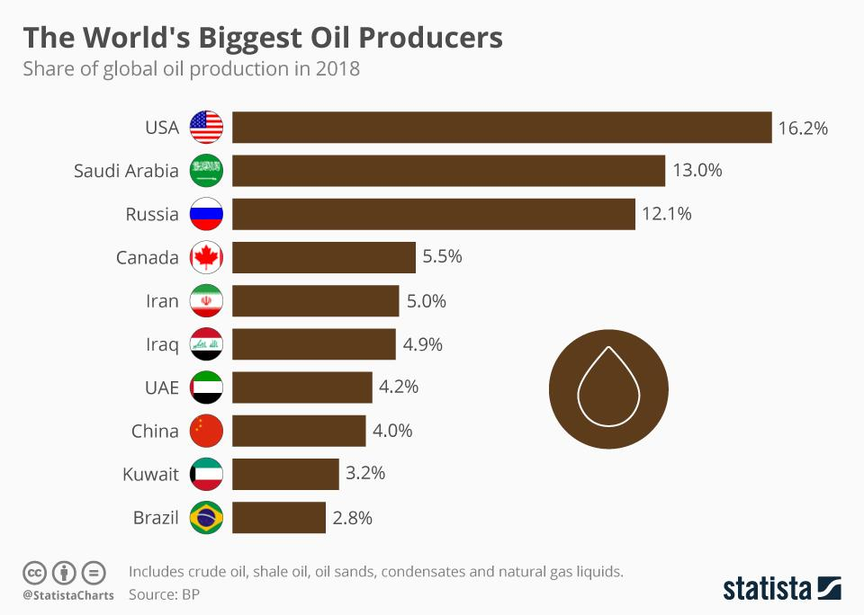

The global oil market is a multifaceted and ever-changing landscape shaped by an interplay of geopolitical, technological, and economic factors. Oil production plays a critical role in shaping a country's economic vitality and geopolitical standing. As one of the most traded commodities, oil influences energy policies, international relations, and economic strategies on a global scale.

The market's complexity stems from various factors. Geopolitical events, such as conflicts in oil-rich regions and international sanctions, can disrupt supply chains and influence oil prices. Technological advancements also play a significant role, with innovations in drilling and extraction techniques boosting production efficiency and enabling access to previously hard-to-reach reserves.

Economic factors further contribute to this dynamic. Global economic growth drives demand for energy, while shifts in consumption patterns, such as the rise of electric vehicles, impact oil demand. Additionally, financial markets heavily influence oil trade dynamics, with algorithmic trading becoming an increasingly significant player in managing price volatility and market risks.

This article aims to provide a comprehensive examination of global oil production trends, spotlight the leading oil-producing nations, and explore the burgeoning influence of algorithmic trading within the oil market. Through these lenses, we will gain insights into the forces shaping the current and future states of the global oil industry.

## Table of Contents

## Current Global Oil Production Landscape

The global oil production landscape in 2023 is characterized by significant shifts influenced by a multitude of factors. Current statistics indicate a steady increase in oil production, primarily driven by heightened global demand and the resurgence of industrial activities post-pandemic. In 2023, the world oil production is estimated to exceed 95 million barrels per day, reflecting an upward trend due to escalating energy requirements and ongoing economic recovery efforts worldwide. 

One of the major factors affecting oil production is economic growth. As economies expand, industrial and consumer demand for energy surges, necessitating increased oil output. Historically, economic booms have been concomitant with spikes in oil production, and 2023 is no exception. Rapid industrialization in developing countries, coupled with recovery in advanced economies, is exerting pressure on oil producers to enhance production capacities.

Geopolitical tensions continue to play a crucial role in shaping the global oil production landscape. Conflicts in key oil-producing regions, such as the Middle East and Eastern Europe, impact production levels and influence global oil prices. Sanctions, trade disputes, and regulatory changes are other geopolitical elements that affect production dynamics. For instance, sanctions on countries like Iran and Russia can limit their ability to export oil, thereby reshaping global supply chains and production strategies.

Technological advancements have significantly impacted oil extraction and production efficiency. Innovations in drilling technologies, such as enhanced horizontal drilling and hydraulic fracturing, have enabled producers to tap into previously inaccessible reserves, boosting production potential. The adoption of digital technologies and data analytics in oil field management has further optimized operational efficiency, reduced production costs, and minimized environmental impact. Automation and real-time monitoring systems are now extensively used to predict equipment failures, streamline operations, and improve safety standards.

In conclusion, the global oil production landscape in 2023 is a complex interplay of economic, geopolitical, and technological forces. These factors collectively shape the strategic approaches adopted by oil-producing nations and determine the trajectory of future production trends. The integration of technology remains pivotal in maximizing extraction efficiencies and meeting evolving global energy demands.

## Top Oil Producing Countries

The global oil industry is predominantly influenced by a few key players whose production capabilities and reserves shape the dynamics of the market. Understanding the intricacies of the production patterns, reserve [statistics](/wiki/bayesian-statistics), and strategic roles of these oil-producing countries provides insights into their impact on the global economy and geopolitical landscape.

**United States:**

The United States has emerged as a leading oil producer largely due to its advances in hydraulic fracturing and horizontal drilling. With significant production primarily in the Permian Basin, the Bakken Formation, and the Eagle Ford Group, the U.S. continues to expand its capacity. As of 2023, the U.S. has sustained an output of approximately 11 million barrels per day (bpd), positioning it as a critical player in global oil supply. The strategic shift in U.S. energy policy toward greater self-reliance while exploring renewable energy alternatives suggests a complex future balancing act between conventional and green energy.

**Saudi Arabia:**

Saudi Arabia remains central to global oil production, primarily through its vast reserves in the Ghawar and Safaniya fields. As the leading member of the Organization of the Petroleum Exporting Countries (OPEC), Saudi Arabia heavily influences global oil prices. The nation's strategic importance is further underscored by its Vision 2030 initiative, which aims to diversify its economy and reduce dependence on oil revenues. Current estimates place Saudi oil production at around 10 million bpd, with a reserve capacity allowing for adjustments to mitigate global supply fluctuations.

**Russia:**

Russia's oil industry is pivotal not only due to its substantial production, pegged at roughly 10.5 million bpd, but also because of its strategic supply routes to Europe and Asia. The Siberian regions, including Western Siberia and the Volga-Urals, serve as the backbone of Russian oil extraction. Geopolitical challenges and Western sanctions have prompted Russia to seek alternative markets and strengthen ties with Asian economies, particularly China. The future of Russian oil heavily depends on its ability to maintain export volumes while navigating geopolitical tensions and economic sanctions.

**Canada:**

Canada's oil production is mainly driven by its vast oil sands located in Alberta, featuring the third-largest proven oil reserves globally. With a production rate of about 4.6 million bpd, Canada plays a critical role in North American energy security. Investments in technology to reduce environmental impacts and increase extraction efficiency are crucial for Canada’s oil sands industry. Future prospects for Canadian oil may be shaped by global climate policies and U.S. energy demand dynamics.

**China:**

While not traditionally seen as a top exporter, China is a significant oil producer, with a production rate of around 3.9 million bpd. China's focus remains on meeting domestic demand through its onshore fields like Daqing and offshore fields in the Bohai Bay. Despite its production capabilities, China is the world's largest oil importer, heavily influencing market dynamics. China's strategic investments in foreign oil assets and energy infrastructure point towards long-term plans to ensure energy security amidst growing consumption.

These countries, by virtue of their production capabilities and strategic influence, shape the contours of the global oil market. Examining their reserves and future prospects reveals a complex interplay of economic ambitions, technological investments, and geopolitical strategies. As the world navigates the energy transition, each nation's role may evolve, leaving a lasting impact on the global energy landscape.

## Emerging Players in the Oil Market

In recent years, several countries have shown significant growth in their oil production capabilities, positioning them as emerging players within the global oil market. Brazil, Iraq, and the United Arab Emirates (UAE) are among the standout examples. Each of these nations has leveraged its geographic, economic, and political strengths to boost production and influence within the industry.

**Brazil's Rising Oil Production**

Brazil has become a significant player due to its massive offshore oil reserves, particularly the pre-salt fields located in the Santos and Campos basins. These reserves are challenging to access due to their depth beneath layers of salt, rock, and water. However, advancements in deepwater drilling technology have made it possible for Brazil to tap into these resources. Petrobras, the state-controlled oil company, has been instrumental in this development, achieving substantial production growth. According to the National Agency of Petroleum, Natural Gas and Biofuels (ANP), Brazil's oil production reached an average of 3.1 million barrels per day in 2023, marking a steady increase from previous years.

**Iraq's Strategic Oil Reserves**

Iraq boasts one of the largest proven oil reserves globally, and its production potential is immense. The country's oil output was reinvigorated following geopolitical stabilization efforts and investment in its oil infrastructure. As of 2023, Iraq produced approximately 4.5 million barrels per day, with plans to further increase output by enhancing its oil export infrastructure and attracting foreign investment. Challenges such as political instability and security issues remain, which can hinder production and investment interests.

**United Arab Emirates' Technological Innovation**

The UAE is distinguished by its strategic investments in both traditional oil extraction methods and renewable energy initiatives. The country has prioritized enhancing its production efficiency through advanced technologies like enhanced oil recovery (EOR). The ADNOC (Abu Dhabi National Oil Company) has been pivotal in these advancements, supporting increased production capabilities. By 2023, the UAE maintained an output of around 4 million barrels per day. Its efforts to remain competitive are complemented by a focus on sustainability and alternative energy sources, ensuring long-term relevance in the energy sector.

**Untapped Potential in Africa and Northern Siberia**

Sub-Saharan Africa presents a promising opportunity for increased oil production, with countries like Nigeria and Angola leading the way. However, vast untapped reserves remain across the continent, particularly in regions like East Africa and the Congo Basin. Simultaneously, Northern Siberia holds considerable potential with its unexplored reserves, although harsh climatic conditions and a lack of infrastructure pose significant hurdles.

**Challenges for Emerging Oil Producers**

Emerging oil producers face a myriad of challenges, including political instability, regulatory hurdles, and underdeveloped infrastructure. These factors can impede exploration and production efforts and deter foreign investment. Additionally, fluctuating global oil prices can impact revenue streams, making economic planning difficult. Addressing these issues requires strong governance, investment in infrastructure, and strategic partnerships with established global oil companies to leverage technology and expertise. 

In summary, the global oil market's landscape is evolving, with emerging players like Brazil, Iraq, and the UAE expanding their production capabilities. However, capitalizing on untapped resources and mitigating challenges remains vital for sustained growth and influence in the oil industry.

## The Impact of Algorithmic Trading on Oil Markets

Algorithmic trading has become a significant force in global financial markets, including the oil markets. This form of trading utilizes complex algorithms to make trading decisions at speeds and frequencies that are impossible for human traders. By leveraging data analytics, mathematical models, and [machine learning](/wiki/machine-learning), [algorithmic trading](/wiki/algorithmic-trading) systems aim to optimize trading strategies and enhance market efficiency.

In the context of oil markets, algorithmic trading plays a crucial role in managing price [volatility](/wiki/volatility-trading-strategies) and associated market risks. Oil prices are notoriously volatile, influenced by various factors ranging from geopolitical tensions and natural disasters to shifts in global demand and supply dynamics. Automated trading systems can swiftly analyze vast datasets, detect patterns, and execute trades that capitalize on these fluctuations, often within milliseconds.

One of the key benefits of algorithmic trading in oil markets is its ability to improve [liquidity](/wiki/liquidity-risk-premium). By executing a large [volume](/wiki/volume-trading-strategy) of transactions quickly, these systems contribute to more stable pricing and tighter bid-ask spreads. This increased liquidity helps reduce transaction costs and facilitates smoother market operations.

Additionally, algorithmic trading systems can be programmed to implement sophisticated risk management strategies. For instance, algorithms can diversify portfolios, hedge against adverse price movements, and optimize trading positions based on real-time market data and predictive analytics. These capabilities are particularly valuable in the highly volatile oil markets, where rapid price swings can lead to significant financial losses.

However, algorithmic trading also presents challenges. The speed and complexity of these systems can sometimes lead to unforeseen consequences, such as flash crashes or market distortions. For example, an algorithm's malfunction or unintended interaction with other trading systems can cause a rapid and aggressive sell-off, triggering sharp price declines unrelated to fundamental market conditions.

There is also the issue of market fairness and transparency. The dominance of high-frequency traders using advanced algorithms can create an uneven playing field, disadvantaging traditional traders who cannot compete with such technological prowess. This has raised concerns among regulators, prompting discussions on implementing regulatory measures to ensure fair and equitable trading environments.

In conclusion, while algorithmic trading offers notable advantages in managing volatility and enhancing market efficiency in oil trading, it also requires careful oversight and regulation. Balancing these benefits with the challenges posed is crucial for maintaining robust and stable oil markets. The strategic deployment of algorithmic trading, combined with ongoing technological innovations and regulatory frameworks, is essential for navigating the complexities of the oil trading landscape.

## Future Outlook and Strategic Considerations

In analyzing the future trends of global oil production and consumption, several critical factors must be considered. The International Energy Agency (IEA) projects fluctuations in oil demand due to varying rates of economic growth, technological advancements, and shifts in consumer preferences. Notably, an increasing emphasis on energy efficiency and alternative energy sources significantly influences these trends.

Renewable energy sources are gaining traction worldwide, presenting a potential challenge to the traditional oil market. According to the IEA, renewables could account for almost 30% of global electricity demand by 2025, exerting downward pressure on oil demand. Countries are increasingly adopting policies favoring electrification of the transport sector, which could reduce oil consumption, traditionally one of the primary uses of oil. For instance, electric vehicle (EV) adoption is expected to accelerate, potentially decreasing the demand for gasoline. Policy incentives such as tax credits and regulations that limit emissions bolster this shift, creating a foreseeable decline in oil dependency.

Global energy policies are increasingly integrating objectives to curb emissions and enhance sustainability. The Paris Agreement and other international accords underscore a collaborative effort to mitigate climate change by reducing reliance on fossil fuels. Such global policy initiatives catalyze investment in renewable technologies, further diminishing the future role of oil. However, this transition poses strategic challenges for nations heavily reliant on oil production and exports.

Countries reliant on oil production must adapt to these evolving energy landscapes to maintain economic stability. A recommended strategic approach is diversification. Oil-rich nations could invest in renewable energy infrastructure and technologies to mitigate dependence on oil revenues. Implementing policies that promote energy efficiency and reduce carbon emissions may not only align with global trends but also open avenues for new economic opportunities. 

Additionally, investing in technological advancements can optimize current oil extraction and production processes, enhancing efficiency and prolonging the relevance of existing oil resources. Advanced technologies like carbon capture and storage (CCS) might allow these countries to curtail their carbon footprint while maintaining oil production levels.

Furthermore, forming strategic alliances and participating in international agreements can provide oil-producing countries with greater resilience against global policy shifts. Collaborating on research and technological innovation in energy can position these nations as leaders in the transition to a more sustainable global energy framework.

In summary, while the global oil market faces considerable challenges from renewable energy growth and shifting policies, opportunities for adaptation and innovation exist. By embracing diversification, technological advancement, and strategic alliances, oil-producing countries can navigate the uncertainties of future energy demands and maintain their economic stability.

## Conclusion

The examination of global oil production and trading dynamics reveals a multifaceted interplay between geopolitical factors, technological advancements, and strategic market decisions. Amidst fluctuating demand and complex international relations, the significance of oil remains paramount, influencing both global economic stability and national power. Geopolitical tensions, such as conflicts or alliances that affect oil-rich regions, play a critical role in determining production levels and pricing structures. Countries strive to maintain or enhance their influence in the oil market through strategic alignments and adaptations to international policies.

Technological advancements have undeniably shaped current oil production capabilities. Innovations in extraction techniques, such as hydraulic fracturing and horizontal drilling, have unlocked previously inaccessible reserves and improved efficiency significantly. These advancements have allowed some countries to transform into major oil producers, altering the traditional power dynamics of global energy supply. The implementation of technology not only augments production but also enhances the precision of operational decisions and the ability to swiftly respond to market changes.

Moreover, the integration of algorithmic trading into the oil market exemplifies the nuanced complexity of contemporary trading paradigms. Automated systems provide mechanisms to manage market volatility and enhance liquidity, though they also introduce new challenges such as potential market manipulation and increased systemic risks. The need for regulatory oversight to ensure fair trading practices while maximizing the benefits of modern technology is a pressing concern for market participants and policymakers alike.

In the face of such intricate dynamics, the oil industry must adopt a proactive approach to address future challenges. With the global shift toward renewable energy and changing energy policies, oil-reliant countries must diversify their economic strategies and invest in sustainable technologies to maintain relevance. This calls for innovation not only in exploring alternative energy sources but also in enhancing the sustainability and environmental impact of existing oil production methods.

As the world transitions towards a more diverse energy portfolio, the adaptability and innovative capacity of oil-producing nations will determine their future role in the global market. By integrating advanced technologies and aligning strategic initiatives with global energy transitions, the oil industry can secure its position in a rapidly evolving landscape, fostering economic resilience and sustainability.

## References & Further Reading

[1]: Yergin, D. (2011). ["The Quest: Energy, Security, and the Remaking of the Modern World"](https://archive.org/details/questenergysecur0000yerg). Penguin Books.

[2]: Maugeri, L. (2012). ["Oil: The Next Revolution."](https://ciaotest.cc.columbia.edu/wps/isp/0026605/index.html). Harvard Kennedy School - Belfer Center for Science and International Affairs.

[3]: Hulbert, M. (2019). [“The Top 10 Geopolitical Risks for Oil Markets in 2019.”](https://www.eurasiagroup.net/issues/top-risks-for-2019) Forbes.

[4]: Baffes, J., et al. (2015). ["The Great Plunge in Oil Prices: Causes, Consequences, and Policy Responses."](https://cama.crawford.anu.edu.au/sites/default/files/publication/cama_crawford_anu_edu_au/2015-06/23_2015_baffes_kose_ohnsorge_stocker_0.pdf) World Bank Group.

[5]: McLean, B. (2018). ["Saudi America's Dominance of the World Oil Market Is Near an End."](https://www.amazon.com/Saudi-America-Truth-Fracking-Changing-ebook/dp/B07FSY6P3X) Vanity Fair.

[6]: International Energy Agency (IEA). (2023). ["Oil Market Report - April 2023."](https://www.iea.org/reports/oil-market-report-april-2023) 

[7]: Hörnig, E. (2018). ["The Impact of Technological Advances on the Oil Market."](https://www.sciencedirect.com/science/article/pii/S2211467X24002967) ResearchGate.

[8]: Geman, H. (2005). ["Commodities and Commodity Derivatives: Modelling and Pricing for Agriculturals, Metals and Energy."](https://download.e-bookshelf.de/download/0000/5675/90/L-G-0000567590-0015270354.pdf) Wiley Finance.

[9]: Katz, J. O. (2010). ["The Impact of High Frequency Trading on Securities Markets."](https://www.researchgate.net/publication/363798358_The_Impact_of_High-Frequency_Trading_on_Modern_Securities_Markets) Social Science Research Network.

[10]: Adelman, M. A. (2002). ["The Genie Out of the Bottle: World Oil Since 1970."](https://archive.org/details/genieoutofbottle0000adel) The MIT Press.