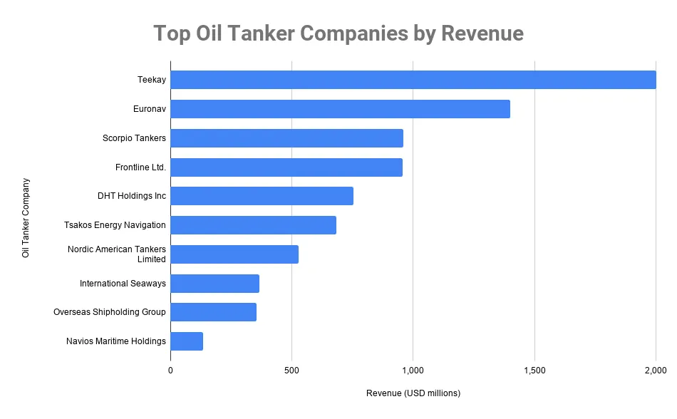

## Table of Contents

## What is an oil tanker company?

An oil tanker company is a business that transports large amounts of oil across the world using big ships called oil tankers. These ships carry oil from places where it is taken out of the ground, like oil fields, to places where it is needed, such as refineries where the oil is turned into things like gasoline and diesel.

Oil tanker companies are very important because they help move oil safely and efficiently. They have to follow strict rules to make sure the oil does not spill into the ocean, which can harm the environment. These companies also need to keep their ships in good condition and make sure their crews are well-trained to handle the oil and the ships properly.

## How do oil tanker companies operate?

Oil tanker companies work by using big ships to move oil from one place to another. They get oil from where it is drilled, like oil fields, and take it to places like refineries where it gets turned into things we use every day, like gasoline. The companies plan the routes their ships will take and make sure the ships are filled with the right amount of oil. They also have to keep track of where the oil is going and make sure it gets there on time.

To make sure everything goes smoothly, oil tanker companies follow strict rules to keep the oil safe and protect the environment. They check their ships often to make sure they are in good shape and can [carry](/wiki/carry-trading) the oil without any problems. The people who work on the ships, called the crew, are trained to handle the oil and know what to do if something goes wrong. This helps the companies move oil safely and efficiently all over the world.

## What are the main types of oil tankers used by these companies?

Oil tanker companies use different types of tankers to move oil. The main types are [crude oil](/wiki/crude-oil) tankers and product tankers. Crude oil tankers carry unrefined oil from oil fields to refineries. They come in different sizes, like VLCCs (Very Large Crude Carriers) and ULCCs (Ultra Large Crude Carriers), which can carry a lot of oil. Product tankers, on the other hand, carry refined products like gasoline and diesel from refineries to places where people use them.

Another type of tanker is the chemical tanker, which carries special liquids like chemicals and vegetable oils. These tankers have to be very clean and safe because the liquids they carry can be dangerous. All these tankers help oil tanker companies move different kinds of liquids safely and efficiently around the world.

## Which countries are home to the largest oil tanker companies?

Some of the biggest oil tanker companies are in Greece. Greece has a lot of big shipping companies that own many oil tankers. These companies help move a lot of oil around the world. They are important because they have many ships and know a lot about shipping oil safely.

Norway and Japan also have big oil tanker companies. In Norway, companies like Frontline and Knutsen are very important in the oil shipping business. Japan has companies like Mitsui O.S.K. Lines and Nippon Yusen Kaisha, which are big in moving oil too. These countries are important because their companies help move oil all over the world.

## What are the top 5 largest oil tanker companies in the world?

The top 5 largest oil tanker companies in the world are Euronav, Frontline, Teekay Tankers, DHT Holdings, and Scorpio Tankers. These companies are known for their big fleets of ships that move a lot of oil around the world. Euronav, based in Belgium, is one of the biggest and has a lot of large crude oil tankers. Frontline, from Norway, is also very big and has many ships that carry oil safely.

Teekay Tankers, another company from Norway, has a lot of different kinds of tankers that move both crude oil and refined products. DHT Holdings, based in the United States, focuses on moving crude oil and has a lot of big ships. Scorpio Tankers, from Monaco, has a lot of product tankers that carry things like gasoline and diesel. These companies are important because they help make sure oil gets to where it needs to go safely and on time.

## How do these companies ensure the safety and environmental compliance of their operations?

Oil tanker companies work hard to keep their ships and the environment safe. They follow strict rules set by different countries and groups like the International Maritime Organization (IMO). These rules tell them how to build and take care of their ships, how to train their crews, and what to do if there is an oil spill. The companies check their ships often to make sure they are in good shape and can carry oil without any problems. They also use special equipment like double hulls on their ships to help prevent oil spills if the ship gets damaged.

The crews on the ships are trained to handle the oil and know what to do in emergencies. They practice drills to be ready for any problems that might happen. Oil tanker companies also have plans for cleaning up oil spills quickly if they do happen. They work with other groups to make sure the ocean stays clean and safe. By following these rules and being prepared, oil tanker companies help move oil safely and protect the environment.

## What are the economic impacts of the largest oil tanker companies on global trade?

The largest oil tanker companies have a big impact on global trade. They move a lot of oil from places where it is drilled to places where it is needed. This helps countries that do not have their own oil to get the oil they need to run their cars, heat their homes, and make things in factories. Without these companies, it would be hard for many countries to get the oil they need, and this could slow down their economies. The companies also help keep the price of oil steady by moving it efficiently and on time.

These companies also create jobs for many people. They need people to work on the ships, to plan the routes, and to take care of the ships when they are not sailing. This means more jobs in places where the companies are based, like Greece, Norway, and Japan. The money these workers earn helps the local economy grow. Also, when these companies buy things like fuel and supplies for their ships, it helps other businesses and keeps the global trade system working smoothly.

## How have technological advancements affected the operations of oil tanker companies?

Technological advancements have made big changes in how oil tanker companies work. They now use computers and special software to plan the best routes for their ships. This helps them save time and money because the ships can travel faster and use less fuel. They also use satellites to keep track of their ships and make sure they are safe. This technology helps them know exactly where their ships are and if they need help. Another important technology is the double hull design on the ships. This makes the ships stronger and helps prevent oil spills if the ship gets damaged.

New technology has also made it easier for oil tanker companies to take care of their ships. They use special tools to check the ships and make sure they are in good shape. This helps them find problems early and fix them before they get worse. The crews on the ships also use new technology to help them do their jobs better. They have special equipment to load and unload the oil safely and quickly. All these changes help oil tanker companies move oil more safely and efficiently, which is good for the environment and the economy.

## What are the current market trends influencing the oil tanker industry?

The oil tanker industry is seeing a few big trends right now. One trend is that more oil is being moved around the world because of changes in where oil is coming from and going to. For example, more oil is being shipped from the United States because they are producing more oil now. This means oil tanker companies are busier and need more ships to move all this oil. Another trend is that the prices for using oil tankers can go up and down a lot. This happens because the amount of oil being shipped and the number of ships available can change quickly. When there are a lot of ships but not much oil to move, the prices can go down. But if there is a lot of oil and not enough ships, the prices can go up.

Another important trend is the focus on making oil tankers more eco-friendly. Governments and groups around the world are making stricter rules to protect the environment. Oil tanker companies have to follow these rules, which can mean spending more money to make their ships cleaner and safer. This includes using new technology to reduce how much pollution the ships make. Also, there is a trend towards using bigger ships to move more oil at once. This can save money because it costs less to move a lot of oil in one big ship than in many smaller ones. These trends are shaping how oil tanker companies work and plan for the future.

## How do oil tanker companies manage and mitigate risks associated with oil transportation?

Oil tanker companies work hard to manage and lower the risks of moving oil. They do this by following strict rules set by groups like the International Maritime Organization. These rules tell them how to build and take care of their ships, how to train their crews, and what to do if there is an oil spill. The companies check their ships often to make sure they are in good shape. They also use special equipment, like double hulls on their ships, to help prevent oil spills if the ship gets damaged. The crews on the ships are trained to handle the oil and know what to do in emergencies. They practice drills to be ready for any problems that might happen.

Oil tanker companies also have plans for cleaning up oil spills quickly if they do happen. They work with other groups to make sure the ocean stays clean and safe. They use technology to keep track of their ships and make sure they are safe. They also plan the best routes for their ships to avoid bad weather and other dangers. By following these rules and being prepared, oil tanker companies help move oil safely and protect the environment.

## What role do the largest oil tanker companies play in global energy security?

The biggest oil tanker companies are really important for keeping the world's energy safe. They move a lot of oil from places where it is taken out of the ground to places where it is needed. This means that countries that don't have their own oil can still get it and use it to keep their cars running, their homes warm, and their factories working. Without these companies, it would be hard for many countries to get the oil they need, and this could cause big problems for their economies.

These companies also help keep the price of oil steady by moving it efficiently and on time. If there is a problem with oil moving from one place to another, it can make the price of oil go up a lot. The big oil tanker companies work hard to make sure this doesn't happen. They use their big ships and their knowledge of moving oil to help make sure that everyone can get the oil they need without big price changes. This helps keep the world's energy supply safe and reliable.

## What future challenges and opportunities await the largest oil tanker companies?

The biggest oil tanker companies will face some big challenges in the future. One challenge is that the world is trying to use less oil and more clean energy, like wind and solar power. This means that there might be less oil to move around, which could make it harder for these companies to make money. Another challenge is that the rules for moving oil are getting stricter to protect the environment. Oil tanker companies will need to spend more money to make their ships cleaner and safer. They also have to deal with changes in where oil is coming from and going to, which can make planning their routes harder.

But there are also some big opportunities for these companies. One opportunity is that they can use new technology to make their ships more efficient and eco-friendly. This can help them save money and follow the new rules. Another opportunity is that they can start moving other things besides oil, like chemicals or even clean energy products. This can help them make money even if people use less oil. By being ready for these challenges and taking advantage of these opportunities, the biggest oil tanker companies can keep helping the world get the energy it needs.

## References & Further Reading

[1]: International Maritime Organization (IMO) – Initial Strategy on the Reduction of GHG Emissions from Ships. Available at the International Maritime Organization's official website: [IMO GHG Strategy](https://www.imo.org/en/OurWork/Environment/Pages/2023-IMO-Strategy-on-Reduction-of-GHG-Emissions-from-Ships.aspx)

[2]: International Energy Agency (IEA) – World Energy Outlook. Visit IEA for reports and data: [IEA World Energy Outlook](https://www.iea.org/reports/world-energy-outlook-2024)

[3]: BRS Group (2022). ["Annual Review of the Shipping and Shipbuilding Markets."](https://brsshipbrokers.com/publications) Provides insights and analysis on the shipping industry, including oil tankers.

[4]: Stopford, M. (2009). ["Maritime Economics"](https://www.taylorfrancis.com/books/mono/10.4324/9780203891742/maritime-economics-3e-martin-stopford). Routledge. A comprehensive guide to the economics of the shipping industry.

[5]: Clarkson Research Services Limited. ["Shipping Intelligence Network"](https://sin.clarksons.net/) offers market-leading commercial data and intelligence in global shipping, including tankers.

[6]: Jovanovic, B. & Menkveld, A. J. (2016). ["Middlemen in Limit Order Markets"](https://papers.ssrn.com/sol3/papers.cfm?abstract_id=1624329). Review of Economic Studies. Discusses algorithmic trading in financial markets.

[7]: de Prado, M. L. (2018). ["Advances in Financial Machine Learning"](https://books.google.com/books/about/Advances_in_Financial_Machine_Learning.html?id=oU9KDwAAQBAJ). Wiley. Discusses applications of machine learning in trading, relevant to algorithmic trading.