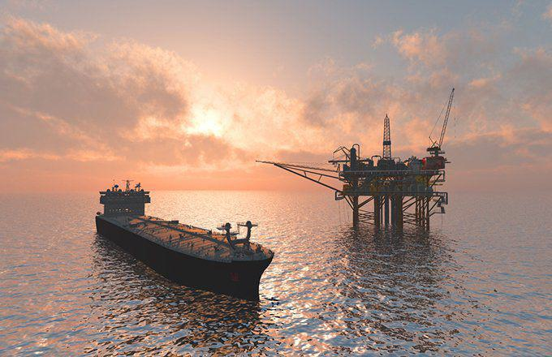

The shipping industry serves as a cornerstone of the global economy, ensuring the smooth movement of goods, including crude oil, across the world. As one of the most critical elements within this sector, the transportation of crude oil is heavily reliant on oil tankers, which are designed to efficiently transport large volumes of oil over vast oceanic distances. These vessels not only ensure the steady supply of energy resources required for industrial and domestic use but also support international trade by linking producers to global markets.

Oil tankers vary in size and capability, ranging from medium-range vessels to the colossal Very Large Crude Carriers (VLCCs) and Ultra Large Crude Carriers (ULCCs) that navigate major shipping routes. These tankers are fundamental in balancing global oil supply and demand, making their efficient operation crucial for economic stability.



This article aims to explore the technological marvels of the largest oil tankers and profile key oil tanker companies that are at the helm of the industry. Additionally, the article will shed light on the emerging trends in algorithmic trading that are transforming the oil market, enhancing operational efficiencies, and influencing financial strategies within the industry. By examining these topics, we gain comprehensive insights into how the industry is adapting to meet the demands of modern commerce while grappling with challenges such as environmental regulations and price volatility.

## Table of Contents

## Overview of the Shipping Industry

The shipping industry plays a pivotal role in the global economy by facilitating the movement of goods and resources worldwide. Accounting for over 80% of the volume of international trade, it is an essential component in the vast network of global commerce. Oil tankers, in particular, are a crucial part of this sector, as they transport massive quantities of crude oil and refined petroleum products efficiently, thereby supporting energy needs across continents.

Oil tankers are specialized vessels designed to carry vast quantities of liquid cargo. They come in various sizes, with Very Large Crude Carriers (VLCCs) and Ultra Large Crude Carriers (ULCCs) among the largest, capable of transporting up to two million barrels of oil each. These tankers enable the seamless transfer of oil from production sites to refineries and consumption markets. The efficiency of these vessels lies in their ability to transport a significant volume of oil per voyage, reducing the cost per unit of oil transported and contributing to a stable supply chain.

Despite its significance, the shipping industry faces numerous challenges. One of the primary issues is the stringent environmental regulations aimed at reducing pollution and minimizing the industry's carbon footprint. The International Maritime Organization (IMO), for example, has implemented measures such as the IMO 2020 regulation, which mandates a reduction in the sulfur content of fuel oil used in ships. Compliance with such regulations requires significant investment in cleaner technologies and alternative fuels, presenting both operational and financial challenges to shipping companies.

Moreover, the industry is subject to the [volatility](/wiki/volatility-trading-strategies) of oil prices, which can influence operational costs and economic feasibility. Fluctuations in oil prices affect fuel expenses, which are a considerable component of shipping costs. When oil prices rise, shipping companies may face increased operating costs, which can ripple through to freight rates and the prices of transported goods. Conversely, falling oil prices can reduce operating expenses but may also reflect reduced global demand, impacting shipping volumes.

In summary, the shipping industry is indispensable for global trade, with oil tankers being integral to the transport of [crude oil](/wiki/crude-oil) and its derivatives. While the sector is confronted with significant challenges, including stringent environmental regulations and volatile oil prices, it remains a cornerstone of international commerce, continuously adapting to meet the evolving demands of global markets.

## Largest Oil Tankers in the World

Very Large Crude Carriers (VLCCs) and Ultra Large Crude Carriers (ULCCs) are instrumental in the transoceanic shipping of crude oil, forming the backbone of the international oil supply chain. These vessels are characterized by their immense size and capacity, designed specifically to optimize the transportation of oil across vast distances.

VLCCs typically have a deadweight tonnage (DWT) ranging from 200,000 to 320,000 metric tons, enabling them to [carry](/wiki/carry-trading) approximately 2 million barrels of oil per voyage. This capacity not only maximizes efficiency but also reduces the frequency of trips required, thereby lowering operational costs and emissions per barrel transported. ULCCs, even larger than VLCCs, can exceed 320,000 DWT, with some vessels capable of transporting up to 4 million barrels of oil. However, the number of ULCCs is limited due to their specialized terminals and navigational constraints, such as deep-water ports capable of accommodating their draft requirements.

The utility of these massive vessels lies in their ability to facilitate the global oil distribution network by connecting oil-producing regions with major consumer markets. The primary routes often include voyages from the Middle East to Asia, Europe, and North America, which are critical corridors in global energy trade. The strategic importance of these vessels is underscored by their role in ensuring that energy demands are met consistently, acting as floating warehouses that stabilize supply chains by accommodating fluctuations in oil production or geopolitical disruptions.

In essence, VLCCs and ULCCs contribute significantly to the economies of scale in crude oil shipping. Their size and efficiency enable the transport of large volumes of oil with fewer voyages, which in turn aids in maintaining competitive shipping rates and ensuring that global oil markets remain liquid and accessible. As the demand for energy continues to grow, the largest oil tankers will likely remain pivotal in meeting the challenges of transcontinental oil distribution, balancing operational proficiency with evolving environmental and regulatory requirements.

## Major Oil Tanker Companies

Mitsui OSK Lines, Teekay Corp, and Scorpio Tankers are prominent players in the oil tanker industry. Each of these companies has established itself as a leader through strategic operations, fleet expansion, and global outreach.

**Mitsui OSK Lines (MOL)** is one of the largest shipping companies globally, based in Japan, with a significant presence in the oil tanker sector. MOL operates a diverse fleet that includes Very Large Crude Carriers (VLCCs), among others, enabling the transportation of vast quantities of crude oil across international waters. The company's geographic reach extends from Asia to Europe and the Americas, making it a critical component in the global oil supply chain. MOL has continuously adapted to market demands through strategic fleet optimization and has been involved in various mergers and partnerships to bolster its market position. 

**Teekay Corporation** is another major player, renowned for its extensive fleet and innovative approach to shipping. Headquartered in Bermuda, Teekay manages and operates a wide range of oil tankers, including influential VLCCs and Suezmax tankers. The company’s market influence is significant, driven by its ability to adapt to market changes and maintain operational efficiency across multi-national routes. Teekay has embarked on strategic acquisitions to enhance its service offerings and expand its global footprint, ensuring its competitive edge in the tanker industry.

**Scorpio Tankers** is a leading tanker operator with its headquarters in Monaco. The company specializes in the transportation of refined petroleum products using its fleet of modern, fuel-efficient vessels. Scorpio Tankers has made a mark with its aggressive expansion strategy, regularly investing in modern vessels to improve operational efficiency and decrease environmental impact. Its market influence is underscored by its strategic alliances and emphasis on sustainability, aligning with the industry's growing focus on environmentally friendly operations.

The oil tanker industry has witnessed a series of mergers and acquisitions as companies strive to increase their competitive advantage. These strategic decisions are made to not only expand fleet sizes but also to extend geographic reach and improve operational efficiencies. As global oil demand patterns shift, companies like MOL, Teekay, and Scorpio Tankers continue to seek partnerships that enhance their position in the market and allow them to capitalize on emerging opportunities in the ever-evolving maritime industry.

## The Role of Algorithmic Trading in the Oil Industry

Algorithmic trading, an automated method of executing trading orders using pre-programmed codes and algorithms, has become increasingly prominent in the oil industry. It enables traders to swiftly perform transactions and make informed decisions by analyzing numerous market variables. In the oil market, characterized by high volatility and significant price fluctuations, [algorithmic trading](/wiki/algorithmic-trading) offers enhanced speed and efficiency.

Oil tanker companies harness algorithmic trading to optimize both operational strategies and financial performance. By automating the trading process, these companies can quickly respond to real-time market conditions, securing advantageous deals and mitigating risks. Through algorithms that incorporate a variety of factors such as market trends, geopolitical events, and supply chain disruptions, companies can improve their decision-making capabilities. This not only helps in stabilizing their operational costs but also enhances profit margins by optimizing shipping routes and reducing fuel consumption.

One of the significant impacts of algorithmic trading in the oil market is its effect on price volatility and market efficiency. The rapid execution of trades facilitated by algorithms reduces the time discrepancy in demand and supply data, leading to a more responsive and liquid market. This increased market [liquidity](/wiki/liquidity-risk-premium) helps in narrowing bid-ask spreads and moderating price swings. Moreover, algorithms are capable of identifying [arbitrage](/wiki/arbitrage) opportunities that might be invisible to human traders, thus further contributing to market efficiency.

Despite its advantages, algorithmic trading also introduces challenges, such as the potential for exacerbating flash crashes due to mass automated orders executed within seconds. Organizations must incorporate fail-safes and regularly update their algorithms to adapt to ever-changing market conditions.

Ultimately, algorithmic trading stands out as a transformative tool in the oil industry, offering improved operational efficiencies and contributing to a more stable market environment through enhanced liquidity and reduced price volatility. As technology advances, the influence of algorithmic trading is likely to expand, further embedding itself as an integral component within the oil trading ecosystem.

## Challenges and Opportunities in Oil Tanker Trade

The oil tanker trade is a critical component of the global shipping industry, but it faces several challenges and opportunities, particularly concerning environmental regulations, technological advancements, and digitalization.

### Environmental Regulations

Oil tankers are subjected to rigorous environmental regulations aimed at minimizing their ecological impact. The International Maritime Organization (IMO) implements several measures, such as the International Convention for the Prevention of Pollution from Ships (MARPOL), which sets limits on emissions and mandates the use of cleaner fuels. The IMO 2020 regulation, which restricts sulfur content in marine fuels to 0.5%, has forced tanker companies to retrofit ships with scrubbers or switch to alternative fuels like liquefied natural gas (LNG). These regulations increase operational costs but are necessary for reducing pollution and mitigating climate change.

### Technological Advancements

Technological advancements are pivotal in enhancing the efficiency and safety of oil tankers. Innovations such as hull design optimization, propulsion improvements, and advanced coatings reduce fuel consumption and lower CO2 emissions. The integration of the Internet of Things (IoT) and real-time monitoring systems allows for predictive maintenance, reducing downtime and enhancing vessel longevity. Automated systems and [machine learning](/wiki/machine-learning) algorithms enhance navigation and safety, decreasing the likelihood of accidents and oil spills.

### Opportunities for Growth through Digitalization and Data Analytics

Digitalization presents significant growth opportunities for the oil tanker industry. Data analytics can optimize routing and scheduling, leading to increased efficiency and fuel savings. The analysis of large datasets allows for better forecasting of market demand and pricing trends, aiding in strategic decision-making. Blockchain technology also offers potential benefits in tracking shipments and securing transactions, enhancing transparency and trust in oil trading.

Python code for simplifying data analysis through typical aggregation might look like this:

```python
import pandas as pd

# Load sample data of oil shipments (hypothetical example)
data = pd.DataFrame({
    'Route': ['US-Asia', 'Europe-ME', 'US-Europe'],
    'Fuel Consumption (tons)': [300, 270, 320],
    'Distance (nautical miles)': [7000, 4500, 6000]
})

# Calculate efficiency (fuel consumption per nautical mile)
data['Efficiency (ton/nm)'] = data['Fuel Consumption (tons)'] / data['Distance (nautical miles)']

# Aggregate and find route with the best efficiency
best_efficiency_route = data.loc[data['Efficiency (ton/nm)'].idxmin()]
print("Most efficient route:", best_efficiency_route['Route'])
```

This code allows for the quick assessment of shipment routes based on fuel efficiency, illustrating how data analytics can enhance decision-making in oil tanker operations. In summary, despite environmental challenges, the oil tanker trade can leverage advancements and digital tools to enhance operations, meet regulatory demands, and tap into new opportunities for growth.

## Future Outlook for the Shipping and Oil Trading Industry

The future of the shipping and oil trading industry is poised for transformation, primarily driven by sustainability considerations and technological advancements. As the world increasingly embraces environmental responsibility, the shipping industry is being pressured to reduce its carbon footprint. This shift is catalyzed by regulations such as the International Maritime Organization's (IMO) strategy to reduce greenhouse gas emissions by at least 50% by 2050 compared to 2008 levels[1]. Consequently, tanker companies are investing in cleaner technologies and alternative fuels, such as liquefied natural gas (LNG) and hydrogen, to meet these requirements.

As for global oil demand, several factors could influence its trajectory. Economies are steadily transitioning toward renewable energy sources, which might reduce the long-term demand for oil. However, in the short to medium term, oil is expected to remain a crucial energy source, especially in developing nations experiencing rapid industrialization[2]. For tanker companies, this transitional phase could mean fluctuating demand patterns, necessitating strategic fleet and route management to maintain profitability.

Data-driven technologies and algorithmic trading are increasingly becoming integral to the shipping and oil trading sectors. The rise of digital platforms for trade execution and risk management enables companies to optimize their operations through real-time data analytics. These technologies help in forecasting demand, managing supply chains, and mitigating risks associated with geopolitical events or market volatility. By employing machine learning algorithms, companies can enhance their predictive capabilities, thus improving decision-making processes.

Algorithmic trading, in particular, has revolutionized the way oil is traded on global markets. By automating trading processes, companies gain a competitive edge through rapid transaction execution and reduced human error. This not only increases market efficiency but also adds liquidity, potentially stabilizing oil prices. However, the complexity and speed of algorithmic trading also present risks, such as exacerbating price volatility during unexpected market events.

In conclusion, the future of the shipping and oil trading industry lies in balancing sustainability ambitions with technological innovations. Tanker companies must navigate emerging environmental regulations and adapt to shifting oil demand patterns while leveraging data-driven strategies to enhance operational efficiency and market performance. By doing so, they can ensure continued relevance and profitability in a rapidly evolving global landscape.

References:

1. International Maritime Organization (IMO) – Initial Strategy on the Reduction of GHG Emissions from Ships
2. International Energy Agency (IEA) – World Energy Outlook

## Conclusion

Oil tankers are instrumental in global commerce, serving as the backbone of the oil transportation network that fuels industries and economies worldwide. These colossal vessels, notably Very Large Crude Carriers (VLCCs) and Ultra Large Crude Carriers (ULCCs), enable the efficient movement of crude oil from production hotspots to refineries and distribution centers across the globe. The ability of these tankers to transport immense quantities of oil in a single journey reduces transportation costs and supports the global supply chain's robustness.

Large oil tankers and the companies that own and operate them have a substantial impact on the shipping industry and global economy. Companies such as Mitsui OSK Lines, Teekay Corp, and Scorpio Tankers hold significant market influence, managing extensive fleets with a wide geographic reach. Their operations are a testament to the strategic importance of oil shipping in maintaining energy security and economic stability. Moreover, strategic mergers and partnerships within the industry have facilitated operational efficiencies and expanded market access, amplifying the role of major tanker companies in the global economic landscape.

Algorithmic trading represents a significant technological advancement that is reshaping the oil industry. It enables companies to optimize operations and financial performance through data-driven decision-making and automated trading strategies. By leveraging complex algorithms, oil tanker firms can predict market trends, manage risks, and enhance their competitive edge. Algorithmic trading contributes to greater market efficiency by improving price discovery and reducing volatility. The integration of such technologies signifies a shift towards a more efficient, data-centric industry model, which is essential given the ever-changing dynamics of global oil markets and environmental regulations.

Overall, the importance of oil tankers and the evolution driven by technological advancements such as algorithmic trading cannot be overstated. The continued innovation in this sector is pivotal for sustaining global commerce and addressing the challenges posed by fluctuating demand, pricing pressures, and regulatory changes. As the industry adapts to evolving market needs, oil tankers remain a vital component of the global economic structure, underscoring their enduring significance in the modern world.

## References & Further Reading

[1]: International Maritime Organization (IMO) – Initial Strategy on the Reduction of GHG Emissions from Ships. Available at the International Maritime Organization's official website: [IMO GHG Strategy](https://www.imo.org/en/OurWork/Environment/Pages/2023-IMO-Strategy-on-Reduction-of-GHG-Emissions-from-Ships.aspx)

[2]: International Energy Agency (IEA) – World Energy Outlook. Visit IEA for reports and data: [IEA World Energy Outlook](https://www.iea.org/reports/world-energy-outlook-2024)

[3]: BRS Group (2022). ["Annual Review of the Shipping and Shipbuilding Markets."](https://brsshipbrokers.com/publications) Provides insights and analysis on the shipping industry, including oil tankers.

[4]: Stopford, M. (2009). ["Maritime Economics"](https://www.taylorfrancis.com/books/mono/10.4324/9780203891742/maritime-economics-3e-martin-stopford). Routledge. A comprehensive guide to the economics of the shipping industry.

[5]: Clarkson Research Services Limited. ["Shipping Intelligence Network"](https://sin.clarksons.net/) offers market-leading commercial data and intelligence in global shipping, including tankers.

[6]: Jovanovic, B. & Menkveld, A. J. (2016). ["Middlemen in Limit Order Markets"](https://papers.ssrn.com/sol3/papers.cfm?abstract_id=1624329). Review of Economic Studies. Discusses algorithmic trading in financial markets.

[7]: de Prado, M. L. (2018). ["Advances in Financial Machine Learning"](https://books.google.com/books/about/Advances_in_Financial_Machine_Learning.html?id=oU9KDwAAQBAJ). Wiley. Discusses applications of machine learning in trading, relevant to algorithmic trading.