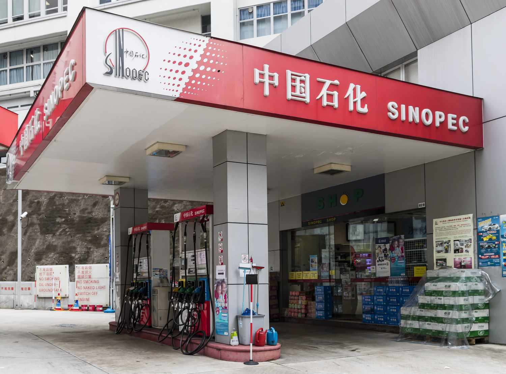

## Table of Contents

## What are private oil companies?

Private oil companies are businesses owned by individuals or groups, not by the government. They explore, extract, refine, and sell oil and gas. Some well-known private oil companies include ExxonMobil, Chevron, and BP. These companies operate all over the world, looking for oil in places like the ocean, deserts, and even under the Arctic ice.

These companies make money by selling oil and gas to other businesses and countries. They use the money to find more oil and to improve their technology. Private oil companies are important because they help meet the world's energy needs. However, they also face challenges like changing oil prices, environmental concerns, and competition from other energy sources like solar and wind power.

## How do private oil companies differ from state-owned oil companies?

Private oil companies are owned by people or groups, not by the government. They make their own decisions about where to look for oil, how to get it out of the ground, and who to sell it to. They need to make money to keep going, so they focus on finding the cheapest and best ways to do their work. Examples of private oil companies are ExxonMobil and Chevron. They compete with each other to find and sell oil, and they have to follow the laws of the countries where they work.

State-owned oil companies, on the other hand, are run by the government of a country. They might have different goals, like making sure their country has enough oil or helping their economy grow. These companies don't always need to make a profit because the government can support them. Examples include Saudi Aramco in Saudi Arabia and Petrobras in Brazil. They might have more control over the oil in their country and can set rules that help their own company more than private ones.

Both types of companies are important in the oil industry, but they work in different ways. Private companies focus on making money and growing their business, while state-owned companies often focus on what's best for their country. This can lead to different strategies and outcomes in how they find, produce, and sell oil.

## Which country hosts the largest number of private oil companies?

The United States hosts the largest number of private oil companies. This is because the country has a big oil industry with lots of oil fields, especially in places like Texas and Oklahoma. Many people and groups in the U.S. have started their own oil companies to find and sell oil. Some famous private oil companies from the U.S. are ExxonMobil and Chevron.

The U.S. has a good environment for private businesses, which helps these companies grow. The government has rules that make it easier for private companies to work and compete. This means there are many small and big private oil companies all trying to find and sell oil. Because of this, the U.S. has more private oil companies than any other country.

## What criteria are used to rank the largest private oil companies?

The largest private oil companies are ranked based on how much money they make, how much oil they produce, and how much they are worth. The amount of money a company makes, or its revenue, is a big part of this. If a company makes a lot of money from selling oil, it is usually seen as one of the biggest. Another important thing is how much oil a company can produce every day. Companies that can get a lot of oil out of the ground are often at the top of the list. Lastly, the total value of a company, or its market capitalization, also matters. This is how much all the shares of the company are worth if you added them up.

These criteria help people understand which private oil companies are the biggest and most important in the world. For example, ExxonMobil and Chevron are often near the top because they make a lot of money and produce a lot of oil. They also have a high market value, which shows that people think they will do well in the future. By looking at these things, we can see which companies are leading the oil industry and have the most impact on the world's energy supply.

## Who is the largest private oil company in the world by revenue?

The largest private oil company in the world by revenue is ExxonMobil. It made about $286 billion in 2022. ExxonMobil is a big company that looks for oil all over the world, gets it out of the ground, and then sells it. They have been doing this for a long time and are very good at it. They use their money to find more oil and to make their work better and safer.

ExxonMobil is based in the United States, but they work in many countries. They have a lot of oil fields and they work hard to keep finding more. Because they make so much money, they can spend a lot on new technology and ways to get oil out of the ground. This helps them stay the biggest and most important private oil company in the world.

## How do the top private oil companies contribute to global oil production?

The top private oil companies, like ExxonMobil, Chevron, and BP, play a big role in global oil production. They explore for oil all over the world, from the deep ocean to deserts, and then drill to get it out of the ground. These companies have a lot of money and technology, so they can find oil in places where it's hard to reach. They also work to make their drilling safer and better for the environment. Because of this, they produce a lot of the oil that the world uses every day.

These companies not only find and produce oil but also help move it around the world. They have big ships and pipelines to get oil from where it's found to where it's needed. They also build refineries to turn the oil into things like gasoline and diesel. This means they are involved in every step of getting oil from the ground to people's cars and homes. Their work helps keep the world's energy supply steady and meets the needs of many countries.

## What are the main challenges faced by private oil companies in terms of exploration and production?

Private oil companies face many challenges when they try to find and get oil out of the ground. One big challenge is that the easy-to-find oil is already gone. Now, they have to look in harder places like deep under the ocean or in the Arctic. This means they need special technology and it costs a lot of money. They also have to deal with changing oil prices. If the price of oil goes down, it can be hard for them to make enough money to keep exploring and producing.

Another challenge is the environment. People are more worried about how oil drilling can harm the planet. Governments are making stricter rules to protect the environment, which can make it harder and more expensive for oil companies to work. They also face competition from other energy sources like solar and wind power. These new energy sources are getting cheaper and more popular, which can make it harder for oil companies to sell their oil. 

Overall, private oil companies need to keep finding new ways to explore and produce oil while dealing with these challenges. They have to balance the costs of their work with the need to make a profit and follow environmental rules. It's a tough job, but these companies are always working to find new solutions and keep the world's energy supply going.

## How have environmental regulations impacted the operations of the largest private oil companies?

Environmental regulations have made it harder and more expensive for the largest private oil companies to do their work. These rules are made to protect the environment and stop pollution. Oil companies have to spend more money on special equipment and technology to make sure they don't harm the environment. For example, they might need to use better ways to clean up oil spills or reduce the gases they release into the air. This means they have to spend more money to follow these rules, which can make it harder for them to make a profit.

These regulations also change how oil companies plan their work. They have to think about the environment more when they decide where to look for oil and how to get it out of the ground. Sometimes, they can't drill in certain places because of environmental rules. This can limit where they can work and make it harder to find new oil. Even though these rules make things more challenging, they also push oil companies to find new and better ways to work that are kinder to the environment.

## What role do technological advancements play in the success of private oil companies?

Technological advancements are really important for private oil companies to do well. They help these companies find oil in places that are hard to reach, like deep under the ocean or in the Arctic. With new technology, oil companies can drill deeper and faster, which means they can get more oil out of the ground. They also use technology to make their work safer and better for the environment. For example, they can use special machines to clean up oil spills or reduce the harmful gases they release into the air. This helps them follow environmental rules and keep people happy.

Technology also helps oil companies save money and make more profit. They can use computers and data to find the best places to drill for oil, which means they don't waste time and money looking in the wrong spots. New technology can also make it cheaper to get oil out of the ground and move it around the world. This is important because oil prices can go up and down, and companies need to find ways to keep making money even when prices are low. By using technology, private oil companies can stay competitive and keep finding and selling oil to meet the world's energy needs.

## How do mergers and acquisitions affect the rankings of the largest private oil companies?

Mergers and acquisitions can change the rankings of the largest private oil companies. When two companies merge, or one company buys another, they combine their resources and can become bigger and more powerful. This means they might produce more oil, make more money, and be worth more money. For example, if a smaller company joins with a bigger one, the bigger company might move up in the rankings because it now has more oil fields and more money coming in. This can push other companies down in the rankings.

These changes can also affect how oil companies compete with each other. A company that gets bigger through a merger or acquisition might be able to find and produce oil more cheaply. This can help them make more profit and stay ahead of their competitors. On the other hand, if a company is bought out, it might disappear from the rankings altogether. So, mergers and acquisitions can shake up the list of the biggest oil companies and change who is at the top.

## What strategies do the largest private oil companies employ to manage geopolitical risks?

The largest private oil companies face many geopolitical risks when they work in different countries. These risks can come from political changes, wars, or new laws that can make it hard for them to do their work. To manage these risks, oil companies often make strong relationships with the governments of the countries where they work. They do this by talking a lot with government leaders and sometimes even helping the local economy grow. This can help them get support and make it easier to keep working even if things change politically.

Another strategy they use is to spread their work across many different countries. By not relying on just one place for their oil, they can keep producing even if something bad happens in one country. They also use special insurance and contracts to protect themselves from risks. These agreements can help them get paid even if they have to stop working because of political problems. By using these strategies, the largest private oil companies can manage geopolitical risks and keep their business going strong.

## How are the largest private oil companies adapting to the global shift towards renewable energy?

The largest private oil companies are starting to change because more people want to use renewable energy like solar and wind power. They know that oil might not be as important in the future, so they are trying new things. Some companies are investing in renewable energy projects themselves. They are building wind farms and solar panels, and even trying to make energy from things like hydrogen. By doing this, they hope to stay important in the energy world even as people use less oil.

These companies are also trying to make their oil business cleaner. They are using new technology to make less pollution when they get oil out of the ground and turn it into things like gasoline. They are also looking for ways to capture the harmful gases they release and store them safely underground. By making their oil business more environmentally friendly, they can keep selling oil to people who still need it while also showing that they care about the planet. This way, they can keep making money from oil while also getting ready for a future with more renewable energy.

## References & Further Reading

[1]: ["International Petroleum Encyclopedia"](https://archive.org/details/internationalpet0000penn_u7h4) - PennWell Corporation

[2]: ["Algorithmic Trading and DMA: An introduction to direct access trading strategies"](https://www.amazon.com/Algorithmic-Trading-DMA-introduction-strategies/dp/0956399207) by Barry Johnson

[3]: ["The Prize: The Epic Quest for Oil, Money, and Power"](https://www.amazon.com/Prize-Epic-Quest-Money-Power/dp/1439110123) by Daniel Yergin

[4]: ["Oil in the Global Economy"](https://www.weforum.org/stories/2022/02/why-oil-prices-matter-to-global-economy-expert-explains/) by World Bank Publications

[5]: ["Twilight in the Desert: The Coming Saudi Oil Shock and the World Economy"](https://www.amazon.com/Twilight-Desert-Coming-Saudi-Economy/dp/0471790184) by Matthew R. Simmons