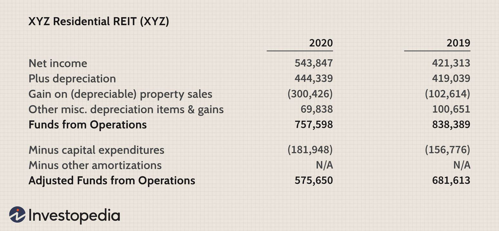

## Table of Contents

## What is a Real Estate Investment Trust (REIT)?

A Real Estate Investment Trust, or REIT, is a company that owns, operates, or finances income-generating real estate. It's like a big pool of money from many investors that is used to buy properties like apartments, shopping centers, or offices. People invest in REITs because they want to earn money from real estate without having to buy and manage properties themselves.

REITs are required by law to pay out at least 90% of their taxable income as dividends to shareholders. This means that if you own shares in a REIT, you can get regular payments, kind of like getting rent from a property you own. This makes REITs attractive to people looking for steady income from their investments.

There are different types of REITs, such as equity REITs that own and manage properties, mortgage REITs that invest in real estate loans, and hybrid REITs that do a bit of both. By investing in a REIT, you can diversify your investment portfolio and potentially benefit from the growth and income of the real estate market without the hassle of being a landlord.

## How does a REIT generate income for investors?

A REIT generates income for investors mainly through renting out the properties it owns. For example, if a REIT owns apartment buildings, it collects rent from the tenants living there. If it owns shopping centers, it gets money from the stores that rent space in the mall. This rental income is the main way a REIT makes money, and a big part of this money is then given back to the investors as dividends. So, when you invest in a REIT, you're basically getting a share of the rent collected from these properties.

In addition to rental income, a REIT can also make money by selling properties that have gone up in value. If a REIT buys a building for a certain price and later sells it for more, the profit from that sale can also be shared with investors. However, not all REITs focus on selling properties; some concentrate more on holding and managing them for steady rental income. Either way, the goal is to provide investors with regular income, making REITs a popular choice for those looking for steady returns from real estate without the hassle of managing properties themselves.

## What are the different types of REITs?

There are three main types of REITs: equity REITs, mortgage REITs, and hybrid REITs. Equity REITs are the most common type. They own and manage properties like apartments, shopping centers, or office buildings. They make money by renting out these properties and sometimes by selling them at a higher price than they bought them for. The rent they collect is shared with investors as dividends, which is a big reason why people invest in equity REITs.

Mortgage REITs, on the other hand, don't own properties directly. Instead, they invest in real estate loans or mortgage-backed securities. They make money from the interest on these loans. This type of REIT can be a bit riskier because it depends a lot on interest rates and the health of the real estate market, but it can also offer good returns.

Hybrid REITs are a mix of the first two types. They both own properties and invest in mortgages. This gives them a bit of the benefits of both worlds. They can get rental income from the properties they own and interest income from the loans they invest in. This diversification can make them a bit more stable than focusing on just one type of real estate investment.

## What qualifies a REIT as one of the largest?

A REIT is considered one of the largest based on the total value of its assets or its market capitalization. Market capitalization is calculated by multiplying the number of shares a REIT has by the current price of each share. So, if a REIT has a lot of valuable properties and a high share price, it can be one of the biggest. For example, some of the largest REITs in the world own thousands of properties worth billions of dollars.

These big REITs often have a wide variety of properties, like shopping centers, apartments, and office buildings, spread across different cities or even countries. Because they are so big, they can attract a lot of investors who want to put their money into a stable and well-known real estate company. Being one of the largest REITs usually means it has a strong track record of paying dividends and growing over time, which makes it attractive to people looking for steady income from their investments.

## How do you measure the size of a REIT?

The size of a REIT is mainly measured by its market capitalization or the total value of its assets. Market capitalization is found by multiplying the number of shares a REIT has by the current price of each share. So, if a REIT has a lot of shares and each share is worth a lot, it will have a big market capitalization. The total value of its assets is another way to measure size, which includes the value of all the properties and investments the REIT owns.

Big REITs often own a lot of different types of properties, like shopping centers, apartments, and office buildings, spread out in different places. This makes them very large and valuable. Because they are so big, they can attract a lot of investors who want to put their money into a stable and well-known real estate company. Being one of the largest REITs usually means it has a good history of paying dividends and growing over time, which makes it attractive to people looking for steady income from their investments.

## Can you name the top 5 largest REITs by market capitalization?

The top 5 largest REITs by market capitalization are Prologis, American Tower Corporation, Crown Castle, Equinix, and Public Storage. These companies are really big and own a lot of properties all over the world. Prologis is the biggest and it owns warehouses and distribution centers. American Tower and Crown Castle both own a lot of cell towers and other stuff that helps with communication. Equinix owns data centers, which are like big buildings full of computers that help the internet work. Public Storage owns a lot of storage units where people can rent space to keep their stuff.

These REITs are popular because they are big and stable. They have a lot of money coming in from renting out their properties, and they share a lot of that money with their investors as dividends. People like to invest in these big REITs because they can get a steady income without having to buy and manage properties themselves. Plus, these big companies are often seen as safer investments because they have so many different properties and a strong history of doing well.

## What industries do the largest REITs typically focus on?

The largest REITs usually focus on a few main industries. One big industry is logistics and warehousing, like Prologis, which owns a lot of warehouses and distribution centers. These are important because they help companies store and move goods around the world. Another big industry is communications, with companies like American Tower and Crown Castle, which own cell towers and other communication infrastructure. These are crucial for keeping our phones and internet working.

Another industry that big REITs often focus on is data centers, like Equinix. Data centers are like giant computer rooms that help the internet and other digital services work smoothly. Lastly, there's the self-storage industry, with companies like Public Storage. They own a lot of storage units where people can rent space to keep their things. These industries are popular because they provide steady income and are important parts of our daily lives.

## How has the performance of the largest REITs varied over the past decade?

Over the past decade, the performance of the largest REITs has been pretty good overall, but it has also had some ups and downs. For example, Prologis, which focuses on warehouses and distribution centers, did really well because more people started shopping online and needed places to store and ship things. American Tower and Crown Castle, which own cell towers, also grew a lot because more people needed good internet and phone service. But, there were some tough times too, like during the early days of the COVID-19 pandemic in 2020, when many businesses had to close and people weren't sure what would happen next. This made the stock prices of some REITs go down for a while.

Even with these challenges, the biggest REITs have generally bounced back and kept growing. Companies like Equinix, which owns data centers, did well because more businesses and people needed to use the internet for work and fun. Public Storage, which rents out storage units, also stayed strong because people always need a place to keep their stuff. Overall, the largest REITs have been able to weather the storms and keep providing good returns for their investors, thanks to their focus on important industries and their ability to adapt to changes in the world.

## What are the key financial metrics to consider when evaluating the largest REITs?

When you want to check out the biggest REITs, there are a few important numbers you should look at. One key metric is Funds From Operations (FFO), which shows how much money the REIT is making from its properties before taking away things like depreciation. FFO is really important because it gives a better idea of the REIT's real cash flow than just looking at net income. Another thing to consider is the dividend yield, which tells you how much money you get back from your investment each year as a percentage of the share price. A high dividend yield can be good, but you also need to make sure the REIT can keep paying those dividends over time.

Another important number is the Net Asset Value (NAV), which is the total value of all the properties the REIT owns minus any debts. This helps you see if the REIT's shares are a good deal compared to what the properties are actually worth. You should also look at the debt-to-equity ratio, which shows how much the REIT is borrowing compared to what the investors have put in. A high debt level can be risky, especially if interest rates go up or if the real estate market has a downturn. By keeping an eye on these key financial metrics, you can get a better sense of how well the biggest REITs are doing and whether they're a good investment for you.

## How do regulatory changes impact the operations of the largest REITs?

Regulatory changes can have a big impact on how the largest REITs operate. For example, if the government changes the rules about how much money REITs have to pay out as dividends, it can affect how much money investors get back. Also, changes in tax laws can make a big difference. If taxes on real estate go up, it can make it harder for REITs to make a profit, which might make their shares less valuable. Sometimes, new rules about the environment or building safety can mean that REITs have to spend more money to make sure their properties meet the new standards. All these changes can make REITs change how they do business and plan for the future.

Even though regulatory changes can be tough, the biggest REITs often have the resources and experience to handle them well. They might hire experts to help them understand and follow the new rules, or they might change their investment strategies to take advantage of new opportunities that come from the changes. For example, if there are new rules to make buildings more energy-efficient, a big REIT might invest in upgrading their properties to meet these standards, which could attract more tenants and increase their rental income. So, while regulatory changes can be challenging, the largest REITs are usually good at adapting and finding ways to keep growing and making money for their investors.

## What are the growth strategies employed by the largest REITs?

The biggest REITs often grow by buying more properties or improving the ones they already own. For example, they might buy new warehouses, shopping centers, or apartment buildings to increase their rental income. They also might spend money to make their current properties better, like adding new features or making them more energy-efficient. This can help them attract more tenants and charge higher rents. Another way they grow is by expanding into new areas or countries, which can help them reach more customers and spread out their risk.

In addition to buying and improving properties, the largest REITs also use smart financial moves to grow. They might borrow money at low interest rates to buy more properties, or they might sell some of their older properties to raise cash for new investments. They also pay attention to trends, like the rise of online shopping or the need for better internet service, and invest in properties that fit these trends. By doing all these things, the biggest REITs can keep growing and making more money for their investors.

## How do global economic conditions affect the performance of the largest REITs?

Global economic conditions can really change how well the biggest REITs do. When the world economy is doing well, people and businesses have more money to spend on renting properties. This means more money for REITs that own things like shopping centers, offices, and warehouses. But if the economy is not doing so great, like during a recession, people might not spend as much, and businesses might close or move out. This can make it harder for REITs to collect rent and keep their properties full, which can hurt their profits and the value of their shares.

Also, things like interest rates and inflation can affect REITs. When interest rates go up, it can be more expensive for REITs to borrow money to buy new properties or improve the ones they have. This can slow down their growth. On the other hand, if inflation goes up, it might help REITs because they can raise rents to keep up with the higher costs. But if inflation gets too high, it can also make people and businesses spend less, which can be bad for REITs. So, the biggest REITs need to keep a close eye on what's happening in the world economy and be ready to change their plans to keep growing and making money for their investors.

## References & Further Reading

[1]: Geltner, D., Miller, N., Clayton, J., & Eichholtz, P. (2013). ["Commercial Real Estate Analysis and Investments."](https://www.researchgate.net/publication/245702364_Commercial_Real_Estate_Analysis_and_Investments) South-Western Educational Publishing.

[2]: Block, R. L. (2011). ["Investing in REITs: Real Estate Investment Trusts."](https://www.amazon.com/Investing-REITs-Estate-Investment-Trusts/dp/1118004450) Wiley.

[3]: Chan, S. H., Erickson, J., & Wang, K. (2003). ["Real Estate Investment Trusts: Structure, Performance, and Investment Opportunities."](https://www.researchgate.net/publication/227466824_Real_estate_investment_trusts_Structure_performance_and_investment_opportunities) Oxford University Press.

[4]: Sixt, P. (2021). ["Understanding REITs and Algorithmic Trading: How Real Estate Investment Trusts Are Traded On Emerging Markets."](https://scholar.google.com/citations?user=XtejLN8AAAAJ&hl=pl) Springer.

[5]: Kissell, R. (2013). ["The Science of Algorithmic Trading and Portfolio Management."](https://www.sciencedirect.com/book/9780124016897/the-science-of-algorithmic-trading-and-portfolio-management) Academic Press.

[6]: Lopez de Prado, M. (2018). ["Advances in Financial Machine Learning."](https://www.amazon.com/Advances-Financial-Machine-Learning-Marcos/dp/1119482089) Wiley.

[7]: Fabozzi, F. J., & Peterson, P. P. (2003). ["Financial Modeling of the Equity Market: From CAPM to Cointegration."](https://archive.org/details/financialmodelin0000fabo) Wiley.

[8]: Peters, M. (2018). ["Big Data in Real Estate: Opportunities and Challenges in Commercial Real Estate Investments."](https://www.cbre.com/insights/articles/the-big-data-of-real-estate) Springer Access.