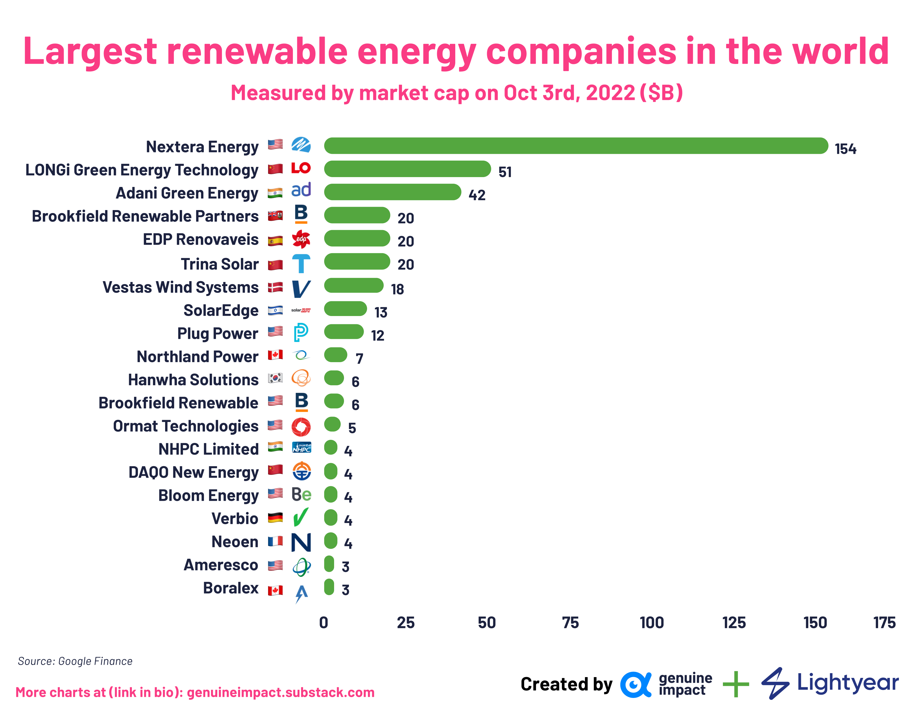

## Table of Contents

## What is renewable energy?

Renewable energy comes from sources that nature can replace quickly, like the sun, wind, and water. These sources are called renewable because they don't run out, unlike oil and coal, which are gone once we use them up. Using renewable energy is good for the environment because it produces less pollution and helps fight climate change.

There are many types of renewable energy. Solar power uses the sun's energy to make electricity, often with panels on roofs. Wind power uses big turbines that spin in the wind to generate power. Hydropower uses the energy of moving water, often from rivers or dams. These methods help us use natural resources in a way that doesn't harm the planet as much as burning fossil fuels.

## Why is renewable energy important?

Renewable energy is important because it helps keep our planet healthy. When we use renewable sources like the sun, wind, and water to make electricity, we create less pollution. This is good because pollution can make the air dirty and cause health problems. Also, using renewable energy helps slow down climate change. Climate change happens when the Earth gets too warm because of gases from burning oil and coal. By using renewable energy, we can reduce these harmful gases and keep the Earth cooler.

Another reason renewable energy is important is that it will never run out. Oil and coal, which are called fossil fuels, can be used up and then they're gone. But the sun will keep shining, the wind will keep blowing, and rivers will keep flowing. This means we can always use renewable energy, which makes our energy supply safe for the future. It also helps countries be more independent because they don't have to buy oil and coal from other places.

Lastly, using renewable energy can create jobs and help the economy. Building wind turbines, solar panels, and hydroelectric dams needs workers. These jobs can help people earn money and support their families. Plus, when countries use more renewable energy, they don't have to spend as much money on buying fossil fuels from other countries. This can save money and make the economy stronger.

## What are the different types of renewable energy sources?

There are several types of renewable energy sources that we can use instead of fossil fuels. One type is solar energy, which uses the sun's power to make electricity. You might see solar panels on rooftops or in big fields, soaking up the sun's rays to create clean energy. Another type is wind energy, which uses big wind turbines that look like giant fans. These turbines spin when the wind blows, and that movement makes electricity. Both solar and wind energy are great because they don't make pollution and they use resources that never run out.

Hydropower is another important renewable energy source. It uses the energy from moving water, like in rivers or waterfalls, to make electricity. Sometimes, big dams are built to hold back water and then let it flow through turbines to generate power. Geothermal energy is also renewable, and it comes from the heat inside the Earth. This heat can be used to make steam, which then powers turbines to create electricity. Both hydropower and geothermal energy are clean and reliable ways to produce energy.

Biomass and biofuels are other types of renewable energy. Biomass energy comes from burning organic materials like wood, crops, or even garbage. When these materials are burned, they release energy that can be used to make electricity or heat. Biofuels, like ethanol and biodiesel, are made from plants and can be used to power cars and trucks. While these sources do release some pollution, they are still better for the environment than fossil fuels because the plants they come from absorb carbon dioxide as they grow.

## How do renewable energy companies operate?

Renewable energy companies work to create and sell energy from sources like the sun, wind, water, and more. These companies build and manage big projects like solar farms, wind farms, and hydroelectric dams. They use special equipment like solar panels, wind turbines, and generators to capture energy from nature. Once they collect this energy, they turn it into electricity that people can use in their homes and businesses. These companies also need to take care of their equipment, making sure it works well and fixing it if something goes wrong.

To keep their business going, renewable energy companies sell the electricity they make to power companies or directly to people. They have to figure out how much to charge for the electricity so they can make money and keep growing. Sometimes, they get help from the government, like special loans or tax breaks, to help them build new projects. These companies also have to think about the future, planning new projects and trying to use the latest technology to make their energy even cleaner and cheaper. By doing all these things, renewable energy companies help provide clean power and help the planet stay healthy.

## What criteria are used to determine the largest renewable energy companies?

The size of renewable energy companies can be measured by how much energy they produce, how much money they make, and how many people work for them. A company that makes a lot of electricity from renewable sources like solar or wind is considered large. Also, if a company earns a lot of money from selling this electricity, it shows that it is a big player in the industry. The number of employees is another way to tell if a company is big, because a company with many workers can handle more projects and produce more energy.

Another important criterion is the market share of the company. This means how much of the total renewable energy market the company controls. A company with a big market share is one of the largest in the industry. Sometimes, the value of the company, or how much it would cost to buy it, is used to determine its size. This value can be influenced by how much the company is expected to grow in the future and how much money it is making now. All these factors help decide which renewable energy companies are the biggest.

## Which company is considered the largest in renewable energy globally?

NextEra Energy is considered the largest renewable energy company in the world. They make a lot of electricity from clean sources like the sun and wind. NextEra Energy has big projects all over the United States, and they keep building more to make even more clean energy. They are known for being good at using new technology to make their energy cheaper and better for the environment.

NextEra Energy makes a lot of money from selling this clean electricity. They have many workers who help run their projects and build new ones. Because they produce so much energy and have a big part of the market, NextEra Energy is seen as the biggest company in renewable energy. They also work hard to grow and keep making the world a better place with clean power.

## What are the top 5 renewable energy companies by market share?

NextEra Energy is the biggest renewable energy company in the world. They make a lot of electricity from clean sources like the sun and wind. NextEra Energy has big projects all over the United States and keeps building more to make even more clean energy. They are good at using new technology to make their energy cheaper and better for the environment. They make a lot of money from selling this clean electricity and have many workers who help run their projects and build new ones.

Another big company is Vestas, which is known for making wind turbines. They have a big part of the market because they sell their turbines all over the world. Siemens Gamesa is also important in the wind energy market. They make wind turbines too and have a lot of projects in many countries. Both Vestas and Siemens Gamesa help make a lot of clean energy around the world.

The fifth biggest company by market share is Enel Green Power. They work on many different types of renewable energy like solar, wind, and hydro. Enel Green Power has projects in many countries and helps make a lot of clean energy. All these companies are important because they help make the world cleaner and provide energy that doesn't run out.

## How do the largest renewable energy companies contribute to global energy production?

The largest renewable energy companies, like NextEra Energy, Vestas, Siemens Gamesa, and Enel Green Power, play a big role in making clean energy around the world. NextEra Energy, for example, makes a lot of electricity from the sun and wind in the United States. They build big projects and use new technology to make their energy cheaper and better for the environment. Vestas and Siemens Gamesa focus on making wind turbines, which are used all over the world to turn wind into electricity. These companies help countries use less dirty energy from oil and coal, which is good for the planet.

Enel Green Power works on many types of renewable energy, like solar, wind, and water power. They have projects in many countries, which helps make a lot of clean energy around the world. By building and running these projects, these big companies help lower the amount of pollution that goes into the air. They also create jobs and help countries be less dependent on buying energy from other places. Overall, the largest renewable energy companies are important because they help make the world cleaner and provide energy that will never run out.

## What are the technological innovations driving the growth of these companies?

The growth of the largest renewable energy companies is driven by many new technologies. One big innovation is better solar panels. These new panels can turn more of the sun's energy into electricity, making solar power cheaper and more useful. Another important technology is bigger and more efficient wind turbines. These new turbines can make more electricity from the wind, even when it's not blowing very hard. This helps companies like Vestas and Siemens Gamesa grow because they can sell these turbines to more places.

Also, smart technology helps these companies manage their energy better. They use computers and software to keep track of how much energy their solar and wind projects are making. This helps them make sure the energy goes where it's needed most. Another innovation is energy storage, like big batteries. These batteries can save extra energy made during the day and use it at night or when the wind isn't blowing. This makes renewable energy more reliable and helps companies like NextEra Energy and Enel Green Power grow by providing steady power to more people.

## How do government policies and incentives affect the operations of these companies?

Government policies and incentives play a big role in how renewable energy companies like NextEra Energy, Vestas, Siemens Gamesa, and Enel Green Power operate. Governments can help these companies grow by giving them special loans or tax breaks. These incentives make it easier for the companies to build new projects, like big solar farms or wind turbines. For example, if a government offers money back on taxes for building a new wind farm, the company can use that money to build more projects and make more clean energy.

Also, government rules can change how these companies work. Some countries have laws that say a certain amount of their energy has to come from renewable sources. This means companies have to build more solar panels or wind turbines to meet these rules. Governments can also set prices for renewable energy, which helps companies know how much money they will make from selling their electricity. All these policies and incentives help renewable energy companies grow and make more clean energy for people to use.

## What are the future growth prospects for the largest renewable energy companies?

The future looks bright for the biggest renewable energy companies like NextEra Energy, Vestas, Siemens Gamesa, and Enel Green Power. As more countries want to use clean energy and fight climate change, these companies will have more chances to grow. Governments are making rules that say more energy needs to come from renewable sources, which means these companies will build more solar farms, wind turbines, and other projects. Also, as technology gets better, like new solar panels and bigger wind turbines, these companies can make even more energy and sell it at a lower price. This will help them get more customers and make more money.

These companies are also looking at new places to grow. For example, countries in Asia and Africa are starting to use more renewable energy, so companies like Enel Green Power are building projects there. As people around the world learn more about the problems with fossil fuels, they will want more clean energy. This means the biggest renewable energy companies will have more work to do. They will keep using new technology and smart ways to manage their energy to stay ahead and keep growing.

## How do these companies address environmental and social governance (ESG) issues?

The biggest renewable energy companies like NextEra Energy, Vestas, Siemens Gamesa, and Enel Green Power care a lot about environmental and social governance (ESG) issues. They work hard to make sure their projects are good for the environment. They use clean energy from the sun, wind, and water, which makes less pollution than oil and coal. These companies also try to use the land in a way that doesn't hurt nature. For example, they might plant trees or protect wildlife around their projects. They also work on making their equipment, like solar panels and wind turbines, last longer and be easier to recycle, so they don't create a lot of waste.

These companies also think about social issues. They want to be good neighbors in the places where they build their projects. They talk to people who live nearby to make sure they are happy with the new projects. They also try to create jobs and help the local economy grow. For example, they might hire people from the area to work on building and running their solar farms or wind turbines. They also care about being fair and honest in how they run their business. They make sure their workers are treated well and that they follow all the rules and laws. By doing all these things, these companies help make the world a better place while they grow their business.

## What are the regulatory considerations?

The regulatory landscape surrounding algorithmic trading in energy markets is pivotal in ensuring that technological innovations enhance efficiency while maintaining market integrity. Across the globe, different regions have established frameworks to guide the use of algorithmic trading in the energy sector, balancing the need for innovation with the imperative of market stability and transparency.

In the European Union, the Markets in Financial Instruments Directive II (MiFID II) has significantly influenced the regulation of algorithmic trading. MiFID II mandates that firms engaging in algorithmic trading implement robust risk controls and ensure systems are resilient and capable of handling extraordinary trading volumes. Additionally, this directive requires firms to provide comprehensive reporting to enhance transparency and facilitate effective market surveillance.

The United Kingdom, post-Brexit, has retained many EU-inspired regulations but with its own regulatory body, the Financial Conduct Authority (FCA), overseeing compliance. The UK emphasizes ensuring fair and transparent trading practices while also focusing on systemic risk. The FCA has specific guidelines that require algorithmic trading firms to maintain rigorous standards in testing algorithms and monitoring their impact in real-time.

In the United States, the regulation of algorithmic trading in energy markets is primarily governed by the Commodity Futures Trading Commission (CFTC). The CFTC's rules require algorithmic trading firms to register and adhere to stringent risk management protocols. These include pre-trade risk controls and the use of "kill switches" to halt trading in cases of unintended results. Furthermore, the CFTC works closely with exchanges to facilitate data reporting that enhances the transparency and integrity of the trading ecosystem.

A critical aspect of these regulatory frameworks is finding the equilibrium between nurturing innovation and safeguarding market integrity. This involves ensuring that firms have the flexibility to develop sophisticated algorithms while also instituting measures that prevent market abuses such as spoofing or manipulation. The adoption of algorithmic trading necessitates ongoing dialogue between regulators and industry participants to adapt to technological advancements without compromising fairness or [liquidity](/wiki/liquidity-risk-premium).

Mathematically, risk controls often involve setting constraints on the trades executed by algorithms. For example, a simple risk control mechanism could be limiting the notional value of trades per day:

$$
\text{Daily Trade Limit} = \sum (\text{Volume}_i \times \text{Price}_i) \leq \text{Max Limit}
$$

In Python, this could be represented as:

```python
def is_within_daily_limit(trades, max_limit):
    total_value = sum(trade['volume'] * trade['price'] for trade in trades)
    return total_value <= max_limit

trades = [{'volume': 10, 'price': 50}, {'volume': 5, 'price': 100}]
max_limit = 1000

if is_within_daily_limit(trades, max_limit):
    print("Trading within limit.")
else:
    print("Trade exceeds daily limit.")
```

Overall, the regulatory considerations for algorithmic trading in energy markets are geared towards fostering an environment where technological advancements contribute positively to market functioning, ensuring that they are leveraged to enhance sustainability and efficiency without compromising the foundational aspects of market fairness and integrity.

## References & Further Reading

[1]: Bergstra, J., Bardenet, R., Bengio, Y., & Kégl, B. (2011). ["Algorithms for Hyper-Parameter Optimization."](https://papers.nips.cc/paper/4443-algorithms-for-hyper-parameter-optimization) Advances in Neural Information Processing Systems 24.

[2]: ["Advances in Financial Machine Learning"](https://www.amazon.com/Advances-Financial-Machine-Learning-Marcos/dp/1119482089) by Marcos Lopez de Prado

[3]: International Renewable Energy Agency (IRENA). ["Renewable Energy Statistics."](https://www.irena.org/Publications/2024/Jul/Renewable-energy-statistics-2024)

[4]: ["Machine Learning for Algorithmic Trading"](https://github.com/PacktPublishing/Machine-Learning-for-Algorithmic-Trading-Second-Edition) by Stefan Jansen

[5]: United Nations Framework Convention on Climate Change. ["The Paris Agreement."](https://unfccc.int/process-and-meetings/the-paris-agreement)

[6]: ["Quantitative Trading: How to Build Your Own Algorithmic Trading Business"](https://www.amazon.com/Quantitative-Trading-Build-Algorithmic-Business/dp/1119800064) by Ernest P. Chan

[7]: Markets in Financial Instruments Directive II (MiFID II). ["Regulating International Financial Markets."](https://www.esma.europa.eu/publications-and-data/interactive-single-rulebook/mifid-ii) European Commission.

[8]: Commodity Futures Trading Commission (CFTC). ["Regulations on Algorithmic Trading."](https://iqeq.com/insights/cftc-regulation-4-7-update-what-you-need-to-know/)