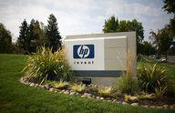

The global retail industry stands as a cornerstone of the world economy, representing a dynamic and expansive sector with a profound influence on economic trends and consumer behaviors. This industry encompasses a diverse range of businesses, from small local shops to colossal multinational corporations. The convergence of traditional retail practices with advanced technology marks a significant shift in how the industry operates today, driven notably by algorithmic trading. Algorithmic trading refers to the use of complex algorithms to optimize trading decisions, offering the retail sector new methodologies to enhance operational efficiencies and maintain a competitive edge.

In recent years, algorithmic trading has emerged as a transformative tool for retailers, facilitating the rapid analysis of vast datasets to forecast consumer behavior, manage inventory systems, and implement dynamic pricing strategies. This technological innovation can process large volumes of transactions and market data far more swiftly than human capacity allows, leading to improved accuracy and responsiveness in business operations.



This article investigates the methods and strategies employed by some of the world's largest retailers to leverage algorithmic trading for sustained growth and innovation. Retail powerhouses such as Walmart, Amazon, and Costco not only dominate the market in terms of revenue but also pioneer advancements in utilizing these technologies. Their efforts are paving the way for a more technologically integrated retail industry, setting the standard for both operational excellence and customer-centric service delivery.

These retail giants serve as exemplars of how embracing algorithmic trading can lead to remarkable transformations within the sector. Their integration of sophisticated technologies highlights the potential for retail companies to harness this tool, redefining traditional paradigms in favor of more efficient, data-driven approaches. As the industry continues to evolve, the role of algorithmic trading is likely to become even more central, further underscoring its importance in shaping the future landscape of global retail.

## Table of Contents

## Top Retail Companies Globally

Walmart, Amazon, and Costco are consistently ranked among the top retailers worldwide based on revenue. Each of these companies has established a significant global footprint by expanding operations across various markets and continually adapting to regional demands. This expansion is supported by strategic supply chain management and investment in technology, which have been critical in maintaining their market dominance and revenue growth.

Walmart, headquartered in Bentonville, Arkansas, is the largest retailer by revenue globally. Founded in 1962, it has grown to operate more than 11,000 stores in 27 countries under 56 different brands. Walmart's success is largely attributed to its effective supply chain logistics, purchasing power, and extensive product diversification, which enables competitive pricing and a wide range of offerings. Walmart also leads in e-commerce; as of the fiscal year 2022, Walmart's online sales comprised an increasing share of its total revenue, attributed to the company's substantial investment in digital infrastructure and partnerships with various technology firms to enhance its e-commerce platform.

Amazon, founded in 1994 and headquartered in Seattle, Washington, stands as the largest online retailer globally and holds a prominent position in physical retail through its purchase of Whole Foods Market in 2017. Amazon's innovative approach to retail, characterized by customer-centric operations and a robust logistics network, allows it to offer a vast selection of products efficiently and at competitive prices. The company's use of technology, particularly in algorithmic data analysis and cloud computing services, has been instrumental in optimizing inventory control, personalizing customer experiences, and driving its successful e-commerce platform.

Costco Wholesale Corporation, based in Issaquah, Washington, operates membership-only warehouse clubs and ranks among the top retailers due to its unique business model focusing on bulk sales and low operating margins. Since opening its first warehouse in 1983, Costco has established a presence in multiple countries, maintaining a strong customer base that values high-quality products at low prices. Costco’s expansion strategy involves opening new warehouses internationally, which supports its revenue growth. Additionally, the company's e-commerce operations have shown significant growth, aligning with changing consumer preferences towards digital shopping.

Overall, Walmart, Amazon, and Costco exemplify strategic diversification in both product offerings and market presence. Their continued investment in e-commerce platforms ensures they remain competitive in the rapidly evolving retail industry and adapt to changing consumer purchasing behaviors.

## Role of Algorithmic Trading in Retail

Algorithmic trading in the retail sector is transforming how companies conduct business by providing advanced tools for maximizing efficiency and enhancing decision-making processes. At its core, [algorithmic trading](/wiki/algorithmic-trading) involves the use of software programs to execute large volumes of trades with high speed and precision, far surpassing human capabilities. This technology, traditionally used in financial markets, is being adapted by retailers to drive operational improvements in several key areas.

One significant application of algorithmic trading in retail is in the prediction of consumer behavior. Retail algorithms analyze historical data, such as purchase history, browsing patterns, and consumer demographics, to forecast demand and tailor offerings to individual customers. For example, [machine learning](/wiki/machine-learning) models can predict the likelihood of a customer purchasing a product based on past interactions and provide personalized recommendations. This results in a more engaging shopping experience and increased sales.

Inventory optimization is another area where algorithmic trading proves invaluable. Retailers utilize sophisticated algorithms to assess inventory levels and predict future stock requirements, minimizing overstock and stockouts. These models take into account variables such as lead times, seasonal trends, and promotional activities. By accurately forecasting demand, retailers can reduce holding costs and improve supply chain efficiency. For example, a simple model might predict inventory needs using a formula:

$$
\text{Inventory\_Required} = \text{Average\_Demand} + (\text{Lead\_Time} \times \text{Safety\_Stock})
$$

Dynamic pricing is also enhanced through algorithmic trading. Algorithms evaluate market trends, competitor pricing, and consumer sensitivity to price changes in real-time, enabling retailers to adjust prices dynamically to optimize sales and margins. This process requires complex algorithms that can evaluate numerous data points continuously to determine the optimal price point for each product.

Furthermore, these algorithms contribute to cost reduction and increased sales efficiency by leveraging the vast amounts of data generated in retail transactions. Big data analytics allows retailers to make informed decisions rapidly, improving responsiveness to market changes. For instance, a retailer might use Python to implement a predictive model for pricing:

```python
import numpy as np
from sklearn.linear_model import LinearRegression

# Sample data: past prices and sales
prices = np.array([[10], [12], [15], [20], [25]])
sales = np.array([100, 80, 65, 50, 30])

# Create a linear regression model
model = LinearRegression().fit(prices, sales)

# Predict sales for a new price point
new_price = np.array([[18]])
predicted_sales = model.predict(new_price)
```

This code snippet demonstrates how a retailer might predict sales for a new price point using a simple linear regression model.

In summary, the integration of algorithmic trading in retail operations has become a powerful strategy for driving efficiencies and enhancing customer experiences. By leveraging predictive algorithms, retailers can fine-tune their business processes and maintain a competitive edge in an increasingly data-driven market.

## Impact of Technology on Retail Operations

Technology has significantly reshaped retail operations, bringing remarkable efficiencies and enhancing customer experiences through automation and innovation. One of the primary transformations lies in supply chain management, where advanced systems now monitor and manage the journey of goods from production to consumer. Automation tools and software help track inventory levels, predict demand, and manage logistics, reducing human error and increasing speed and reliability. For instance, radio-frequency identification (RFID) technology tracks products in real-time, providing retailers with precise data on inventory levels and logistics operations, thereby minimizing stockouts and overstock situations.

The implementation of interactive customer interfaces has also revolutionized the way retailers engage with consumers. Digital kiosks, virtual fitting rooms, and augmented reality applications allow customers to interact with products without physical contact, offering an enriched shopping experience. Retailers utilize advanced algorithms to tailor recommendations based on consumer preferences and behaviors, leading to increased satisfaction and loyalty.

Artificial intelligence (AI) and machine learning (ML) are at the forefront of retail innovation. These technologies analyze vast amounts of consumer data to identify patterns and trends, enabling retailers to make informed decisions and predict future behaviors. For example, AI-driven chatbots provide personalized customer service, answering inquiries and resolving issues instantly. Machine learning models forecast demand trends, ensuring optimal stock levels and reducing waste.

Investment in AI and ML extends to optimizing backend operations as well. Retailers employ these technologies in pricing strategies, utilizing dynamic pricing models that adjust in real-time based on demand, competition, and other external factors. This approach enhances profitability while staying competitive.

In summary, technology plays a pivotal role in transforming retail operations, fostering efficiency, and creating superior customer experiences. Retailers who embrace these technological advancements are better positioned to meet the evolving needs of their customers and achieve sustained success in the market.

## Challenges in Implementing Algorithmic Trading

Algorithmic trading, while advantageous, presents several significant challenges for retail companies aiming to leverage this advanced technology. One primary concern is the technical complexity inherent in the integration and maintenance of algorithmic systems. Implementing these systems requires a sophisticated understanding of both the algorithms and the technological infrastructure necessary to support them. Retailers must invest in high-performance computing resources and skilled personnel capable of developing and maintaining these complex algorithms, which can be both time-consuming and costly.

Data security is another pressing challenge in the deployment of algorithmic trading in retail. Algorithms rely on vast amounts of data to function effectively; however, the handling of this data poses significant security risks. Protecting sensitive consumer and transaction data from breaches is paramount. Retailers must implement robust cybersecurity measures to safeguard data integrity and confidentiality, thereby preventing unauthorized access and potential data leaks.

Furthermore, ethical considerations in data handling play a critical role. Algorithms are only as unbiased as the data from which they learn. Retailers must be vigilant against embedding biases in their automated decision-making processes. This requires continuous monitoring and auditing of algorithms to ensure fairness and transparency in decision-making outcomes. Addressing this challenge necessitates a commitment to ethical standards and practices in data handling and processing.

The rapid evolution of technology compounds these challenges. Retailers must not only implement effective algorithmic systems but also ensure that their systems remain up-to-date. The fast pace of technological advancements means that systems quickly become obsolete if not regularly updated. Retailers must establish processes for software updates and algorithmic improvements, requiring ongoing investments in both technology and personnel development. Staying competitive demands an agile approach that adapts to industry innovations and consumer needs while maintaining a secure and ethically sound operation.

The combined demands of technical, security, and ethical challenges in algorithmic trading require retailers to strategically navigate these issues. Investing in continuous education and system upgrades, alongside a robust ethical framework for data management, will be essential for those seeking to successfully implement algorithmic trading solutions in the retail sector.

## Future Trends in Retail

The future of retail is set to be significantly influenced by the integration of [artificial intelligence](/wiki/ai-artificial-intelligence) (AI) and machine learning. These technologies are poised to offer more personalized customer experiences through sophisticated data analysis and predictive modeling. AI algorithms can analyze consumer behavior patterns to customize product recommendations, enhance customer service through chatbots, and optimize supply chain operations. Machine learning algorithms enable retailers to continuously improve these processes by learning from new data, ensuring that the customer experience becomes increasingly tailored over time.

Blockchain technology is also expected to play a pivotal role in enhancing security and transparency within the retail sector. By creating a secure and immutable ledger of transactions, blockchain can help in authenticating products, reducing fraud, and ensuring the integrity of supply chains. Smart contracts, which are self-executing contracts with the terms of the agreement directly written into code, offer potential for automating and securing transactions, thereby reducing administrative overheads and enhancing trust with consumers.

Sustainability and ethical sourcing are becoming paramount as consumers increasingly demand eco-friendly and ethically produced goods. Retailers are expected to focus on reducing their carbon footprints, minimizing waste, and ensuring fair trade practices. Initiatives such as carbon-neutral shipping, recyclable packaging, and transparent sourcing of materials are likely to become standard practices. These approaches not only help in meeting regulatory requirements but also cater to a growing segment of environmentally conscious consumers.

As the retail sector advances, these trends will require retailers to adapt by investing in new technologies and restructuring existing business models. Embracing AI, blockchain, and sustainability will not only address consumer preferences but also enhance operational efficiency and long-term profitability. Retailers who successfully integrate these future trends will likely secure a competitive edge in the evolving marketplace.

## Conclusion

Retail companies hold a significant position in the global economy, continually adapting to technological innovations to maintain their growth trajectory. As technology progresses, retail giants are leveraging advanced tools like algorithmic trading to optimize their operations and secure a competitive edge. This approach involves using computer algorithms to automate trading decisions, enabling retailers to manage large volumes of transactions with remarkable speed and accuracy.

Algorithmic trading is revolutionizing the retail sector by providing profound benefits. It allows retailers to predict consumer behavior, adjust inventory levels accurately, and determine dynamic pricing strategies. By analyzing vast datasets, these algorithms enhance sales efficiency and reduce operational costs, crucial factors for maintaining profitability in a highly competitive market.

However, the shift towards algorithmic trading also presents challenges. Technical complexities and data security concerns must be managed meticulously to mitigate risks associated with automation. Retailers need to ensure that their systems remain up to date, safeguarding against obsolescence while also being aware of ethical considerations in data handling to avoid biases in automated decision-making.

Strategic implementation of these technologies is critical. Retailers must invest in robust infrastructure and skilled personnel to maximize the potential of algorithmic trading effectively. By doing so, they can enhance customer satisfaction through personalized experiences, further securing their position as key contributors to the global economy. As such, the use of algorithmic trading in retail is not just an option but a necessity to ensure sustained growth and competitiveness in the future.

## References & Further Reading

[1]: ["Advances in Financial Machine Learning"](https://www.amazon.com/Advances-Financial-Machine-Learning-Marcos/dp/1119482089) by Marcos Lopez de Prado

[2]: Bergstra, J., Bardenet, R., Bengio, Y., & Kégl, B. (2011). ["Algorithms for Hyper-Parameter Optimization."](https://proceedings.neurips.cc/paper/2011/file/86e8f7ab32cfd12577bc2619bc635690-Paper.pdf) Advances in Neural Information Processing Systems 24.

[3]: ["Machine Learning for Algorithmic Trading"](https://github.com/stefan-jansen/machine-learning-for-trading) by Stefan Jansen

[4]: ["Quantitative Trading: How to Build Your Own Algorithmic Trading Business"](https://www.amazon.com/Quantitative-Trading-Build-Algorithmic-Business/dp/1119800064) by Ernest P. Chan

[5]: ["Evidence-Based Technical Analysis: Applying the Scientific Method and Statistical Inference to Trading Signals"](https://onlinelibrary.wiley.com/doi/book/10.1002/9781118268315) by David Aronson