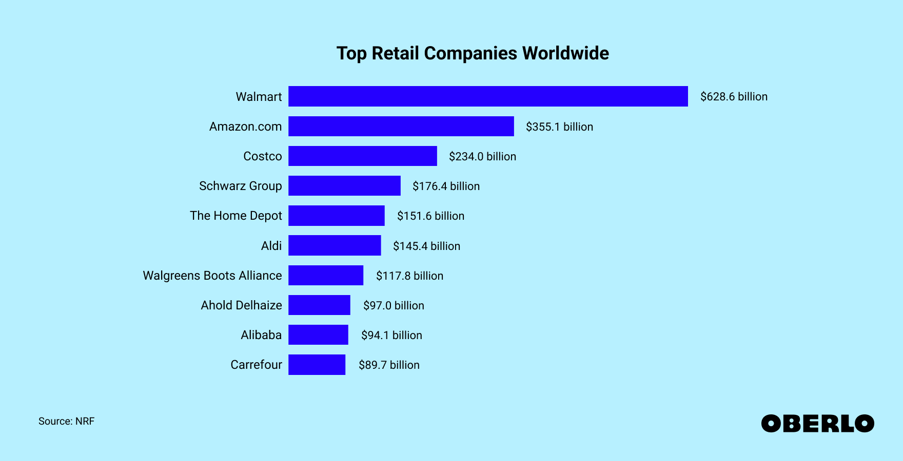

## Table of Contents

## What is a retail company?

A retail company is a business that sells products directly to customers. These products can be anything from clothes and electronics to food and furniture. Retail companies can have physical stores where people come to shop, or they can sell things online through websites and apps. Some retail companies do both, having stores and also selling online.

Retail companies are important because they help people get the things they need and want easily. They buy products from manufacturers or wholesalers and then sell them to the public. This makes it convenient for customers to find and buy what they need in one place. Retail companies also often offer services like returns, customer support, and sometimes even delivery, which makes shopping easier and more enjoyable for people.

## How is the size of a retail company measured?

The size of a retail company can be measured in different ways. One common way is by looking at how much money the company makes, which is called revenue. A company with more revenue is usually considered bigger than one with less revenue. Another way to measure size is by the number of stores the company has. A retail company with many stores across different cities or countries is often seen as larger than one with just a few stores in one area.

Another important measure is the number of employees. A retail company with a lot of workers is typically considered bigger than one with fewer employees. This can show how much the company has grown and how many people it needs to run its operations. Additionally, the size of a retail company can also be measured by its market share, which is the percentage of total sales in its industry that the company has. A higher market share means the company is a bigger player in the market compared to its competitors.

## What are the criteria for being included in the list of largest retail companies?

The list of largest retail companies usually includes companies based on how much money they make, which is called revenue. Companies with the highest revenue are seen as the biggest. This is because revenue shows how much business a company does. For example, if a company makes a lot of money from selling things, it is considered large.

Another way to decide if a company should be on the list is by looking at how many stores it has. A company with many stores in different places is often seen as big. Also, the number of people working for the company can be important. A company with a lot of employees is usually considered larger than one with fewer workers. These criteria help make the list of the largest retail companies.

## Which is the largest retail company in the world?

The largest retail company in the world is Walmart. Walmart is a big store that sells many different things like food, clothes, and toys. They have stores all over the world, and they make a lot of money every year. In 2022, Walmart made about $573 billion in revenue. This is more money than any other retail company.

Walmart started in the United States, but now it has stores in many countries. They have over 10,500 stores and clubs in 24 countries. Walmart also has a lot of workers, with more than 2.3 million employees. Because of their big size and the amount of money they make, Walmart is the biggest retail company in the world.

## How does the revenue of the top retail companies compare?

Walmart is the biggest retail company in the world. In 2022, they made about $573 billion in revenue. This is a lot more money than other retail companies. The next biggest company is Amazon, which made around $469 billion in revenue in the same year. Amazon sells a lot of things online and also has some physical stores. Both companies make a lot of money, but Walmart makes more.

Other big retail companies make less money than Walmart and Amazon. For example, Costco made about $226 billion in revenue in 2022. Costco is known for selling things in big packages and having membership fees. Another company, Schwarz Group, which owns stores like Lidl and Kaufland, made around $150 billion in revenue. These companies are still very big and successful, but they don't make as much money as Walmart and Amazon.

## What are the different types of retail companies on the list?

The list of the largest retail companies includes different types of stores that sell different things. Some companies, like Walmart and Target, are called department stores. They sell a lot of different things in one place, like clothes, food, and toys. These stores are big and have many sections for different products. Other companies, like Costco and Sam's Club, are called warehouse clubs. They sell things in big packages and you need to pay a membership fee to shop there. These stores focus on selling a lot of things at once, which can save money for people who buy a lot.

Another type of retail company on the list is supermarkets, like Kroger and Albertsons. These stores mainly sell food and things you need for your home. They have a lot of different food choices and sometimes even have their own brands of products. Then there are specialty retail companies, like Home Depot and Lowe's, which sell things for your home and garden. These stores focus on specific products, like tools and building materials, and help people with home projects. Each type of retail company on the list has its own way of selling things and helping customers.

## How has the ranking of the largest retail companies changed over the past decade?

Over the past decade, the ranking of the largest retail companies has changed a lot. Walmart has stayed at the top for a long time because they make a lot of money and have many stores. But Amazon has grown very fast. Ten years ago, Amazon was not as big as it is now. They started selling more things online and even opened some physical stores. By 2022, Amazon got very close to Walmart in terms of how much money they make, showing how quickly they grew.

Other companies have also seen changes in their rankings. For example, Costco has moved up in the list because more people started shopping there. They sell things in big packages and people like that. On the other hand, some traditional department stores like Sears have fallen in the rankings or even gone out of business. This shows how the way people shop has changed, with more people buying things online and looking for different ways to save money.

## What role do international markets play in the success of these retail companies?

International markets are very important for the success of big retail companies. When a company like Walmart or Amazon goes to other countries, they can sell their products to more people. This helps them make more money and grow bigger. For example, Walmart has stores in many different countries, not just the United States. By selling things in places like Mexico, Canada, and China, Walmart can reach more customers and make more sales.

Having stores in different countries also helps these companies learn new things. They can see what people in other places like to buy and change their products to fit those needs. This makes them better at selling things and staying popular. For example, Amazon has learned a lot about what people in Europe and Asia want, and they use that information to sell more things. So, international markets are key to making these big retail companies successful and helping them grow.

## How do the largest retail companies adapt to changes in consumer behavior?

The biggest retail companies change how they do things when people start shopping differently. For example, more people are buying things online now. So, companies like Walmart and Amazon have made their websites and apps better. They make it easy for people to shop from home. They also offer fast delivery and sometimes even let people pick up their orders at stores. This helps them keep customers happy even when people don't want to go to a store.

These companies also pay attention to what people want to buy. If people start liking different kinds of food or clothes, the companies will start selling those things. They use information about what people are buying to decide what to sell. Sometimes, they even make their own special products that people like. By doing this, they can keep up with what people want and stay successful.

## What are the sustainability practices of the top retail companies?

The biggest retail companies are working on being more sustainable, which means they try to be kinder to the environment. Walmart, for example, wants to use only renewable energy in their stores and make less waste. They also try to sell more products that are good for the environment, like clothes made from recycled materials. Amazon is doing similar things. They want to use more electric trucks for deliveries and make their buildings use less energy. Both companies know that people care about the planet, so they are trying to do their part to help.

Another way these companies are being sustainable is by helping their suppliers be more eco-friendly. For example, Walmart works with the companies that make their products to use less water and create less pollution. Amazon also helps its suppliers use more sustainable materials and practices. By doing this, the big retail companies are not only making their own operations better for the environment but also encouraging others to do the same. This helps make the whole industry more sustainable.

## How do technological advancements influence the operations of these retail giants?

Technological advancements have a big impact on how the biggest retail companies work. They use technology to make shopping easier and faster for people. For example, Amazon uses robots in their warehouses to pick and pack items quickly. This helps them send things to customers faster. Walmart also uses technology to keep track of what people are buying in their stores. They use this information to make sure they always have the things people want in stock. Both companies have apps and websites that let people shop from home, which is very convenient.

Technology also helps these companies save money and be more efficient. They use computers to plan how to move things from warehouses to stores in the best way. This saves time and fuel. They also use technology to talk to customers better. For example, chatbots on their websites can answer questions and help people find what they need. By using technology, these big retail companies can do more with less, which helps them stay successful and keep growing.

## What future trends are expected to impact the largest retail companies?

In the future, more people might shop using their phones and computers. This means big retail companies like Walmart and Amazon will need to make their apps and websites even better. They might use new technology like virtual reality to let people see products in a new way. For example, you could use a VR headset to "walk" through a virtual store and pick out things you want to buy. Also, more people might want things delivered very quickly, so these companies will need to find faster ways to get products to people's homes.

Another big trend will be about being good to the environment. People are caring more about how companies affect the planet. So, big retail companies will need to be more sustainable. They might use more electric trucks for deliveries and try to make less waste. They will also need to sell more eco-friendly products. This will help them keep customers happy and stay successful. By paying attention to these trends, the biggest retail companies can keep growing and changing with the times.

## What is the role of algorithmic trading in retail?

Algorithmic trading in the retail sector is transforming how companies conduct business by providing advanced tools for maximizing efficiency and enhancing decision-making processes. At its core, [algorithmic trading](/wiki/algorithmic-trading) involves the use of software programs to execute large volumes of trades with high speed and precision, far surpassing human capabilities. This technology, traditionally used in financial markets, is being adapted by retailers to drive operational improvements in several key areas.

One significant application of algorithmic trading in retail is in the prediction of consumer behavior. Retail algorithms analyze historical data, such as purchase history, browsing patterns, and consumer demographics, to forecast demand and tailor offerings to individual customers. For example, [machine learning](/wiki/machine-learning) models can predict the likelihood of a customer purchasing a product based on past interactions and provide personalized recommendations. This results in a more engaging shopping experience and increased sales.

Inventory optimization is another area where algorithmic trading proves invaluable. Retailers utilize sophisticated algorithms to assess inventory levels and predict future stock requirements, minimizing overstock and stockouts. These models take into account variables such as lead times, seasonal trends, and promotional activities. By accurately forecasting demand, retailers can reduce holding costs and improve supply chain efficiency. For example, a simple model might predict inventory needs using a formula:

$$
\text{Inventory\_Required} = \text{Average\_Demand} + (\text{Lead\_Time} \times \text{Safety\_Stock})
$$

Dynamic pricing is also enhanced through algorithmic trading. Algorithms evaluate market trends, competitor pricing, and consumer sensitivity to price changes in real-time, enabling retailers to adjust prices dynamically to optimize sales and margins. This process requires complex algorithms that can evaluate numerous data points continuously to determine the optimal price point for each product.

Furthermore, these algorithms contribute to cost reduction and increased sales efficiency by leveraging the vast amounts of data generated in retail transactions. Big data analytics allows retailers to make informed decisions rapidly, improving responsiveness to market changes. For instance, a retailer might use Python to implement a predictive model for pricing:

```python
import numpy as np
from sklearn.linear_model import LinearRegression

# Sample data: past prices and sales
prices = np.array([[10], [12], [15], [20], [25]])
sales = np.array([100, 80, 65, 50, 30])

# Create a linear regression model
model = LinearRegression().fit(prices, sales)

# Predict sales for a new price point
new_price = np.array([[18]])
predicted_sales = model.predict(new_price)
```

This code snippet demonstrates how a retailer might predict sales for a new price point using a simple linear regression model.

In summary, the integration of algorithmic trading in retail operations has become a powerful strategy for driving efficiencies and enhancing customer experiences. By leveraging predictive algorithms, retailers can fine-tune their business processes and maintain a competitive edge in an increasingly data-driven market.

## References & Further Reading

[1]: ["Advances in Financial Machine Learning"](https://www.amazon.com/Advances-Financial-Machine-Learning-Marcos/dp/1119482089) by Marcos Lopez de Prado

[2]: Bergstra, J., Bardenet, R., Bengio, Y., & Kégl, B. (2011). ["Algorithms for Hyper-Parameter Optimization."](https://proceedings.neurips.cc/paper/2011/file/86e8f7ab32cfd12577bc2619bc635690-Paper.pdf) Advances in Neural Information Processing Systems 24.

[3]: ["Machine Learning for Algorithmic Trading"](https://github.com/stefan-jansen/machine-learning-for-trading) by Stefan Jansen

[4]: ["Quantitative Trading: How to Build Your Own Algorithmic Trading Business"](https://www.amazon.com/Quantitative-Trading-Build-Algorithmic-Business/dp/1119800064) by Ernest P. Chan

[5]: ["Evidence-Based Technical Analysis: Applying the Scientific Method and Statistical Inference to Trading Signals"](https://onlinelibrary.wiley.com/doi/book/10.1002/9781118268315) by David Aronson