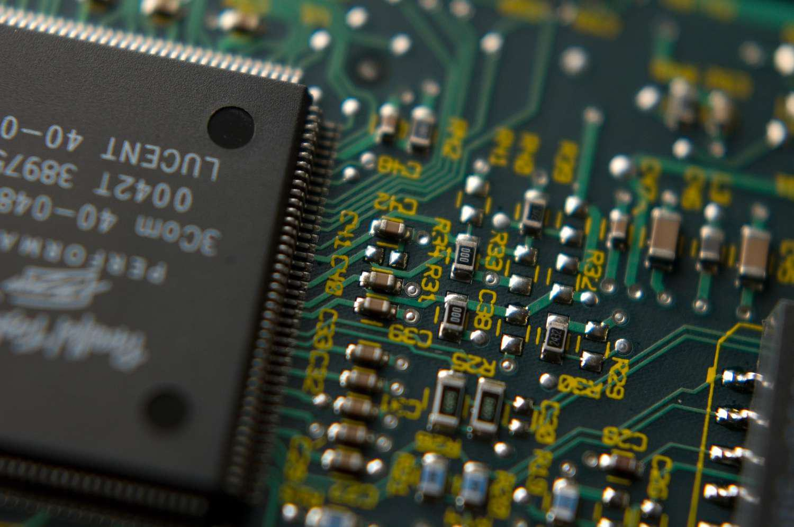

The semiconductor industry is integral to the architecture of contemporary technology, underpinning a myriad of devices that support daily life and spur scientific advancement. Semiconductors are the foundational components that power devices ranging from everyday smartphones and computers to sophisticated space exploration equipment. They have become indispensable due to their unique properties that allow for the control of electrical current, making them essential in developing more efficient and compact electronic circuits.

As technology propels forward, there is an escalating demand for devices that are not only smaller and faster but also boast enhanced efficiency. This demand places semiconductor companies at the forefront, driving them to spearhead innovations that revolutionize how electronic gadgets and systems are designed and operate. These companies are pivotal in pushing boundaries, consistently seeking to introduce cutting-edge solutions that meet and anticipate the evolving technological needs of consumers and industries alike.



This article examines the major players dominating the semiconductor industry, detailing their significant contributions to technological advancement. It will also highlight the emerging role of algorithmic trading in shaping the semiconductor market, an important aspect that influences how these companies position themselves in a highly competitive environment. From optimizing manufacturing processes to accelerating investment strategies, algorithmic trading is becoming a crucial tool in the semiconductor sector's strategic arsenal.

## Table of Contents

## Overview of the Semiconductor Industry

Semiconductors are indispensable components in modern electronic devices, playing a vital role across multiple sectors including automotive, telecommunications, and consumer electronics. Their significance is derived from their unique ability to control electrical currents, which is fundamental to the operation of a wide range of electronic systems. The semiconductor industry can be segmented into several key categories: microprocessors, memory chips, commodity integrated circuits, and systems on a chip (SoCs).

Microprocessors, often described as the brains of computers and smart devices, execute commands and conduct calculations that enable the functionality of complex software applications. Memory chips, another critical category, store data and play a crucial role in determining the speed and efficiency of data retrieval and storage in devices. These chips include various types, such as dynamic random-access memory (DRAM) and NAND flash memory, which are essential for both consumer electronics and enterprise-level data centers.

Commodity integrated circuits, although less glamorous, provide a wide range of basic functions in electronic devices, such as timing, amplification, and signal processing. These circuits are produced in large volumes and are integral to achieving cost-effective solutions for everyday electronics.

Systems on a chip (SoCs) integrate multiple electronic components onto a single chip, optimizing space and power efficiency, which is critical for the development of compact and highly functional mobile devices and other portable technology.

In an intensely competitive global market, semiconductor companies strive to deliver innovative products that meet the increasing demands for higher performance and energy efficiency across various applications. This includes addressing the growing requirements of emerging technologies such as [artificial intelligence](/wiki/ai-artificial-intelligence) (AI), Internet of Things (IoT), and 5G communications. As semiconductors continue to be foundational to the advancement of diverse technological applications, the industry persists as a vibrant field marked by rapid innovation and significant economic impact.

## Top Semiconductor Companies

The semiconductor industry is dominated by several key players, each of which has established itself as a leader in its respective niche. Among the most prominent companies in this sector are NVIDIA, TSMC (Taiwan Semiconductor Manufacturing Company), Broadcom, and Samsung. These firms not only command significant market capitalization but also play crucial roles in driving technological advancements across various segments of the industry.

NVIDIA is best known for its innovative graphics processing units (GPUs), which are indispensable in gaming, professional visualization, data centers, and artificial intelligence (AI). The company has consistently pushed the boundaries of what GPUs can achieve, enabling high-performance computing tasks that require massive parallel processing capabilities. NVIDIA’s GPUs have become foundational technology for [machine learning](/wiki/machine-learning) applications and have significant implications for [deep learning](/wiki/deep-learning) architectures.

TSMC, a titan in contract manufacturing, is the foremost independent semiconductor foundry in the world. The company specializes in the fabrication of integrated circuits (ICs) for a diverse range of tech companies, including top chip designers who do not own fabrication facilities. TSMC’s prowess in manufacturing cutting-edge chips lies in its advanced process technologies, with the company consistently leading in the transition to smaller node sizes, thus delivering chips that are more power-efficient and capable of supporting the intricate designs demanded by modern applications.

Broadcom is recognized for its extensive range of semiconductor and infrastructure software solutions. The company's products are critical in the areas of wired and wireless communications, enterprise storage, and networking. Broadcom’s expertise lies in creating semiconductors that facilitate connectivity and networking, making them essential in an increasingly interconnected digital world. The company's strategic acquisitions have further cemented its position in providing end-to-end semiconductor solutions.

Samsung, apart from being a leading consumer electronics brand, is a dominant player in the semiconductor industry, particularly in memory solutions. The company's portfolio includes DRAM, NAND flash, and SSD technologies, all of which are crucial for data storage and processing. Samsung has invested heavily in semiconductor research and development, allowing it to lead in memory technology advancements and production capacity. This focus enables Samsung to cater to the growing demand for storage driven by sectors such as cloud computing, smartphones, and artificial intelligence.

Collectively, these companies exemplify the innovation and specialization that characterize the semiconductor industry. Through their unique contributions, they continue to ensure the development and proliferation of advanced technological applications, impacting various sectors ranging from consumer electronics to advanced scientific research.

## Algorithmic Trading in the Semiconductor Market

Algorithmic trading is profoundly impacting the semiconductor market by facilitating rapid decision-making and execution of trades. The essence of [algorithmic trading](/wiki/algorithmic-trading) lies in using complex algorithms and mathematical models to decide on buying or selling assets. This method is particularly advantageous in the semiconductor market, known for its high [volatility](/wiki/volatility-trading-strategies) and cyclicality, driven by constant technological advancements and changing demand patterns.

The core advantage of algorithmic trading is its ability to reduce human error. Traders can rely on algorithms to execute trades based on pre-defined criteria without the biases and emotional influences that may affect human decision-making. For instance, algorithms can scan multiple markets and execute orders at optimal prices within milliseconds, far surpassing the speed of manual trading. This capability is crucial in the semiconductor market, where price fluctuations can occur rapidly due to shifts in demand, supply chain disruptions, or geopolitical tensions.

The speed and efficiency offered by algorithmic trading enable market participants to capitalize on fleeting opportunities. The algorithms assess real-time market data, detecting patterns and trends that may indicate a profitable move. Such capabilities are built on sophisticated computational techniques, as exemplified by strategies like statistical [arbitrage](/wiki/arbitrage), which exploits pricing inefficiencies. The pseudocode below illustrates a basic structure of an algorithmic trading strategy that could be employed in the semiconductor sector:

```python
# Sample Pseudocode for a basic trading strategy
threshold_buy = -0.02
threshold_sell = 0.02

def fetch_market_data():
    # Function to get real-time market data
    return market_prices

def calculate_indicators(data):
    # Function to calculate desired indicators
    return moving_average, momentum

def make_trade_decision(moving_average, momentum):
    if momentum < threshold_buy:
        return "BUY"
    elif momentum > threshold_sell:
        return "SELL"
    else:
        return "HOLD"

# Main trading loop
while market_open:
    data = fetch_market_data()
    moving_average, momentum = calculate_indicators(data)
    decision = make_trade_decision(moving_average, momentum)
    execute_trade(decision)
```

Algorithmic trading also provides deep insights into market trends, crucial for navigating the highly cyclical semiconductor industry. By analyzing extensive datasets, algorithms can identify emerging trends and patterns that may not be immediately apparent, allowing traders to anticipate market movements more accurately. These insights become invaluable for developing forward-looking strategies that align with market dynamics.

In summary, algorithmic trading offers significant benefits in the semiconductor market by enhancing the speed, accuracy, and analytical depth of trading activities. It reduces human error, capitalizes on market opportunities swiftly, and uncovers trends that inform strategic decision-making. This integration of technology into trading practices reflects the broader shift towards automation and data-driven strategies within the financial sector.

## Future Prospects and Challenges

The semiconductor industry, recognized for its crucial role in technological advancement, is currently navigating a landscape filled with both promising opportunities and significant challenges. One of the predominant issues facing the industry is supply chain disruptions. These disruptions, exacerbated by global events such as the COVID-19 pandemic and geopolitical tensions, have resulted in shortages and delayed production across various sectors dependent on semiconductors. The dependence on a few key regions for semiconductor manufacturing has amplified these vulnerabilities, prompting a reevaluation of global supply chains to mitigate risks.

Despite these challenges, the push for innovation and technological advancement continues unabated. The advent of artificial intelligence (AI), the Internet of Things (IoT), and the rollout of 5G technology have significantly increased demand for semiconductors. AI applications require advanced processing power, leading to a surge in the need for specialized chips capable of handling complex calculations and large data sets efficiently. Similarly, IoT devices, which are expected to number in tens of billions over the next decade, rely heavily on semiconductors for connectivity and functionality.

The integration of 5G technology is also a major driver of semiconductor demand. As 5G networks facilitate faster data speeds and more reliable internet connections, they enable new applications and services that necessitate cutting-edge semiconductor technology for both infrastructure and consumer devices.

To maintain a competitive edge and address these growing technological demands, semiconductor companies are significantly investing in research and development (R&D). This investment is crucial not only for developing next-generation semiconductor technologies but also for improving existing manufacturing processes to increase efficiency and reduce costs. According to industry reports, major firms such as Intel, Samsung, and TSMC allocate substantial portions of their revenue to R&D endeavors, underpinning their strategic objectives to lead in innovation and market share.

Moreover, geopolitical tensions, particularly in regions critical to semiconductor manufacturing like East Asia, pose additional challenges. These tensions can lead to trade restrictions or tariffs, impacting the flow of raw materials and finished products and potentially inflating costs. In response, some countries and companies are exploring ways to enhance self-sufficiency in semiconductor production, such as investing in new fabs or encouraging regional manufacturing collaborations.

Overall, while the semiconductor industry is poised for remarkable growth driven by technological advancements, it must strategically navigate supply chain complexities and geopolitical landscapes to sustain innovation and meet burgeoning global demand. The industry's future hinges on its ability to adapt and innovate, ensuring robust and resilient supply chains and continuously pushing the boundaries of semiconductor capabilities.

## Conclusion

The semiconductor industry remains a cornerstone of modern technological progress, underpinning the functionality and advancement of a wide range of devices and systems. Major companies within the sector, such as NVIDIA, TSMC, Broadcom, and Samsung, are at the forefront of innovation, consistently pushing the boundaries to deliver more sophisticated and efficient solutions. Their efforts not only enhance consumer electronics but also find applications in critical domains like telecommunications, automotive technology, and energy systems.

The integration of algorithmic trading into the semiconductor market represents a significant shift in how stakeholders approach investment decisions. This method of trading, characterized by its capability for rapid analysis and execution, allows for more agile responses to market dynamics. By minimizing human error and capitalizing on fleeting opportunities, algorithmic trading helps investors navigate the cyclical nature of the semiconductor industry, further underscoring the importance of technological sophistication in financial strategies.

Despite the optimistic outlook, the semiconductor sector faces challenges, including supply chain disruptions and geopolitical tensions that could impact production and distribution. These hurdles necessitate a continuous emphasis on research and development as companies strive to maintain a competitive edge amidst evolving technological demands driven by artificial intelligence, the Internet of Things (IoT), and the rollout of 5G networks.

Staying informed about the latest developments in the semiconductor industry is imperative for stakeholders and investors looking to capitalize on emerging opportunities. Rapid technological changes and shifting market dynamics require vigilant observation and swift adaptation to ensure sustained growth and innovation. As the industry continues to evolve, those well-versed in current trends and challenges will be best positioned to drive future advancements and effectively navigate the complexities of the semiconductor landscape.

## References & Further Reading

[1]: Chang, Y.C., Chen, H.C., & Lin, C.H. (2019). ["The Impact of Algorithmic Trading on Stock Liquidity: Evidence from the Tick Size Change in Taiwan."](https://pubmed.ncbi.nlm.nih.gov/9126500/) Journal of Empirical Finance.

[2]: Morris, K. J. (2018). ["Semiconductors, Trade, and the Global Economy."](https://www.mckinsey.com/industries/semiconductors/our-insights/the-semiconductor-decade-a-trillion-dollar-industry) Brookings Institution.

[3]: Gershgorn, D. (2020). ["Nvidia Could End Intel's 30-Year Run As The Largest US Chipmaker."](https://www.nbcnews.com/business/business-news/what-is-nvidia-what-do-they-make-ai-artificial-intelligence-rcna140171) Quartz.

[4]: ["AI Hardware: NVIDIA Flips the Switch on New Age in Machine Learning."](https://www.newyorker.com/magazine/2023/12/04/how-jensen-huangs-nvidia-is-powering-the-ai-revolution) Data Center Dynamics.

[5]: ["The Inside Story of TSMC, the World’s Most Important Company."](https://www.abc.net.au/news/2023-08-19/tsmc-the-most-important-company-in-the-world/102728172) Nikkei Asia.