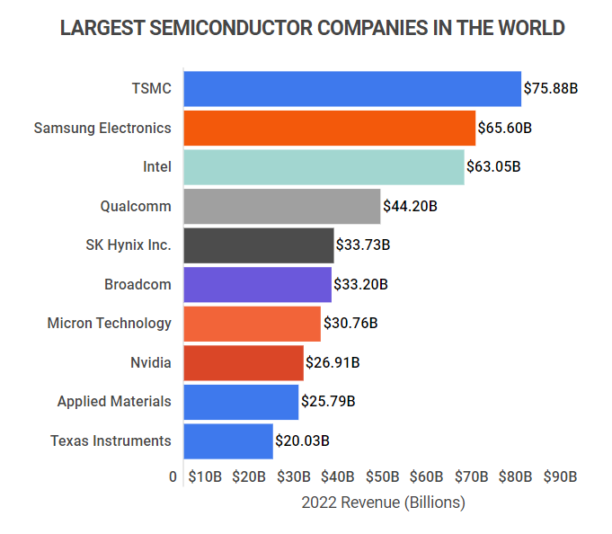

## Table of Contents

## What is a semiconductor?

A semiconductor is a material that can conduct electricity better than an insulator but not as well as a conductor. It's like a middle ground. Common semiconductors include silicon and germanium. They are used in many electronic devices, like computers and smartphones, because we can control how much electricity flows through them.

Semiconductors work by adding tiny amounts of other materials, called dopants, to them. This process changes how the semiconductor conducts electricity. For example, adding a little bit of phosphorus to silicon can make it conduct electricity more easily. By carefully controlling these additions, we can make semiconductors do specific jobs in electronic circuits, like switching or amplifying electrical signals.

## Why are semiconductors important in technology?

Semiconductors are super important in technology because they are the brains behind many devices we use every day. They are used to make chips that go into computers, smartphones, and even cars. These chips help control how these devices work, making them faster and more efficient. Without semiconductors, we wouldn't have the powerful gadgets that we rely on so much.

Another reason semiconductors are crucial is that they can be made to do different jobs by changing their properties. This means we can use them to make things like memory chips that store data, or processors that do calculations. This flexibility makes semiconductors really useful for creating all sorts of electronic devices. They help make technology smaller, cheaper, and better, which is why they are at the heart of so many innovations.

## What criteria are used to rank the largest semiconductor companies?

The largest semiconductor companies are ranked based on how much money they make, which is called revenue. They also look at how much profit they earn and how much they are worth in the market, which is their market capitalization. These numbers help people see which companies are doing the best in the semiconductor industry.

Sometimes, people also consider how many chips a company can make, which is their production capacity. They might look at how advanced their technology is and how much research and development they do. All these things together help decide which companies are the biggest and most important in the world of semiconductors.

## Who are the top 10 largest semiconductor companies by revenue?

The top 10 largest semiconductor companies by revenue include big names that help power our gadgets. In 2022, Samsung Electronics was the leader, making the most money from selling chips. They are known for their memory chips and also make chips for smartphones and other devices. Following Samsung, Intel came in second. Intel is famous for making processors that go into computers and servers. TSMC, or Taiwan Semiconductor Manufacturing Company, took the third spot. They are the world's biggest contract chip maker, making chips for other companies like Apple and Qualcomm.

Next on the list is SK Hynix, which is another big player in the memory chip market, coming in fourth. They make DRAM and NAND flash memory, which are used in computers and smartphones. Micron Technology, also known for memory chips, is fifth. They make DRAM, NAND, and other memory products. In sixth place, we have Qualcomm, which is known for making chips that help phones connect to the internet and use GPS. Broadcom, which makes a variety of chips for networking and data centers, comes in seventh.

Rounding out the top 10, Texas Instruments is eighth and is known for making analog and embedded processing chips. They are used in many different devices, from cars to appliances. In ninth place, we have MediaTek, which makes chips for smartphones and other consumer electronics. Finally, in tenth place, there's AMD, or Advanced Micro Devices, which makes processors and graphics cards that compete with Intel and Nvidia. These companies are all important because they help make the technology we use every day work better and faster.

## How do these companies compare in terms of market share?

In the world of semiconductors, Samsung Electronics holds the biggest piece of the market pie. They are the leader because they make a lot of memory chips, which are used in everything from smartphones to computers. Intel is right behind them, with a big share of the market thanks to their processors that power many PCs and servers. TSMC, or Taiwan Semiconductor Manufacturing Company, is also a major player, making chips for other companies like Apple and Qualcomm. This makes them important even though they don't sell chips under their own brand.

SK Hynix and Micron Technology also have a good chunk of the market because they focus on memory chips, just like Samsung. Qualcomm and Broadcom have a smaller share but are still important because they make chips that help with internet connections and data centers. Texas Instruments, MediaTek, and AMD each have their own piece of the market, with Texas Instruments known for analog chips, MediaTek for smartphone chips, and AMD for processors and graphics cards. Together, these companies make up a big part of the semiconductor market, but Samsung, Intel, and TSMC are the biggest players.

The market share can change over time because new technology and new products can shift things around. For example, if a company comes out with a new type of chip that everyone wants, their market share might grow. But overall, these top 10 companies are the ones that most people think of when they talk about the biggest names in semiconductors.

## What are the primary products or services offered by these companies?

Samsung Electronics is the biggest name in the semiconductor world. They make a lot of memory chips, like DRAM and NAND flash memory, which are used in computers, smartphones, and other gadgets. They also make chips for smartphones, like the ones used in their own Galaxy phones. Intel is another big player, known for making processors that go into computers and servers. Their processors help make computers fast and powerful. TSMC, or Taiwan Semiconductor Manufacturing Company, is the world's biggest contract chip maker. They make chips for other companies, like Apple and Qualcomm, without putting their own brand on them. This makes them very important in the industry.

SK Hynix and Micron Technology focus on memory chips too, just like Samsung. They make DRAM and NAND flash memory, which are used in computers and smartphones. Qualcomm is known for making chips that help phones connect to the internet and use GPS. Broadcom makes a variety of chips that are used in networking and data centers. Texas Instruments makes analog and embedded processing chips, which are used in cars, appliances, and other devices. MediaTek makes chips for smartphones and other consumer electronics. Finally, AMD, or Advanced Micro Devices, makes processors and graphics cards that compete with Intel and Nvidia. These companies all make important parts that help our technology work better and faster.

Each of these companies has its own specialty. Samsung, SK Hynix, and Micron focus on memory, while Intel and AMD are known for processors. TSMC makes chips for others, and Qualcomm and Broadcom help with connectivity and data centers. Texas Instruments and MediaTek offer chips for a wide range of devices. Together, these companies help power the gadgets we use every day.

## How have recent global events affected the semiconductor industry?

Recent global events, like the COVID-19 pandemic and trade tensions between countries, have had a big impact on the semiconductor industry. The pandemic caused factories to close and slowed down the making of chips. This led to a big shortage of semiconductors because everyone still wanted to buy new gadgets, like computers and smartphones, to work and study from home. Also, trade fights, especially between the U.S. and China, made it harder for companies to get the materials they need to make chips. This made the shortage even worse and caused prices to go up.

To deal with these problems, companies started looking for new ways to make chips and new places to get the materials they need. Some countries, like the U.S., started making plans to build more factories at home so they wouldn't have to rely on other countries as much. This is called "reshoring" or "onshoring." The industry also started to focus more on making sure they could keep making chips even if something unexpected happened again. This means they are trying to be more flexible and ready for anything.

## What are the current trends in semiconductor technology?

One big trend in semiconductor technology right now is making chips smaller and more powerful. This is called "Moore's Law," which says that the number of transistors on a chip doubles about every two years. This makes chips faster and more efficient. Companies are working on new ways to pack more transistors into smaller spaces, like using new materials and building chips in 3D instead of flat. This helps make our gadgets, like smartphones and computers, work better and use less power.

Another trend is the rise of [artificial intelligence](/wiki/ai-artificial-intelligence) (AI) and [machine learning](/wiki/machine-learning). These technologies need special chips that can do a lot of math quickly. Companies are making new types of chips, called AI accelerators, to help with this. These chips are made to handle the kind of calculations that AI needs, making it faster and more efficient. This is important for things like self-driving cars, smart home devices, and even medical research.

The third trend is the focus on sustainability. As we use more technology, we need to think about how much energy it uses and how it affects the environment. Companies are working on making chips that use less power and are easier to recycle. They are also looking at new ways to make chips that are kinder to the environment. This is important because it helps us use technology in a way that doesn't harm the planet.

## How do these companies invest in research and development?

The top semiconductor companies spend a lot of money on research and development (R&D) to stay ahead in the industry. They use this money to find new ways to make chips smaller, faster, and more efficient. For example, Samsung and TSMC invest billions of dollars every year to develop new technology. They work on things like 3D chip stacking and new materials that can pack more transistors into a smaller space. This helps them keep up with Moore's Law, which says that the number of transistors on a chip should double every two years.

These companies also focus on creating new types of chips for specific uses, like AI and machine learning. Companies like Qualcomm and NVIDIA spend a lot on R&D to make chips that can do the special calculations needed for AI. This is important because AI is becoming a big part of many devices, from smartphones to self-driving cars. By investing in R&D, these companies can make sure they have the best technology for these new applications.

In addition to making chips better, these companies also invest in sustainability. They look for ways to make chips that use less power and are easier to recycle. Intel, for example, works on eco-friendly manufacturing processes. By spending on R&D, these companies can find new ways to make technology that is good for the environment. This helps them meet the growing demand for technology while also being responsible about their impact on the planet.

## What are the challenges faced by semiconductor companies in scaling production?

Scaling up production is a big challenge for semiconductor companies. They need a lot of money to build new factories, called fabs, and buy the machines that make chips. These machines are very expensive, and it can take years to build a new fab. Also, making chips is a complicated process that needs to be perfect every time. If something goes wrong, it can ruin a whole batch of chips, which is costly. Companies have to make sure they can keep making high-quality chips even when they are making more of them.

Another challenge is getting the materials they need. Semiconductors need special materials, like silicon wafers and chemicals, to be made. Sometimes, there are not enough of these materials, or they come from places that are far away or have problems. This can slow down production and make it harder to meet the demand for chips. Companies are trying to find new ways to get these materials and make their supply chains stronger, but it's not easy. They also have to deal with rules and regulations from different countries, which can make scaling up even harder.

## How do geopolitical factors influence the semiconductor market?

Geopolitical factors play a big role in the semiconductor market. Countries like the U.S. and China are always trying to be the best at making chips. This can lead to trade fights, where one country puts rules or taxes on chips from another country. These fights can make it harder for companies to get the materials they need or sell their chips in certain places. For example, the U.S. has put restrictions on selling some chips to China, which has made things tricky for companies that do business there.

These tensions also push countries to want to make more chips at home. They don't want to rely on other countries for something so important. This is called "reshoring" or "onshoring." For instance, the U.S. government is spending a lot of money to help build new factories in America. This way, they can make sure they have enough chips even if there are problems with other countries. But building new factories takes a long time and a lot of money, so it's not an easy fix.

## What future developments can we expect from the leading semiconductor companies?

In the future, leading semiconductor companies will keep working on making chips smaller, faster, and more powerful. They will use new technologies like 3D chip stacking and new materials to pack more transistors into tiny spaces. This will help make our gadgets, like smartphones and computers, work even better. Companies like Samsung, Intel, and TSMC are already spending a lot of money on research to find new ways to do this. They want to keep up with Moore's Law, which says that the number of transistors on a chip should double every two years.

Another big area of focus will be making chips for artificial intelligence (AI) and machine learning. Companies like Qualcomm and NVIDIA are investing in special chips called AI accelerators that can do the math needed for AI quickly. This is important because AI is becoming a big part of many devices, from self-driving cars to smart home gadgets. These companies will keep working on making these chips even better so that AI can do more and be used in more places.

Lastly, semiconductor companies will also focus on making their technology more sustainable. They will work on making chips that use less power and are easier to recycle. This is important because as we use more technology, we need to make sure it doesn't harm the environment. Companies like Intel are already looking at new ways to make chips that are kinder to the planet. By doing this, they can meet the growing demand for technology while also being responsible about their impact on the world.

## References & Further Reading

[1]: Chang, Y.C., Chen, H.C., & Lin, C.H. (2019). ["The Impact of Algorithmic Trading on Stock Liquidity: Evidence from the Tick Size Change in Taiwan."](https://pubmed.ncbi.nlm.nih.gov/9126500/) Journal of Empirical Finance.

[2]: Morris, K. J. (2018). ["Semiconductors, Trade, and the Global Economy."](https://www.mckinsey.com/industries/semiconductors/our-insights/the-semiconductor-decade-a-trillion-dollar-industry) Brookings Institution.

[3]: Gershgorn, D. (2020). ["Nvidia Could End Intel's 30-Year Run As The Largest US Chipmaker."](https://www.nbcnews.com/business/business-news/what-is-nvidia-what-do-they-make-ai-artificial-intelligence-rcna140171) Quartz.

[4]: ["AI Hardware: NVIDIA Flips the Switch on New Age in Machine Learning."](https://www.newyorker.com/magazine/2023/12/04/how-jensen-huangs-nvidia-is-powering-the-ai-revolution) Data Center Dynamics.

[5]: ["The Inside Story of TSMC, the World’s Most Important Company."](https://www.abc.net.au/news/2023-08-19/tsmc-the-most-important-company-in-the-world/102728172) Nikkei Asia.