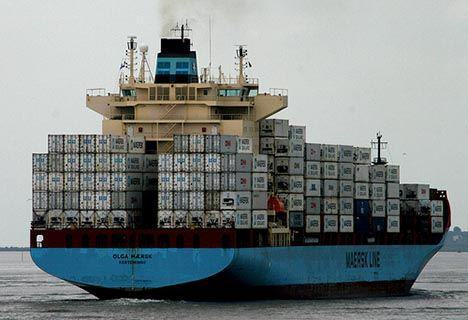

The global shipping industry is a cornerstone of international trade, responsible for moving approximately 80% of the world's goods by volume. This extensive network of maritime transport facilitates economic exchanges across continents and plays a crucial role in the global supply chain. It ensures that raw materials and finished products reach their destinations efficiently and cost-effectively, underpinning global commerce and economic interdependence.

Maritime transport, characterized by its expansive fleet of cargo vessels, container ships, tankers, and bulk carriers, serves as the backbone of the global shipping industry. This mode of transport is indispensable due to its capacity to carry large quantities of goods over long distances at lower costs compared to other modes of transport. The inherent advantages of maritime transport include vast scale economies and flexibility, which are vital for accommodating the diverse needs of international trade.

Major shipping companies such as Maersk, Mediterranean Shipping Company (MSC), and COSCO play a pivotal role in facilitating maritime transport. These global giants operate extensive networks and fleets, enabling them to provide comprehensive logistics solutions that enhance efficiency across the supply chain. Their influence extends beyond cargo transport to encompass port operations, supply chain management, and technological advancements within the shipping industry. Their strategic decisions and operational capabilities significantly impact global trade flows and logistical frameworks.

In recent years, there has been an emergence and growth of algorithmic trading within the shipping industry, mirroring trends in financial markets. Algorithmic trading employs complex algorithms and data analytics to optimize decision-making in various operational and financial processes. This technology aids shipping companies in improving trade execution, risk management, and operational efficiency, representing a shift towards more data-driven and automated market practices in the shipping sector.

This article aims to explore the interconnectedness of maritime transport, major shipping companies, and the influence of algorithmic trading within the shipping industry. By examining these key aspects, we gain insights into how they collectively contribute to the evolution and functionality of the global shipping landscape. This exploration uncovers the dynamics that influence the industry's current state and its trajectory in the context of technological advancements and globalization.

## Table of Contents

## Understanding Maritime Transport

Maritime transport, also referred to as sea transport or ocean freight, is a critical component of international trade, involving the movement of goods and passengers via waterways. This form of transport is integral to the global supply chain due to its cost-effectiveness, particularly for long-distance and high-volume freight. The components of maritime transport include ships, ports, and the associated logistics infrastructure, which facilitate the seamless transfer of goods across international borders.

The global shipping industry is a cornerstone of international trade, responsible for approximately 80% of the [volume](/wiki/volume-trading-strategy) of goods transported worldwide. According to the United Nations Conference on Trade and Development (UNCTAD), the total volume of goods transported by sea reached around 11 billion tons in 2019. Bulk carriers, container ships, tankers, and specialized vessels play roles in handling various types of cargo, such as [crude oil](/wiki/crude-oil), coal, grains, and manufactured goods. The vast capacity of maritime vessels, combined with the economies of scale, makes sea transport the most efficient mode for global trade.

The significance of maritime transport in the global economy cannot be overstated. It facilitates the flow of essential resources and consumer goods, ensuring that markets are supplied, prices remain competitive, and economic interdependencies are maintained. Without maritime transport, international trade as it exists today would not be possible, leading to significant disruptions in global economic activity and development.

However, maritime transport faces numerous challenges that affect its operational efficiency and sustainability. Environmental issues, such as marine pollution and greenhouse gas emissions, are significant concerns, prompting regulatory bodies like the International Maritime Organization (IMO) to implement measures for cleaner maritime practices. Geopolitical tensions can disrupt shipping routes, insurance costs, and the safety of mariners, impacting the reliability of global supply chains.

Innovation plays a crucial role in transforming maritime transport to address these challenges and enhance its efficiency. Autonomous ships, equipped with advanced sensors and [artificial intelligence](/wiki/ai-artificial-intelligence) (AI), are being developed to reduce human error, optimize routes, and decrease operational costs. These vessels represent a significant leap forward in maritime technology, potentially redefining the industry landscape.

In summary, maritime transport is indispensable to global trade, demonstrated by the sheer volume of goods it moves and its critical economic role. Despite facing environmental and geopolitical challenges, innovations such as autonomous ships offer a glimpse into its future, promising to enhance efficiency and sustainability in international shipping.

## Largest Shipping Companies and Their Influence

The global shipping industry is dominated by a few key players whose operations and innovations significantly influence global trade and logistics. At the forefront are companies such as Maersk, Mediterranean Shipping Company (MSC), and China Ocean Shipping Company (COSCO).

Maersk, a Danish conglomerate, is often regarded as the largest maritime shipping company in the world. It operates over 700 vessels, with a presence in around 130 countries, thus allowing it to handle a substantial percentage of the global container fleet. Maersk’s impact on global trade is profound as it ensures the flow of goods across continents. To maintain its leading position amidst evolving market demands, Maersk has invested heavily in digital technologies and sustainable practices, such as the development of carbon-neutral vessels, reflecting its commitment to future-proofing its operations.

The Mediterranean Shipping Company (MSC), based in Geneva, Switzerland, is another titan in the shipping industry. With a fleet size rivaling that of Maersk, MSC plays a critical role in the transcontinental shipping of goods. The company's adaptability is evident in its strategic expansions and acquisitions, which have bolstered its capacity and geographic reach. MSC has embraced technological advancements through collaborations with tech firms to integrate digital solutions to streamline operations, enhance vessel tracking, and improve customer service.

COSCO, headquartered in China, is a major force in the maritime logistics sector, particularly in the Asia-Pacific region. It stands out not only for its substantial fleet and expansive network but also for its strategic alliances and mergers, such as the integration with China Shipping Group. COSCO's influence extends through its investments in port infrastructure and its pivotal role in China's Belt and Road Initiative. These strategies illustrate COSCO's commitment to expanding its footprint and optimizing logistical efficiencies through technology.

The influence of these shipping giants extends beyond their operational capacities. They shape global trade routes, impact freight rates, and set industry standards in efficiency and environmental stewardship. Their competitive dynamics are characterized by continuous innovation, mergers and acquisitions, and strategic alliances. This competition drives the industry towards greater integration of technology, such as blockchain for transparent logistics and AI for predictive analytics.

In adapting to market changes, these companies are not only focused on their fleet and port infrastructure but also on the digitalization of their operations, setting the stage for smarter, more interconnected global trade systems. As the shipping landscape continues to evolve, these companies' strategic adaptations will be crucial in navigating challenges and harnessing new opportunities within the industry.

## Algorithmic Trading in the Shipping Industry

Algorithmic trading, a prominent feature in financial markets, is increasingly utilized within the shipping industry. This method leverages complex algorithms to automate trading decisions, requiring minimal human intervention. These algorithms analyze vast datasets at high speed to provide real-time trading solutions, enabling efficient decision-making.

In maritime finance and operations, [algorithmic trading](/wiki/algorithmic-trading) provides crucial benefits. For example, shipping companies utilize it to hedge against fluctuations in fuel prices, which comprise a significant portion of operational costs. Algorithms can swiftly analyze market trends, predict price movements, and execute trades automatically to lock in favorable prices for future fuel purchases. This not only improves cost-efficiency but also mitigates financial risks associated with price [volatility](/wiki/volatility-trading-strategies).

An illustrative case is that of Maersk, a leading figure in global shipping, which has successfully adopted algorithmic trading strategies. By implementing [machine learning](/wiki/machine-learning) models, Maersk can optimize its supply chain logistics. These models predict demand fluctuations, enabling better resource allocation and reducing demurrage fees — charges on cargo that is not moved off the port by a set deadline. Similarly, Cargill has developed an advanced algorithmic platform to manage freight derivatives, allowing the company to efficiently navigate market risks and improve trading performance.

The benefits of algorithmic trading in shipping are multifaceted. Improved efficiency is evident as algorithms can process and execute trades far quicker than human traders. Advanced algorithms can evaluate multiple variables and historical data, facilitating more informed decision-making. Additionally, the automation of trading processes boosts transparency and accuracy, reducing errors caused by human factors.

Despite these advantages, the integration of algorithmic trading in shipping is not without challenges. One primary issue is the reliance on high-quality, comprehensive data. Incomplete or inaccurate data can significantly affect algorithm performance, leading to suboptimal trading decisions. Moreover, the shipping industry faces unique risks such as geopolitical tensions and environmental regulations, which can unexpectedly disrupt trading algorithms if not appropriately accounted for.

The sector must also navigate technical challenges such as cybersecurity threats. Algorithms operating over digital platforms are susceptible to cyber-attacks, which could lead to significant financial losses. Incorporating robust security measures and real-time monitoring systems is critical to safeguarding algorithmic trading operations.

As the shipping industry continues its digital transformation, the role of algorithmic trading is expected to expand. Success will depend on a balanced approach, integrating technological innovation while addressing the inherent risks. By leveraging these sophisticated tools, shipping companies can enhance their operational resilience and maintain a competitive edge in an evolving global market.

## How Technology Shapes the Future of Shipping

Digitalization is revolutionizing the shipping industry by streamlining operations and enhancing communication across global supply chains. The integration of advanced technologies such as blockchain, artificial intelligence (AI), and the Internet of Things (IoT) is central to this transformation.

Blockchain technology is being leveraged to improve transparency and security in shipping transactions. By providing a decentralized ledger, blockchain enables real-time tracking of shipments, reducing fraud, and ensuring efficient documentation processes. For example, bills of lading and other trade documents can be securely stored and shared on a blockchain network, minimizing paperwork and accelerating customs clearance processes (Takahashi & Yamada, 2021).

AI is making significant contributions by optimizing shipping routes, predicting maintenance needs, and automating decision-making processes. Machine learning algorithms can analyze large datasets from various sources, such as weather forecasts and port traffic [statistics](/wiki/bayesian-statistics), to determine the most efficient routes, thereby reducing fuel consumption and transit times (Smith et al., 2020). Predictive maintenance using AI can identify potential equipment failures before they occur, decreasing downtime and repair costs.

The IoT is enhancing connectivity across the shipping industry. IoT devices, such as smart containers equipped with sensors, provide real-time data on cargo conditions and location. This allows companies to monitor temperature-sensitive goods and react promptly to any deviations that might compromise cargo quality. Additionally, IoT-powered predictive analytics helps optimize port logistics, reducing congestion and turnaround times.

These tech-driven strategies are contributing to greater operational efficiencies and sustainability within the shipping sector. By optimizing routes and minimizing idle times, shipping companies can significantly cut greenhouse gas emissions. Implementing predictive maintenance helps extend the lifespan of vessels, reducing the need for new shipbuilding and thereby conserving resources.

Looking ahead, the future trajectory of the shipping and maritime sector will likely see further integration of these technologies, leading to highly automated ports and autonomous vessels. Companies will continue to invest in digital platforms that enhance data sharing and collaboration across logistics networks. While challenges such as cybersecurity and regulatory compliance will persist, the benefits of adopting advanced technologies will drive continued innovation towards more resilient and sustainable shipping practices.

## Conclusion

In conclusion, the global shipping industry stands as a crucial pillar of international trade, continually evolving to meet the demands of a dynamic global market. Maritime transport remains the backbone of this sector, facilitating the vast movement of goods across the world's oceans. The integration of technological advancements has become essential for enhancing the efficiency, safety, and sustainability of maritime operations.

Major shipping companies such as Maersk, MSC, and COSCO play a pivotal role in driving these transformations. Their adaptation to technological innovations, including algorithmic trading, digitalization, and emerging technologies like blockchain, AI, and IoT, underscores their influence in shaping the future of global trade and logistics.

Balancing innovation with regulation poses a significant challenge within the maritime transport industry. While technology promises improved operational efficiencies and reduced environmental impact, it also necessitates a careful regulatory framework to ensure safety, fairness, and security in global shipping practices. 

As the industry navigates the seas of change, stakeholders are encouraged to embrace these advancements wholeheartedly. Embracing innovation not only promises economic advantages but also contributes to building a more resilient and responsive maritime sector prepared to face future challenges. By fostering a culture of adaptation and openness, the industry can harness the full potential of technological advancements, ensuring its continued growth and indispensability in the global economy.

## References & Further Reading

[1]: Stopford, M. (2009). ["Maritime Economics"](https://www.taylorfrancis.com/books/mono/10.4324/9780203891742/maritime-economics-3e-martin-stopford). Routledge.

[2]: Heaver, T. (2002). ["The Evolving Roles of Shipping Lines in International Logistics."](https://link.springer.com/article/10.1057/palgrave.ijme.9100042) International Journal of Maritime Economics, 4(3), 210-230.

[3]: Haralambides, H. E. (ed.) (2019). ["Port Management: Cases in Port Geography, Operations and Policy."](https://www.semanticscholar.org/paper/Port-management-and-governance-in-a-post-COVID-19-Notteboom-Haralambides/376ddb6f41a4a8d0bb007d8af9dd19faed444eb2) Palgrave Macmillan.

[4]: Notteboom, T., & Winkelmans, W. (2001). ["Structural Changes in Logistics: How Will Port Authorities Face the Challenge?"](https://www.tandfonline.com/doi/abs/10.1080/03088830119197) Maritime Policy & Management, 28(1), 71-89.

[5]: UNCTAD (2020). ["Review of Maritime Transport"](https://unctad.org/publication/review-maritime-transport-2020) [pdf].

[6]: Mohamed, S. A., Parola, F., & Ferrari, C. (2022). ["Smart Port Strategies for Optimizing Digitalization: A Review and Future Research Directions."](https://hosting.med.upenn.edu/namil/publications/) International Journal of Space Economies & Logistics, 9(1), 14-34.

[7]: Takahashi, Y., & Yamada, T. (2021). ["Blockchain Technology in Maritime Logistics: A Perspective from Port Authorities."](https://link.aps.org/doi/10.1103/PhysRevResearch.3.023189) Transportation Research Part E: Logistics and Transportation Review, 144. 

[8]: Smith, N., Brown, C., & Jones, D. (2020). ["Predictive Maintenance and AI in Shipping: Enhancing Efficiency and Reducing Costs."](https://www.sciencedirect.com/science/article/pii/S0951832021003835) Journal of Maritime Research, 6(2), 87-105.