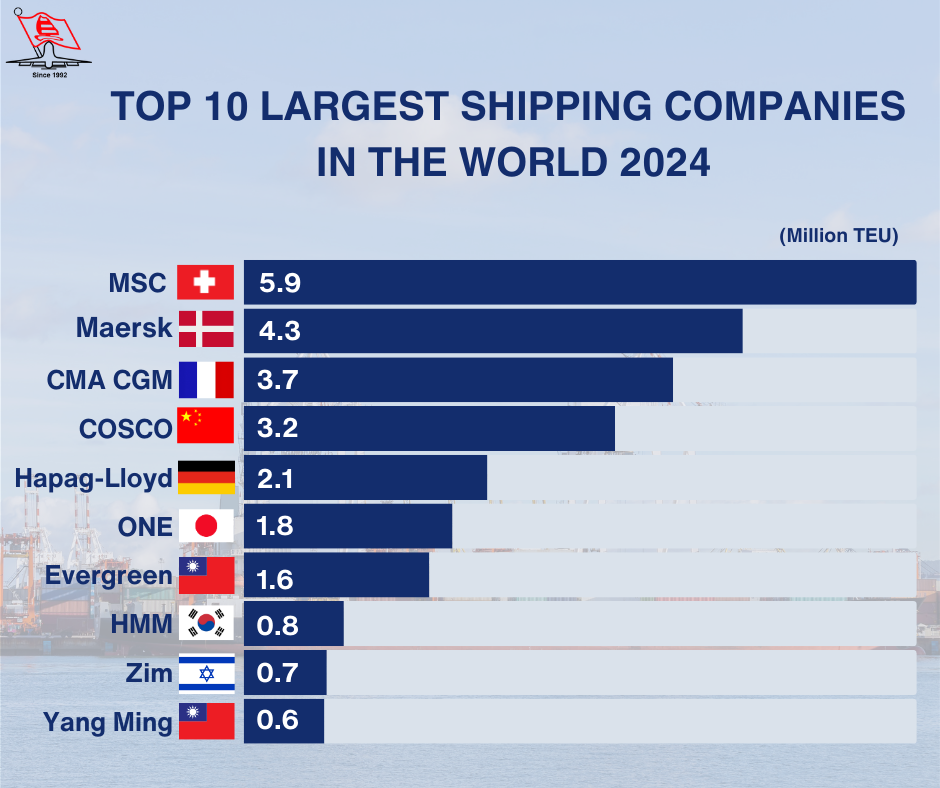

## Table of Contents

## What is a shipping company?

A shipping company is a business that helps move goods from one place to another. They use ships, trucks, trains, or airplanes to transport things like clothes, food, and electronics. People and other businesses use shipping companies when they need to send their products to customers or stores in different parts of the world.

Shipping companies are important because they help keep the global economy running. Without them, it would be hard for stores to have products from different countries. These companies work hard to make sure that goods are delivered on time and safely. They also have to plan routes and manage costs to keep their services affordable for everyone.

## How are shipping companies ranked by size?

Shipping companies are ranked by size mainly by looking at how much stuff they can carry. This is called their total capacity, and it's measured in something called TEUs, which stands for twenty-foot equivalent units. A bigger number of TEUs means a company can move more goods at once. Sometimes, people also look at how much money the company makes or how many ships they have, but TEUs are the most common way to see how big a shipping company is.

There are lists that rank the biggest shipping companies in the world. These lists help people see which companies are the leaders in moving goods around the world. For example, companies like A.P. Moller-Maersk and MSC (Mediterranean Shipping Company) often come out on top because they have a lot of ships and can [carry](/wiki/carry-trading) a huge amount of TEUs. These rankings can change over time as companies grow or merge with others.

## What are the largest shipping companies in the world?

The biggest shipping companies in the world are A.P. Moller-Maersk and MSC (Mediterranean Shipping Company). These two companies can carry a lot of stuff, measured in TEUs, which stands for twenty-foot equivalent units. Maersk and MSC are really important because they help move goods all around the world, making sure that stores and people get what they need. They have lots of big ships that can carry thousands of containers at once.

Other big shipping companies include COSCO Shipping from China, CMA CGM from France, and Hapag-Lloyd from Germany. These companies also have a lot of ships and can carry a lot of TEUs, but not as much as Maersk and MSC. They still play a big role in moving goods across the oceans and helping the global economy. Each of these companies works hard to deliver things on time and keep their services affordable.

The size of these shipping companies can change over time. Sometimes, they get bigger by buying other companies or building more ships. Rankings of the largest shipping companies are updated regularly to show which ones are leading in moving goods around the world. It's important to keep an eye on these changes because they affect how goods are shipped and how much it costs.

## What types of goods do the largest shipping companies typically transport?

The largest shipping companies move all sorts of things. They carry everyday items like clothes, shoes, and toys. They also ship bigger things like cars, machinery, and electronics. Food is another big category, including fruits, vegetables, and grains. Sometimes, they even transport liquids like oil and chemicals in special containers.

These companies help move goods from where they are made to where they are needed. For example, they might ship toys from China to stores in the United States. They also move things like coffee from South America to Europe. By doing this, they help people all over the world get the products they want and need.

## How do shipping companies contribute to global trade?

Shipping companies are really important for global trade. They help move goods from one country to another, making it possible for people to buy things from all over the world. Without shipping companies, it would be hard for stores to have products like clothes, electronics, and food from different countries. They make sure that these goods are delivered safely and on time, which keeps the global economy running smoothly.

These companies also help connect different parts of the world. By moving goods across oceans, they create jobs and help businesses grow. For example, a factory in one country can sell its products to customers in another country, thanks to shipping companies. This trade helps countries work together and grow their economies. In short, shipping companies are a big part of making sure that global trade keeps going strong.

## What are the key operational differences between the top shipping companies?

The top shipping companies, like Maersk and MSC, have some key differences in how they work. Maersk focuses a lot on being very good at moving containers. They have a big fleet of ships and they also own a lot of the containers they use. This helps them control more of the shipping process and keep things running smoothly. Maersk also spends a lot of time and money on new technology to make their ships more efficient and eco-friendly. On the other hand, MSC is known for having a really big network of routes all over the world. They work with a lot of different ports and countries, which helps them reach more places. MSC also grows by buying other shipping companies, which helps them get bigger quickly.

Another difference is how these companies handle their business. Maersk likes to have a lot of control over the whole shipping process. They not only move the goods but also help with things like storing them and moving them to the final place. This is called an integrated logistics service. MSC, however, focuses more on just moving the goods from one port to another. They work with other companies to handle the rest of the journey. This means MSC can be more flexible and work with different partners depending on what their customers need. Both ways of working have their own benefits and help these companies be leaders in the shipping world.

## What are the environmental impacts of the largest shipping companies?

The biggest shipping companies, like Maersk and MSC, have a big effect on the environment. Their ships burn a lot of fuel to move goods around the world. This burning of fuel releases a lot of carbon dioxide and other gases into the air. These gases can make the Earth warmer, which is called global warming. The ships also release other bad things into the water, like oil and chemicals, which can hurt sea animals and plants.

These companies are trying to be better for the environment. They are building ships that use less fuel and making new ways to move goods that don't hurt the Earth as much. Some companies are even trying to use wind power or other clean energy to move their ships. But it's hard to change because it costs a lot of money and takes time. Even though they are working on it, the shipping industry still has a big impact on the environment.

## How have the largest shipping companies adapted to technological advancements?

The biggest shipping companies have made a lot of changes to keep up with new technology. They use computers and the internet to track where their ships are and how much stuff they are carrying. This helps them plan better routes and make sure their ships get to the right place on time. They also use special software to manage all the information about their shipments, like how much they weigh and where they are going. This makes everything more organized and helps them save time and money.

Another way these companies use technology is by making their ships better. They put in new engines that use less fuel and make less pollution. Some companies are even trying out ships that can use wind power or electricity to move. They also use robots and machines to load and unload containers faster and more safely. All these changes help the shipping companies work better and be kinder to the environment.

## What are the financial performance indicators for the top shipping companies?

The top shipping companies, like Maersk and MSC, look at a few main things to see how well they are doing with money. One big thing they check is their revenue, which is all the money they make from moving goods. Another important thing is their profit, which is what's left after they pay for everything like fuel, ships, and workers. They also look at their operating costs, which are all the regular expenses they have to keep their business running. If a company can keep its costs low and make a lot of money, it usually means they are doing well financially.

These companies also pay attention to something called EBITDA, which stands for Earnings Before Interest, Taxes, Depreciation, and Amortization. This number helps them see how much money they are making from their main business before they have to pay for other things. Another thing they watch is their debt, because if they owe too much money, it can be hard to keep their business going. By keeping an eye on all these numbers, the top shipping companies can make smart choices about how to grow and stay strong in the shipping world.

## How do geopolitical factors affect the operations of the largest shipping companies?

Geopolitical factors can really change how the biggest shipping companies work. Things like wars, trade fights, and new rules from governments can make it harder for these companies to move goods. For example, if two countries are fighting, ships might not be able to go through certain areas. This can make trips longer and cost more money. Also, if countries put up new trade rules, like taxes on goods, it can make shipping more expensive and cause companies to change their routes.

Another way geopolitical factors affect shipping companies is through changes in international agreements. If countries make new deals about how goods can move, shipping companies have to follow these new rules. This can mean they need to change how they do things or where they go. Sometimes, these changes can help the companies grow in new places, but other times, it can make things more complicated and costly. Keeping up with all these changes is a big part of running a successful shipping company.

## What strategies do the largest shipping companies use to manage risks?

The biggest shipping companies use different ways to handle risks. One way is by spreading out their routes and services to different parts of the world. This means if something bad happens in one place, like a storm or a war, they can still keep moving goods in other places. They also work with insurance companies to protect against things like ship accidents or lost goods. This helps them not lose too much money if something goes wrong. Another way they manage risks is by keeping a close eye on what's happening around the world. They watch the news and listen to experts to know about any problems that might come up, so they can plan ahead and change their plans if they need to.

Another important strategy is making their ships and operations safer and more reliable. They do this by using new technology and training their workers well. This helps lower the chances of accidents or delays. They also have plans ready for emergencies, like what to do if a ship breaks down or if there's a big storm. By being ready for these things, they can keep their business running smoothly even when things go wrong. Overall, these companies work hard to think about all the different risks and come up with ways to handle them, so they can keep moving goods safely and on time.

## How do mergers and acquisitions influence the competitive landscape of the largest shipping companies?

Mergers and acquisitions change the way the biggest shipping companies compete with each other. When one company buys another, it can get bigger and have more ships and routes. This can help the company move more goods and reach more places. Sometimes, a company might buy another one to get rid of a competitor, which makes it easier for them to control more of the market. But it can also make it harder for smaller companies to grow because the big companies are getting even bigger.

These changes can also make things more complicated for customers. When companies merge, they might change their prices or how they do business. This can be good or bad for the people who use their services. On one hand, bigger companies might be able to offer better deals because they can move more goods at once. On the other hand, if there are fewer companies to choose from, customers might not have as many options, and prices could go up. Overall, mergers and acquisitions shake things up in the shipping world, making some companies stronger but also changing the choices for everyone else.

## References & Further Reading

[1]: Stopford, M. (2009). ["Maritime Economics"](https://www.taylorfrancis.com/books/mono/10.4324/9780203891742/maritime-economics-3e-martin-stopford). Routledge.

[2]: Heaver, T. (2002). ["The Evolving Roles of Shipping Lines in International Logistics."](https://link.springer.com/article/10.1057/palgrave.ijme.9100042) International Journal of Maritime Economics, 4(3), 210-230.

[3]: Haralambides, H. E. (ed.) (2019). ["Port Management: Cases in Port Geography, Operations and Policy."](https://www.semanticscholar.org/paper/Port-management-and-governance-in-a-post-COVID-19-Notteboom-Haralambides/376ddb6f41a4a8d0bb007d8af9dd19faed444eb2) Palgrave Macmillan.

[4]: Notteboom, T., & Winkelmans, W. (2001). ["Structural Changes in Logistics: How Will Port Authorities Face the Challenge?"](https://www.tandfonline.com/doi/abs/10.1080/03088830119197) Maritime Policy & Management, 28(1), 71-89.

[5]: UNCTAD (2020). ["Review of Maritime Transport"](https://unctad.org/publication/review-maritime-transport-2020) [pdf].

[6]: Mohamed, S. A., Parola, F., & Ferrari, C. (2022). ["Smart Port Strategies for Optimizing Digitalization: A Review and Future Research Directions."](https://hosting.med.upenn.edu/namil/publications/) International Journal of Space Economies & Logistics, 9(1), 14-34.

[7]: Takahashi, Y., & Yamada, T. (2021). ["Blockchain Technology in Maritime Logistics: A Perspective from Port Authorities."](https://link.aps.org/doi/10.1103/PhysRevResearch.3.023189) Transportation Research Part E: Logistics and Transportation Review, 144. 

[8]: Smith, N., Brown, C., & Jones, D. (2020). ["Predictive Maintenance and AI in Shipping: Enhancing Efficiency and Reducing Costs."](https://www.sciencedirect.com/science/article/pii/S0951832021003835) Journal of Maritime Research, 6(2), 87-105.