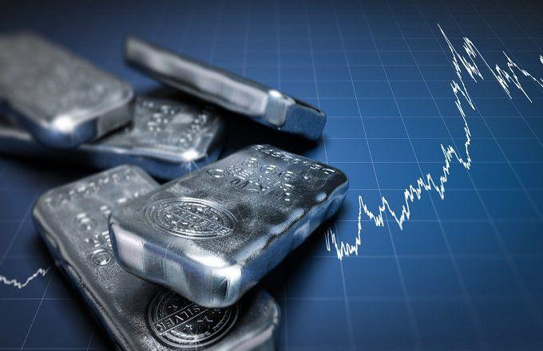

The silver mining industry is an integral part of the global commodities market due to its diverse applications and intrinsic value. Silver is not just a precious metal; it performs vital functions across various sectors. In electronics, silver's excellent conductivity makes it indispensable for manufacturing circuit boards, switches, and other components. In the jewelry industry, silver has been cherished for its luster and malleability, making it a popular choice for crafting elegant ornaments. Additionally, the renewable energy sector utilizes silver extensively, particularly in photovoltaic cells for solar panels, where its conductive properties enhance efficiency in energy capture and conversion processes.

This article presents the largest silver producers and mining companies, shedding light on their contributions to maintaining the industry's vitality. Notable players in the silver market strategically navigate challenges and leverage opportunities to sustain production and meet global demands.

The intricacies of the silver market extend beyond traditional mining operations. Algorithmic trading, for instance, has emerged as a crucial factor influencing the silver market. By employing complex mathematical models and computational algorithms, traders can execute orders at speeds and frequencies significantly surpassing traditional trade methods. The use of algorithmic trading in the silver market enhances market liquidity and efficiency, impacting how investors interact with this critical commodity.

The exploration of these topics provides a comprehensive understanding of the factors that shape the silver mining industry, its current landscape, and future prospects. Through this examination, stakeholders and investors can grasp the dynamics and potential of silver in the modern economy.

## Table of Contents

## Global Silver Production

In 2023, global silver production achieved a notable milestone, reaching 831 million ounces. This production volume underscores the significant role silver continues to play in the global commodities market. The silver mining industry's output is dominated by the largest companies, with the top 20 enterprises accounting for approximately 43% of total production. This concentration highlights the influence and operational scale of major players within the industry, ensuring a stable supply to meet global demand.

North America emerges as a pivotal region in silver mining, reflecting its rich mineral resources and well-established mining infrastructure. Within North America, Mexico stands out as the largest producer, contributing significantly to the global silver supply. The country's geological advantage, combined with its mining capabilities, positions it as a leading force in the industry. Mexico's mining sector is further supported by favorable regulations and a skilled workforce, enabling efficient extraction and processing of silver ores.

The substantial production volumes from Mexico and other North American nations highlight the region's strategic importance in fulfilling global silver requirements. Moreover, the concerted efforts of leading mining companies in optimizing production processes and leveraging advanced technologies contribute to the robust output levels observed.

As the silver industry evolves, the geographical and corporate concentration of silver production remains a critical [factor](/wiki/factor-investing) in meeting the diverse needs of industries reliant on this precious metal.

## Top Silver Mining Companies

Industrias Peñoles SAB de CV stands as the largest silver mining company based on revenue, playing a crucial role in the global silver market. The company, headquartered in Mexico, is renowned for its substantial silver production capabilities and diverse mining operations. As an integrated mining group, Peñoles also leads in other metals, but silver remains a significant focus. Financially, the company exhibits strong revenue figures driven by high market demand and efficient mining practices. In recent years, it has consistently maintained its position at the top due to its ability to adapt to market changes and technological advancements in mining operations.

Fresnillo PLC, another key player, is a major producer with deep roots in Mexico, which is the world's top silver-producing country. Operating numerous mines, Fresnillo has established a reputation for high-quality silver production. The company emphasizes cost-effective operations and continuous exploration to maintain its competitive edge. Financial reports indicate robust performance metrics, with significant investments in sustainable mining practices and technological innovations to enhance productivity and reduce environmental impact.

Polymetal International PLC, with significant operations in Russia and Kazakhstan, completes the trio of leading silver mining companies. As a diverse mining firm, Polymetal not only mines silver but also focuses on gold and other precious metals. Its strategic geographical presence enables access to rich mineral reserves, and its commitment to efficient mining technology further boosts its production capacity. Financial assessments reveal consistent revenue streams, supported by its strong market position in precious metal mining and its adaptability to shifts in global market demands.

The operations of these companies are interconnected with the broader dynamics of the silver market, where technological advancements, cost management, and sustainable practices are increasingly critical. While each company has unique geographical and operational characteristics, their collective contribution significantly influences global silver supply, underscoring the importance of understanding their financial and operational strategies. As these companies continue to innovate and adapt, they maintain a formidable presence in the global commodities market, shaping the future of silver mining.

## Challenges in Silver Mining

The silver mining industry is confronted with several challenges that impact its operations and sustainability. A primary concern is the escalating production costs, driven by the depletion of high-grade ore reserves and the necessity to access deeper and more remote deposits. As ore grades decline, companies must invest in advanced extraction technologies and more sophisticated equipment, leading to increased capital expenditures. Furthermore, energy costs, a significant component of mining expenses, continue to rise, adding further financial pressure to mining operations.

Environmental regulations are another critical challenge facing the silver mining industry. Governments and international bodies are imposing stringent regulations to mitigate the environmental impact of mining activities. These regulations often require companies to adopt eco-friendly practices and technologies that minimize water usage, reduce emissions, and manage waste more effectively. Compliance not only demands financial investment but also necessitates operational changes that can affect productivity.

Technological advances in the renewable energy sector present both opportunities and demands for sustainable practices within the silver mining industry. Silver plays a pivotal role in the manufacturing of photovoltaic cells for solar panels, thus benefiting from the growth in renewable energy markets. However, this increases the responsibility of mining companies to adopt sustainable practices that align with the environmental ethos of renewable industries. Companies are increasingly investing in green technologies, such as electric-powered mining vehicles and renewable energy sources for their operations, to reduce their carbon footprint and meet regulatory standards.

In response to these challenges, silver mining companies are employing various strategies. Innovations such as automation and digitization are being harnessed to enhance efficiency and reduce costs. For instance, the use of data analytics and [machine learning](/wiki/machine-learning) models enables more precise ore body assessments and predictive maintenance, optimizing operational efficiencies. Additionally, companies are increasingly partnering with technology firms to develop more sustainable mining practices and reduce environmental impacts.

Moreover, some companies are adopting a circular economy approach, where waste materials are repurposed or recycled, thereby reducing environmental harm and improving resource efficiency. This approach not only aligns with regulatory demands but also presents a potential cost-saving measure by reducing raw material expenses.

In summary, the silver mining industry is navigating a complex landscape of rising production costs and stringent environmental regulations, compounded by the need for sustainable practices driven by technological advances in renewable energy. By leveraging technology and adopting innovative solutions, silver mining companies aim to address these challenges while maintaining profitability and compliance with environmental standards.

## Algorithmic Trading in Silver Markets

Algorithmic trading has become a substantial component of modern financial markets, including the silver market. It involves using computer programs and trading algorithms to execute orders rapidly and efficiently, often across multiple market segments simultaneously. This method of trading offers several significant benefits, particularly pertaining to increased efficiency and market [liquidity](/wiki/liquidity-risk-premium).

Algorithmic strategies, when applied to silver trading, analyze vast datasets far beyond the capabilities of human traders. These strategies can identify patterns, execute trades at optimal speeds, and reduce transaction costs significantly. The ability to process information quickly allows [algorithmic trading](/wiki/algorithmic-trading) systems to make informed decisions in milliseconds, thus enhancing market efficiency and allowing for more accurate price discovery in the silver market.

The impact of algorithmic trading on the silver market can be seen in the improved market liquidity. By automating trades, algorithms facilitate smoother transactions and lessen the bid-ask spread, which represents the difference between the prices quoted for an immediate sale and an immediate purchase. This increased liquidity benefits all market participants by making it easier to enter and [exit](/wiki/exit-strategy) positions in silver, leading to a more fluid and potentially less volatile market environment.

For investors and stakeholders in the silver market, understanding algorithmic trading is crucial. The prevalence of algorithms means that market behavior can sometimes be driven by factors that are not immediately apparent to human traders. For instance, algorithmic trading can cause sudden price movements based on pre-programmed criteria, which might not align with market fundamentals. As such, investors need to consider these dynamics when making investment decisions.

Furthermore, there is an increasing trend toward machine learning and [artificial intelligence](/wiki/ai-artificial-intelligence) within algorithmic trading systems. These advanced technologies offer the potential to recognize more complex patterns and make predictions with greater accuracy. Investors equipped with this understanding can better anticipate market shifts and adjust their strategies accordingly.

In conclusion, algorithmic trading plays a pivotal role in shaping the silver market. Its contribution to market efficiency and liquidity is invaluable, but it also brings complexity that requires investors to be well-informed. As technology continues to advance, the intertwining of algorithmic trading with traditional trading methods is anticipated to deepen, marking a new era of trading in silver markets.

## Future Prospects for Silver Mining

Despite recent declines, the outlook for silver mining suggests potential recovery, particularly from key mining areas like Mexico and the United States. The global demand for silver is anticipated to strengthen, driven in large part by advances in technology where silver remains an essential component. Notably, the proliferation of renewable energy technologies, such as solar panels, has significantly enhanced the market for silver.

### Silver in Technology

Silver's unique properties make it indispensable in several technological applications. One of the fastest-growing sectors is the solar energy industry. Silver is a critical element in photovoltaic (PV) cells used in solar panels due to its high electrical conductivity. The International Energy Agency (IEA) predicts a substantial increase in the adoption of solar energy, which directly correlates with a rise in silver demand.

For example, a contemporary solar panel typically uses approximately 20 grams of silver. Given the expected expansion in global solar capacity, the cumulative demand for silver in this sector alone could rise dramatically. This increased usage presents a lucrative opportunity for silver producers positioned to capitalize on technological advancements.

### Forecasts and Strategic Adjustments

Leading silver mining companies are making concerted efforts to align their production strategies with the anticipated demand. In response to market demands, companies are investing in sustainable mining technologies and optimizing production techniques. For instance, firms like Fresnillo PLC are exploring advanced extraction methods to increase yield while reducing environmental impact.

Moreover, strategic analysis using predictive algorithms is becoming increasingly prevalent. By employing data analytics, companies can forecast market trends and adjust production plans accordingly. This approach not only maximizes operational efficiency but also positions companies to swiftly react to shifts in demand.

### Conclusion

The future of silver mining seems promising, with potential recovery support from the strengths in technology and strategic corporate adjustments. While challenges persist, the industry's ability to adapt and innovate is likely to shape its trajectory positively. The strategic focus on reducing carbon footprints and enhancing operational efficiencies will weigh heavily on future developments. Investors and industry stakeholders must, therefore, maintain an acute awareness of market dynamics and technological innovations to fully leverage emerging opportunities in the silver market.

## Conclusion

The silver mining industry continues to be a vital part of the global economy, significantly impacting numerous sectors due to its diverse applications. However, it faces ongoing challenges, such as rising production costs and increasingly stringent environmental regulations. Technological advancements in renewable energy add pressure on mining practices to become more sustainable, yet they also open up new opportunities for growth and innovation. Companies are thus compelled to adapt, finding new ways to enhance efficiency and reduce environmental footprints.

One pivotal area shaping the future of silver mining is algorithmic trading. This technological advancement offers increased market efficiency and liquidity, potentially transforming how silver is traded globally. For investors, understanding these algorithmic strategies becomes essential. The dynamic nature of algorithmic trading means that it can significantly influence market prices and trading volumes, thereby impacting investment decisions and strategies.

To navigate this evolving landscape, investors must remain vigilant, keeping abreast of industry changes and technological advancements. Staying informed about these developments will be crucial for making strategic investment choices and leveraging the potential benefits of algorithmic trading. As the industry continues to evolve, those who adapt promptly will be better positioned to capitalize on the opportunities that arise.

## References & Further Reading

[1]: López-Castro, M. L., & Mandujano, M. L. (2012). ["A New Era for Mexico’s Mining Industry"](https://pmc.ncbi.nlm.nih.gov/articles/PMC8988238/). In "The Mining Industry in Mexico: A History" (pp. 123-145). UNAM. (Provides insight into Mexico's role in the silver mining sector). 

[2]: Marcos López de Prado. (2018). ["Advances in Financial Machine Learning"](https://www.amazon.com/Advances-Financial-Machine-Learning-Marcos/dp/1119482089). Wiley. (Presents advanced techniques relevant to algorithmic trading in financial markets).

[3]: Fresnillo plc. (2022). ["Annual Report 2022"](https://www.fresnilloplc.com/investors/reports-and-presentations/annual-reports-and-accounts/). Fresnillo PLC. (Contains detailed insights into the strategic and operational approaches of a leading silver producer).

[4]: Chan, Ernest P. (2009). ["Quantitative Trading: How to Build Your Own Algorithmic Trading Business"](https://github.com/ftvision/quant_trading_echan_book). Wiley. (Discusses the implementation of algorithmic trading systems).

[5]: World Silver Survey 2023. (2023). ["The Silver Institute"](https://www.silverinstitute.org/wp-content/uploads/2023/05/SNApr2023.pdf). (Provides comprehensive data on global silver production, supply, and demand).
