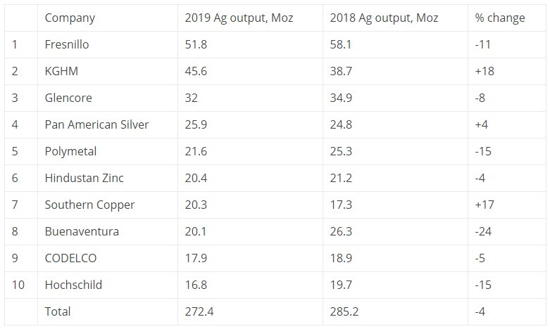

## Table of Contents

## What is silver mining?

Silver mining is the process of extracting silver from the earth. People dig into the ground to find rocks that have silver in them. They use big machines and tools to break the rocks and get the silver out. This has been done for a very long time because silver is valuable and used in many things like jewelry, coins, and electronics.

There are different ways to mine silver. One way is underground mining, where miners go deep into the earth to find silver. Another way is open-pit mining, where they dig big holes in the ground to reach the silver. Both methods can be hard and dangerous work. After they get the silver out of the rocks, they clean it and make it into something people can use.

## Why is silver important in the global market?

Silver is important in the global market because it is used in many different things. People use silver to make jewelry, coins, and even some electronic devices like phones and computers. Silver is a good conductor of electricity, which makes it very useful in technology. Because it has so many uses, there is always a demand for silver, which makes it valuable.

Countries that have a lot of silver mines can make money by selling silver to other countries. This can help their economy grow. The price of silver can go up and down based on how much people want it and how much is available. When there is not enough silver, the price goes up. When there is a lot of silver, the price can go down. This makes silver an important part of the world's economy.

## Who are the top silver mining companies in the world?

Some of the biggest silver mining companies in the world are Fresnillo, KGHM Polska Miedź, and Polymetal International. Fresnillo is a company from Mexico that mines a lot of silver. They have many mines in Mexico and are known for being one of the top producers of silver in the world. KGHM Polska Miedź is a company from Poland that also mines a lot of silver, along with other metals like copper. They have mines in Poland and other countries. Polymetal International is a company from Russia that mines silver and gold. They have mines in Russia and Kazakhstan.

These companies are important because they help meet the world's need for silver. They use big machines and a lot of workers to dig silver out of the ground. The silver they mine is used in many things like jewelry, electronics, and coins. Because silver is valuable, these companies play a big role in the global market. They help keep the supply of silver steady, which is important for the economy.

## What are the key factors that determine the size of a silver mining company?

The size of a silver mining company is determined by how much silver they can mine and how many mines they have. A company that can mine a lot of silver each year is considered big. This is because they have the machines and workers needed to get a lot of silver out of the ground. The number of mines a company has also matters. If a company has many mines in different places, they can mine more silver and be a bigger company.

Another important [factor](/wiki/factor-investing) is how much money the company makes. A big company usually makes a lot of money from selling the silver they mine. They can use this money to buy more machines, hire more workers, and open new mines. This helps them grow even bigger. The price of silver also affects the size of a company. If the price of silver goes up, the company can make more money and become bigger. If the price goes down, it can be harder for them to grow.

## How do silver mining companies contribute to the economy?

Silver mining companies help the economy by making and selling silver. They dig silver out of the ground and sell it to people who use it to make things like jewelry, coins, and electronics. When they sell the silver, they make money. This money helps the company grow bigger. They can buy more machines and hire more workers. This creates jobs for people and helps the economy get stronger.

When silver mining companies sell silver to other countries, it can help their own country's economy too. The money they make from selling silver can be used to build schools, roads, and hospitals. This makes life better for people in the country. Also, when the price of silver goes up, the company makes more money. This can make the economy grow even more because the company can spend more money on things that help the economy.

## What are the largest silver mines operated by these companies?

Fresnillo operates the Fresnillo mine in Mexico. This mine is one of the biggest silver mines in the world. It has been around for a long time and produces a lot of silver every year. The mine helps Fresnillo be one of the top silver mining companies. They use big machines and a lot of workers to get the silver out of the ground.

KGHM Polska Miedź runs the Sierra Gorda mine in Chile. This mine is not just for silver; it also mines copper. But it is still one of the biggest silver mines because it produces a lot of silver along with the copper. The mine is important for KGHM because it helps them make a lot of money and grow bigger.

Polymetal International operates the Dukat mine in Russia. This mine is known for being one of the largest silver mines in Russia. It helps Polymetal International be a big player in the silver market. The mine uses modern technology to dig out a lot of silver every year, which is important for the company and the global silver supply.

## What are the production statistics of the top silver mining companies?

Fresnillo is a big silver mining company from Mexico. In 2022, they mined about 53 million ounces of silver. This makes them one of the top producers of silver in the world. They have many mines in Mexico, and the Fresnillo mine is one of their biggest. They use a lot of workers and big machines to get the silver out of the ground.

KGHM Polska Miedź, a company from Poland, also mines a lot of silver. In 2022, they produced around 40 million ounces of silver. They have mines in different countries, and the Sierra Gorda mine in Chile is one of their biggest. This mine also mines copper, but it still produces a lot of silver. The silver they mine helps KGHM make a lot of money and grow bigger.

Polymetal International, a company from Russia, is another big silver mining company. In 2022, they mined about 27 million ounces of silver. They have mines in Russia and Kazakhstan, and the Dukat mine in Russia is one of their largest. This mine helps Polymetal be a big player in the silver market. They use modern technology to dig out a lot of silver every year.

## How do these companies manage environmental and social impacts of mining?

Silver mining companies like Fresnillo, KGHM Polska Miedź, and Polymetal International try to take care of the environment and the people around their mines. They know that mining can harm the land, water, and air. To help, they use special ways to clean up after mining. They also try to use less water and energy. They plant trees and make sure the land looks good after they are done mining. This helps keep the environment safe for animals and people.

These companies also think about the people who live near their mines. They talk to the people in the community and listen to what they need. They create jobs for local people and help build schools and hospitals. This makes life better for the people around the mines. They also make sure their workers are safe and happy. They give them good training and make sure they follow safety rules. This helps the company and the community get along well.

## What technological advancements are being used by leading silver mining companies?

Leading silver mining companies like Fresnillo, KGHM Polska Miedź, and Polymetal International use new technology to mine silver better. They use big machines called drills to dig into the ground and find silver. These drills can go very deep and are faster than old ways of mining. They also use computers to help them see where the silver is in the ground. This helps them mine more silver without wasting time and money. Another important technology they use is called automation. This means machines can work by themselves without people always watching them. This makes mining safer and more efficient.

These companies also use special technology to clean the silver after they dig it out. They use machines that can separate the silver from the rock quickly and without using too many harmful chemicals. This is good for the environment. They also use new ways to recycle water and energy at their mines. This helps them save money and be kinder to the environment. Overall, these technologies help them mine more silver, keep their workers safe, and take care of the world around them.

## How do fluctuations in silver prices affect these companies' operations?

When the price of silver goes up, it's good for silver mining companies like Fresnillo, KGHM Polska Miedź, and Polymetal International. They can make more money from selling the silver they mine. This extra money lets them buy new machines, hire more workers, and even open new mines. They can also spend more on taking care of the environment and helping the people around their mines. So, when silver prices are high, these companies can grow bigger and do more good things.

But when the price of silver goes down, it's hard for these companies. They don't make as much money from selling their silver. This can make it tough for them to pay for new machines or to keep all their workers. Sometimes, they might even have to close some of their mines. They also have less money to spend on helping the environment and the community. So, when silver prices are low, these companies have to be careful and find ways to save money.

## What are the future prospects and growth strategies for the largest silver mining companies?

The future looks good for big silver mining companies like Fresnillo, KGHM Polska Miedź, and Polymetal International. They want to keep growing by finding new places to mine silver. They use new technology to find silver and mine it better. They also want to make their mines safer and use less water and energy. This helps them save money and be kinder to the environment. They also plan to work with other companies to share ideas and learn new ways to mine silver.

These companies also think about the people who live near their mines. They want to help the community by creating more jobs and building schools and hospitals. They talk to the people in the community to find out what they need. This helps them get along well with the people around their mines. By doing all these things, these companies hope to mine more silver, make more money, and help the world be a better place.

## How do these companies compare in terms of reserves and resources?

Fresnillo has a lot of silver in the ground, more than many other companies. They have about 500 million ounces of silver reserves. This means they can keep mining for a long time. KGHM Polska Miedź also has a lot of silver, but not as much as Fresnillo. They have around 300 million ounces of silver reserves. Even though it's less, it's still a lot of silver. Polymetal International has about 200 million ounces of silver reserves. This is less than the other two companies, but it's still enough to keep them mining for many years.

These companies also look at resources, which is the silver they think is in the ground but haven't proven yet. Fresnillo has a lot of resources, about 1.5 billion ounces. This gives them a big chance to find more silver in the future. KGHM Polska Miedź has around 1 billion ounces of resources. This is less than Fresnillo, but still a good amount. Polymetal International has about 500 million ounces of resources. This is the smallest of the three, but it still means they can keep looking for more silver.

## References & Further Reading

[1]: López-Castro, M. L., & Mandujano, M. L. (2012). ["A New Era for Mexico’s Mining Industry"](https://pmc.ncbi.nlm.nih.gov/articles/PMC8988238/). In "The Mining Industry in Mexico: A History" (pp. 123-145). UNAM. (Provides insight into Mexico's role in the silver mining sector). 

[2]: Marcos López de Prado. (2018). ["Advances in Financial Machine Learning"](https://www.amazon.com/Advances-Financial-Machine-Learning-Marcos/dp/1119482089). Wiley. (Presents advanced techniques relevant to algorithmic trading in financial markets).

[3]: Fresnillo plc. (2022). ["Annual Report 2022"](https://www.fresnilloplc.com/investors/reports-and-presentations/annual-reports-and-accounts/). Fresnillo PLC. (Contains detailed insights into the strategic and operational approaches of a leading silver producer).

[4]: Chan, Ernest P. (2009). ["Quantitative Trading: How to Build Your Own Algorithmic Trading Business"](https://github.com/ftvision/quant_trading_echan_book). Wiley. (Discusses the implementation of algorithmic trading systems).

[5]: World Silver Survey 2023. (2023). ["The Silver Institute"](https://www.silverinstitute.org/wp-content/uploads/2023/05/SNApr2023.pdf). (Provides comprehensive data on global silver production, supply, and demand).
