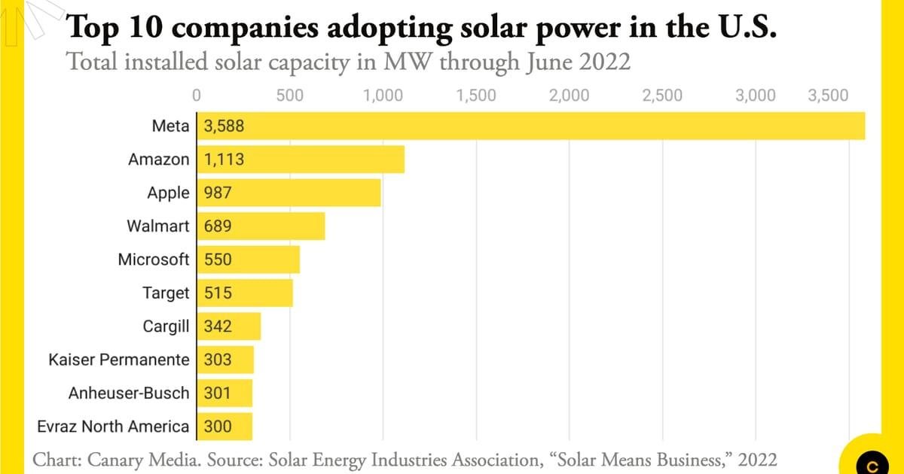

The transition towards renewable energy is accelerating as climate change becomes an increasingly urgent global issue. Among the various sources of renewable energy, solar energy stands out as a pivotal contributor due to its minimal environmental footprint. Harnessing the power of the sun through photovoltaic technology, solar energy provides a sustainable and cleaner alternative to fossil fuels. As technological advancements continue to lower costs, solar energy is becoming increasingly accessible for both residential and commercial use, fulfilling a significant role in reducing carbon emissions.

This article examines the largest solar companies leading this transformative movement and the novel integration of algorithmic trading in the solar energy market. With significant investment inflows and policy-driven incentives, leading companies such as NextEra Energy, First Solar, and Enphase Energy are setting benchmarks in terms of innovation, market share, and growth potential. These companies not only spearhead technological advancements but also play influential roles in shaping the market landscape.



Furthermore, algorithmic trading is revolutionizing how investors engage with this sector. By utilizing sophisticated algorithms, investors can navigate the volatility typical of solar company stocks, optimizing decision-making processes and enhancing market efficiencies. This technology underscores a significant shift in market dynamics, offering a modern approach to investment strategies in the solar industry.

The article will address the multifaceted impact of solar energy, highlighting its environmental benefits, profiling the top performing companies in the sector, and detailing how algorithmic trading is reshaping investment landscapes. Through examining these elements, the discussion underscores the importance of solar energy as a cornerstone in the global transition to renewable energy sources.

## Table of Contents

## Understanding Solar Energy

Solar energy is derived from sunlight, which is converted into electricity using photovoltaic (PV) cells. Photovoltaic cells are semiconductor devices that exhibit the photovoltaic effect—namely, the generation of electric current when exposed to sunlight. These cells are typically made from silicon, which, when doped with specific impurities, forms a p-n junction crucial for the conversion of light photons into electrical energy. The efficiency of these cells, denoted as $\eta$, can be expressed by the formula:

$$
\eta = \frac{P_{\mathrm{out}}}{P_{\mathrm{in}}}
$$

where $P_{\mathrm{out}}$ is the electrical power output and $P_{\mathrm{in}}$ is the solar power input.

The global adoption of solar energy is spreading rapidly, partly due to significant decreases in the cost of solar technology. The cost reductions are driven by advancements in manufacturing processes, economies of scale, and improvements in cell efficiency. According to the International Renewable Energy Agency (IRENA), the cost of electricity from utility-scale solar photovoltaics fell by 88% between 2010 and 2021 ([IRENA, 2022](https://www.irena.org/publications/2022/Jul/Renewable-Power-Generation-Costs-in-2021)). This decrease in cost has made solar energy increasingly attractive for both residential and commercial purposes.

Despite an initial higher capital expense compared to fossil fuels, solar energy presents a cleaner, more sustainable alternative due to its minimal environmental impact. Unlike fossil fuels, solar energy does not produce air pollutants or carbon dioxide emissions during operation, contributing to a reduction in overall greenhouse gas emissions. Additionally, solar installations have relatively low operational and maintenance costs once they are in place.

In recent years, technological advancements have further enhanced solar energy’s viability. Innovations such as bifacial solar panels, which capture sunlight on both sides of the panel, and perovskite-based solar cells, which offer potentially higher efficiencies, represent promising developments in solar technology.

Despite these advancements, the initial adoption hurdle remains higher due to installation and setup expenses. However, the levelized cost of electricity (LCOE) for solar power continues to decrease, making it competitive with traditional fossil fuel sources in many regions. This trend is likely to continue as solar technology continues to improve and economies of scale are realized.

## Top 10 Largest Solar Companies

The solar energy market is dominated by a few key players, each with substantial market capitalizations and expansive operations. These companies demonstrate not only significant growth potential but also the capability to influence and drive the global energy transition. Among these, NextEra Energy, First Solar, and Enphase Energy are especially prominent.

**NextEra Energy** stands as the largest solar company by market capitalization. It has adopted innovative strategies for expanding its solar and wind energy production capabilities, positioning the company as a leader in renewable energy. By integrating advanced technologies and maintaining a strong focus on sustainability, NextEra Energy has carved out a crucial role in the energy sector's evolution towards cleaner resources.

**First Solar** is renowned for its expertise in photovoltaic (PV) technology. The company specializes in thin-film solar modules, which have proven to be highly effective in reducing the cost per watt of solar power. Its commitment to low-cost and high-efficiency solar technologies has enabled First Solar to maintain a competitive edge and sustain substantial growth in various global markets.

**Enphase Energy** distinguishes itself through its advancements in microinverter systems. These systems optimize the energy output of solar installations by converting direct current (DC) generated by solar panels into alternating current (AC) at the panel level. This approach not only increases the efficiency of solar systems but also enhances their overall reliability.

These companies are not just market leaders but are pioneers in adopting and promoting innovative technologies that improve solar energy systems' efficiency and cost-effectiveness. Their substantial market shares reflect a combination of strategic investments in technology and an ability to adapt to changing regulatory and market environments. As solar energy continues to gain traction worldwide, these companies are expected to play increasingly pivotal roles in shaping the future of the energy industry.

## Algorithmic Trading in the Solar Market

Algorithmic trading, also known as algo trading, is a method of executing orders using pre-programmed trading instructions that account for variables such as time, price, and [volume](/wiki/volume-trading-strategy). This form of trading harnesses the power of computer algorithms to scan and act upon market data more quickly and efficiently than human traders.

In the solar energy market, [algorithmic trading](/wiki/algorithmic-trading) plays a crucial role by helping to manage the [volatility](/wiki/volatility-trading-strategies) of solar stocks. The leverage of sophisticated algorithms enables the rapid processing of large datasets, which is essential for making informed trading decisions. This is especially pertinent given the inherent volatility and uncertainty within the renewable energy sector, where stock prices can be influenced by diverse factors including policy changes, technological advancements, and shifts in market demand.

Algoritmic trading enhances market efficiency by facilitating quicker transactions and reducing market impact, ultimately leading to improved [liquidity](/wiki/liquidity-risk-premium) in solar stocks. The efficiency gained allows traders to execute large orders with minimal price changes, crucial for maintaining the stability of solar stocks in potentially tumultuous market environments.

Specialized algorithms are increasingly employed to predict price movements and execute trades based on signals generated by various indicators. For instance, [machine learning](/wiki/machine-learning) models can be trained to recognize patterns and trends within historical stock data, allowing for predictive analytics that provide traders with a competitive edge.

Moreover, the adoption of algorithmic trading frameworks can democratize access to the solar energy market. Smaller investors may use automated trading systems to participate alongside larger institutional players by leveraging the same advanced strategies and insights.

In practice, a simple Python script utilizing a machine learning library such as scikit-learn can be used to create a basic algorithmic trading model for solar stocks. Here is an illustrative example:

```python
from sklearn.ensemble import RandomForestClassifier
import pandas as pd

# Load historical solar stock data
data = pd.read_csv('solar_stock_data.csv')

# Define features and target variable
features = data[['feature1', 'feature2', 'feature3']]  # Example features
target = data['price_direction']  # Example target: 1 for rise, 0 for fall

# Train the Random Forest model
model = RandomForestClassifier(n_estimators=100)
model.fit(features, target)

# Predict future price direction
future_data = pd.read_csv('future_solar_stock_data.csv')
prediction = model.predict(future_data[['feature1', 'feature2', 'feature3']])
print(prediction)
```

While this example simplifies complexities involved, it illustrates the potential of algorithmic trading in structuring diverse data points into actionable trading strategies. By transforming investor interactions with solar stocks, algorithmic trading not only reinforces market dynamics but also supports the broader goal of financially integrating renewables into the global energy portfolio.

## Impact of Financial Incentives

Government incentives play a pivotal role in accelerating the growth and adoption of solar energy across various sectors. The Inflation Reduction Act of 2022 exemplifies significant policy support, offering substantial tax credits for solar installations. These tax incentives are strategically designed to reduce the initial financial burden associated with installing solar systems, promoting broader adoption among residential and commercial entities. 

The structure of these incentives typically provides a percentage of the installation cost as a credit, effectively lowering the overall expenditure for the end consumer. For instance, the Federal Investment Tax Credit (ITC) allows individuals and businesses to deduct a certain percentage of their solar installation costs from their federal taxes, delivering direct financial benefits. As of recent policy updates, this tax credit has been set at 30% for systems installed from 2022 to 2032, which significantly impacts the decision-making process for potential solar adopters. 

Moreover, financial incentives create a competitive advantage for leading solar companies by stimulating market demand. Companies can leverage these incentives in their marketing strategies, making solar solutions more attractive and economically feasible for a wider audience. This increased demand not only boosts sales but also encourages firms to innovate and expand their operational capacities to meet the growing needs. 

The impact of such financial policies is further evidenced by the growth in solar capacity installations. Data indicates a substantial increase in solar adoption following the introduction of tax incentives, reflecting the critical role these policies play in shaping market dynamics. By enhancing the financial appeal of solar investments, government incentives foster an environment conducive to sustained growth and technological advancement within the solar industry.

In summary, government financial incentives such as tax credits significantly bolster the solar sector's expansion by lowering the economic barriers to entry. They catalyze higher adoption rates and provide a tangible competitive edge to companies at the forefront of the solar energy market, facilitating a transition towards a more sustainable energy future.

## Challenges Facing the Solar Industry

The solar industry, while rapidly advancing and contributing significantly to the renewable energy landscape, grapples with various challenges that threaten its sustained growth. Among these, high interest rates present a notable obstacle. Elevated interest rates increase the cost of borrowing capital, thereby impacting financing options for solar projects. This condition can deter investments, slow down project developments, and consequently reduce market expansion potential.

Technological advancements, while generally beneficial, can sometimes disrupt market stability. The swift pace of innovation in solar technology can render existing systems obsolete, necessitating continuous upgrades and investments. This need for recurrent technological adaptation creates financial pressure on solar companies, especially those lacking sufficient resources to keep pace with these changes. Furthermore, the increased efficiency of newer technologies can also lead to fluctuations in solar panel prices, affecting market dynamics and company profitability.

Access to capital remains a crucial [factor](/wiki/factor-investing) influencing the ability of companies to grow and maintain operations. Financial constraints, compounded by high interest rates, can severely limit expansion efforts. Companies often require substantial upfront investments to build and maintain solar infrastructure, and difficulties in securing capital can lead to stalled or cancelled projects. This financial bottleneck can hinder the scalability of solar energy solutions, restricting the industry's ability to meet growing energy demands.

Competition within the solar industry is intense, with numerous players vying for market share and technological supremacy. This competitive environment, while fostering innovation and driving down costs, also poses the risk of market saturation. Smaller companies may struggle to compete with larger, more established entities that benefit from economies of scale. This imbalance can lead to consolidation within the industry, reducing the diversity of offerings and potentially stifling innovation.

Policy changes further contribute to the challenges facing the solar industry. Government policies and regulations significantly influence the industry's growth trajectory. Changes in policy, such as reductions in subsidies or alterations in tax incentives, can have profound effects on the financial viability of solar projects. Companies must remain agile and adaptive to navigate these regulatory landscapes successfully. Policy uncertainty can add another layer of risk for investors, affecting long-term strategic planning and investment decisions in the solar sector. 

In summary, the solar industry must navigate a complex array of challenges related to financing, technological advancement, competition, and policy changes. Addressing these issues is critical for the sustained growth and successful integration of solar energy into the global energy portfolio.

## Conclusion

The solar energy industry is leading the renewable energy revolution, underscored by technological innovations and supportive policy measures. As the world faces mounting challenges from climate change, the growth of solar power symbolizes a pivotal shift towards more sustainable energy solutions. This sector benefits from continuous technological advancements and strategic investments, fostering the expansion and efficiency of solar power systems.

Top solar companies demonstrate strong growth trajectories as they leverage cutting-edge technology to enhance photovoltaic efficiency and reduce production costs. Innovations such as bifacial solar panels and advanced energy storage solutions are becoming integral to the industry's progress, supporting larger-scale adoption and deployment. These advancements not only decrease the levelized cost of electricity (LCOE) for solar energy but also enhance its competitiveness against traditional fossil fuels.

Algorithmic trading, a sophisticated tool employed in financial markets, further empowers investors to navigate the volatility associated with solar stocks. By analyzing extensive datasets and utilizing complex algorithms, investors can make more informed and timely decisions, thereby improving liquidity and market efficiency in the solar sector. This technology also plays a role in reducing transaction costs and optimizing investment strategies, making the sector more attractive to a broader range of investors.

Despite facing challenges such as high interest rates and regulatory hurdles, the solar energy market remains a cornerstone of global efforts to mitigate climate change. The concerted push towards renewable energy, bolstered by government incentives and public demand, continues to drive solar energy forward. This trajectory not only aids in the reduction of carbon emissions but also fosters economic growth through the creation of new jobs and industries.

In summary, the solar energy industry stands as a key component in the quest for sustainable energy solutions. Bolstered by technological innovation, strategic investments, and the introduction of algorithmic trading into financial practices, solar power is poised to play an increasingly vital role in the global energy landscape. Despite existing challenges, its potential to contribute significantly to climate change mitigation and sustainable development is undeniable.

## References & Further Reading

[1]: ["Renewable Power Generation Costs in 2021"](https://www.irena.org/publications/2022/Jul/Renewable-Power-Generation-Costs-in-2021) by the International Renewable Energy Agency (IRENA), 2022.

[2]: Bergstra, J., Bardenet, R., Bengio, Y., & Kégl, B. (2011). ["Algorithms for Hyper-Parameter Optimization."](https://dl.acm.org/doi/10.5555/2986459.2986743) Advances in Neural Information Processing Systems 24.

[3]: Barton, M. (2020). ["The Solar Revolution: How the World is Getting Solar Power and Why it Matters."](https://www.nature.com/articles/s41467-023-41971-7)

[4]: ["Advances in Financial Machine Learning"](https://www.amazon.com/Advances-Financial-Machine-Learning-Marcos/dp/1119482089) by Marcos Lopez de Prado

[5]: ["Machine Learning for Algorithmic Trading"](https://github.com/stefan-jansen/machine-learning-for-trading) by Stefan Jansen

[6]: ["Quantitative Trading: How to Build Your Own Algorithmic Trading Business"](https://www.amazon.com/Quantitative-Trading-Build-Algorithmic-Business/dp/1119800064) by Ernest P. Chan