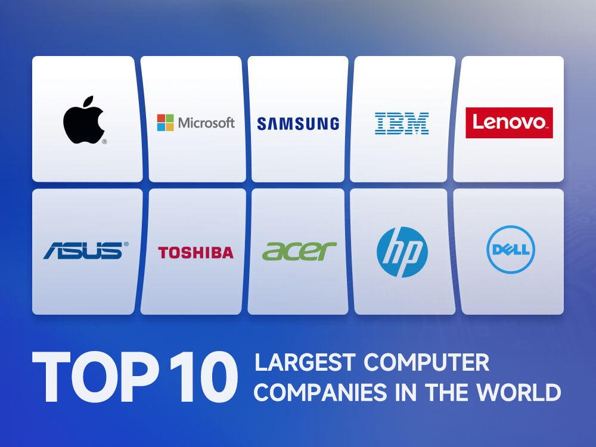

The intersection of technology and finance has revolutionized the world of securities through algorithmic trading. This modern approach leverages computational algorithms to automate the decision-making and execution of trades with remarkable speed and precision. At the heart of this transformation are technology companies that have been instrumental in creating the sophisticated hardware and software platforms driving algorithmic trading. These tech firms design and develop solutions that optimize trading strategies, enhance data processing capabilities, and ensure robust connectivity across global markets.

Understanding the synergy between technological innovations and algorithmic trading strategies is paramount for financial market participants aiming to maintain a competitive edge. As trading environments become increasingly complex and data-intensive, the ability to harness technology efficiently becomes a differentiator. Algorithmic trading systems require not only state-of-the-art computing power but also advanced algorithms capable of analyzing vast datasets and executing trades in milliseconds.



This article examines the role of technology in enhancing the efficiency and innovation of algorithmic trading. It highlights the critical contributions of major tech companies that are leading the development of trading infrastructure. By examining the technological advancements and the companies spearheading these innovations, we aim to elucidate how these developments impact the financial trading sector. In doing so, the article provides insights into the transformation of trading strategies and the future trajectory of financial markets influenced by technological progress. Understanding these dynamics is essential not only for traders and financial institutions but also for tech companies striving to align their offerings with market needs.

## Table of Contents

## Understanding Algorithmic Trading

Algorithmic trading, often referred to as algo trading, is the use of computer algorithms to automate trading decisions and execute orders in financial markets. This technology-driven approach enables high-frequency trading and leverages vast amounts of market data to identify opportunities and optimize trades. It has become a cornerstone of modern finance, allowing for more efficient and precise market operations.

At its core, algorithmic trading utilizes pre-defined sets of instructions, or algorithms, to analyze market conditions and make trade decisions. These algorithms can process complex computations and execute orders at speeds and frequencies that are impossible for human traders. By analyzing indicators such as market price, volume, and timing, algorithms make data-driven decisions, reducing human biases and emotions from the process. For instance, an algorithm may be programmed to buy a stock if its 50-day moving average exceeds the 200-day moving average, capitalizing on a so-called "golden cross" pattern indicative of a potential upward trend.

Over time, algorithmic trading has evolved significantly, driven by technological advancements. Initially, algo trading was limited by computing power and data availability. However, as technology has progressed, so too has the capacity and complexity of algorithmic strategies. High-performance computing resources, increased data storage, and real-time analytics have facilitated the development of sophisticated algorithms capable of making split-second decisions. This evolution traces back to the late 20th century, with significant growth in the 2000s as global connectivity and data processing abilities expanded.

The advantages of [algorithmic trading](/wiki/algorithmic-trading) are manifold. Speed is a primary benefit, as algorithms can process information and execute trades far quicker than any human. This rapid execution is particularly beneficial in volatile markets where opportunities can arise and disappear in fractions of a second. Additionally, algorithmic trading ensures accuracy by minimizing human errors in order processing and allows for greater market reach, enabling the simultaneous trading of multiple markets and financial instruments.

However, algorithmic trading comes with its own set of challenges. Market [volatility](/wiki/volatility-trading-strategies) can lead to substantial financial risks, particularly if algorithms are not properly tested or monitored. The "flash crash" of 2010 is a notable example where a feedback loop between trading algorithms led to a sudden market downturn. Moreover, technical failures, such as software or hardware malfunctions, pose significant operational risks. Ensuring that algorithms operate as intended requires rigorous testing and continuous monitoring—a process known as algorithmic risk management.

In conclusion, while algorithmic trading has fundamentally transformed how financial markets operate by enhancing efficiency and precision, it also necessitates robust safeguards and an in-depth understanding of the risks involved. The collaboration between technology and finance continues to drive innovations that define the future landscape of trading.

## Tech Companies at the Forefront

Prominent technology companies have significantly contributed to the advancements in algorithmic trading technology by developing innovative platforms and infrastructures that enable high-speed and efficient trading. Notable among these companies are IBM, NVIDIA, and Intel, each playing a pivotal role in enhancing the technology that drives modern trading strategies.

IBM has long been recognized for its contributions to data processing and analytics. The company provides financial institutions with sophisticated data analytics platforms that facilitate the efficient processing of vast amounts of market data, essential for algorithmic trading. IBM's expertise in [artificial intelligence](/wiki/ai-artificial-intelligence), through its Watson platform, offers predictive analytics and [machine learning](/wiki/machine-learning) capabilities that enhance decision-making processes in trading.

NVIDIA is at the forefront of graphics processing unit (GPU) technology, crucial for high-performance computing tasks involved in algorithmic trading. GPUs excel in parallel processing, making them ideal for executing complex algorithms that require substantial computational power. NVIDIA's GPU architectures are widely utilized in financial trading systems to reduce latency and increase the speed of data analysis and execution.

Intel, a leading semiconductor manufacturer, provides critical hardware infrastructure for algorithmic trading systems. Its advancements in central processing unit (CPU) technology have led to faster and more efficient data processing capabilities. Intel's Xeon processors are a staple in trading servers, offering high performance and reliability necessary for real-time trading operations. Additionally, Intel's innovations in 5G technology enhance the speed and reliability of data transmission, supporting low-latency trading environments.

Collaboration between tech companies and financial institutions has led to significant advancements in trading strategies. For instance, partnerships have enabled the integration of AI-driven analytics into trading platforms, improving the accuracy and efficiency of trading decisions. These collaborations also focus on optimizing the performance of trading infrastructures to cope with the increasing [volume](/wiki/volume-trading-strategy) and complexity of market data.

Several case studies illustrate the successful implementation of technological solutions in trading environments. For example, a financial institution utilizing NVIDIA's GPUs reported a substantial reduction in algorithm execution time, allowing for quicker responses to market changes. Similarly, an investment firm leveraging IBM's AI analytics framework enhanced its ability to predict market trends, resulting in improved trading outcomes. Collaboration between Intel and various trading platforms has also improved the hardware robustness, ensuring uptime and reliability critical for continuous trading operations.

In conclusion, the contribution of tech giants like IBM, NVIDIA, and Intel to algorithmic trading is indispensable. Their innovations in hardware, analytics, and infrastructure continue to shape the landscape of financial markets, driving efficiency, speed, and precision in trading operations. As technology progresses, the synergy between these companies and financial institutions is expected to grow, ushering in new opportunities for innovation in algorithmic trading.

## Hardware Innovations Driving Algo Trading

The hardware supporting algorithmic trading plays a pivotal role in ensuring transactions occur with maximum speed and precision. High-frequency trading ([HFT](/wiki/high-frequency-trading-strategies)), a subtype of algorithmic trading, benefits significantly from advancements in hardware, as it requires executing thousands of trades within microseconds. The core components of this hardware are powerful processing units, efficient data centers, robust servers, and advanced networking systems.

Advancements in computing power have directly impacted trading speed and efficiency. Modern processors are designed to handle extensive computational tasks quickly, effectively reducing latency—the time delay between data being sent and received. Graphics Processing Units (GPUs), such as those manufactured by NVIDIA, are increasingly employed for their parallel processing capabilities, enabling faster data analysis and execution of trades. Field-Programmable Gate Arrays (FPGAs) are also leveraged in trading systems due to their ability to process large data sets at high speeds with low latency. An example of the speed requirements is the equation used in time-sensitive [arbitrage](/wiki/arbitrage) strategies:

$$
\Delta t = t_{\text{buy}} - t_{\text{sell}}
$$

Here, $\Delta t$ represents the time difference crucial for maximizing profit, necessitating minimal values through hardware optimization.

Data centers, servers, and networking hardware form the backbone of algo trading operations. The strategic location of data centers close to financial exchanges can significantly reduce latency, a practice known as colocation. This proximity allows trading firms to receive market data and execute orders more swiftly than competitors further away. Networking technologies, such as fiber optics, contribute to the rapid transmission of data, while robust servers ensure stable and continuous operations, crucial for maintaining the integrity of trading systems.

Recent innovations in chip technology have further propelled the scalability and performance of algo trading systems. The development of multi-core processors and 3D stacking technology has increased the number of transistors on a chip, thus enhancing processing power without increasing physical size. This innovation drives scalability, enabling trading systems to handle more complex algorithms and larger datasets efficiently.

However, maintaining hardware reliability and uptime presents significant challenges. High-frequency trading systems require continuous operation, making downtime potentially costly. Therefore, redundancy—having backup systems in place—is essential. Physical and cyber threats pose additional risks, necessitating robust security measures. Regular maintenance, updates, and monitoring are necessary to ensure systems operate smoothly without interruption. Furthermore, the rapid pace of technological advancement requires constant upgrades, which can be resource-intensive both financially and logistically.

In summary, the hardware infrastructure supporting algorithmic trading is critical for achieving the rapid execution speeds necessary in today’s financial markets. As technology continues to advance, the importance of cutting-edge hardware will only grow, cementing its role as a cornerstone of algorithmic trading success.

## Future Trends in Technology and Algo Trading

Emerging technologies are poised to dramatically reshape algorithmic trading. Quantum computing, for instance, promises to revolutionize the speed and efficiency of financial computations. By leveraging quantum bits, or qubits, quantum computers can perform complex calculations much faster than classical computers, which is crucial in the high-speed environment of trading. Quantum algorithms, such as Shor’s algorithm for factoring integers, could potentially break encryption methods used to secure trading data, whereas Grover’s algorithm can accelerate database search processes, offering a competitive advantage to traders capable of harnessing this power effectively.

AI and machine learning are enhancing the adaptability and sophistication of trading algorithms. These technologies facilitate the development of models that can analyze vast datasets to recognize patterns and predict market movements. For example, [reinforcement learning](/wiki/reinforcement-learning), a type of machine learning, allows algorithms to optimize trading strategies through trial and error, improving trading outcomes over time. Here is a simple example of how reinforcement learning might be implemented in Python:

```python
import numpy as np

class TradingEnvironment:
    def __init__(self):
        self.state = 0  # simplified representation of market state

    def step(self, action):
        # Simulate market reaction to action
        reward = np.random.normal()
        self.state += action
        return self.state, reward

class TradingAgent:
    def __init__(self, environment):
        self.env = environment
        self.policy = {}

    def learn(self, episodes=1000):
        for _ in range(episodes):
            state = self.env.state
            action = np.random.choice([-1, 1])  # Buy or sell
            new_state, reward = self.env.step(action)
            self.policy[state] = (action, reward)

env = TradingEnvironment()
agent = TradingAgent(env)
agent.learn()
```

Cloud computing and distributed ledger technologies are creating more resilient and adaptable trading ecosystems. Cloud solutions offer scalable computing resources, enabling traders to handle intensive computational tasks and vast quantities of data without significant capital expenditure on local hardware infrastructure. Distributed ledgers, such as blockchain, ensure transparency and security in trade verification and settlement processes. These ledgers reduce the risk of fraud and errors, thereby enhancing trust among trading participants.

Cybersecurity remains a paramount concern as the integration of advanced technologies expands the attack surface of trading systems. Protecting sensitive financial data from cyber threats requires robust security protocols, including end-to-end encryption and multi-[factor](/wiki/factor-investing) authentication. Emerging solutions involve AI-driven anomaly detection systems that dynamically identify and mitigate threats in real-time, ensuring the integrity and confidentiality of trading infrastructures.

Looking ahead, the convergence of these technologies suggests a future where trading systems are not only faster and more secure but also profoundly intelligent and adaptive. Tech companies may need to invest in hybrid quantum-classical computing architectures and AI capabilities to maintain a competitive edge. Furthermore, as regulatory frameworks adapt to these technological changes, traders and institutions may need to navigate new compliance landscapes, balancing innovation with adherence to evolving standards.

## Conclusion

The integration of technology within algorithmic trading underscores a transformative relationship pivotal to modern financial markets. This intersection results in unprecedented levels of efficiency, accuracy, and speed, creating new standards for trade execution and market participation. The continuous evolution of tech companies to meet these market demands is evident in their relentless pursuit of innovation in hardware, software, and data processing capabilities. Major technological advancements from firms such as IBM, NVIDIA, and Intel contribute significantly to developing robust trading infrastructures and platforms, highlighting the dynamic nature of this industry.

Remaining informed about technological advancements is crucial for industry participants aiming to leverage these developments for a competitive edge. As tech companies introduce novel solutions, traders must integrate these innovations to optimize strategies and operations. This is not merely an option, but a necessity, given the rapid pace at which technology can redefine market landscapes.

Collaboration between tech innovators and financial experts is essential in crafting sophisticated trading systems that can anticipate and adapt to market fluctuations. This partnership fosters the development of integrated solutions that combine cutting-edge technology with financial acumen, setting a benchmark for the future of trading systems.

Further exploration into areas such as quantum computing, AI, and machine learning promises to reveal more breakthroughs that could further revolutionize algorithmic trading. Encouraging readers to stay engaged with these emerging technologies ensures continual growth and adaptation within the industry. As technology advances, it invites traders and tech companies alike to pioneer new pathways in trading, underscoring the ongoing saga of innovation and collaboration in the financial sector.

## References & Further Reading

[1]: Bergstra, J., Bardenet, R., Bengio, Y., & Kégl, B. (2011). ["Algorithms for Hyper-Parameter Optimization."](https://dl.acm.org/doi/10.5555/2986459.2986743) Advances in Neural Information Processing Systems 24.

[2]: ["Advances in Financial Machine Learning"](https://www.amazon.com/Advances-Financial-Machine-Learning-Marcos/dp/1119482089) by Marcos Lopez de Prado

[3]: ["Evidence-Based Technical Analysis: Applying the Scientific Method and Statistical Inference to Trading Signals"](https://www.amazon.com/Evidence-Based-Technical-Analysis-Scientific-Statistical/dp/0470008741) by David Aronson

[4]: ["Machine Learning for Algorithmic Trading"](https://github.com/stefan-jansen/machine-learning-for-trading) by Stefan Jansen

[5]: ["Quantitative Trading: How to Build Your Own Algorithmic Trading Business"](https://books.google.com/books/about/Quantitative_Trading.html?id=j70yEAAAQBAJ) by Ernest P. Chan