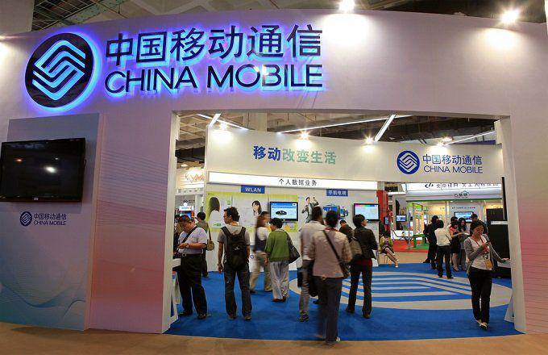

The telecommunications industry plays a crucial role in modern society by facilitating the connection of billions globally. It encompasses a range of services, including voice, data, and video transmission, forming the backbone of global communication networks. As technology continues to advance, this sector witnesses significant transformations, particularly with the rise of data-driven and automated solutions. Notably, the integration of algorithmic trading (algo trading) reflects this trend, offering new efficiencies and capabilities in financial operations within the industry.

The largest telecom companies, such as Verizon, AT&T, and Comcast, exemplify the sector's expansive reach and influence. These industry leaders not only generate substantial revenue but also drive significant technological and infrastructural advancements. They have been instrumental in transitioning from traditional wireline communications to more sophisticated wireless and Internet-based systems, enhancing connectivity across diverse global landscapes.



As the telecommunications sector evolves, innovation becomes a key factor, enabling these companies to maintain competitive advantages and meet growing consumer demands for faster and more reliable services. The move towards technologies like 5G and the incorporation of artificial intelligence (AI) and machine learning are indicative of this dynamic shift. The industry's adaptation to new technologies not only improves operational efficiency but also sets a precedent for the continued integration of algo trading strategies, optimizing financial market engagements in unprecedented ways. 

In summary, the telecommunications industry's capacity for growth and adaptation reflects its dedication to harnessing technological advancements. By focusing on innovative solutions, the industry is well-positioned to address future challenges and enhance its role in connecting the world.

## Table of Contents

## Overview of the Global Telecommunications Industry

The global telecommunications industry is fundamentally responsible for enabling the transmission of data in various forms—including words, voice, audio, and video—across vast distances. This capability effectively underpins modern connectivity, facilitating communication on an unprecedented scale. Historically, the industry relied heavily on traditional wireline services. However, these have largely been eclipsed by the rapid adoption of wireless technology and internet-based communication systems. This shift is evident in the way individuals and businesses favor mobile devices and broadband connectivity over conventional telephone lines for their communication needs.

One of the current key trends shaping this industry is the progression towards 5G technology. 5G represents the fifth generation of mobile network technology, promising significantly enhanced speeds, reduced latency, and the ability to connect a larger number of devices simultaneously. This evolution is not merely incremental but transformative, enabling new applications such as advanced mobile gaming, augmented reality (AR), and the seamless functioning of smart cities.

The growth of mobile internet is another major trend defining the landscape of telecommunications today. The number of mobile internet subscribers has surged, driven by the widespread availability of affordable smartphones and data plans, particularly in emerging markets. As a result, mobile internet has become the primary means of accessing digital content and services for many users around the globe. This shift has profound implications for consumer behavior and e-commerce, with more transactions and interactions occurring via mobile platforms than ever before.

Cybersecurity has also emerged as a paramount concern within the telecommunications industry. As the [volume](/wiki/volume-trading-strategy) and sophistication of cyber threats continue to rise, telecommunication companies are investing heavily in cybersecurity measures to protect their networks and the sensitive data they handle. The increasing incidence of cyberattacks, such as those targeting critical infrastructure or aiming to exploit personal data, underscores the urgent need for robust security solutions. Consequently, the focus on cybersecurity is intensifying, with telecommunications companies prioritizing the development and implementation of advanced security protocols and technologies to safeguard their networks.

In summary, the telecommunications industry is navigating a period of significant transformation, characterized by the decline of traditional wireline services and the ascendancy of wireless and internet-based technologies. The migration towards 5G, the burgeoning mobile internet landscape, and heightened emphasis on cybersecurity are key drivers shaping the future trajectory of this essential industry.

## Top 10 Largest Telecom Companies Worldwide

The telecommunications sector is characterized by several formidable companies that lead the industry based on revenue, market cap, and innovation. Among the most notable of these giants are Verizon Communications Inc., Comcast Corporation, and AT&T Inc., which have established prominent positions within the industry due to their significant contributions to telecommunications services, infrastructure, and customer reach.

Verizon Communications is a leader in wireless services, offering a broad range of telecommunications products. Its substantial market cap and revenue streams are primarily driven by extensive wireless services, fiber-optic networks, and digital platforms. The company's consistent focus on expanding its 5G network underscores its commitment to innovation and enhancing service quality.

Comcast Corporation, primarily known for its comprehensive cable television, internet, and telephone services, enjoys a formidable presence in the telecom industry. Its Xfinity brand has become synonymous with quality home internet and streaming services. Comcast's strategic investments in technology and infrastructure accelerate its expansion in digital media and telecommunications.

AT&T Inc. stands as one of the largest telecom providers globally, with a substantial customer base for both wireless and entertainment services. The acquisition of major media companies has bolstered its position, allowing it to offer an integrated content distribution platform that combines traditional telecom services with streaming media.

Beyond the United States, Deutsche Telekom AG and Nippon Telegraph & Telephone Corporation (NTT) wield considerable influence. Deutsche Telekom, based in Germany, has a vast footprint in Europe while also owning a major stake in T-Mobile US. This positions it strategically for cross-continental telecommunications influence and service provision.

Nippon Telegraph & Telephone, headquartered in Japan, is a cornerstone of the telecom landscape in Asia. Known for pioneering research and dedicated service delivery, NTT is essential in driving innovations in fiber-optic communication and mobile networks in the region.

These sector leaders demonstrate unparalleled ability to advance telecommunications technology and infrastructure. Their relentless drive for innovation not only shapes the current market landscape but also sets the benchmark for future industry standards.

## The Role and Influence of Algorithmic Trading in Telecom

Algorithmic trading, or algo trading, utilizes sophisticated algorithms and high-frequency techniques to analyze financial markets and execute orders at unprecedented speeds. This approach can significantly enhance the efficiency of trading operations, particularly within the telecommunications sector. Telecom companies, with their sizable market footprints and high stock trading volumes, stand to gain considerably from implementing these advanced trading systems.

By leveraging [algorithmic trading](/wiki/algorithmic-trading), telecom companies can optimize the trading of their shares. Algorithms, capable of processing large datasets at lightning speeds, can identify profitable trading opportunities that would likely be missed by human traders. Moreover, these algorithms can execute trades almost instantaneously, minimizing the risk of market fluctuations impacting order prices. This rapid execution is crucial in the volatile markets telecom companies often find themselves in.

Another critical advantage of algorithmic trading in telecom is its ability to forecast market trends. By employing [machine learning](/wiki/machine-learning) and [artificial intelligence](/wiki/ai-artificial-intelligence) (AI), algo trading systems can analyze historical data, recognize patterns, and predict future market movements. For instance, algorithms can assess the potential impact of a new technological development, like the rollout of 5G networks, on stock prices, allowing telecom companies to make informed investment decisions. This predictive capability not only aids in strategic planning but also enhances the companies' competitive edge in the market.

Furthermore, the integration of AI and machine learning within algorithmic trading systems enhances decision-making processes in telecom financial markets. These technologies enable algorithms to learn and adapt to new data, continuously refining their predictive accuracy and trading strategies. This adaptability is particularly beneficial in the rapidly evolving telecom landscape, where market conditions and technological advancements are in constant flux.

Incorporating algorithms designed to optimize operational efficiency can also lead to cost savings and increased profitability for telecom firms. For example, by automating certain trading processes, companies can reduce the need for manual oversight, thereby cutting labor costs and minimizing the potential for human error. Additionally, algorithms can optimize network resource allocation, ensuring that investments are channeled into the most lucrative ventures.

Python, a popular language for implementing algorithmic trading strategies, provides various libraries such as NumPy, pandas, and scikit-learn, which are essential for data analysis and machine learning. A simple algorithmic trading strategy might involve the moving average crossover method, where a short-term moving average crosses above a long-term moving average, signaling a buy opportunity. Here is a basic example in Python:

```python
import pandas as pd

def moving_average_crossover(data, short_window=50, long_window=200):
    # Create short and long exponential moving averages
    data['short_mavg'] = data['Close'].rolling(window=short_window, min_periods=1).mean()
    data['long_mavg'] = data['Close'].rolling(window=long_window, min_periods=1).mean()

    # Create signals
    data['signal'] = 0
    data.loc[data['short_mavg'] > data['long_mavg'], 'signal'] = 1

    return data

# Assuming `df` is a DataFrame with a 'Close' column for stock prices
df = pd.DataFrame({'Close': [stock_prices]})
signals = moving_average_crossover(df)
```

This example demonstrates the use of a moving average crossover strategy to generate trading signals, an approach that can be fine-tuned and expanded upon using more complex algorithms and additional data inputs.

In summary, algorithmic trading transforms how telecom companies operate in financial markets, offering enhanced efficiency, predictive power, and strategic insights that are vital for maintaining a competitive edge in the dynamic telecommunications industry.

## Key Market and Financial Metrics for Telecom Companies

Evaluating the performance of telecom companies requires a thorough analysis of several key financial metrics. Revenue remains the primary indicator of a company's ability to generate sales, which in turn, reflects its market penetration and consumer demand. Net income, derived from revenue after expenses, taxes, and costs, provides insights into a company's profitability and operational efficiency.

Market capitalization (market cap) is another essential metric, calculated by multiplying the current share price by the total number of outstanding shares. It offers a snapshot of a company's total valuation as perceived by the stock market and is a critical [factor](/wiki/factor-investing) in assessing its size and investment appeal.

Investors also examine the one-year trailing total return, an essential metric that evaluates the total yield a security has provided over the past year. This includes dividends and capital gains, offering a comprehensive look at how a company's stock has performed, which is integral for forecasting long-term viability.

Economic conditions and external variables significantly influence telecommunications. Factors such as interest rates, regulatory changes, and technological advancements can impact revenue growth and cost management, thereby affecting net income and market cap. For instance, [interest rate](/wiki/interest-rate-trading-strategies) fluctuations might affect borrowing costs for infrastructure development, ultimately influencing company profits.

The examination of these metrics aids in understanding both current performance and future potential. For instance, a telecom company's high market cap suggests robust investor confidence and capabilities for strategic expansion, while consistently rising net income could indicate effective cost management and sustainable growth prospects.

Python can be employed to calculate these metrics and perform financial analysis tasks efficiently. An example code snippet for calculating market cap is shown below:

```python
def calculate_market_cap(share_price, outstanding_shares):
    return share_price * outstanding_shares

# Example calculation
share_price = 120.50  # Example share price
outstanding_shares = 1_000_000  # Example number of outstanding shares
market_cap = calculate_market_cap(share_price, outstanding_shares)
print("Market Capitalization: $", market_cap)
```

Understanding these financial metrics provides valuable knowledge for investors and stakeholders looking to gauge the performance and potential growth trajectory of major telecom companies. Through strategic analysis of revenue, net income, market cap, and total returns, informed decisions can be made about investments and future developments in the telecommunications sector.

## Challenges Facing the Telecom Industry

The telecommunications industry is confronted with multiple challenges that are shaping its current landscape and future trajectory. A critical issue is regulatory compliance, as governments worldwide impose a myriad of regulations intended to safeguard consumer rights, ensure fair competition, and protect national security. Adhering to these regulations requires telecom companies to invest heavily in legal expertise and adopt flexible business strategies to quickly adapt to legislative changes. Regulatory challenges often vary by region, demanding telecom companies to maintain local compliance practices while trying to achieve global operational efficiency.

Intense competition is another significant challenge as companies vie for market share in an increasingly saturated market. This competition drives the need for differentiation through improved services and innovative products. Often, this leads to aggressive pricing strategies and, at times, reduced profit margins. As new entrants in the market offer low-cost solutions, existing companies must continuously refine their offerings to retain customers and prevent churn.

Furthermore, the relentless need for technological upgrades presents both a challenge and an opportunity. With the rapid pace of technological advancements, particularly evident with the transition to 5G networks, telecom operators must regularly update their infrastructure. This necessitates heavy investments in new technologies, which can strain financial resources but are essential for maintaining competitiveness and meeting customer expectations for high-speed and reliable services.

Emerging markets represent growth opportunities yet bring their own set of challenges. In these markets, telecom companies must navigate unique economic, cultural, and regulatory landscapes. Furthermore, infrastructure development in emerging regions often requires substantial investment with long time frames for return on investment, while managing the risks associated with volatile political and economic conditions.

Sustainable practices have become crucial as environmental concerns gain global attention. Telecom companies are increasingly pressured to reduce their carbon footprints and engage in eco-friendly operations. This involves integrating renewable energy sources, reducing electronic waste, and improving the energy efficiency of their networks and data centers.

Cybersecurity is a persistent concern in the telecom sector, given the sensitivity and volume of data handled daily. Protecting against cyber threats requires investment in advanced security technologies and constant monitoring to defend against evolving attack vectors. Any breach can result in significant financial losses and damage to reputation, underscoring the importance of robust cybersecurity measures.

Successfully navigating these challenges demands adaptability, innovation, and strategic investments. Telecom companies must be proactive in forecasting trends and adjusting their strategies accordingly. Innovation in service offerings and operational processes, alongside strategic partnerships and investments, can provide the necessary leverage to overcome these challenges and bolster long-term growth and resilience in this ever-evolving industry.

## The Future of Telecommunications

The telecommunications landscape is poised for significant transformation as it embraces future trends characterized by the widespread rollout of 5G networks, the expansion of the Internet of Things (IoT), and an increased dependence on cloud computing services. 

5G technology promises to revolutionize connectivity with its high-speed, low-latency capabilities, facilitating the development of more sophisticated applications. Enhanced mobile broadband, ultra-reliable low latency communication, and massive IoT deployments are among the key features of 5G. These advancements are expected to lead to the proliferation of connected devices and smarter cities, propelling industries such as autonomous vehicles, smart homes, and industrial automation.

The IoT presents vast opportunities for the telecom sector by connecting a myriad of devices that communicate with each other. By 2025, it is expected that IoT connections will reach approximately 30.9 billion devices globally, necessitating robust telecommunications infrastructure to support this growth[^1^]. Telecom providers play a crucial role in ensuring seamless connectivity and managing the enormous data flowing through IoT networks.

Cloud services are increasingly becoming integral to the telecom industry, offering scalable and flexible solutions for data storage and processing needs. Infrastructure as a Service (IaaS) and Software as a Service (SaaS) solutions enable telecom companies to offer diverse, value-added services, optimize their operations, and drive digital transformation.

Mergers and acquisitions within the industry are strategic moves to consolidate market presence and enhance service offerings. By acquiring or merging with other companies, telecom providers can expand their customer base, leverage new technology, and improve operational efficiency. This consolidation trend is likely to continue, fostering a competitive environment and spurring innovation.

Sustainable innovation stands at the forefront as companies explore eco-friendly technologies to reduce their carbon footprint. Initiatives such as energy-efficient network equipment and renewable energy sources for powering infrastructure are critical in ensuring environmentally sustainable growth.

Consumer-centric services are increasingly important, with telecom companies focusing on personalized offerings and enhancing customer experience through AI-powered analytics and services. Customizing packages based on user behavior and preferences strengthens customer loyalty and satisfaction.

Algorithmic trading is also making inroads in telecom, providing a technological edge in financial transactions. By deploying algorithms and machine learning techniques, companies can make more informed trading decisions, optimize investment strategies, and enhance financial performance. Python, a prevalent programming language in algorithmic trading, can be used to write automated trading scripts that execute trades based on pre-defined criteria.

```python
# Example of a simple algorithmic trading strategy using Python and pandas
import pandas as pd

# Sample data of stock prices
data = {'Date': pd.date_range(start='2023-01-01', periods=5, freq='D'),
        'Price': [150, 152, 151, 153, 155]}
df = pd.DataFrame(data)

# Calculate moving average
df['MovingAverage'] = df['Price'].rolling(window=3).mean()

# Trading signal: Buy if price is below moving average
df['Signal'] = df.apply(lambda row: 'Buy' if row['Price'] < row['MovingAverage'] else 'Sell', axis=1)

print(df)
```

As these trends unfold, telecom companies that effectively leverage new technologies and align with market demands are likely to gain a competitive advantage. By pursuing sustainable practices, focusing on consumer needs, and incorporating algorithmic trading, the telecom industry can continue to drive innovation and achieve sustained growth.

[^1^]: GSMA Intelligence (2021). The Mobile Economy 2021. Retrieved from https://www.gsma.com/mobileeconomy/

## Conclusion

The telecommunications industry remains a dynamic and critical sector of the global economy, continuously reshaping how people and businesses connect and communicate. This vibrancy is fueled by relentless innovation and strategic market engagements that have allowed the top telecom companies to thrive even in the face of ever-evolving consumer demands and technological landscapes. 

One of the transformative factors in this sector's success is the integration of algorithmic trading and advanced technologies. Algorithmic trading, with its ability to analyze vast amounts of data and execute transactions at extraordinary speeds, provides telecom firms with a substantial advantage in financial markets. This capacity not only ensures optimal trading of shares but also enhances the forecasting of market trends, leading to more informed decision-making processes.

Additionally, embracing new technologies such as 5G and the Internet of Things (IoT) allows telecom companies to expand their service offerings significantly. These advancements create new avenues for growth, enabling companies to offer cutting-edge, consumer-centric services that meet the growing demands for connectivity and data. The adoption of such technologies necessitates continuous innovation and investment, ensuring that telecom companies maintain their competitive edge.

Sustainability also plays a crucial role as telecom companies seek to address environmental concerns while maximizing operational efficiency. This emphasis on sustainable practices is increasingly becoming a vital component of strategic planning within the industry. By investing in green technologies and adopting sustainable practices, telecom companies are better positioned to minimize their environmental footprint while supporting long-term growth.

In conclusion, through the strategic integration of algorithmic trading and the adoption of novel technologies, the telecommunications industry is well-equipped to sustain growth and successfully navigate future challenges. This dynamic and critical sector will continue to be a cornerstone of the global economy, powering connectivity and innovation across diverse domains.

## References & Further Reading

[1]: ["Advances in Financial Machine Learning"](https://www.amazon.com/Advances-Financial-Machine-Learning-Marcos/dp/1119482089) by Marcos Lopez de Prado

[2]: ["Machine Learning for Algorithmic Trading"](https://www.amazon.com/Machine-Learning-Algorithmic-Trading-alternative/dp/1839217715) by Stefan Jansen

[3]: ["Quantitative Trading: How to Build Your Own Algorithmic Trading Business"](https://www.amazon.com/Quantitative-Trading-Build-Algorithmic-Business/dp/1119800064) by Ernest P. Chan

[4]: GSMA Intelligence (2021). ["The Mobile Economy 2021."](https://data.gsmaintelligence.com/research/research/research-2021/the-mobile-economy-2021) 

[5]: ["Evidence-Based Technical Analysis: Applying the Scientific Method and Statistical Inference to Trading Signals"](https://www.amazon.com/Evidence-Based-Technical-Analysis-Scientific-Statistical/dp/0470008741) by David Aronson