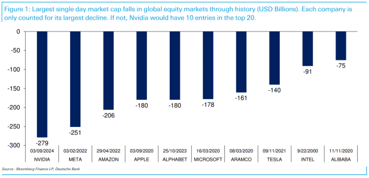

## Table of Contents

## What is a stock market cap?

A stock market cap, or market capitalization, is the total value of all the shares of a company. It is calculated by multiplying the current stock price by the total number of shares that the company has issued. This number gives investors an idea of the size of the company and how it compares to others in the market.

Market cap is important because it helps investors understand a company's value at a glance. A larger market cap usually means the company is bigger and more established, while a smaller market cap might mean the company is smaller or newer. Investors use this information to make decisions about which stocks to buy or sell.

## What does a single-day decline in market cap mean?

A single-day decline in market cap means that the total value of a company's shares dropped on that day. This happens when the price of the company's stock goes down. If a company's stock was worth $100 per share at the end of one day and dropped to $90 the next day, the market cap would be lower because each share is now worth less.

This decline can happen for many reasons. It might be because of bad news about the company, like lower profits or problems with their products. It could also be because of bigger things happening in the economy or the stock market as a whole. When investors hear this news, they might decide to sell their shares, which makes the stock price go down and the market cap drop.

Even though a single-day decline can be worrying, it's just one part of a bigger picture. The stock market goes up and down all the time. A drop in market cap on one day doesn't mean the company is in trouble forever. It's important for investors to look at the company's overall performance and other information before making decisions based on one day's change.

## Why is it important to track the largest single-day declines in U.S. stock market cap?

Tracking the largest single-day declines in U.S. stock market cap is important because it helps us understand how big events can shake the stock market. When the market cap of major companies drops a lot in one day, it often means something big and unexpected happened, like a financial crisis or a major company failing. By looking at these big drops, we can learn about what causes them and how the market reacts to different kinds of news or events.

Knowing about these big declines also helps investors make better choices. If they see a huge drop in market cap, they might decide to sell their stocks to avoid losing more money, or they might see it as a chance to buy stocks at a lower price. Understanding these big changes can also help people plan for the future, making sure they are ready for big swings in the market. It's like keeping an eye on the weather to know when a storm might be coming.

## Can you list the top 5 largest single-day declines in U.S. stock market cap history?

The biggest single-day drop in U.S. stock market cap happened on March 16, 2020. The market lost about $2.6 trillion in one day. This was because of the COVID-19 pandemic. People were scared and didn't know what would happen to the economy, so they sold their stocks quickly. This made the stock prices and the total value of the market go down a lot.

The second biggest drop was on October 15, 2008, during the financial crisis. The market lost about $1.5 trillion. Banks were failing, and people were worried about their money, so they sold stocks, causing the market to drop. The third biggest drop was on September 29, 2008, also during the financial crisis, with a loss of about $1.2 trillion. This happened after the U.S. House of Representatives voted against a plan to help the economy, making people panic.

The fourth biggest drop was on March 9, 2020, again due to the COVID-19 fears, with a loss of about $1.0 trillion. Finally, the fifth biggest drop was on February 5, 2018, with a loss of about $1.0 trillion. This was because of worries about rising interest rates and inflation. These big drops show how quickly the stock market can change and how important it is to keep an eye on what's happening in the world.

## What were the primary causes of these significant market cap declines?

The biggest single-day drop in U.S. stock market cap happened on March 16, 2020, because of the COVID-19 pandemic. People were scared about the virus spreading and didn't know how it would affect the economy. They started selling their stocks quickly, which made the stock prices and the total value of the market go down a lot. This fear and uncertainty caused a huge drop in market cap.

The second and third biggest drops happened during the financial crisis in 2008. On October 15, 2008, the market lost a lot because banks were failing, and people were worried about their money. They sold their stocks, causing the market to drop. On September 29, 2008, the market dropped again after the U.S. House of Representatives voted against a plan to help the economy. This made people panic and sell their stocks, leading to another big drop in market cap.

The fourth biggest drop on March 9, 2020, was also due to fears about the COVID-19 pandemic. People were still worried about the virus and its impact on the economy, so they kept selling their stocks. The fifth biggest drop on February 5, 2018, was caused by concerns about rising interest rates and inflation. Investors were worried that these changes would hurt the economy, so they sold their stocks, causing the market cap to drop significantly.

## How do these declines impact the overall economy?

When the stock market has a big drop in one day, it can affect the whole economy. People who own stocks might feel poorer because their investments are worth less. This can make them spend less money on things like cars or vacations. Companies might also find it harder to get money to grow their business because investors are scared and don't want to buy new stocks. If companies can't grow, they might have to lay off workers, which can lead to more people being out of work and less money being spent in the economy.

These big drops can also make people lose trust in the stock market and the economy. When people are scared, they might stop investing and spending money, which can slow down the economy even more. But, it's important to remember that the stock market is just one part of the economy. Even though a big drop can cause problems, the economy can still recover over time if people keep working and spending money.

## What are the differences between nominal and real declines in market cap?

Nominal declines in market cap are the actual dollar amount that the total value of a company's shares drops by. If a company's stock price goes from $100 to $90, and it has 1 million shares, the nominal decline in market cap would be $10 million because each share lost $10 in value. Nominal declines are important because they show the immediate impact on the company's value in current dollars.

Real declines in market cap take into account the effect of inflation on the value of money over time. If inflation is high, the buying power of a dollar goes down, so a nominal decline might not be as bad as it seems. For example, if the stock price drops from $100 to $90, but inflation has been 5% over the year, the real decline would be less than the nominal decline because the value of money has also gone down. Real declines give a better picture of how much the company's value has really changed when you consider the economy's overall price levels.

## How does the frequency of large market cap declines correlate with economic cycles?

Large market cap declines often happen more when the economy is going through tough times. These tough times are called recessions or downturns. During these periods, people might lose their jobs or worry about money, so they sell their stocks. This selling makes stock prices go down and causes big drops in market cap. For example, big drops happened during the financial crisis in 2008 and when the COVID-19 pandemic started in 2020. These were times when the economy was struggling, and people were scared about the future.

On the other hand, when the economy is doing well, these big drops in market cap don't happen as often. During good times, called expansions, people feel more confident about their money and the future. They are more likely to keep their stocks or even buy more, which keeps stock prices stable or going up. So, the frequency of large market cap declines is a good sign of where the economy is in its cycle, with more drops during bad times and fewer during good times.

## What role do investor sentiment and market psychology play in these declines?

Investor sentiment and market psychology are really important when it comes to big drops in market cap. When people start to feel scared or worried about the economy, they might decide to sell their stocks quickly. This can happen because of bad news, like a company doing poorly or a big event like a financial crisis. When a lot of people sell their stocks at the same time, it makes the stock prices go down fast, causing a big drop in market cap. It's like everyone running out of a room at once because they think there's a fire.

Market psychology also makes these drops even bigger. When people see others selling their stocks and the market going down, they might get even more scared and start selling their own stocks too. This can turn a small drop into a big one because everyone is reacting to what everyone else is doing. It's like a chain reaction where fear spreads from one person to another, making the market drop even more. So, how people feel and think about the market can really affect how big these declines are.

## How have regulatory responses evolved in reaction to major market cap declines?

When big drops in market cap happen, the people who make the rules for the stock market often change things to try to stop it from happening again. After the big drop in 2008 during the financial crisis, the government made new rules to make the market safer. They created something called the Dodd-Frank Act, which made banks have more money saved up and be more careful with their investments. They also set up a new group called the Financial Stability Oversight Council to watch the market and stop big problems before they start.

During the big drop in 2020 because of the COVID-19 pandemic, the government did things a bit differently. They gave money to people and businesses to help them keep going even though the economy was struggling. The Federal Reserve, which is like the boss of money in the U.S., also made it easier for banks to borrow money. This helped keep the economy from getting even worse. So, over time, the people in charge have tried different ways to help the market and the economy when big drops happen.

## What statistical models are used to predict potential large declines in market cap?

People use different math models to try to guess when big drops in market cap might happen. One common model is called the GARCH model, which stands for Generalized Autoregressive Conditional Heteroskedasticity. This model looks at how much stock prices move around over time. It helps predict when the market might get really shaky and have a big drop. Another model is the ARIMA model, which stands for Autoregressive Integrated Moving Average. This model looks at past stock prices to find patterns and guess what might happen next. Both of these models use a lot of numbers and past data to make their guesses.

Another way to predict big drops is by using [machine learning](/wiki/machine-learning). This is when computers learn from a lot of data to find patterns that people might not see. For example, they might look at news articles, social media posts, and other information to see if people are getting scared or worried about the market. If the computer sees a lot of worry, it might guess that a big drop is coming. These models are really helpful, but they're not perfect. The stock market can be hard to predict because it's affected by so many things, like what people feel and what's happening in the world.

## How do international market events influence U.S. stock market cap declines?

International market events can have a big impact on the U.S. stock market. When something bad happens in another country, like a financial crisis or a big drop in their stock market, it can make people in the U.S. worried too. They might think that the problem in the other country could spread to the U.S., so they start selling their stocks. This selling can cause the U.S. stock market to go down and have a big drop in market cap. For example, if a big country like China has a financial problem, it can affect companies in the U.S. that do business with China, making their stock prices go down.

Sometimes, international events can also affect the whole world's economy. Things like wars, natural disasters, or global health crises can make people everywhere feel scared and unsure about the future. When people are scared, they often sell their stocks to try to protect their money, which can lead to big drops in market cap in the U.S. and other countries. This is why what happens in one part of the world can quickly affect the U.S. stock market, even if the problem started far away.

## What is Understanding Market Capitalization?

Market capitalization, or market cap, represents a company’s total value as measured by the market and is a crucial metric in evaluating corporate size and worth. It is calculated by multiplying the current share price by the total number of outstanding shares using the formula:

$$
\text{Market Capitalization} = \text{Share Price} \times \text{Number of Outstanding Shares}
$$

This financial metric serves as a guiding tool for investors, providing insight into a company’s market value and its standing relative to others. Companies are often categorized based on their market cap: large-cap, mid-cap, and small-cap, with large-cap stocks typically representing well-established companies that possess a significant market presence and dominant industry positions. These companies, due to their size and reach, are perceived to have a lower risk compared to smaller companies, making them appealing to risk-averse investors looking for stability.

Market capitalization is subject to change, largely influenced by fluctuations in stock prices, which can be driven by a multitude of factors. Economic indicators, such as inflation rates, GDP growth, and employment figures, are significant external factors that can impact investor confidence and, subsequently, stock prices. Similarly, a company's performance indicators, including earnings reports, business strategies, and executive leadership, also play pivotal roles in shaping its market cap.

Understanding the implications of market capitalization fluctuations is vital. A drop in market cap may signal potential red flags for investors, leading to changes in investment strategies. On a broader scale, such fluctuations can also influence economic trends, affecting trading volumes, investor sentiment, and overall market stability. Therefore, keeping track of market cap dynamics provides investors with a clearer picture of both individual company standings and the health of the financial markets at large.

## How does algo trading impact market cap declines?

Algorithmic trading, characterized by its automation and speed, can significantly impact market capitalization declines in the stock market. By executing large-[volume](/wiki/volume-trading-strategy) trades based on predefined algorithms in response to specific market signals, [algorithmic trading](/wiki/algorithmic-trading) can amplify market [volatility](/wiki/volatility-trading-strategies), particularly during periods of market stress.

During turbulent market conditions, trading algorithms can autonomously trigger mass sell orders when detecting negative market signals. These automated actions can lead to sharp and swift declines in stock prices, contributing to a faster reduction in market capitalization. The ability of these algorithms to react almost instantaneously poses a significant risk during market downturns, as seen during historical events like the 1987 crash and more recent "flash crashes". These occurrences highlight how algorithmic trading can create a self-reinforcing cycle, often referred to as a 'poisonous feedback loop', wherein initial price declines trigger further algorithm-driven selling, exacerbating the downward pressure on stock prices.

Algorithmic trading, while introducing efficiencies and minimizing human error, can inadvertently resist traditional market corrections when algorithms are not properly adjusted or configured. In these instances, the sheer volume and pace of transactions can overwhelm typical market mechanisms that might otherwise stabilize prices after substantial declines. This misalignment can prevent the market from self-correcting, prolonging periods of volatility and uncertainty.

The predominance of algorithm-based trading strategies raises the possibility of faster and more severe market crashes. As these algorithmic trades constitute a larger portion of overall market activity, the inherent risks of rapid and extensive sell-offs increase. To better understand the magnitude of these impacts, one might consider the basic principle of supply and demand. An abrupt surge in sell orders increases supply in the market, causing prices to plummet if not matched by sufficient buy orders. The formula for market cap, 

$$
\text{Market Capitalization} = \text{Share Price} \times \text{Total Outstanding Shares}
$$

demonstrates how quickly a plummeting share price can lead to a steep decline in market cap, especially when amplified by algorithmic trading strategies.

Although algorithmic trading enhances market operations by providing [liquidity](/wiki/liquidity-risk-premium) and reducing transaction costs during stable periods, its potential to disrupt markets during declines necessitates careful oversight. Balancing the benefits of efficiency and automation with the risks of volatility is crucial for maintaining a resilient and stable financial market environment. Ensuring that algorithms are well-constructed and dynamically adjusted to market conditions is essential to prevent unintended consequences and sustain healthy market operations.

## References & Further Reading

[1]: Paddrik, M. E., Haynes, R., Todd, A. C., & Scherer, W. T. (2012). ["Implementing the FLASH Model Framework Through an Agent-Based Model: An Application to the US Equities Market."](https://papers.ssrn.com/sol3/papers.cfm?abstract_id=1955965) 

[2]: MacKenzie, D. (2015). ["Mechanizing the Merc: The Chicago Mercantile Exchange and the Rise of High-Frequency Trading."](https://pubmed.ncbi.nlm.nih.gov/26387525/) American Journal of Sociology, 121(1), 47-92.

[3]: Aldridge, I. (2013). ["High-frequency trading: a practical guide to algorithmic strategies and trading systems."](https://www.amazon.com/High-Frequency-Trading-Practical-Algorithmic-Strategies/dp/1118343506) John Wiley & Sons.

[4]: Patterson, S. (2013). ["Dark Pools: High-Speed Traders, A.I. Bandits, and the Threat to the Global Financial System."](https://books.google.com/books/about/Dark_Pools.html?id=LIoNSKUEn24C) Crown Business.

[5]: Kirilenko, A. A., Kyle, A. S., Samadi, M., & Tuzun, T. (2017). ["The Flash Crash: High–Frequency Trading in an Electronic Market."](https://www.jstor.org/stable/26652722) The American Economic Review, 107(8), 2015-2053.