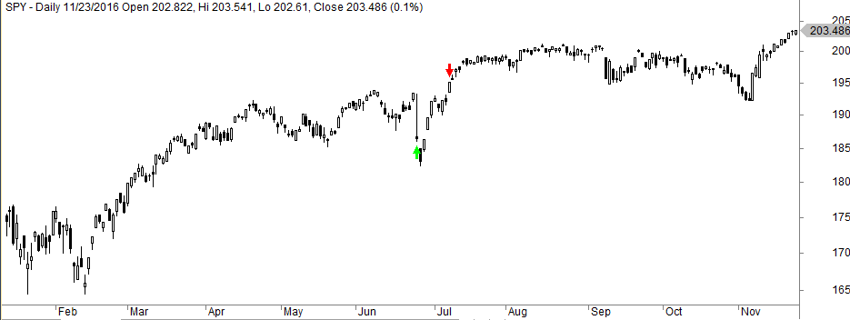

Algorithmic trading, or algo trading, is a method of executing trades using automated and pre-programmed trading instructions. These instructions account for variables such as time, price, and volume. By leveraging advanced computational power, algo trading aims to capitalize on market opportunities at speeds and frequencies that are impossible for human traders.

Among various strategies in algorithmic trading, Larry Connors' Double Seven strategy stands out due to its simplicity and effectiveness. Developed by Larry Connors and Cesar Alvarez, the Double Seven is a short-term, mean-reversion strategy designed to profit from brief reversals in market price trends. It primarily relies on the use of simple moving averages and price action indicators to identify buying and selling points.



This article examines the Double Seven strategy in detail, covering its foundational elements and its evolution over time. By understanding the strategy's core principles, one can assess how it has performed historically and consider its potential for integration into broader trading systems. The Double Seven strategy offers insights into how straightforward approaches can yield robust results in automated trading environments.

## Table of Contents

## What is the Double Seven Strategy?

The Double Seven strategy, formulated by Larry Connors and Cesar Alvarez, is prominently detailed in their book "Short Term Trading Strategies That Work". This trading approach is categorized as a mean-reversion strategy, which targets the exploitation of temporary reversals within market trends. The core principle is that prices exhibiting extreme short-term movements tend to return to their average levels, thus presenting lucrative buying or selling opportunities.

The strategy's mechanism largely revolves around the application of simple moving averages and specific price-based indicators. Unlike [momentum](/wiki/momentum) strategies that buy on strength and sell on weakness, the Double Seven strategy does the opposite. It anticipates a price movement reversal upon reaching certain thresholds, making it fundamentally counter-trend in nature.

The simple moving average (SMA), a key component of this strategy, is used to identify the prevailing trend. A 200-day SMA often serves as a benchmark for defining the market's long-term direction. If the current price is above this moving average, it is indicative of an upward trend, which sets the foundation for further strategic actions.

Price-based indicators, on the other hand, are employed to recognize short-term extremities. The strategy specifically looks at seven-day highs and lows for initiating trade entries or exits. Buying is suggested when the asset price hits a seven-day low, implying an expected mean-reversion upwards. Conversely, selling is advised when an asset reaches a seven-day high, suggesting a potential price pullback.

This strategic approach is relatively straightforward to implement, taking advantage of statistical tendencies without relying on complex [machine learning](/wiki/machine-learning) models or intricate market predictors. Its reliance on historical price data makes it accessible and practical for traders seeking a systematic trading approach without over-reliance on sophisticated computational resources.

## Double Seven Strategy Rules

The Double Seven strategy is defined by a set of straightforward trading rules that guide the decision-making process. The core principles include:

1. **The 200-Day Moving Average Condition**: The initial rule requires that the price of the asset being considered for a trade must be above its 200-day moving average. This criterion serves as a filter to ensure that trades are only executed in assets that are in an overarching upward trend. The 200-day moving average is a widely recognized benchmark for identifying long-term trends in the financial markets.

2. **Buying Condition**: The strategy implements a buying signal when the asset closes at a seven-day low. This condition aims to take advantage of short-term price declines in an asset that is otherwise in a long-term upward trend, aligning with the mean-reversion principle. The expectation is that prices that have fallen to a relative short-term low will revert and rise, presenting a buying opportunity.

3. **Selling Condition**: Conversely, a selling signal is triggered when the asset closes at a seven-day high. This rule is designed to capitalize on the expectation that prices, after having risen to a short-term high, will revert back downwards. The strategy exits the position upon this condition being met.

An essential aspect of this strategy is the absence of a stop-loss mechanism. Instead, the strategy relies solely on the specified buying and selling conditions. This lack of a stop-loss is a deliberate choice, based on the historical [backtesting](/wiki/backtesting) and perceived reliability of the strategy's parameters. However, the implication of not using stop-losses is that traders need to be prepared for potential drawdowns during unfavorable market conditions. 

The simplicity of the Double Seven strategy's rules makes it appealing to traders who favor systematic approaches, while its reliance on historical patterns requires a degree of commitment to its underlying assumptions about market behavior.

## Backtesting and Performance Over Time

A backtest of Larry Connors' Double Seven strategy applied to the S&P 500 index, specifically through the SPDR S&P 500 [ETF](/wiki/etf-trading-strategies) Trust (SPY), highlights a significant win ratio of 82.5% since its inception in 1993. This strategy demonstrates robust performance metrics, including a favorable performance [factor](/wiki/factor-investing) and an impressive Sharpe ratio, indicators of its effectiveness in trading.

The win ratio of 82.5% indicates that the majority of trades taken by the strategy have been profitable, suggesting reliability in its mean-reversion approach. The strategy's reliance on closing price conditions over a 200-day moving average helps identify conditions conducive to reversals, aligning buy and sell signals with temporary price declines and recoveries.

An important metric to consider is the compound annual growth rate (CAGR), which has reached 6.3% over the test period. This figure represents the strategy's ability to generate annualized returns consistently, despite being engaged in trading for a relatively small fraction of the total available market time. The formula to calculate CAGR is:

$$
\text{CAGR} = \left( \frac{\text{Ending Value}}{\text{Beginning Value}} \right)^{\frac{1}{n}} - 1
$$

where "Ending Value" is the final portfolio value, "Beginning Value" is the initial investment, and $n$ is the number of years.

The Sharpe ratio, calculated as:

$$
\text{Sharpe Ratio} = \frac{\overline{R} - R_f}{\sigma_R}
$$

where $\overline{R}$ is the average return of the strategy, $R_f$ is the risk-free rate, and $\sigma_R$ is the standard deviation of the strategy's returns, serves as a measure of risk-adjusted return. A higher Sharpe ratio implies that the strategy offers better average returns per unit of volatility, reinforcing its efficiency.

While past performance does not guarantee future results, the historical data suggests that the Double Seven strategy has consistently capitalized on mean-reversion opportunities in the S&P 500. This success is notable given the strategy's minimal time in active market positions, leveraging brief yet recurring market behaviors.

## Portfolio Implementation

In implementing the Double Seven strategy in a portfolio of exchange-traded funds (ETFs), its success is intricately linked to the characteristics of the selected assets. The strategy capitalizes on mean-reversion, and as such, it benefits most from ETFs that experience temporary market reversals. Diversification within the portfolio is crucial in this context, primarily due to the potential dilution of strategy effectiveness by correlated asset positions.

The success of the Double Seven strategy in a portfolio setting is enhanced when the selected ETFs exhibit low correlation with each other. The mean-reversion nature of the strategy requires a diverse set of market conditions and price movements to optimize entry and [exit](/wiki/exit-strategy) signals. When assets are highly correlated, they tend to move in similar directions simultaneously, reducing the strategy's ability to effectively identify unique reversal opportunities across different assets. Conversely, less correlated ETFs provide distinct price action variance, which the strategy can more effectively leverage.

For instance, suppose we have a portfolio of several ETFs, each representing different sectors, asset classes, or geographical markets. The calculation of pairwise correlation can be performed using Python as follows:

```python
import pandas as pd
import numpy as np

# Assume we have historical price data for ETFs in a DataFrame called df
correlation_matrix = df.pct_change().corr()

# Visualize correlations to assess diversification potential
import seaborn as sns
import matplotlib.pyplot as plt

plt.figure(figsize=(10, 8))
sns.heatmap(correlation_matrix, annot=True, cmap='coolwarm', fmt=".2f")
plt.title('Correlation Matrix of ETFs')
plt.show()
```

The visualization of the correlation matrix assists in selecting ETFs with varying correlations, thus aiding the portfolio's mean-reversion potential. Implementing the Double Seven strategy with careful consideration of ETF diversity allows traders to enhance the strategy's strengths in identifying and exploiting temporary price reversals across different market conditions.

## Optimizing the Double Seven Strategy

Optimizing the Double Seven Strategy involves making adjustments to the strategy's parameters to better align with specific market conditions or asset classes. One primary method to achieve this is by altering the seven-day condition—the core of the strategy—either increasing or decreasing the number of days to fit the [volatility](/wiki/volatility-trading-strategies) and behavior of different markets. Here’s how these adjustments can be approached:

1. **Dynamic Adjustment of Lookback Periods**: The standard Double Seven strategy follows a fixed seven-day lookback period for identifying lows and highs. A dynamic approach involves adjusting these periods based on historical volatility or asset-specific characteristics. By doing so, the strategy can adapt to varying levels of market volatility or trends. For instance, a more volatile market might benefit from a shorter lookback period to quickly capture price reversals, whereas a stable market could use a longer period for improved signal stability.

2. **Volatility-Based Calibration**: Incorporating volatility metrics, such as the Average True Range (ATR), can help calibrate the lookback periods. For instance, the length of the lookback period can be adjusted based on a multiplier of the ATR, enhancing the strategy's responsiveness to market conditions. Python implementation could be as follows:

    ```python
    import pandas as pd

    def adjust_lookback(asset_data, multiplier=1.5):
        atr = asset_data['close'].rolling(window=14).apply(lambda x: max(x) - min(x))
        lookback_period = (atr.mean() * multiplier).astype(int)
        lookback_period = max(5, min(lookback_period, 14))  # restrict lookback between 5 and 14 days
        return lookback_period
    ```

3. **Asset-Specific Optimization**: Different asset classes or individual securities may exhibit distinct trading characteristics. For instance, equities and commodities might show differing mean-reversion characteristics. Testing various lookback durations across different asset classes can identify optimal settings on a per-asset basis, ensuring that the strategy is tailored to the unique behavior of each asset.

4. **Automated Parameter Tuning**: Leveraging machine learning algorithms to automate the tuning process of the lookback periods can also be a viable method. Strategies like genetic algorithms or grid search can be used to efficiently find the best-performing parameters. By systematically testing a range of parameters in backtests, traders can identify the configurations that historically maximize returns and minimize drawdowns.

5. **Risk Management Considerations**: It's crucial to incorporate transaction costs, slippage, and changes in spread when optimizing the strategy, as these factors can significantly affect overall performance. Proper risk-adjusted optimization techniques ensure that any parameter adjustments lead to realistic improvements in strategy performance.

By employing these techniques, traders can enhance the adaptability and performance of the Double Seven strategy. Adjustments should be rigorously backtested to confirm that they indeed add value and do not introduce unintended risks.

## Limitations and Considerations

The Double Seven strategy, while popular for its simplicity and historical performance, carries certain limitations and considerations that traders must take into account. One significant limitation is its potential underperformance in markets that do not exhibit clear mean-reversion characteristics. This strategy thrives in environments where prices tend to revert to the mean after reaching short-term extremities. If a market shows trending behavior without regular mean reversions, the strategy might not perform as expected.

Another critical factor is the correlation among selected ETFs, which can substantially dilute the strategy's effectiveness. The Double Seven strategy is optimized when applied to assets with low correlation, as it allows the exploitation of mean-reversion across different market conditions. High correlation among ETFs means that price movements are often synchronized, reducing the potential for mean-reversion profits. Traders should aim to diversify their portfolio with assets that have varied responses to market drivers.

Additionally, transaction costs can significantly affect the strategy's performance. Due to the frequent trading nature inherent in the Double Seven strategy, traders must account for brokerage fees, bid-ask spreads, and slippage. These costs can erode the profitability of the trades, especially in markets with small average profit margins per trade. Assessing the net returns after accounting for these expenses is essential to evaluate the strategy's true viability.

Market variability, another vital consideration, can influence the strategy's success. Dynamic market conditions, such as sudden volatility or structural changes, may render historical backtesting results less predictive of future performance. Traders should continually assess the strategy's effectiveness and adapt to shifting market dynamics, potentially adjusting parameters like the moving average period or the buy/sell conditions to better suit the current market state.

By recognizing and addressing these limitations, traders can better position themselves to harness the potential of the Double Seven strategy effectively.

## Conclusion

The Double Seven strategy maintains its relevance as a trading method under the mean-reversion framework due to its simplicity and effectiveness. This strategy leverages straightforward rules that capitalize on short-term price movements and reversals, proving that uncomplicated methodologies can hold substantial power in automated trading systems.

Market adaptability and consistent performance derive from the strategy's clear structure, which lacks the complexities of many modern trading algorithms. Its reliance on basic parameters such as the 7-day low and high closing prices reinforces its foundations in mean-reversion theory, requiring minimal computational resources while delivering consistent returns.

Despite the inherent limitations, including potential underperformance in non-mean-reverting markets and vulnerability to high correlation among selected assets, the Double Seven strategy stands as an effective tool for traders. Transaction costs and volatility considerations are critical, yet they do not overshadow the strategy's core strengths.

The flexibility of the Double Seven strategy allows traders to fine-tune and integrate it within broader trading systems. By adjusting key parameters to better align with specific market conditions or integrating it with complementary strategies, traders can enhance its performance and adaptability. Doing so benefits from the strategy's robust mean-reversion foundation while accounting for various market dynamics.

Overall, the Double Seven strategy exemplifies the efficacy of simple principles in [algorithmic trading](/wiki/algorithmic-trading). Its streamlined approach offers a solid starting point for both novice and experienced traders seeking to implement automated trading systems, paving the way for optimized strategies and improved trading outcomes.

## FAQ

**FAQ**

1. **How is the Double Seven strategy implemented?**  
   The Double Seven strategy is operationalized using a systematic approach involving a few simple trading rules. Traders set up the strategy by monitoring an asset's movement relative to its 200-day moving average. A buying trigger occurs when the asset closes at a seven-day low, while a selling condition is met when it closes at a seven-day high. This routine involves minimal intervention, as the strategy is designed for algorithmic execution, eliminating emotional biases common in manual trading.

2. **Is the Double Seven strategy effective in current markets?**  
   The strategy has demonstrated robust historical performance, particularly in mean-reversion-friendly markets, such as the S&P 500, through backtesting. However, its effectiveness can vary based on prevailing market conditions. In trending markets where assets consistently move in one direction without sufficient reversals, the strategy may underperform. Market participants should regularly assess the market environment and may need to adjust strategy parameters to align with current conditions.

3. **How does the Double Seven strategy compare to other strategies by Larry Connors?**  
   Larry Connors has developed several strategies focusing on short-term trading and mean reversion, each with unique parameters and methodologies. Compared to other strategies such as the Connors RSI or the 2-Period RSI, the Double Seven strategy is simpler, focusing on moving averages and clear buy/sell points. While the Double Seven emphasizes capturing rebounds from recent lows or highs, other strategies may incorporate additional indicators to refine entry and exit signals. Traders should analyze performance metrics like the win ratio, drawdowns, and Sharpe ratio to determine the best fit for their trading objectives.

4. **Can the Double Seven strategy be modified to enhance performance?**  
   Yes, the Double Seven strategy can be tailored to meet specific market conditions or individual trading goals. Potential modifications include adjusting the moving average length or changing the period criteria for lows and highs. For instance, traders might experiment with a 10-day high/low instead of a seven-day one to better suit longer corrective phases in certain markets. Backtesting these alterations on historical data ensures modifications improve performance before real-world application.

5. **What are common challenges faced with the Double Seven strategy?**  
   Despite its straightforward nature, the strategy is not without challenges. It assumes market conditions conducive to mean reversion, which may not always be present. High transaction costs from frequent trades, especially in volatile markets, can also erode potential profits. Additionally, if trading multiple highly correlated assets, the strategy's effect may be diminished. Traders should carefully select assets and consider diversifying across uncorrelated instruments to maximize the strategy's efficiency.

## References & Further Reading

[1]: Connors, L., & Alvarez, C. (2009). ["Short Term Trading Strategies That Work: A Quantified Guide to Trading Stocks and ETFs."](https://www.amazon.com/Short-Term-Trading-Strategies-That/dp/0981923909) TradingMarkets Publishing Group.

[2]: Chan, E. P. (2008). ["Quantitative Trading: How to Build Your Own Algorithmic Trading Business"](https://rickorford.com/quantitative-trading/) Wiley.

[3]: Aronson, D. (2007). ["Evidence-Based Technical Analysis: Applying the Scientific Method and Statistical Inference to Trading Signals"](https://www.amazon.com/Evidence-Based-Technical-Analysis-Scientific-Statistical/dp/0470008741) John Wiley & Sons.

[4]: Jansen, S. (2020). ["Machine Learning for Algorithmic Trading: Predictive models to extract signals from market and alternative data for systematic trading strategies with Python."](https://www.amazon.com/Machine-Learning-Algorithmic-Trading-alternative/dp/1839217715) Packt Publishing.

[5]: Prado, M. L. de. (2018). ["Advances in Financial Machine Learning"](https://www.amazon.com/Advances-Financial-Machine-Learning-Marcos/dp/1119482089) Wiley.