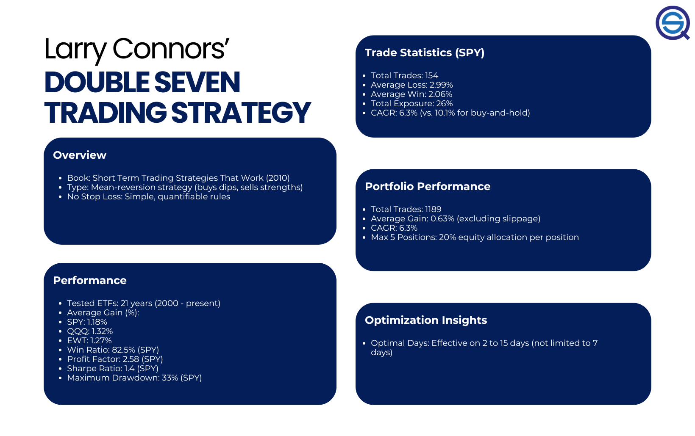

## Table of Contents

## What is the Larry Connors Double Seven Strategy?

The Larry Connors Double Seven Strategy is a trading approach used in the stock market, specifically for short-term trading. It focuses on buying stocks that have recently dropped in price, with the idea that they might bounce back quickly. The strategy uses two main rules: first, the stock must have gone down by 7% or more over the last four weeks. Second, the stock's price must be at least 7% below its 52-week high. When both conditions are met, the strategy suggests buying the stock and holding it for a short period, usually a few days to a couple of weeks.

This strategy is based on the belief that stocks that have fallen significantly in a short time might be oversold and due for a rebound. Traders using this method look for stocks that meet the criteria and then watch for signs of a price recovery. The goal is to buy low and sell high within a short timeframe. However, like all trading strategies, it comes with risks, and it's important for traders to do their own research and consider their risk tolerance before using it.

## Who is Larry Connors and why is his strategy notable?

Larry Connors is a well-known figure in the world of trading and investing. He has written many books about trading strategies and runs a company that provides trading research and tools. He is famous for coming up with different ways to trade stocks, especially short-term trading.

The Larry Connors Double Seven Strategy is notable because it gives traders a clear set of rules to follow. It helps them decide when to buy a stock that has gone down a lot in a short time. Many traders like this strategy because it is simple to understand and can be used quickly. However, it's important to remember that no strategy works all the time, and traders should be careful and do their own research.

## How does the Double Seven Strategy work in simple terms?

The Double Seven Strategy is a way to trade stocks that have gone down a lot in a short time. It says you should buy a stock if it has dropped by 7% or more in the last four weeks and is also at least 7% below its highest price in the last year. The idea is that these stocks might be ready to go back up soon.

Once you buy the stock using this strategy, you hold onto it for just a short time, usually a few days to a couple of weeks. You're hoping the stock will bounce back quickly so you can sell it for a profit. But remember, this strategy doesn't always work, and you need to be careful and do your own research before trying it.

## What are the key components of the Double Seven Strategy?

The Double Seven Strategy is all about buying stocks that have dropped a lot in a short time. It has two main rules you need to follow. First, the stock must have gone down by 7% or more over the last four weeks. This means you look at how much the stock's price has changed in the past month. Second, the stock's current price must be at least 7% below its highest price in the last year. This means you compare the stock's price now to its highest price over the past 52 weeks.

Once you find a stock that meets both these rules, the strategy says you should buy it. The idea is that the stock might be ready to go back up soon because it has fallen so much. You hold onto the stock for a short time, usually just a few days to a couple of weeks. If the stock starts to go up, you sell it and make a profit. But remember, this strategy doesn't always work, and you need to be careful and do your own research before trying it.

## Can you explain the entry and exit rules of the Double Seven Strategy?

The entry rule for the Double Seven Strategy is simple. You buy a stock when it has dropped by 7% or more in the last four weeks and is also at least 7% below its highest price in the last year. This means you need to check the stock's price history to see if it meets both these conditions. If it does, you go ahead and buy the stock, hoping it will bounce back soon.

The [exit](/wiki/exit-strategy) rule is about when to sell the stock. You hold onto the stock for a short time, usually just a few days to a couple of weeks. You're looking for the stock to start going up again. Once you see it begin to recover, you sell it to make a profit. Remember, this strategy doesn't always work, so you need to be careful and do your own research before trying it.

## What historical performance data supports the Double Seven Strategy?

The Double Seven Strategy has been tested over time, and some studies show it can work well. Larry Connors, who created the strategy, looked at data from many stocks and found that stocks meeting the two rules often went up after a short time. In one study, he found that if you used this strategy, you could make money about 65% of the time. This means that if you followed the rules and bought stocks that had dropped by 7% in four weeks and were 7% below their 52-week high, more than half the time, those stocks would go up in the next few weeks.

However, it's important to remember that past results don't guarantee future success. The stock market can change, and what worked before might not work the same way in the future. Also, the strategy might work better in some market conditions than others. So, while the historical data can give you some confidence, you should always be careful and do your own research before using the Double Seven Strategy.

## How has the effectiveness of the Double Seven Strategy changed over time?

The Double Seven Strategy has seen changes in how well it works over time. When Larry Connors first talked about it, the strategy did pretty well. Studies showed that if you followed the rules and bought stocks that had dropped by 7% in four weeks and were 7% below their 52-week high, you could make money about 65% of the time. But as time went on, the stock market changed, and the strategy didn't always work as well as it used to. 

This change in effectiveness can happen because the market is always changing. What worked well a few years ago might not work the same way now. Things like economic conditions, how people feel about the market, and new trading strategies can all affect how well the Double Seven Strategy does. So, while it has a good track record, it's important to keep an eye on how it's doing and be ready to adjust your approach.

## What are the potential risks and limitations of using the Double Seven Strategy?

Using the Double Seven Strategy comes with some risks and limitations. One big risk is that the stock might keep going down even after you buy it. Just because a stock has dropped a lot doesn't mean it will bounce back. If the stock keeps falling, you could lose money. Another risk is that the market might change, and what worked before might not work now. The strategy might not be as effective in different market conditions, so it's important to keep an eye on how the market is doing.

There are also some limitations to think about. The Double Seven Strategy is based on past data, and past results don't guarantee future success. What happened before might not happen again. Also, the strategy only looks at two things: how much the stock has dropped in four weeks and how far it is from its 52-week high. It doesn't consider other important factors like the company's financial health or what's happening in the world that could affect the stock. So, while the strategy can be useful, you need to be careful and do your own research before using it.

## How can the Double Seven Strategy be adapted for different market conditions?

The Double Seven Strategy can be changed a bit to work better in different market conditions. If the market is going up a lot, you might want to hold onto the stock for a shorter time. This is because stocks can bounce back faster when the market is doing well. On the other hand, if the market is going down, you might need to be more careful. You could wait for a bigger drop than 7% before buying, or you might want to hold the stock for a longer time to give it a better chance to go back up.

Another way to adapt the strategy is to look at other things besides just the stock's price. For example, you could check the company's news or financial reports to see if there's a good reason to think the stock will go up. You might also want to use other tools, like looking at the stock's trading [volume](/wiki/volume-trading-strategy) or using technical indicators, to help you decide when to buy and sell. By making these changes, you can make the Double Seven Strategy work better in different market situations.

## What are some real-world examples of the Double Seven Strategy in action?

Imagine you're looking at a stock called ABC Company. Over the last four weeks, its price has dropped by 8%, and it's now 10% below its highest price in the last year. According to the Double Seven Strategy, this stock meets both rules: it has fallen by more than 7% in four weeks and is more than 7% below its 52-week high. So, you decide to buy the stock. A week later, the stock starts to go up again, and you sell it for a small profit. This is a simple example of how the strategy can work in real life.

Another example could be with XYZ Corporation. You notice that its stock has gone down by 9% in the last four weeks and is currently 12% below its 52-week high. You buy the stock, hoping it will bounce back soon. However, this time, the stock keeps going down, and after two weeks, you decide to sell it at a loss. This shows that the Double Seven Strategy doesn't always work, and there are risks involved. It's important to be careful and do your own research before trying it.

## How does the Double Seven Strategy compare to other trading strategies in terms of performance and risk?

The Double Seven Strategy is one way to trade stocks, but it's different from other strategies when you look at how well it works and how risky it is. Compared to long-term investing, where you hold onto stocks for years, the Double Seven Strategy is much shorter. It's all about buying stocks that have dropped a lot in a short time and selling them quickly. This can lead to quick profits, but it's also riskier because the stock might keep going down instead of bouncing back. On the other hand, long-term investing can be less risky because you have more time for the stock to recover, but it might take a long time to see any profit.

When you compare the Double Seven Strategy to other short-term trading strategies, like [momentum](/wiki/momentum) trading or [day trading](/wiki/day-trading-spy), it's a bit different too. Momentum trading is about buying stocks that are already going up, hoping they'll keep going. This can be less risky than the Double Seven Strategy because you're buying stocks that are doing well, not ones that have fallen a lot. Day trading, where you buy and sell stocks in one day, can be even riskier than the Double Seven Strategy because you're making quick decisions with less time to see if the stock will go up. The Double Seven Strategy sits in the middle, offering a chance for quick gains but with a higher risk than long-term investing and a different kind of risk than other short-term strategies.

## What advanced techniques can be used to optimize the Double Seven Strategy?

To make the Double Seven Strategy work better, you can use some advanced tricks. One trick is to use something called a "stop-loss" order. This means you decide ahead of time how much money you're willing to lose on a stock. If the stock goes down to that price, it automatically sells, so you don't lose more money. Another trick is to look at how many people are buying and selling the stock, which is called "volume." If a lot of people are buying the stock after it drops, it might be a good sign that it will go back up soon. You can also use "technical indicators" like moving averages to help you decide when to buy and sell. These tools can help you make smarter choices and maybe make more money.

Another way to improve the Double Seven Strategy is to think about what's happening in the world that could affect the stock. For example, if there's good news about the company or the economy, it might be a good time to buy a stock that has dropped. You can also change the rules a bit depending on the market. If the market is going up a lot, you might want to buy stocks that have only dropped by 5% instead of 7% because they might bounce back faster. If the market is going down, you might want to wait for a bigger drop, like 10%, before buying. By using these advanced techniques, you can make the Double Seven Strategy work better for you and maybe lower your risk of losing money.

## What is the relationship between backtesting and performance over time?

A backtest of Larry Connors' Double Seven strategy applied to the S&P 500 index, specifically through the SPDR S&P 500 [ETF](/wiki/etf-trading-strategies) Trust (SPY), highlights a significant win ratio of 82.5% since its inception in 1993. This strategy demonstrates robust performance metrics, including a favorable performance [factor](/wiki/factor-investing) and an impressive Sharpe ratio, indicators of its effectiveness in trading.

The win ratio of 82.5% indicates that the majority of trades taken by the strategy have been profitable, suggesting reliability in its mean-reversion approach. The strategy's reliance on closing price conditions over a 200-day moving average helps identify conditions conducive to reversals, aligning buy and sell signals with temporary price declines and recoveries.

An important metric to consider is the compound annual growth rate (CAGR), which has reached 6.3% over the test period. This figure represents the strategy's ability to generate annualized returns consistently, despite being engaged in trading for a relatively small fraction of the total available market time. The formula to calculate CAGR is:

$$
\text{CAGR} = \left( \frac{\text{Ending Value}}{\text{Beginning Value}} \right)^{\frac{1}{n}} - 1
$$

where "Ending Value" is the final portfolio value, "Beginning Value" is the initial investment, and $n$ is the number of years.

The Sharpe ratio, calculated as:

$$
\text{Sharpe Ratio} = \frac{\overline{R} - R_f}{\sigma_R}
$$

where $\overline{R}$ is the average return of the strategy, $R_f$ is the risk-free rate, and $\sigma_R$ is the standard deviation of the strategy's returns, serves as a measure of risk-adjusted return. A higher Sharpe ratio implies that the strategy offers better average returns per unit of volatility, reinforcing its efficiency.

While past performance does not guarantee future results, the historical data suggests that the Double Seven strategy has consistently capitalized on mean-reversion opportunities in the S&P 500. This success is notable given the strategy's minimal time in active market positions, leveraging brief yet recurring market behaviors.

## References & Further Reading

[1]: Connors, L., & Alvarez, C. (2009). ["Short Term Trading Strategies That Work: A Quantified Guide to Trading Stocks and ETFs."](https://www.amazon.com/Short-Term-Trading-Strategies-That/dp/0981923909) TradingMarkets Publishing Group.

[2]: Chan, E. P. (2008). ["Quantitative Trading: How to Build Your Own Algorithmic Trading Business"](https://rickorford.com/quantitative-trading/) Wiley.

[3]: Aronson, D. (2007). ["Evidence-Based Technical Analysis: Applying the Scientific Method and Statistical Inference to Trading Signals"](https://www.amazon.com/Evidence-Based-Technical-Analysis-Scientific-Statistical/dp/0470008741) John Wiley & Sons.

[4]: Jansen, S. (2020). ["Machine Learning for Algorithmic Trading: Predictive models to extract signals from market and alternative data for systematic trading strategies with Python."](https://www.amazon.com/Machine-Learning-Algorithmic-Trading-alternative/dp/1839217715) Packt Publishing.

[5]: Prado, M. L. de. (2018). ["Advances in Financial Machine Learning"](https://www.amazon.com/Advances-Financial-Machine-Learning-Marcos/dp/1119482089) Wiley.