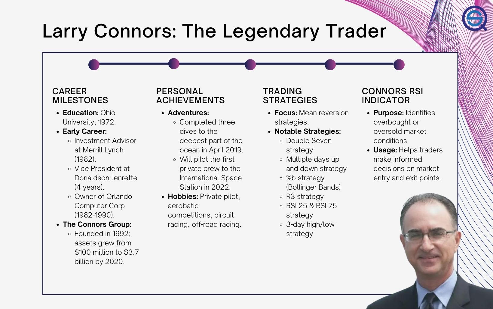

## Table of Contents

## Who is Larry Connors and what is he known for in the trading world?

Larry Connors is a well-known figure in the trading world, particularly in the United States. He is a trader, author, and the founder of TradingMarkets and Connors Research. Larry has spent many years studying the stock market and developing trading strategies that help traders make better decisions.

He is most famous for his work on quantitative trading strategies. Larry has written several books on this topic, including "How Markets Really Work" and "Short Term Trading Strategies That Work." These books explain how to use data and math to find good trading opportunities. Many traders use the strategies from his books to improve their trading results.

## What are the key principles of Larry Connors' trading strategies?

Larry Connors' trading strategies focus on using numbers and data to make smart trading choices. He believes that by looking at past market data, traders can find patterns that help predict what might happen next. This approach is called quantitative trading. Connors uses things like moving averages and other technical indicators to decide when to buy or sell. He also looks at how stocks behave after certain events, like big price drops or rises, to find good trading opportunities.

Another important part of Connors' strategies is managing risk. He teaches traders to always think about how much they could lose before they think about how much they could win. This means setting clear rules for when to get out of a trade if it goes the wrong way. By keeping losses small, traders can stay in the game longer and have more chances to make money. Connors also stresses the importance of sticking to a plan and not letting emotions drive trading decisions.

## Can you explain Larry Connors' approach to using quantitative analysis in trading?

Larry Connors uses numbers and past data to help traders make better choices. He looks at things like moving averages, which are lines on a chart that show the average price of a stock over time. By studying how these lines move, he can see patterns that might tell him if a stock is going up or down soon. He also pays attention to what happens after big price changes. For example, if a stock drops a lot, he might look at how it usually acts after that to decide if it's a good time to buy.

Another big part of Connors' approach is managing risk. He believes traders should always think about how much they could lose before they think about how much they could win. This means setting rules for when to sell a stock if it starts going down, to keep losses small. By doing this, traders can stay in the game longer and have more chances to make money. Connors also says it's important to stick to a plan and not let feelings like fear or excitement make trading decisions.

## What are some of the most popular trading strategies developed by Larry Connors?

Larry Connors has developed many popular trading strategies that traders use to make money in the stock market. One of his most famous strategies is called the 2-period RSI strategy. This strategy looks at a special number called the Relative Strength Index (RSI) over two days. If the RSI is very low, it might mean the stock is about to go up, so it could be a good time to buy. Traders use this strategy to find stocks that might be ready for a quick rise in price.

Another well-known strategy by Connors is the VIX Trading Strategy. The VIX is a number that shows how much fear is in the market. When the VIX is high, it means people are scared, and when it's low, people are feeling more calm. Connors' strategy uses the VIX to decide when to buy or sell stocks. If the VIX is very high, it might be a good time to buy because the market could be ready to go up again. This strategy helps traders use the overall mood of the market to make smart trading choices.

## How does Larry Connors' RSI(2) strategy work, and how can it be applied?

Larry Connors' RSI(2) strategy is a way to find good times to buy stocks. It uses a special number called the Relative Strength Index (RSI) that looks at how a stock has been doing over the last two days. If the RSI is below 10, it means the stock has been going down a lot and might be ready to go back up. When the RSI is this low, Connors says it could be a good time to buy the stock because it might be about to rise in price. This strategy is all about looking for stocks that have been beaten down and could bounce back.

To use the RSI(2) strategy, you need to watch the RSI number for a stock. If you see the RSI drop below 10, that's your signal to think about buying. But remember, you also need to set a plan for when to sell the stock if it doesn't go up like you hoped. Larry Connors says it's important to have a rule for when to get out, like selling if the stock goes down another 5% after you buy it. This way, you can keep your losses small and wait for the next chance to use the strategy again.

## What role does Larry Connors believe market psychology plays in trading?

Larry Connors believes that market psychology is very important in trading. He thinks that understanding how people feel about the market can help traders make better choices. For example, when everyone is scared and selling their stocks, it might be a good time to buy because prices are low. On the other hand, when everyone is excited and buying, it might be a good time to sell because prices could be too high.

Connors uses tools like the VIX, which measures fear in the market, to help traders see what other people are feeling. If the VIX is high, it means people are scared, and this could be a signal to buy. If the VIX is low, it means people are calm, and this could be a signal to sell. By paying attention to these feelings, traders can use market psychology to find good times to trade.

## How has Larry Connors' work influenced modern algorithmic trading?

Larry Connors' work has had a big impact on modern [algorithmic trading](/wiki/algorithmic-trading). He has shown traders how to use numbers and past data to make smart choices. His strategies, like the RSI(2) and VIX trading, use math to find good times to buy and sell stocks. Many traders now use computers to do this kind of math quickly, which is called algorithmic trading. Connors' ideas have helped people build these computer programs that can trade on their own, using the same rules he wrote about in his [books](/wiki/algo-trading-books).

Because of Connors, more traders understand how important it is to use data to make decisions. His focus on keeping losses small and sticking to a plan has also become a big part of algorithmic trading. These computer programs can follow the rules without getting scared or excited, which helps them trade better. Connors' work has made algorithmic trading more popular and has shown traders how to use it to make money in the stock market.

## What are the common criticisms or limitations of Larry Connors' trading strategies?

Some people say that Larry Connors' trading strategies can be too simple. They think that using just one number, like the RSI(2), might not be enough to make good trading choices. Markets can be very tricky, and looking at more things, like what's happening in the news or how the whole economy is doing, could help make better decisions. Also, some traders worry that if too many people start using the same strategy, it might stop working as well. This is because everyone would be trying to buy and sell at the same times, which could change how the market moves.

Another criticism is that Connors' strategies might not work well for everyone. Some traders might not have the same amount of money to start with, or they might not be able to watch the market all day. This means they might not be able to use the strategies the way Connors suggests. Also, his strategies focus a lot on short-term trading, which can be risky. If someone loses money on a trade, they might not have time to make it back before they need to trade again. So, while Connors' ideas can be helpful, they might not fit every trader's situation or style.

## How can beginners start implementing Larry Connors' strategies in their trading?

Beginners can start using Larry Connors' strategies by first learning about the RSI(2) strategy. This means watching the Relative Strength Index over two days for a stock. If the RSI drops below 10, it might be a good time to buy because the stock could be ready to go up. Beginners should practice this on a demo account first, where they can trade without using real money. This way, they can get used to watching the RSI and making decisions without risking their savings. It's also important to set a rule for when to sell, like if the stock goes down another 5% after buying, to keep losses small.

Another way beginners can start is by learning about the VIX and how it shows fear in the market. When the VIX is high, it means people are scared, and it might be a good time to buy stocks. When the VIX is low, it means people are calm, and it might be a good time to sell. Beginners can watch the VIX on financial news websites or trading platforms. They should also practice using this information to make trading decisions on a demo account. By understanding how market feelings can affect stock prices, beginners can start to use Connors' ideas to make smarter trades.

## What are some advanced techniques Larry Connors uses for risk management?

Larry Connors puts a big focus on keeping losses small when trading. He believes that traders should always think about how much they could lose before they think about how much they could win. One way he does this is by setting clear rules for when to sell a stock if it starts going down. For example, if a stock goes down by a certain percentage after you buy it, you should sell it to stop losing more money. This helps traders stay in the game longer because they don't lose too much on any one trade.

Another advanced technique Connors uses is something called position sizing. This means deciding how much money to put into each trade based on how much risk you can handle. If a trade looks very risky, you might put less money into it. If a trade looks safer, you might put more money into it. By doing this, traders can control how much they could lose overall. Connors also teaches traders to stick to their plan and not let feelings like fear or excitement make them change their trading decisions. This helps them stay calm and make smart choices even when the market is moving a lot.

## Can you discuss any case studies or real-world examples where Larry Connors' strategies were successfully applied?

One real-world example where Larry Connors' strategies were successfully applied is in the use of his RSI(2) strategy by a group of traders at a [hedge fund](/wiki/hedge-fund-trading-strategies). They used this strategy to find stocks that had dropped a lot and were ready to go back up. By buying these stocks when the RSI(2) was below 10, they were able to make money as the stocks bounced back. The traders followed Connors' advice to set clear rules for when to sell if the stocks didn't go up as expected, which helped them keep their losses small. Over time, this strategy helped the hedge fund make steady profits by taking advantage of short-term price movements.

Another example is how a retail trader used Connors' VIX trading strategy to make smart decisions during a time of high market fear. When the VIX was very high, showing that people were scared, the trader bought stocks because Connors' strategy suggested that this could be a good time. As the market calmed down and the VIX went down, the stocks the trader bought went up in price, leading to a profit. The trader also used Connors' risk management techniques, like setting a stop-loss to sell if the stocks went down too much, which helped protect their money. This example shows how understanding market psychology, as taught by Connors, can lead to successful trading.

## How does Larry Connors view the future of trading with the rise of AI and machine learning?

Larry Connors believes that AI and [machine learning](/wiki/machine-learning) will change the future of trading a lot. He thinks these new tools can help traders make better choices by looking at huge amounts of data very quickly. AI can find patterns that people might miss, which could help traders find good times to buy and sell stocks. Connors says that as AI gets better, it will be able to do more of the work that traders used to do by hand, like watching the market and making decisions.

But Connors also says that even with AI, the basic ideas of trading will still be important. He believes that traders will always need to manage risk and stick to a plan. AI can help with these things, but it's still up to the trader to decide how much risk they want to take and when to get out of a trade. Connors thinks that the future of trading will be about using AI to help make smarter choices, but the human part of trading, like understanding market feelings, will still be key.

## References & Further Reading

[1]: Connors, L., & Alvarez, C. (2009). ["High Probability ETF Trading: 7 Professional Strategies to Improve Your ETF Trading."](https://www.amazon.com/High-Probability-ETF-Trading-Professional/dp/0615297412) TradingMarkets Publishing Group.

[2]: Connors, L., & Alvarez, C. (2010). ["Short Term Trading Strategies That Work: A Quantified Guide to Trading Stocks and ETFs."](https://www.amazon.com/Short-Term-Trading-Strategies-That/dp/0981923909) TradingMarkets Publishing Group.

[3]: Morris, G. (1999). ["Candlestick Charting Explained: Timeless Techniques for Trading Stocks and Futures."](https://www.amazon.com/Candlestick-Charting-Explained-Timeless-Techniques/dp/007146154X) McGraw-Hill Education.

[4]: Bollinger, J. (2002). ["Bollinger on Bollinger Bands."](https://books.google.com/books/about/Bollinger_on_Bollinger_Bands.html?id=MVrJdo8VOnIC) McGraw-Hill.

[5]: Kaufman, P. J. (2013). ["Trading Systems and Methods."](https://www.amazon.com/Trading-Systems-Methods-Website-Wiley/dp/1118043561) Wiley.