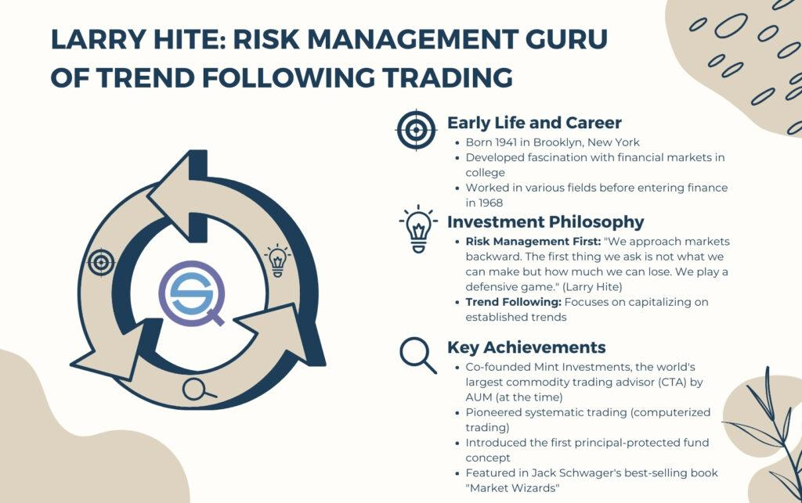

## Table of Contents

## Who is Larry Hite?

Larry Hite is a well-known figure in the world of finance and trading. He was born in 1941 and became famous for his success in the financial markets. Larry started his career as a drummer in a rock band before moving into the world of finance. He worked hard and learned a lot about trading, which helped him become very successful.

Larry Hite is best known for creating a company called Mint Investment Management. At Mint, he used computers and math to make smart trading decisions. This approach helped him make a lot of money for himself and his clients. Larry's success made him a respected figure in the trading world, and he even wrote a book to share his knowledge with others.

## What is Larry Hite's background and education?

Larry Hite was born in 1941 in New York. He grew up in a regular family and didn't start out in finance. At first, Larry wanted to be a musician. He played drums in a rock band and even got a degree in music from the University of Pennsylvania. But after a while, he decided to try something new.

Larry then went to Brooklyn Law School and got a law degree. Even though he studied law, he didn't end up working as a lawyer. Instead, he got interested in the stock market and trading. He started learning everything he could about finance and eventually became very successful in this new field.

## How did Larry Hite start his career in trading?

Larry Hite started his trading career after trying different things. He first wanted to be a musician and got a degree in music from the University of Pennsylvania. But then he went to Brooklyn Law School and got a law degree. Even with a law degree, Larry didn't become a lawyer. Instead, he got curious about the stock market and decided to learn more about trading.

He began working at a small brokerage firm where he learned the basics of trading. Larry worked hard and used his free time to study and understand how the markets worked. Over time, he got better at trading and started making good money. This success led him to start his own company, Mint Investment Management, where he used computers and math to make smart trading decisions.

## What are some key milestones in Larry Hite's trading career?

Larry Hite's trading career had some important moments that made him famous. He started working at a small brokerage firm where he learned how to trade. Larry worked hard and used his free time to study the markets. He got better at trading and started making good money. This success helped him start his own company called Mint Investment Management. At Mint, Larry used computers and math to make smart trading choices, which helped him make a lot of money for himself and his clients.

Another big milestone was when Larry became known as one of the "Market Wizards." This happened after he was featured in a book called "The New Market Wizards" by Jack D. Schwager. The book talked about Larry's success and how he used math and computers to trade. Being called a Market Wizard made Larry even more respected in the trading world. He also shared his knowledge by writing a book called "The Rule: The Simple Strategy That Will Help You Win Every Bet." This book explained his trading methods and helped others learn from his success.

## What trading strategies does Larry Hite advocate?

Larry Hite believes in using math and computers to make trading decisions. He thinks that by looking at numbers and patterns, you can predict how prices will move. He calls this approach "trend following." This means watching the market and making trades based on the direction the market is going. If the market is going up, you buy. If it's going down, you sell. Larry says it's important to stick to this plan and not let emotions get in the way.

Another key part of Larry's strategy is managing risk. He believes in not putting all your money into one trade. Instead, he suggests spreading your money across different trades. This way, if one trade doesn't go well, you won't lose everything. Larry also talks about setting clear rules for when to get out of a trade. If a trade starts losing money, he says to cut your losses quickly. This helps protect your money and gives you a better chance of making profits over time.

## How did Larry Hite develop his approach to risk management?

Larry Hite developed his approach to risk management by learning from his own experiences and by studying the markets closely. He realized that the key to successful trading was not just about making money, but also about not losing it. Larry started by spreading his money across different trades. This way, if one trade didn't work out, he wouldn't lose everything. He called this diversification, and it helped him manage risk better.

Over time, Larry also learned the importance of setting clear rules for when to get out of a trade. He believed that if a trade started losing money, it was better to cut losses quickly rather than hoping it would turn around. This approach helped him protect his money and keep his trading account safe. By sticking to these rules and using math to guide his decisions, Larry was able to manage risk effectively and achieve long-term success in trading.

## What is the significance of the Hite Hedge Fund?

The Hite Hedge Fund, started by Larry Hite, was very important in the world of trading. It showed how using computers and math could help make smart trading decisions. Larry used a method called trend following, where he watched the market and made trades based on which way prices were moving. This approach helped the fund make a lot of money for its investors. The success of the Hite Hedge Fund made Larry Hite famous and respected in the trading world.

The fund also helped show how important it is to manage risk. Larry believed in not putting all the money into one trade. Instead, he spread the money across different trades. This way, if one trade didn't work out, the fund wouldn't lose everything. Larry also set clear rules for when to get out of a trade if it started losing money. This helped protect the fund's money and made it more likely to make profits over time. The Hite Hedge Fund's success showed that using math and good risk management could lead to big wins in trading.

## Can you explain Larry Hite's philosophy on market trends and cycles?

Larry Hite believes that markets move in trends and cycles, and understanding these can help you make smart trading choices. He thinks that by watching the market closely, you can see which way prices are going. If prices are going up, that's a trend. If they're going down, that's another trend. Larry says that by following these trends, you can make money. He calls this approach "trend following." It means not trying to guess what will happen next but instead, going with what the market is doing right now.

Larry also believes that markets go through cycles, which are like patterns that repeat over time. He thinks that knowing these cycles can help you know when to buy and when to sell. For example, if you see that a certain time of year often brings a rise in prices, you might want to buy then. Larry says it's important to use math and computers to help spot these trends and cycles. By sticking to what the numbers show, you can make better trading decisions and not let your feelings get in the way.

## What books or publications has Larry Hite authored or contributed to?

Larry Hite wrote a book called "The Rule: The Simple Strategy That Will Help You Win Every Bet." In this book, he shares his trading methods and explains how he used math and computers to make smart choices. Larry talks about his approach to trend following and how it helped him succeed in the markets. He also gives advice on managing risk and not letting emotions get in the way of trading decisions.

Larry was also featured in another book called "The New Market Wizards" by Jack D. Schwager. This book is about successful traders, and Larry's chapter explains how he became known as one of the "Market Wizards." He shares stories from his career and talks about how he started with a small brokerage firm and eventually founded Mint Investment Management. The book helped make Larry even more respected in the trading world and showed others how they could learn from his success.

## How has Larry Hite influenced the trading community?

Larry Hite has had a big impact on the trading community because of his success and the way he shared his knowledge. He started using computers and math to make trading decisions, which was different from what many people were doing at the time. His approach, called trend following, showed traders that they could make money by watching the market and going with the flow of prices. Larry's success with his Hite Hedge Fund and Mint Investment Management proved that his methods worked. This inspired many other traders to try using math and computers in their own trading.

Larry also influenced the trading community by writing and being featured in books. He wrote "The Rule: The Simple Strategy That Will Help You Win Every Bet," where he explained his trading methods in a way that anyone could understand. He also shared his story in "The New Market Wizards" by Jack D. Schwager, which helped him become known as one of the "Market Wizards." By sharing his experiences and advice, Larry helped many traders learn how to manage risk and make better trading decisions. His influence continues to be felt in the trading world today.

## What are some of the challenges Larry Hite faced in his career and how did he overcome them?

Larry Hite faced many challenges in his trading career. One big challenge was starting out with no experience in finance. He had studied music and law, but not trading. This meant he had to learn everything from scratch. Another challenge was dealing with the ups and downs of the market. Sometimes, trades didn't go the way he planned, and he had to deal with losses. It was hard to keep going when things weren't working out.

Larry overcame these challenges by working hard and never giving up. He spent a lot of time studying the markets and learning how they worked. He also used computers and math to help him make better trading decisions. This approach helped him see patterns and trends that others might miss. When he faced losses, Larry stuck to his plan of managing risk. He didn't put all his money into one trade and always had clear rules for when to get out of a losing trade. By staying disciplined and following his strategies, Larry was able to turn his challenges into successes.

## What lessons can new traders learn from Larry Hite's success?

New traders can learn a lot from Larry Hite's success. One big lesson is the importance of using math and computers to make trading decisions. Larry showed that by looking at numbers and patterns, you can predict how prices will move. This method, called trend following, means watching the market and making trades based on which way prices are going. New traders should try to understand the market's trends and use this knowledge to make smart choices. Larry also taught that it's important to stick to a plan and not let emotions get in the way. By following a clear strategy, traders can make better decisions and avoid making mistakes based on feelings.

Another important lesson from Larry Hite is how to manage risk. He believed in spreading money across different trades, so if one trade doesn't work out, you won't lose everything. This approach, called diversification, helps protect your money. Larry also set clear rules for when to get out of a losing trade. If a trade starts losing money, it's better to cut your losses quickly rather than hoping it will turn around. By managing risk well, new traders can protect their money and increase their chances of making profits over time. Larry's success shows that with hard work, discipline, and smart risk management, anyone can do well in trading.

## What is the Approach to Risk Management?

Larry Hite's approach to risk management is renowned for its emphasis on defensive strategies. He famously stated that profits take care of themselves if risks are managed. This philosophy underscores the importance of evaluating potential losses prior to considering potential gains. By focusing on the downside, Hite ensures that the trading strategy remains robust irrespective of market fluctuations.

A cornerstone of Hite's risk management philosophy is diversification. He believes that spreading investments across various asset classes can mitigate potential losses, reducing exposure to any single market event. This reduces the correlation of returns and helps in preserving capital during downturns.

Volatility-based position sizing is another pivotal component of Hite's approach. This method involves adjusting the size of a position based on the asset's [volatility](/wiki/volatility-trading-strategies), thereby maintaining a consistent level of risk across different trades. Mathematically, this can be represented as:

$$
\text{Position Size} = \frac{\text{Risk Capital} \times \text{Risk per Trade (\%)}}{\text{Volatility (Standard Deviation)}}
$$

Using this formula allows traders to scale their positions according to market conditions, ensuring that they do not overextend themselves in more volatile environments.

Furthermore, Hite integrates the use of stop-loss orders, a critical tool in protecting capital. Stop-loss orders automatically execute a trade to [exit](/wiki/exit-strategy) a position at a predetermined price, limiting potential losses. This automated process ensures adherence to the trading plan and eliminates emotional bias from decision-making.

Hite's strict adherence to trading plans serves as the backbone of his risk management strategy. By establishing predetermined rules and criteria for entering and exiting trades, traders can navigate markets with discipline and avoid impulsive decisions that could lead to significant losses. Such an approach not only protects capital but also contributes to a consistent trading performance over the long term.

Overall, Larry Hite's risk management strategies have set a benchmark in trading, emphasizing the protection of capital and the systematic assessment of risk. His principles are widely regarded and continue to guide traders aiming for longevity and success in the financial markets.

## References & Further Reading

[1]: Schwager, J. D. (1989). ["Market Wizards: Interviews with Top Traders."](https://www.amazon.com/Market-Wizards-Jack-D-Schwager/dp/0887306101) New York Institute of Finance.

[2]: ["Trend Following: Learn to Make Millions in Up or Down Markets"](https://www.amazon.com/Trend-Following-Updated-Millions-Markets/dp/013702018X) by Michael W. Covel

[3]: Tharp, V. K. (1999). ["Trade Your Way to Financial Freedom."](https://www.amazon.com/Trade-Your-Way-Financial-Freedom/dp/007147871X) McGraw-Hill Education.

[4]: Lo, A. W., & Hasanhodzic, J. (2009). ["The Heretics of Finance: Conversations with Leading Practitioners of Technical Analysis."](https://www.amazon.com/Heretics-Finance-Conversations-Practitioners-Technical/dp/1576603164) Bloomberg Press.

[5]: Hite, L., & Ali, E. (1996). ["Larry Hite on Trading & Risk Management"](https://www.amazon.com/Rule-Beat-Odds-Markets-Life_and/dp/1260452654) (Audio Book).