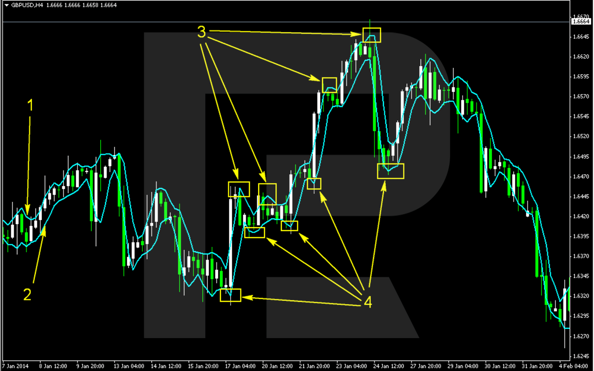

## Table of Contents

## Who is Larry Williams and what is his background in trading?

Larry Williams is a well-known trader and author who has been active in the financial markets for many years. He first gained fame in the 1980s when he turned $10,000 into over $1 million in a single year during the U.S. Investing Championship. This achievement brought him a lot of attention and established him as a successful trader. Larry has written several books on trading and investing, sharing his strategies and insights with others.

In addition to his trading success, Larry Williams has a background in journalism and has worked as a financial commentator. He has appeared on various television shows and has been a frequent speaker at trading conferences. His work in the media has helped him reach a wider audience and spread his knowledge about the markets. Larry's approach to trading often focuses on technical analysis and he is known for developing various trading indicators and systems.

## What are the basic principles of Larry Williams' trading strategies?

Larry Williams' trading strategies are based on a few key ideas. He believes in using technical analysis to find good times to buy and sell. This means he looks at charts and patterns to make decisions. He also thinks it's important to manage risk. This means he sets rules for how much money he can lose on a trade. He uses stop-loss orders to limit his losses. Another big part of his strategy is understanding market psychology. He tries to figure out what other traders are thinking and feeling, which helps him predict what they might do next.

Another principle of Larry Williams' approach is using specific indicators and systems he has developed. For example, he created the Williams %R indicator, which helps traders see if a stock is overbought or oversold. He also uses [volume](/wiki/volume-trading-strategy) analysis to understand how strong a price move is. Larry believes in testing his strategies with real data to see if they work. He encourages traders to keep learning and adapting their methods. Overall, his strategies combine technical tools, risk management, and an understanding of market behavior to make trading decisions.

## How does Larry Williams use technical analysis in his trading?

Larry Williams uses technical analysis to look at charts and patterns to decide when to buy and sell. He believes that by studying past price movements, he can predict what might happen next. One of his famous tools is the Williams %R indicator. This helps him see if a stock is overbought or oversold. If the %R shows a stock is overbought, Larry might think it's time to sell. If it's oversold, he might see it as a good time to buy. He also pays attention to volume, which tells him how strong a price move is. If a lot of people are trading a stock, it might mean the price move is more important.

Another way Larry uses technical analysis is by looking at market trends and cycles. He tries to find patterns that repeat over time. For example, he might notice that a stock goes up every December. By spotting these patterns, he can plan his trades better. Larry also uses moving averages to smooth out price data and see the overall direction of a stock. If a short-term moving average crosses above a long-term one, it might signal a good time to buy. Larry combines all these technical tools to make his trading decisions, always trying to find the best entry and [exit](/wiki/exit-strategy) points for his trades.

## What are some of the key indicators Larry Williams relies on?

Larry Williams uses a few important indicators to help him trade. One of his most famous indicators is the Williams %R. This tool helps him see if a stock is overbought or oversold. When the %R shows a stock is overbought, Larry might decide it's a good time to sell. If it's oversold, he might see it as a good time to buy. This helps him make better trading decisions by understanding when a stock might be ready for a price change.

Another key indicator Larry relies on is volume. He looks at how many people are trading a stock to understand how strong a price move is. If a lot of people are buying or selling, it can mean the price move is important. Larry also uses moving averages to smooth out price data and see the overall direction of a stock. If a short-term moving average crosses above a long-term one, it might be a good time to buy. By combining these indicators, Larry can make more informed trading choices.

## Can you explain Larry Williams' %R indicator and how to use it?

The Williams %R indicator is a tool that Larry Williams created to help traders see if a stock is overbought or oversold. It's a number that moves between 0 and -100. When the %R is close to 0, it means the stock might be overbought, and it could be a good time to sell. When it's close to -100, it means the stock might be oversold, and it could be a good time to buy. The idea is to use this number to find the best times to enter or exit trades.

To use the Williams %R, you look at its value on a chart. If the %R goes above -20, it's in the overbought area, and you might think about selling. If it drops below -80, it's in the oversold area, and you might think about buying. But it's not just about the number itself. You also need to watch for when the %R starts to move back from these extreme levels. For example, if it was overbought and starts moving down towards -50, it could be a signal to sell. If it was oversold and starts moving up towards -50, it might be a signal to buy. Using the Williams %R along with other indicators can help you make better trading decisions.

## What is the Larry Williams Volatility Breakout strategy and how does it work?

The Larry Williams Volatility Breakout strategy is a way to trade stocks by looking at how much the price moves each day. Larry Williams noticed that if a stock's price moves a lot one day, it often keeps moving in the same direction the next day. So, he made a strategy to use this idea. He looks at the difference between the highest and lowest price of a stock each day. This difference is called the "range." If the next day's price goes above the highest price of the range from the day before, Larry thinks it's a good time to buy. If it goes below the lowest price of the range from the day before, he thinks it's a good time to sell.

To use this strategy, you first find the range of the stock's price from the day before. Then, you watch the stock's price the next day. If the price goes above the top of the range from the day before, you buy the stock. If the price goes below the bottom of the range from the day before, you sell the stock. This strategy tries to catch the big moves that happen after a stock has a big price change. It's important to use this strategy with other tools and to set rules for how much you're willing to lose on a trade.

## How does Larry Williams approach risk management in his trading?

Larry Williams believes that managing risk is very important in trading. He sets rules for how much money he can lose on each trade. He uses stop-loss orders to help with this. A stop-loss order is like a safety net that tells the computer to sell a stock if it goes down too much. This helps him not lose too much money if the trade doesn't go his way. Larry also thinks about how much of his money he should use for each trade. He doesn't put all his money into one trade because that's too risky. Instead, he spreads it out so he can keep trading even if some trades don't work out.

Another way Larry manages risk is by testing his strategies with real data. He looks at past trades to see if his methods work well. This helps him understand how much risk he's taking and if he needs to change his approach. Larry also pays attention to how the market feels. He knows that if everyone is feeling the same way about a stock, it might be too risky to trade it. By combining these ideas, Larry tries to keep his losses small and his chances of making money high.

## What are some common mistakes traders make when applying Larry Williams' strategies?

One common mistake traders make when using Larry Williams' strategies is not managing risk properly. They might not use stop-loss orders or might put too much money into one trade. Larry always says it's important to set rules for how much you can lose. If traders don't do this, they can lose a lot of money quickly. Another mistake is not testing the strategies with real data. Larry believes in looking at past trades to see if a strategy works. If traders skip this step, they might use a strategy that doesn't really work for them.

Another mistake is relying too much on just one indicator, like the Williams %R. Larry uses many tools together to make better decisions. If traders only look at one thing, they might miss important signs from the market. Also, some traders might not pay attention to market psychology. Larry thinks it's important to understand how other traders feel about a stock. If traders ignore this, they might make bad trades because they don't see the bigger picture.

## How can beginners start implementing Larry Williams' trading strategies?

Beginners can start implementing Larry Williams' trading strategies by first learning about the key indicators he uses, like the Williams %R and volume analysis. They should understand how to calculate the Williams %R, which helps show if a stock is overbought or oversold. If the %R goes above -20, it might be a good time to sell, and if it goes below -80, it might be a good time to buy. Volume is also important because it tells you how strong a price move is. Beginners should practice using these indicators on a demo account to get comfortable with them before using real money.

Another important part of Larry Williams' strategies is risk management. Beginners should always use stop-loss orders to limit how much they can lose on a trade. They should also decide how much of their money to use for each trade and not put too much into one trade. Testing strategies with past data is also a good idea. Beginners can look at old price charts to see how a strategy would have worked before trying it with real money. By combining these tools and practicing good risk management, beginners can start using Larry Williams' strategies effectively.

## What are some advanced techniques used by Larry Williams in his trading?

Larry Williams uses a lot of different tools to help him trade better. One advanced technique he uses is looking at how the market feels. He pays attention to what other traders are thinking and feeling. This helps him guess what they might do next. He also uses something called the "Accumulation/Distribution" indicator. This helps him see if more people are buying or selling a stock. If more people are buying, it might be a good time to buy too. If more people are selling, it might be a good time to sell.

Another advanced technique Larry uses is looking at seasonal patterns. He knows that some stocks go up or down at certain times of the year. By understanding these patterns, he can plan his trades better. For example, he might buy a stock every December because it usually goes up then. Larry also uses a tool called "COT" reports, which stands for "Commitment of Traders." These reports show what big traders are doing. If big traders are buying a lot of a stock, Larry might decide to buy it too. By using these advanced techniques along with his basic strategies, Larry tries to make the best trading decisions possible.

## How has Larry Williams' trading strategy evolved over the years?

Larry Williams' trading strategy has changed a lot over the years. When he started, he focused a lot on technical analysis, using charts and patterns to make decisions. He created the Williams %R indicator to help him see if a stock was overbought or oversold. He also paid attention to how much a stock's price moved each day, which led to his Volatility Breakout strategy. These early strategies helped him win the U.S. Investing Championship and made him famous.

As time went on, Larry added more tools to his strategy. He started looking at how the market felt and what other traders were thinking. He used the Accumulation/Distribution indicator to see if more people were buying or selling a stock. He also began to study seasonal patterns, noticing that some stocks go up or down at certain times of the year. Larry also started using COT reports to see what big traders were doing. By combining all these new techniques with his old ones, Larry's strategy became more complex and helped him keep making good trading decisions.

## Can you provide case studies or examples of successful trades using Larry Williams' strategies?

One successful trade using Larry Williams' strategies happened in the early 1980s. Larry used his Volatility Breakout strategy to turn $10,000 into over $1 million in a single year during the U.S. Investing Championship. He looked at how much a stock's price moved each day and bought stocks when their prices went above the highest price of the previous day's range. This strategy helped him catch big moves in the market and make a lot of money. By using stop-loss orders and not putting too much money into one trade, Larry managed to keep his losses small and his gains big.

Another example of a successful trade using Larry Williams' strategies involved his use of the Williams %R indicator. In one case, Larry noticed that a stock's %R value was dropping below -80, signaling that the stock was oversold. He bought the stock, expecting its price to go up. As the %R started moving back towards -50, the stock's price did indeed rise, allowing Larry to sell it at a profit. By combining the Williams %R with other indicators like volume analysis, Larry was able to make informed decisions and execute successful trades.

## What are the key Larry Williams trading indicators?

Williams has developed several influential trading indicators, each catering to different aspects of market analysis. These indicators include the Williams %R, the Ultimate Oscillator, and the Williams Volatility Channel, all of which are integral to making informed trading decisions.

The Williams %R is a [momentum](/wiki/momentum)-based indicator that assists traders in identifying overbought and oversold market conditions. It ranges from 0 to -100 and compares the current closing price to the highest high over a specified period. The formula for the Williams %R is:

$$

\text{Williams \%R} = \frac{\text{Highest High} - \text{Current Close}}{\text{Highest High} - \text{Lowest Low}} \times -100 
$$

A value below -80 suggests that the asset might be oversold, whereas a value above -20 indicates potential overbought conditions. This information can help traders time their entries and exits effectively.

The Ultimate Oscillator is designed to measure price momentum across multiple timeframes, utilizing a combination of short, intermediate, and long-term periods to provide a more comprehensive view of momentum than single-period indicators. It incorporates weighted averages of the middle price (average of high and low) over these different timeframes, offering a balanced assessment that aims to reduce false signals typically encountered in choppy or side-ways markets.

The Williams Volatility Channel, on the other hand, employs price range to gauge market [volatility](/wiki/volatility-trading-strategies). It constructs a channel based on the volatility over a specific period, with the current high and low dictating the channel's boundaries. This indicator is particularly useful for identifying potential trend reversals. A price move above the channel may signal a potential upward trend [breakout](/wiki/breakout-trading), while a move below could indicate a downward trend breakout. This makes it an excellent tool for detecting breakouts in high-volatility markets.

Each of these indicators provides distinct insights into market behavior, enhancing a trader's ability to navigate complex trading environments with precision. By leveraging these tools, traders can better discern market trends and make strategic trading decisions.

## What are some case studies of successful application?

Several traders implementing Larry Williams' strategies in [algorithmic trading](/wiki/algorithmic-trading) have reported notable successes, attributing their achievements to precise readings of his well-regarded indicators. By conducting detailed [backtesting](/wiki/backtesting), traders are able to assess the performance of these strategies across diverse market conditions, often finding that they outperform standard benchmarks.

For instance, a case study focused on the implementation of the Williams %R indicator in algorithmic trading might demonstrate its effectiveness in identifying entry and exit points based on overbought and oversold conditions. When integrated into an automated trading algorithm, this indicator could signal buying opportunities when the %R crosses below a certain threshold, such as -80, and sell signals when it crosses above -20. This systematic approach minimizes emotional biases, leading to consistent trading results.

$$
\text{Buy Signal: } \text{Williams \%R} < -80
$$
$$
\text{Sell Signal: } \text{Williams \%R} > -20
$$

In backtesting scenarios, these precise entry and exit points can show improved gains over a baseline strategy that might not incorporate such dynamic momentum indicators. The adaptability of Williams %R to various time frames can further enhance its utility in algorithmic trading, making it versatile across different market conditions.

Moreover, considering the Williams Volatility Channel, traders have effectively used this to automate trades triggered by price breakouts. A case study could reveal how adjusting the channel parameters to current market volatility levels can lead to more responsive trading strategies. By coding the algorithm to execute trades only when sustainable breakout levels are detected, traders have experienced successful entries that capitalize on subsequent market trends.

Leveraging Python, one might construct a basic implementation for an algorithm using Williams %R and the Volatility Channel as follows:

```python
import pandas as pd

def williams_r(df, length=14):
    high = df['High'].rolling(window=length).max()
    low = df['Low'].rolling(window=length).min()
    r = (high - df['Close']) / (high - low) * -100
    return r

def volatility_channel(df, period=20):
    df['mean'] = df['Close'].rolling(window=period).mean()
    df['upper_channel'] = df['mean'] + (df['Close'].rolling(window=period).std() * 2)
    df['lower_channel'] = df['mean'] - (df['Close'].rolling(window=period).std() * 2)
    return df['upper_channel'], df['lower_channel']

# Example usage with a DataFrame 'data' containing trading data
data['Williams %R'] = williams_r(data)
data['UpperChannel'], data['LowerChannel'] = volatility_channel(data)
```

Such real-world adaptations of Larry Williams' strategies illustrate the importance of fine-tuning indicator parameters to align with current market dynamics. Successful case studies consistently highlight the need for ongoing evaluation and adjustment of trading algorithms to enhance performance sustainability and reliability, validating Williams' contributions to modern algorithmic trading.

## What are the frequently asked questions?

### What are the primary components of Larry Williams' strategies suitable for algo trading?

Larry Williams' strategies primarily revolve around momentum, volatility, and price action insights. Some of the key components include:

- **Williams %R Indicator**: This momentum-based indicator is used to identify overbought and oversold conditions, which can be crucial for timing entry and exit points in a trading strategy.

- **Ultimate Oscillator**: This indicator measures price momentum across multiple timeframes, providing a broader perspective on market conditions and helping to reduce false signals that might occur when using single timeframe indicators.

- **Williams Volatility Channel**: This is used to assess market volatility by determining the price range, which aids in identifying potential trend reversals. This component can be particularly useful in strategies aiming to capitalize on breakout opportunities.

### How does the Williams %R indicator assist in better trading decisions?

The Williams %R indicator is designed to reflect the level of the close relative to the high-low range over a specific period, typically 14 periods. It is calculated as:

$$
\text{Williams \%R} = \frac{\text{Highest High} - \text{Close}}{\text{Highest High} - \text{Lowest Low}} \times -100
$$

Values of %R move between 0 and -100. A reading between 0 and -20 typically suggests overbought conditions, while -80 to -100 indicates oversold conditions. In algo trading, this indicator can be programmed to trigger buy signals when it exits the oversold region and sell signals upon exiting the overbought region. This systematic approach helps minimize emotional biases, allowing traders to make more objective trading decisions.

### Can Williams' strategies be integrated with other trading systems for improved performance?

Yes, Williams' strategies can be effectively combined with other trading systems to enhance performance. Integrating these strategies with other technical indicators, such as moving averages or trend lines, can provide a more robust signal confirmation. For example, combining Williams %R with a moving average crossover system can help validate trending conditions, thereby filtering out false breakouts. Moreover, coupling volatility-based strategies with risk management systems like stop-loss and take-profit orders can further enhance the robustness and profitability of a trading system.

### What are the potential risks of deploying these strategies in algorithmic trading algorithms?

Deploying Larry Williams' strategies in algorithmic trading involves certain risks, including:

- **Market Volatility**: While certain strategies leverage volatility to find entry points, sudden and extreme market movements can lead to significant losses if not properly mitigated with risk management protocols.

- **Overfitting During Backtesting**: There's a risk of overfitting the algorithm to historical data. This might lead to strategies that perform well on past data but poorly on live data due to their lack of generalization.

- **Technical Failures**: Like all algorithmic systems, technical issues such as server downtime or execution errors can affect the performance and reliability of the trading strategy.

- **Regulatory Risks**: Algorithmic trading is subjected to regulatory scrutiny. Traders must ensure compliance with relevant trading regulations and laws to avoid penalties and other legal consequences.

Careful implementation and continuous evaluation of these strategies, along with sound risk management practices, can help in mitigating these risks when applied in algorithmic trading.

## References & Further Reading

[1]: Williams, L. (1999). ["Long-Term Secrets to Short-Term Trading"](https://catalogimages.wiley.com/images/db/pdf/0471297224.pdf). Wiley.

[2]: Williams, L. (1979). ["How I Made One Million Dollars Last Year Trading Commodities"](https://www.amazon.com/Made-Million-Dollars-Trading-Commodities/dp/0930233107). Windsor Books.

[3]: Williams, L. (2011). ["Trade Stocks & Commodities with the Insiders"](https://www.amazon.com/Trade-Stocks-Commodities-Insiders-Secrets/dp/0471741256). Wiley.

[4]: Connors, L., & Raschke, L. B. (1995). ["Street Smarts: High Probability Short-Term Trading Strategies"](https://www.amazon.com/Street-Smarts-Probability-Short-Term-Strategies/dp/0965046109). M. Gordon Publishing Group.

[5]: Pring, M. J. (2002). ["Technical Analysis Explained: The Successful Investor's Guide to Spotting Investment Trends and Turning Points"](https://www.amazon.com/Technical-Analysis-Explained-Fifth-Successful/dp/0071825177). McGraw-Hill.