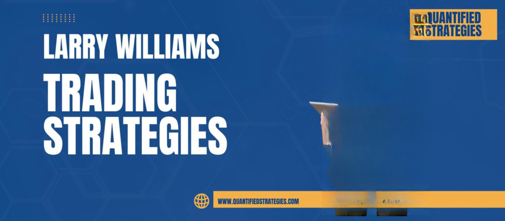

Algorithmic trading, commonly known as algo trading, operates on the foundation of predefined strategies executed using computer programs. These strategies aim to automate the trading process by identifying optimal entry and exit points based on specific market indicators and patterns, thereby minimizing human intervention and emotional biases.

Larry Williams is a prominent figure in the trading community, celebrated for his pioneering and influential trading strategies. His contributions to the field have provided traders with advanced tools and insights that facilitate decision-making processes with greater precision. By leveraging his methodologies, traders aim to improve trading outcomes through a systematic approach that captures market dynamics effectively.



This article explores how Larry Williams' revered trading strategies can be integrated into algorithmic trading systems. It emphasizes the importance of carefully defined rules and adaptability in strategy implementation to ensure that traders can respond efficiently to ever-changing market conditions. By employing these strategies in algo trading, there is potential for enhancing profitability through the disciplined execution of trades.

We provide a detailed overview of Larry Williams' trading strategies and discuss their practical implementation in algorithmic systems. This includes analyzing their components and examining how they can be calibrated to align with specific trading goals. Our objective is to equip traders with the knowledge to harness the advantages of these time-tested strategies, optimizing them for modern algorithmic applications.

## Table of Contents

## Background: Larry Williams and His Contributions

Larry Williams is a prominent figure in the trading industry, renowned for his expertise in stock and commodity futures trading. His career spans several decades, during which he has made significant contributions to the development of trading strategies. One of Williams' most notable achievements is his victory in the 1987 World Cup Championship of Futures Trading, where he achieved a record-breaking return of 11,376% in a single year. This remarkable feat solidified his reputation as a master trader and strategist.

Williams has an extensive body of work, having authored over ten [books](/wiki/algo-trading-books) focused on trading strategies. These books provide valuable insights into his methodologies and are considered essential reading for traders aiming to understand the intricacies of the markets. His works not only detail technical analysis but also emphasize the psychological and strategic aspects of trading, offering a comprehensive approach to market participation.

In addition to his writings, Williams has developed a range of technical indicators that have become staples in the trading community. These include the Williams %R, the Ultimate Oscillator, and the Williams Volatility Channel, among others. These indicators are designed to assist traders in making informed decisions by providing insights into market [momentum](/wiki/momentum), [volatility](/wiki/volatility-trading-strategies), and potential trend reversals.

Understanding Larry Williams' background and contributions is crucial for appreciating the foundation of his trading strategies. His experience and insights continue to be relevant as traders apply his principles to contemporary market scenarios, especially in the context of [algorithmic trading](/wiki/algorithmic-trading). Williams’ strategies are not just historical artifacts; they are evolving tools that, when adapted and implemented correctly, can enhance trading efficacy in today's dynamic markets.

## Key Larry Williams Trading Indicators

Williams has developed several influential trading indicators, each catering to different aspects of market analysis. These indicators include the Williams %R, the Ultimate Oscillator, and the Williams Volatility Channel, all of which are integral to making informed trading decisions.

The Williams %R is a momentum-based indicator that assists traders in identifying overbought and oversold market conditions. It ranges from 0 to -100 and compares the current closing price to the highest high over a specified period. The formula for the Williams %R is:

$$

\text{Williams \%R} = \frac{\text{Highest High} - \text{Current Close}}{\text{Highest High} - \text{Lowest Low}} \times -100 
$$

A value below -80 suggests that the asset might be oversold, whereas a value above -20 indicates potential overbought conditions. This information can help traders time their entries and exits effectively.

The Ultimate Oscillator is designed to measure price momentum across multiple timeframes, utilizing a combination of short, intermediate, and long-term periods to provide a more comprehensive view of momentum than single-period indicators. It incorporates weighted averages of the middle price (average of high and low) over these different timeframes, offering a balanced assessment that aims to reduce false signals typically encountered in choppy or side-ways markets.

The Williams Volatility Channel, on the other hand, employs price range to gauge market volatility. It constructs a channel based on the volatility over a specific period, with the current high and low dictating the channel's boundaries. This indicator is particularly useful for identifying potential trend reversals. A price move above the channel may signal a potential upward trend [breakout](/wiki/breakout-trading), while a move below could indicate a downward trend breakout. This makes it an excellent tool for detecting breakouts in high-volatility markets.

Each of these indicators provides distinct insights into market behavior, enhancing a trader's ability to navigate complex trading environments with precision. By leveraging these tools, traders can better discern market trends and make strategic trading decisions.

## Implementing Larry Williams Strategies in Algo Trading

Algorithmic trading involves the automation of trading strategies through the use of algorithms. This approach necessitates the establishment of well-defined strategies to ensure precise and timely execution. Larry Williams' trading strategies, renowned for their robustness, can be effectively adapted into algorithmic frameworks by crafting clear entry and [exit](/wiki/exit-strategy) protocols based on his acclaimed indicators.

One prominent indicator developed by Larry Williams is the Williams %R, a momentum-based tool used to identify overbought or oversold conditions within a market. This indicator ranges from 0 to -100, with readings closer to 0 suggesting that an asset is overbought, while readings closer to -100 indicate it is oversold. To implement the Williams %R indicator in an algorithmic setting, traders can establish criteria such as:

1. **Buy Signal**: If the Williams %R crosses above a specific threshold (e.g., -80), indicating potential upward momentum, the algorithm executes a buy order.
2. **Sell Signal**: Conversely, if the %R crosses below a threshold (e.g., -20), suggesting downward momentum, a sell order is triggered.

A simple Python code snippet implementing this logic could be:

```python
def williams_r(prices, period=14):
    highest_high = prices['high'].rolling(window=period).max()
    lowest_low = prices['low'].rolling(window=period).min()
    williams_r = -100 * (highest_high - prices['close']) / (highest_high - lowest_low)
    return williams_r

# Example of usage
prices = get_market_data()  # Assume this function retrieves historical market data
%R = williams_r(prices)

# Define trading signals based on Williams %R
threshold_overbought = -20
threshold_oversold = -80

buy_signals = %R > threshold_oversold
sell_signals = %R < threshold_overbought
```

Another key strategy utilizing Williams' insights is the Volatility Channel, which analyzes price ranges to gauge market volatility and predict potential trend reversals. By defining upper and lower bounds based on recent price volatility, traders can implement this strategy in an algorithmic context to trigger trades when prices break through these predefined channels.

For automation, a set of rules can be established where:

- **Enter Long Position**: Triggered when the current price exceeds the upper channel line, indicating a breakout in a bullish direction.
- **Enter Short Position**: Activated when the price falls below the lower channel line, signaling a bearish breakout. 

Coding this strategy involves calculating the volatility bands and implementing signal triggers based on breakouts:

```python
def volatility_channel(prices, period=20, multiplier=2):
    avg_price = prices['close'].rolling(window=period).mean()
    volatility = prices['close'].rolling(window=period).std()

    upper_channel = avg_price + (multiplier * volatility)
    lower_channel = avg_price - (multiplier * volatility)

    return upper_channel, lower_channel

# Example of usage
upper, lower = volatility_channel(prices)

# Define trading signals based on price breakouts
long_positions = prices['close'] > upper
short_positions = prices['close'] < lower
```

By incorporating Larry Williams' strategies into algorithmic trading systems, traders can harness the power of automated decision-making, executing trades with discipline and consistency that is often difficult to achieve manually. This approach not only optimizes entry and exit points but also enhances the efficacy of trading strategies by leveraging well-established indicators and strategic insights.

## Advantages of Using Williams' Strategies in Algorithmic Trading

Williams' trading strategies have withstood the test of time, exhibiting robustness across varying market conditions, making them particularly beneficial for algorithmic trading systems. The decades-spanning experience of Larry Williams informs these strategies, providing a solid empirical foundation and offering several distinct advantages for algo trading.

Firstly, incorporating Williams' strategies into algorithmic frameworks ensures disciplined execution. Unlike human traders, algorithms are not susceptible to emotional influences, such as fear or greed, which can often lead to inconsistent and irrational decision-making. By relying on predefined rules derived from Williams' indicators, such as the Williams %R or the Ultimate Oscillator, algo trading systems maintain consistency and objectivity in trade execution.

The adaptability of Williams' strategies is another significant advantage. These strategies have been validated across various financial instruments and market conditions, demonstrating versatility. This adaptability makes them particularly suited for algorithmic systems, which often need to adjust to different market environments. For instance, strategies built around the Williams Volatility Channel can be effective in both trending and volatile markets by dynamically adjusting the trading parameters based on current market conditions.

Moreover, the ability to backtest Williams' strategies algorithmically offers a powerful tool for optimization and refinement. Backtesting involves running a trading strategy against historical data to assess its viability and effectiveness. By simulating trades based on past market conditions, traders can evaluate the performance of Williams' strategies before deploying them in live trading. This process allows traders to fine-tune parameter settings, improve risk management, and identify potential weaknesses, thereby enhancing overall trading success.

An example of such a backtest might involve defining an algorithm that uses the Williams %R indicator to signal buy and sell orders. Python, with libraries like pandas and [backtrader](/wiki/backtrader), can facilitate this testing. Here’s a basic outline of how such a backtest could be set up:

```python
import backtrader as bt
import pandas as pd

# Strategy using Williams %R indicator
class WilliamsRStrategy(bt.Strategy):
    params = (('period', 14),)

    def __init__(self):
        self.williamsr = bt.indicators.WilliamsR(self.data, period=self.params.period)

    def next(self):
        if self.williamsr < -80:  # Example buy condition
            self.buy()
        elif self.williamsr > -20:  # Example sell condition
            self.sell()

# Load your data, prepare the cerebro engine
data = bt.feeds.PandasData(dataname=pd.read_csv('market_data.csv'))
cerebro = bt.Cerebro()
cerebro.adddata(data)
cerebro.addstrategy(WilliamsRStrategy)
cerebro.run()
```

In summary, the integration of Larry Williams' strategies into algorithmic trading systems provides a structured approach to harnessing market momentum, volatility, and price actions. Their longstanding effectiveness across diverse conditions, coupled with the discipline and optimization opportunities afforded by algo trading, make these strategies highly advantageous for traders seeking to enhance their algorithmic trading capabilities.

## Case Studies of Successful Application

Several traders implementing Larry Williams' strategies in algorithmic trading have reported notable successes, attributing their achievements to precise readings of his well-regarded indicators. By conducting detailed [backtesting](/wiki/backtesting), traders are able to assess the performance of these strategies across diverse market conditions, often finding that they outperform standard benchmarks.

For instance, a case study focused on the implementation of the Williams %R indicator in algorithmic trading might demonstrate its effectiveness in identifying entry and exit points based on overbought and oversold conditions. When integrated into an automated trading algorithm, this indicator could signal buying opportunities when the %R crosses below a certain threshold, such as -80, and sell signals when it crosses above -20. This systematic approach minimizes emotional biases, leading to consistent trading results.

$$
\text{Buy Signal: } \text{Williams \%R} < -80
$$
$$
\text{Sell Signal: } \text{Williams \%R} > -20
$$

In backtesting scenarios, these precise entry and exit points can show improved gains over a baseline strategy that might not incorporate such dynamic momentum indicators. The adaptability of Williams %R to various time frames can further enhance its utility in algorithmic trading, making it versatile across different market conditions.

Moreover, considering the Williams Volatility Channel, traders have effectively used this to automate trades triggered by price breakouts. A case study could reveal how adjusting the channel parameters to current market volatility levels can lead to more responsive trading strategies. By coding the algorithm to execute trades only when sustainable breakout levels are detected, traders have experienced successful entries that capitalize on subsequent market trends.

Leveraging Python, one might construct a basic implementation for an algorithm using Williams %R and the Volatility Channel as follows:

```python
import pandas as pd

def williams_r(df, length=14):
    high = df['High'].rolling(window=length).max()
    low = df['Low'].rolling(window=length).min()
    r = (high - df['Close']) / (high - low) * -100
    return r

def volatility_channel(df, period=20):
    df['mean'] = df['Close'].rolling(window=period).mean()
    df['upper_channel'] = df['mean'] + (df['Close'].rolling(window=period).std() * 2)
    df['lower_channel'] = df['mean'] - (df['Close'].rolling(window=period).std() * 2)
    return df['upper_channel'], df['lower_channel']

# Example usage with a DataFrame 'data' containing trading data
data['Williams %R'] = williams_r(data)
data['UpperChannel'], data['LowerChannel'] = volatility_channel(data)
```

Such real-world adaptations of Larry Williams' strategies illustrate the importance of fine-tuning indicator parameters to align with current market dynamics. Successful case studies consistently highlight the need for ongoing evaluation and adjustment of trading algorithms to enhance performance sustainability and reliability, validating Williams' contributions to modern algorithmic trading.

## Conclusion

Larry Williams' trading strategies are a vital asset for algorithmic trading, utilizing momentum, volatility, and price action insights to develop robust trading systems. These strategies, grounded in decades of experience, provide a framework that can be leveraged to automate trading processes, offering a systematic approach to capitalizing on market movements.

The implementation of Larry Williams' strategies in algorithmic trading requires careful adaptation and continuous refinement. Algorithmic systems thrive on the precision and repeatability of predefined rules, making Williams' indicators, such as the Williams %R and Volatility Channel, ideal candidates for automation. Traders must consider market conditions and backtesting results to tailor these strategies effectively, ensuring they align with the current market landscape.

For traders seeking to enhance their algorithmic trading systems, integrating Larry Williams' methodologies can lead to improved performance and profitability. By adopting a disciplined approach free from emotional biases and focusing on data-driven decision-making, traders can unlock the potential of these time-tested strategies. Tools like algorithmic backtesting further facilitate optimization, allowing traders to maximize successful outcomes and adapt promptly to shifting market dynamics.

In conclusion, Larry Williams' strategies offer a significant edge in algorithmic trading. Their adaptability and proven success across various markets make them valuable additions to any trading system. Continuous evaluation and adjustment of trading parameters will be key to leveraging these strategies effectively in future trading endeavors.

## FAQ

### What are the primary components of Larry Williams' strategies suitable for algo trading?

Larry Williams' strategies primarily revolve around momentum, volatility, and price action insights. Some of the key components include:

- **Williams %R Indicator**: This momentum-based indicator is used to identify overbought and oversold conditions, which can be crucial for timing entry and exit points in a trading strategy.

- **Ultimate Oscillator**: This indicator measures price momentum across multiple timeframes, providing a broader perspective on market conditions and helping to reduce false signals that might occur when using single timeframe indicators.

- **Williams Volatility Channel**: This is used to assess market volatility by determining the price range, which aids in identifying potential trend reversals. This component can be particularly useful in strategies aiming to capitalize on breakout opportunities.

### How does the Williams %R indicator assist in better trading decisions?

The Williams %R indicator is designed to reflect the level of the close relative to the high-low range over a specific period, typically 14 periods. It is calculated as:

$$
\text{Williams \%R} = \frac{\text{Highest High} - \text{Close}}{\text{Highest High} - \text{Lowest Low}} \times -100
$$

Values of %R move between 0 and -100. A reading between 0 and -20 typically suggests overbought conditions, while -80 to -100 indicates oversold conditions. In algo trading, this indicator can be programmed to trigger buy signals when it exits the oversold region and sell signals upon exiting the overbought region. This systematic approach helps minimize emotional biases, allowing traders to make more objective trading decisions.

### Can Williams' strategies be integrated with other trading systems for improved performance?

Yes, Williams' strategies can be effectively combined with other trading systems to enhance performance. Integrating these strategies with other technical indicators, such as moving averages or trend lines, can provide a more robust signal confirmation. For example, combining Williams %R with a moving average crossover system can help validate trending conditions, thereby filtering out false breakouts. Moreover, coupling volatility-based strategies with risk management systems like stop-loss and take-profit orders can further enhance the robustness and profitability of a trading system.

### What are the potential risks of deploying these strategies in algorithmic trading algorithms?

Deploying Larry Williams' strategies in algorithmic trading involves certain risks, including:

- **Market Volatility**: While certain strategies leverage volatility to find entry points, sudden and extreme market movements can lead to significant losses if not properly mitigated with risk management protocols.

- **Overfitting During Backtesting**: There's a risk of overfitting the algorithm to historical data. This might lead to strategies that perform well on past data but poorly on live data due to their lack of generalization.

- **Technical Failures**: Like all algorithmic systems, technical issues such as server downtime or execution errors can affect the performance and reliability of the trading strategy.

- **Regulatory Risks**: Algorithmic trading is subjected to regulatory scrutiny. Traders must ensure compliance with relevant trading regulations and laws to avoid penalties and other legal consequences.

Careful implementation and continuous evaluation of these strategies, along with sound risk management practices, can help in mitigating these risks when applied in algorithmic trading.

## References & Further Reading

[1]: Williams, L. (1999). ["Long-Term Secrets to Short-Term Trading"](https://catalogimages.wiley.com/images/db/pdf/0471297224.pdf). Wiley.

[2]: Williams, L. (1979). ["How I Made One Million Dollars Last Year Trading Commodities"](https://www.amazon.com/Made-Million-Dollars-Trading-Commodities/dp/0930233107). Windsor Books.

[3]: Williams, L. (2011). ["Trade Stocks & Commodities with the Insiders"](https://www.amazon.com/Trade-Stocks-Commodities-Insiders-Secrets/dp/0471741256). Wiley.

[4]: Connors, L., & Raschke, L. B. (1995). ["Street Smarts: High Probability Short-Term Trading Strategies"](https://www.amazon.com/Street-Smarts-Probability-Short-Term-Strategies/dp/0965046109). M. Gordon Publishing Group.

[5]: Pring, M. J. (2002). ["Technical Analysis Explained: The Successful Investor's Guide to Spotting Investment Trends and Turning Points"](https://www.amazon.com/Technical-Analysis-Explained-Fifth-Successful/dp/0071825177). McGraw-Hill.