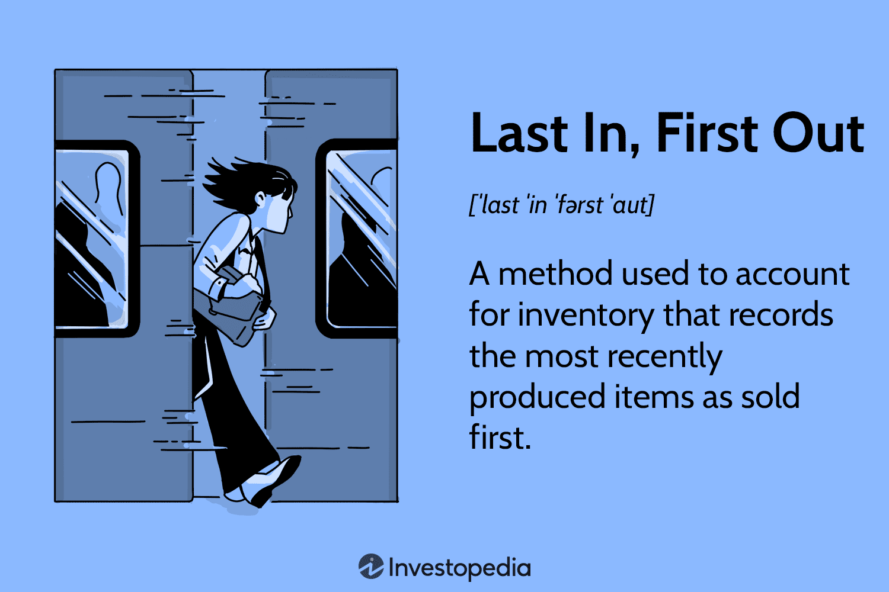

## Table of Contents

## What is the Last In, First Out (LIFO) inventory cost method?

The Last In, First Out (LIFO) inventory cost method is a way businesses keep track of their inventory costs. It works by assuming that the most recent items added to the inventory are the first ones sold. So, when a company sells a product, they use the cost of the newest inventory to calculate the cost of goods sold.

This method can be useful during times when prices are going up, because it matches current costs with current revenues. This can help a business show lower profits on paper, which might mean they pay less in taxes. However, LIFO is not allowed under International Financial Reporting Standards (IFRS), so it's mainly used in the United States.

## How does LIFO differ from other inventory valuation methods like FIFO and Average Cost?

LIFO, or Last In, First Out, is different from FIFO, or First In, First Out, and the Average Cost method in how it tracks the cost of goods sold. With LIFO, you assume that the last items you bought are the first ones you sell. So, if prices are going up, you're using the higher costs of the newer items to figure out how much it cost you to sell your products. On the other hand, FIFO works the opposite way. It assumes that the first items you bought are the first ones you sell. So, with FIFO, you're using the older, lower costs to calculate your cost of goods sold when prices are rising.

The Average Cost method takes a different approach. Instead of focusing on the order of when items were bought, it calculates an average cost for all the items in your inventory. You add up the total cost of all the items and divide it by the total number of items to get an average cost per item. Then, you use this average cost to figure out the cost of goods sold, no matter when the items were bought. This method smooths out the effects of price changes over time, unlike LIFO and FIFO which can show bigger swings in costs depending on when items were purchased.

Each method can affect a company's financial statements differently. LIFO can show lower profits and lower taxes during times of rising prices because it uses the higher costs of newer inventory. FIFO can show higher profits and higher taxes in the same situation because it uses the lower costs of older inventory. The Average Cost method falls somewhere in between, giving a more stable view of costs and profits over time.

## In what types of businesses is LIFO most commonly used?

LIFO is most commonly used in businesses where the cost of goods keeps going up over time. This often happens in industries like oil and gas, where the prices of raw materials can change a lot. Companies in these industries use LIFO to match their recent, higher costs with their current sales, which can show lower profits on their financial statements. This can help them pay less in taxes because lower profits mean lower taxable income.

Another type of business that might use LIFO is in the retail sector, especially for products that have a short shelf life or where prices are always changing. For example, a grocery store might use LIFO for items like dairy products or fresh produce. By using LIFO, they can better reflect the current market prices in their cost of goods sold, which can be important for managing their inventory and financial planning.

## What are the advantages of using the LIFO method for inventory accounting?

Using the LIFO method can help businesses when the prices of things they buy are going up. With LIFO, you use the cost of the newest items you bought to figure out how much it cost you to sell your products. This means if prices are higher now than before, you're using those higher costs to calculate your expenses. This can show lower profits on your financial statements, which means you might have to pay less in taxes because you're not making as much money on paper.

Another good thing about LIFO is it can match your costs with your sales more closely. When you're selling things, the money you're getting is from selling at today's prices. If you're using LIFO, the costs you're using to figure out how much it cost you to sell those things are also from today's prices. This makes your financial reports more accurate because they're showing the real cost of doing business right now. This can be really helpful for businesses that deal with products where prices change a lot, like in the oil and gas industry or with fresh foods in grocery stores.

## What are the potential disadvantages or limitations of using LIFO?

Using LIFO can make your business look like it's not doing as well as it really is. When prices go up, LIFO uses the higher costs of the newest things you bought to figure out how much it cost you to sell your products. This makes your profits look smaller on paper. If you're trying to get a loan or attract investors, they might see those lower profits and think your business isn't doing great, even if it's actually doing okay. This can make it harder to grow your business or get the money you need.

Another problem with LIFO is that it's not allowed everywhere. If you want to do business in other countries, you might have to use a different way to keep track of your inventory costs because LIFO isn't allowed under International Financial Reporting Standards (IFRS). This can make things more complicated if you're trying to sell your products in different places around the world. Also, keeping track of your inventory with LIFO can be harder because you need to keep really good records of when you bought things and how much they cost, which can take more time and effort.

## How does LIFO affect a company's financial statements, particularly during periods of inflation?

During times when prices are going up, using LIFO can make a company's financial statements look different. LIFO means "Last In, First Out," so it uses the cost of the newest things a company bought to figure out how much it cost to sell their products. When prices are rising, the newest things cost more, so the cost of goods sold goes up. This makes the company's profits look smaller on their financial statements because they're using higher costs to calculate their expenses.

Because the profits look smaller, the company might have to pay less in taxes. This is because taxes are based on how much profit a company makes, and with LIFO, that profit number is lower. But, there's a downside too. If a company wants to get a loan or attract investors, those lower profits might make it seem like the business isn't doing well, even if it's actually okay. So, while LIFO can help with taxes during inflation, it can also make it harder to show how well the business is really doing.

## Can you explain the LIFO liquidation and its impact on reported income?

LIFO liquidation happens when a company using the LIFO method sells more of its inventory than it buys. This means they start using up the older, cheaper inventory they have on hand. When prices are going up, this can make their profits look bigger because they're using the lower costs of the older inventory to figure out how much it cost to sell their products.

This can make the company's reported income go up a lot, which might seem good at first. But, it can also cause problems. If a company is showing higher profits because of LIFO liquidation, it might have to pay more in taxes. Also, if this happens because they're not buying as much new inventory, it could mean they're not keeping up with demand, which isn't good for the business in the long run.

## What are the tax implications of using the LIFO method?

Using the LIFO method can help a business pay less in taxes when prices are going up. With LIFO, you use the cost of the newest things you bought to figure out how much it cost to sell your products. If prices are higher now than before, you're using those higher costs to calculate your expenses. This makes your profits look smaller on your financial statements, which means you might have to pay less in taxes because you're not making as much money on paper.

But, there's a catch. If you start selling more than you're buying, you might run into LIFO liquidation. This means you're using up the older, cheaper inventory you have on hand. When this happens, your profits can look a lot bigger because you're using those lower costs to figure out your expenses. This can mean you have to pay more in taxes because your reported income goes up. So, while LIFO can help with taxes during times of rising prices, it can also lead to higher taxes if you're not careful about managing your inventory.

## How is LIFO applied in a perpetual inventory system versus a periodic inventory system?

In a perpetual inventory system, LIFO is applied by keeping track of every single item that comes in and goes out of your inventory all the time. When you sell something, the system takes the cost of the most recent item you bought and uses that to figure out how much it cost you to sell it. This means you're always using the latest costs to calculate your expenses. If prices are going up, this can make your profits look smaller because you're using those higher costs. It's like a real-time update of your inventory and costs.

In a periodic inventory system, things work a bit differently. You don't keep track of every single item as it comes and goes. Instead, you count your inventory at certain times, like at the end of the month or year. When you do your count, you use the LIFO method by assuming the last things you bought are the first things you sold. You then use the costs of those last items to figure out your cost of goods sold for that period. This can also make your profits look smaller during times of rising prices, but you're only updating your costs at those specific times, not all the time like in a perpetual system.

## What are the specific accounting standards and regulations that apply to LIFO in different countries?

In the United States, LIFO is allowed and regulated under the Generally Accepted Accounting Principles (GAAP). Companies can choose to use LIFO for their inventory accounting, and it's especially popular in industries where prices are always changing, like oil and gas. The Internal Revenue Service (IRS) has rules called the LIFO conformity rule, which says that if a company uses LIFO for tax purposes, it also has to use it for financial reporting. This makes sure that the numbers a company shows to the IRS match the numbers it shows to everyone else.

However, LIFO is not allowed under the International Financial Reporting Standards (IFRS), which are used by many countries around the world. This means that if a company wants to do business in places that follow IFRS, it can't use LIFO. Instead, it has to use other methods like FIFO or the Average Cost method. This can make things more complicated for companies that operate in different countries because they might need to keep two sets of [books](/wiki/algo-trading-books): one using LIFO for the U.S. and another using a different method for everywhere else.

## How do companies switch from another inventory method to LIFO, and what are the considerations?

When a company wants to switch from another inventory method to LIFO, they need to do it carefully. They start by figuring out the cost of their inventory at the time of the switch. This is called the LIFO base inventory. They use this base inventory as a starting point and then keep track of new purchases and sales using the LIFO method. The company also needs to tell the IRS about the switch because of the LIFO conformity rule, which says they have to use LIFO for both tax and financial reporting if they use it for taxes.

Switching to LIFO can be good for a company if prices are going up because it can help them pay less in taxes. But, it's not a simple change. They need to keep really good records of when they buy and sell things, which can be more work. Also, if they do business in countries that follow IFRS, they can't use LIFO there, so they might need to keep two sets of books. This can make things more complicated and costly. So, a company needs to think about these things before deciding to switch to LIFO.

## What advanced strategies can companies employ to optimize their use of the LIFO method in inventory management?

Companies can use a few smart tricks to make the most out of the LIFO method. One way is to keep a close eye on their inventory levels and make sure they're buying enough new stuff to avoid LIFO liquidation. This means they won't start using up their older, cheaper inventory, which can make their profits look bigger and lead to higher taxes. By keeping their inventory levels steady, they can keep using the higher costs of the newest items to figure out their expenses, which can help them pay less in taxes when prices are going up.

Another strategy is to use LIFO layers. This means they keep track of different groups of inventory based on when they bought them. By managing these layers carefully, they can make sure they're always using the most recent costs for their expenses. This can help them show lower profits on their financial statements, which can be good for taxes. But, they need to be careful not to mess up these layers, or they might end up with LIFO liquidation, which can cause problems.

## References & Further Reading

[1]: ["Advanced Accounting"](https://www.pearson.com/en-us/subject-catalog/p/advanced-accounting/P200000005826/9780137526444) by Debra C. Jeter and Paul K. Chaney

[2]: Krugman, P., Obstfeld, M., & Melitz, M. (2018). ["Economics of Inflation."](https://www.pearson.com/se/Nordics-Higher-Education/subject-catalogue/economics/International-Economics-Theory-and-Policy-Krugman.html)

[3]: ["Intermediate Accounting"](https://quizlet.com/test/intermediate-accounting-3-exam-study-guide-330550638) by Donald E. Kieso, Jerry J. Weygandt, and Terry D. Warfield

[4]: ["U.S. Master GAAP Guide"](https://www.amazon.com/U-S-Master-Guide-Richard-Gesseck/dp/0808044540) by Bill D. Jarnagin

[5]: ["High-Frequency Trading: A Practical Guide to Algorithmic Strategies and Trading Systems"](https://www.amazon.com/High-Frequency-Trading-Practical-Algorithmic-Strategies/dp/1118343506) by Irene Aldridge