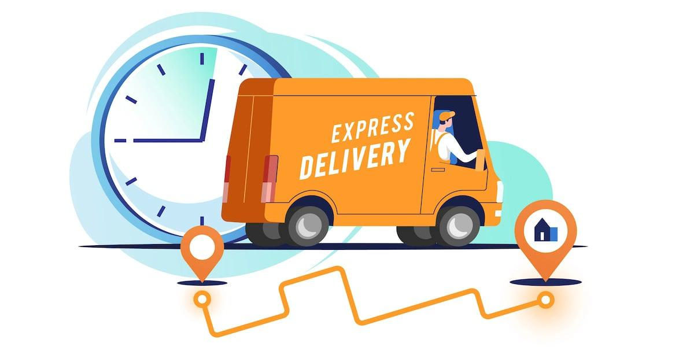

## Table of Contents

## What is last mile delivery?

Last mile delivery is the final step in getting a package from a business to a customer's doorstep. It's called "last mile" because it's the last part of the journey that the package takes. This part of delivery can be tricky because it involves navigating through neighborhoods and finding the right address, which can be time-consuming and expensive.

Companies use different ways to make last mile delivery easier and faster. Some use delivery trucks, while others might use bikes or even drones. Making sure the package gets to the right place on time is really important, so businesses are always trying to find new and better ways to do it. This can help save money and make customers happy.

## Why is last mile delivery important in customer reach?

Last mile delivery is really important because it's the final step that connects businesses with their customers. When a package arrives on time and in good shape, it makes the customer happy. This is the moment when the customer's experience with the company ends, so it's crucial to get it right. If the delivery goes well, customers are more likely to shop with that company again and tell their friends about it.

On the other hand, if the last mile delivery fails, it can make customers unhappy. They might get their package late, or it might be damaged. This can make them not want to buy from that company again. Because of this, businesses work hard to make their last mile delivery as good as possible. They want to keep their customers happy and coming back for more.

## What are the common challenges faced in last mile delivery?

Last mile delivery can be tricky because it's hard to find the right address in busy neighborhoods. There are lots of houses and buildings close together, and sometimes the streets are narrow. Delivery people might have to deal with traffic, parking problems, and even bad weather. All of these things can make it take longer to get the package to the customer.

Another challenge is that last mile delivery can be expensive. Companies have to pay for gas, vehicles, and the time it takes for their workers to deliver each package. If they're delivering to a lot of different places, it can add up quickly. To save money, some companies try to deliver more packages at once, but this can make it harder to get everything to the right place on time.

Sometimes, customers aren't home when the delivery arrives, which can cause more problems. The package might need to be left somewhere safe, or the delivery person might have to come back later. This can slow things down and cost more money. Companies are always trying to find new ways to make last mile delivery easier and cheaper, but it's still a big challenge.

## How does last mile delivery impact customer satisfaction?

Last mile delivery is really important for making customers happy. When a package arrives on time and in good shape, customers feel good about the company. They are more likely to shop there again and tell their friends about their good experience. On the other hand, if the delivery is late or the package is damaged, customers can get upset. They might not want to buy from that company again and could tell others about their bad experience.

Because last mile delivery is so important, companies work hard to make it better. They try different ways to deliver packages faster and cheaper, like using bikes, drones, or special delivery trucks. When companies get it right, customers are happy and keep coming back. But if there are problems, like traffic or bad weather, it can make things harder and customers might not be as satisfied. So, last mile delivery is a big part of keeping customers happy and coming back for more.

## What technologies are used to optimize last mile delivery?

Companies use different technologies to make last mile delivery better. One way is using GPS and route optimization software. This helps delivery drivers find the fastest and easiest way to get to each address. It saves time and gas, which can save money too. Another technology is real-time tracking, which lets customers see where their package is and when it will arrive. This makes customers feel more in control and can make them happier.

Some companies also use drones and autonomous vehicles to deliver packages. Drones can fly over traffic and get to hard-to-reach places quickly. Autonomous vehicles, like self-driving cars or robots, can work without a human driver, which can save money and time. These technologies are still new, but they could make last mile delivery a lot easier in the future.

Other technologies include smart lockers and smart home devices. Smart lockers are secure places where customers can pick up their packages at a time that's good for them. This can help if the customer isn't home during the day. Smart home devices, like doorbells with cameras, can let the delivery person know if someone is home or where to leave the package safely. All these technologies help make last mile delivery faster, cheaper, and more reliable, which is good for both the company and the customer.

## What are the different last mile delivery models?

There are different ways companies can do last mile delivery. One way is called the traditional model, where a company uses its own trucks and drivers to bring packages to customers. This can be good because the company has a lot of control over the delivery process. But it can also be expensive and hard to manage, especially if the company is delivering to a lot of different places.

Another way is called the crowdsourced model. In this model, companies like Uber or Lyft use regular people to deliver packages. These people use their own cars and can pick up and drop off packages when they're already out driving. This can be cheaper for the company and faster for the customer, but it can be hard to make sure the delivery is always on time and safe.

A third way is the third-party logistics (3PL) model. In this model, a company hires another company that's really good at delivering things to handle the last mile delivery. This can help the company focus on making and selling their products, while the 3PL company takes care of getting the packages to the customers. It can save money and time, but the company has less control over the delivery process.

## How do logistics companies measure the efficiency of last mile delivery?

Logistics companies measure the efficiency of last mile delivery by looking at how fast and how well they can get packages to customers. One important thing they look at is the delivery time. They want to know how long it takes from when the package leaves the warehouse to when it arrives at the customer's door. If the delivery time is short, it means the last mile delivery is working well. They also check how often packages are delivered on time. If most packages arrive when they're supposed to, that's a good sign that the delivery process is efficient.

Another way they measure efficiency is by looking at the cost. They want to know how much it costs to deliver each package. If the cost is low, it means they're doing a good job of keeping expenses down. They also look at how many packages they can deliver with each trip. If they can deliver a lot of packages in one go, it saves time and money. By keeping an eye on these things, logistics companies can see if their last mile delivery is working well and find ways to make it even better.

## What role does data analytics play in improving last mile delivery?

Data analytics helps make last mile delivery better by looking at a lot of information to find patterns and problems. Companies can see things like which routes take the longest, where traffic is usually bad, and when customers are most likely to be home. By understanding this information, they can plan better routes for their delivery drivers, which saves time and gas. They can also figure out the best times to deliver packages so they're more likely to reach customers when they're home.

Using data analytics also helps companies see if their delivery methods are working well. They can track how often packages arrive on time and how happy customers are with the service. If they find problems, like a lot of late deliveries in one area, they can fix them quickly. This makes the whole delivery process smoother and more reliable. By using data to make smart choices, companies can make last mile delivery faster, cheaper, and better for everyone.

## How can sustainability be integrated into last mile delivery practices?

Sustainability can be added to last mile delivery by using eco-friendly vehicles like electric trucks or bikes. These vehicles don't use gas, so they don't put as much pollution into the air. Companies can also plan their delivery routes better to save gas and time. By grouping deliveries together and using smart software, they can make fewer trips and use less fuel. Another way to be more sustainable is to use packaging that can be recycled or reused. This helps cut down on waste and is better for the environment.

Companies can also encourage customers to pick up their packages from nearby locations instead of having them delivered to their homes. This can save a lot of trips and reduce the carbon footprint of last mile delivery. Using technology like drones or autonomous vehicles can also help because they use less energy than traditional delivery trucks. By thinking about the environment and making small changes, companies can make last mile delivery more sustainable and help protect the planet.

## What are the future trends in last mile delivery?

In the future, last mile delivery will see a lot of changes to make it faster and better for the environment. One big trend is the use of drones and robots to deliver packages. Drones can fly over traffic and get to hard-to-reach places quickly, while robots can move around cities without needing a human driver. This can save time and reduce the pollution from delivery trucks. Another trend is the use of electric vehicles, like electric bikes and trucks, which don't use gas and are better for the environment. Companies will also use more smart technology to plan the best routes and make sure packages arrive on time.

Another important trend is the focus on sustainability. Companies will try to use less packaging and make sure what they do use can be recycled or reused. They might also encourage customers to pick up their packages from nearby locations instead of having them delivered to their homes. This can cut down on the number of trips delivery vehicles need to make, which is good for the environment. As technology gets better, companies will use data to make smarter choices about how to deliver packages in the most efficient and eco-friendly way possible.

## How do urban and rural last mile delivery strategies differ?

Last mile delivery in urban areas is different from rural areas because cities have a lot more people and buildings close together. In cities, delivery companies often use smaller vehicles like bikes or electric scooters to navigate through busy streets and traffic. They also use smart technology to plan the best routes and avoid traffic jams. Urban areas might have more options for customers to pick up their packages at nearby locations, like smart lockers or stores, which can make delivery faster and easier. The challenge in cities is dealing with traffic and finding parking, but the close distance between stops can make deliveries quicker.

In rural areas, last mile delivery is different because houses are spread out and far apart. Delivery vehicles might need to travel longer distances to reach each customer, which can take more time and use more gas. Because of this, companies might use bigger trucks that can [carry](/wiki/carry-trading) more packages at once to make the trip worth it. Rural areas might not have as many options for package pickup, so home delivery is more common. The challenge in rural areas is the longer travel time and the cost of fuel, but there's usually less traffic to deal with, which can make planning easier.

## What case studies illustrate successful last mile delivery implementations?

Amazon has been a leader in last mile delivery with their program called Amazon Prime. They use a lot of different ways to get packages to customers fast. One way is by using their own delivery trucks and drivers, which helps them control the whole process. They also use drones in some places to fly packages right to people's doors. Amazon has set up special pickup points in stores and lockers where people can get their packages when it's convenient for them. By using technology to plan the best routes and track packages in real time, Amazon makes sure that most packages arrive on time, which makes customers happy.

Another good example is UPS, which has been working on making last mile delivery better for a long time. They use smart technology to plan the best routes for their drivers, which helps them save time and gas. UPS also uses electric bikes and trucks in cities to cut down on pollution and navigate busy streets easier. They have a program called Access Point, where customers can pick up their packages at nearby locations like stores or gas stations. By focusing on being fast and good for the environment, UPS has been able to make their last mile delivery more efficient and keep their customers happy.

## Is Algo Trading being utilized in the Logistics Sphere?

Algorithmic trading, traditionally associated with financial markets, finds increasing applicability in the logistics sphere, notably for optimizing stock levels and reducing waste. By leveraging algorithmic strategies, logistics companies can streamline their operations, ensuring that inventory levels are kept in optimal balance, thereby minimizing both shortages and surpluses. This approach can be especially beneficial in managing the intricacies of supply chains, where demand fluctuations and lead times create a dynamic environment.

In logistics, algorithms can predict demand patterns by analyzing historical data combined with market trends. This predictive ability allows for more accurate forecasting of stock requirements, leading to improved inventory management. For instance, [machine learning](/wiki/machine-learning) models can be trained to recognize patterns in order volumes, allowing businesses to anticipate and meet customer demands efficiently.

To illustrate the application, consider a simple model for inventory management that minimizes costs. The economic order quantity (EOQ) model can be expressed as:

$$
EOQ = \sqrt{\frac{2DS}{H}}
$$

where:
- $D$ is the demand rate,
- $S$ is the order cost, and
- $H$ is the holding cost per unit per year.

This formula calculates the optimal order quantity that minimizes the total cost of inventory, including order and holding costs. By integrating algorithmic models, logistics companies can dynamically adjust the parameters $D$, $S$, and $H$ based on real-time data, thereby refining their EOQ and enhancing stock management.

Moreover, logistics flows can be categorized by the complexity of their supply networks, driven by vast datasets from varied sources such as warehouse sensors, transportation routes, and retail sales. Algorithms sift through these datasets to optimize delivery sequences, rerouting shipments based on current road conditions or predicting potential bottlenecks in supply chains.

Python, a versatile programming language, is widely used to implement these algorithmic solutions. Libraries such as pandas for data manipulation, scikit-learn for machine learning, and optimization tools like scipy can be employed to develop robust logistics algorithms. Below is a simplified Python snippet that demonstrates how one might use these tools to optimize logistics operations:

```python
import numpy as np
import pandas as pd
from scipy.optimize import minimize

# Sample data for demand and costs
data = {'demand': [100, 150, 200], 'order_cost': [50, 75, 100], 'holding_cost': [2, 3, 4]}
df = pd.DataFrame(data)

def total_cost(order_qty, demand, order_cost, holding_cost):
    order_qty = max(order_qty, 1)  # Avoid division by zero
    return order_cost * (demand / order_qty) + holding_cost * (order_qty / 2)

optimal_quantities = []
for i in df.index:
    res = minimize(total_cost, x0=[10], args=(df['demand'][i], df['order_cost'][i], df['holding_cost'][i]))
    optimal_quantities.append(res.x[0])

df['optimal_order_qty'] = optimal_quantities
print(df)
```

This code snippet provides a basic framework for utilizing optimization techniques to determine optimal order quantities in a logistics context. By systematically applying such [algorithmic trading](/wiki/algorithmic-trading) principles, logistics operations can achieve significant improvements in efficiency and cost reduction, thus making algorithmic trading a vital tool in the logistics innovation toolkit.

## References & Further Reading

[1]: Boysen, N., Fedtke, S., & Schwerdfeger, S. (2021). ["Last-Mile Delivery Concepts: A Survey from an Operational Research Perspective."](https://link.springer.com/content/pdf/10.1007/s00291-020-00607-8.pdf) European Journal of Operational Research.

[2]: Agatz, N., Bouman, P., & Schmidt, M. (2021). ["Optimization Approaches for the Attended Home Delivery Problem."](https://www.semanticscholar.org/paper/Optimization-Approaches-for-the-Traveling-Salesman-Agatz-Bouman/1112cb5d327e4cd50b07e353298ca5c0aa094bb5) OR Spectrum.

[3]: ["Logistics and Supply Chain Management"](https://www.netsuite.com/portal/resource/articles/erp/supply-chain-management-vs-logistics.shtml) by Martin Christopher

[4]: Bertsimas, D., & Dunn, J. (2017). ["Machine Learning Under a Modern Optimization Lens."](https://www.mit.edu/~dbertsim/papers/Machine%20Learning%20under%20a%20Modern%20Optimization%20Lens/Optimal_classification_trees_MachineLearning.pdf) Dynamic Ideas.

[5]: Wang, G., Gunasekaran, A., Ngai, E. W. T., & Papadopoulos, T. (2016). ["Big Data Analytics in Logistics and Supply Chain Management: Certain Investigations for Research and Applications."](https://www.sciencedirect.com/science/article/abs/pii/S0925527316300056) International Journal of Production Economics.