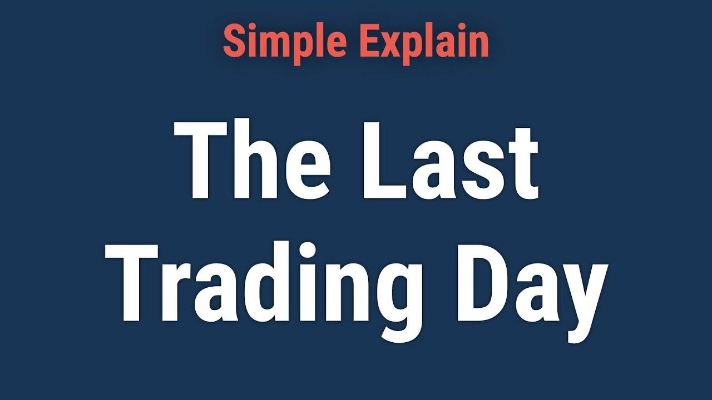

The last trading day in financial markets offers a unique and intensified setting that commands the attention of traders worldwide, particularly those engaged in options and algorithmic trading. This critical day marks the expiration of various derivative contracts, manifesting increased volatility and trading activity as participants finalize their positions.

In option trading, the last trading day holds profound significance. Options contracts, which derive value from underlying assets, require closure or rolling over to avoid unexpected exposures as expiration looms. Traders utilize this day to exploit movements in option premium influenced by underlying asset volatility and time decay, known as theta decay. The strategic significance lies in the opportunity to employ sophisticated trading strategies such as short straddle and short strangle, which aim to capitalize on the heightened market volatility and precise timing.



The rise of algorithmic trading has further transformed last trading day approaches. Algorithms enable traders to manage large volumes of transactions with unprecedented speed, precision, and neutrality, free from emotional biases. These technology-driven strategies harness complex mathematical models and pre-programmed instructions to rapidly respond to market conditions, providing significant advantages in executing expiry day trades. Algorithms are instrumental in backtesting strategies, allowing traders to optimize their approaches through historical data analysis.

This interplay between traditional trading methods and algorithmic strategies highlights a significant evolution in market engagement. Traders who marry their fundamental insights with cutting-edge technology stand to gain a competitive edge, adapting swiftly to dynamic market conditions and fortifying their decision-making processes. The confluence of these approaches underscores the importance of continuously evolving strategies that leverage the best of human expertise and technological sophistication to navigate the opportunities and challenges presented by the last trading day in financial markets.

## Table of Contents

## Understanding the Last Trading Day in Financial Markets

The last trading day in financial markets holds high significance, particularly for derivative contracts like options and futures. On this day, contracts reach their expiration, making it crucial for traders to finalize decisions on whether to close, roll over, or exercise their positions.

Derivative contracts are financial instruments whose value is derived from an underlying asset. Options, for example, offer holders the right, but not the obligation, to buy or sell an asset at a predetermined price before expiration. Similarly, futures contracts obligate the parties to transact an asset at a set price on the expiration date. The last trading day marks the final opportunity for actions pertinent to these contracts.

The last trading day serves as a pivotal point for completing or rolling over positions. For traders holding options, the decision often revolves around exercising the contract if it is in-the-money, meaning the option holds intrinsic value. If an option is out-of-the-money, holding no intrinsic value, traders may let it expire worthless or, if the market conditions are favorable, attempt strategic maneuvers such as rolling over to a future contract expiration. Rolling over a position involves closing the current contract and entering into a new one with a later expiration date, which is commonly employed in futures trading to extend exposure to the asset.

The dynamics of [liquidity](/wiki/liquidity-risk-premium), trading [volume](/wiki/volume-trading-strategy), and [volatility](/wiki/volatility-trading-strategies) are particularly pronounced on the last trading day. Liquidity refers to the ease with which assets can be bought or sold in the market without affecting their price, while trading volume indicates the number of shares or contracts traded over a specific period. Volatility represents the frequency and magnitude of price movements. On expiry days, heightened trading activity often leads to increased liquidity, although the rush to execute final trades can also contribute to erratic price swings, thereby amplifying market volatility.

Traders often exploit the last trading day to conduct final strategies that are time-sensitive. For example, strategies like the "gamma [scalping](/wiki/gamma-scalping)" may be employed to adjust delta-neutral positions in response to price movements throughout the day, capitalizing on the increased market fluctuations. Additionally, the choice of strategy is influenced by the "theta decay" effect, where the value of options diminishes as they approach expiration, a critical consideration for traders seeking to optimize their positions.

In summary, the last trading day is a fundamental component of derivative trading, necessitating strategic decision-making to navigate the complexities of the market. Through a combination of completing positions, managing risk, and adapting to volatile market conditions, traders aim to achieve optimal outcomes before contract expiration.

## Option Trading Strategies on the Last Trading Day

Option trading on the last trading day, often referred to as options expiration day, presents unique opportunities and challenges for traders seeking to optimize their portfolios. Among the myriad of strategies available, the Short Straddle and Short Strangle are particularly popular due to their potential to capitalize on predictable price movements during these volatile periods.

The Short Straddle strategy involves selling both a call and a put option at the same strike price with the same expiration date. This strategy is best employed when a trader anticipates negligible movement in the underlying asset price, resulting in a profit from the premium received upon selling these options. As the expiration date approaches, time decay, known as theta, becomes a critical component in option pricing. Theta decay accelerates as expiration nears, eroding the value of options and benefiting the seller. Traders seek to exploit this decay, banking on the possibility that the underlying asset's price remains close to the strike price, allowing both options to expire worthless. The profitability of a Short Straddle is maximized when the securities remain stable, enabling traders to pocket the entire premium collected from the options sold.

Conversely, the Short Strangle strategy involves selling out-of-the-money call and put options with the same expiration date but different strike prices. This strategy also profits from minimal price movement but provides a wider price range for profitability due to its lower breakeven points in comparison to the Short Straddle. The trade-off is a reduced premium received; however, the risk is more effectively controlled since the asset can fluctuate within a defined window. In managing both strategies, traders must meticulously monitor theta decay alongside other market indicators to optimize timing and execution.

Traders often leverage market conditions emerging on the last trading day to fine-tune these strategies. For example, heightened volatility typical on expiry days can present risks; however, it can also increase option premiums, enhancing potential returns for option writers. Successful implementation requires a nuanced understanding of market trends and precise timing to hedge against adverse movements. For instance, a trader employing a Short Strangle might adjust strike prices or implement stop-loss orders to mitigate unforeseen price shifts, thus enhancing risk management and potential returns.

Historical examples provide valuable insights into these strategies' effectiveness. Notably, periods of low volatility preceding expiration have historically allowed profitable execution of Short Straddles, while more unpredictable markets have occasionally favored Short Strangles due to their wider margin for error. For consistent success, traders are advised to remain adaptable, continuously assessing market conditions and adjusting their strategies accordingly. 

In conclusion, the success of options trading strategies on the last trading day hinges upon a thorough understanding of market dynamics, particularly theta decay, and the ability to effectively manage risk while capitalizing on fleeting opportunities in a rapidly changing environment.

## Algorithmic Trading: Advantages on Expiry Day

Algorithmic trading plays a crucial role on expiry days by efficiently handling and executing large volumes of trades, offering significant advantages over traditional methods. These advantages include increased speed, enhanced precision, and the elimination of emotional biases often present in manual trading.

The primary benefit of [algorithmic trading](/wiki/algorithmic-trading) is its ability to process and execute trades at extraordinary speeds. Algorithms can analyze multiple market variables and execute transactions in milliseconds, something that is beyond human capability. This rapid execution is especially advantageous on expiry days when market conditions are volatile, and opportunities can arise and dissipate quickly. For instance, algorithms can capture price inefficiencies and [arbitrage](/wiki/arbitrage) opportunities that may vanish within seconds.

Precision is another critical advantage of algorithmic trading. Algorithms operate based on predefined criteria and conditions, minimizing human errors and ensuring consistency in trade execution. This precision allows for optimizing strategies based on specific market conditions observed on expiry days. Traders can set precise entry and [exit](/wiki/exit-strategy) points, ensuring that trades are executed only when market conditions align perfectly with their strategic objectives.

Moreover, algorithmic trading removes the emotional component from trading decisions. Human traders are prone to emotions such as fear and greed, which can lead to impulsive decision-making, particularly under the pressure of expiry day volatility. Algorithms, in contrast, adhere strictly to their programmed logic, making unemotional and rational decisions. This emotional neutrality is particularly beneficial during periods of intense market activity.

Traders harness the power of algorithms by developing and [backtesting](/wiki/backtesting) strategies tailored for expiry trading. Backtesting involves running a trading strategy on historical data to evaluate its potential performance. By doing so, traders can refine their strategies to improve profitability and reduce risks associated with expiry days. For example, Python libraries like Backtrader or Zipline can be used for backtesting algorithmic strategies, enabling traders to simulate how their strategies would have performed in past market conditions.

```python
import backtrader as bt

class MyStrategy(bt.Strategy):
    def next(self):
        # Define the logic for entry and exit points
        if self.data.close[0] > self.data.close[-1]:  # sample condition
            self.buy(size=10)

cerebro = bt.Cerebro()
cerebro.addstrategy(MyStrategy)
data = bt.feeds.YahooFinanceCSVData(dataname='historical_data.csv')
cerebro.adddata(data)
cerebro.run()
cerebro.plot()
```

The synergy between algorithmic and conventional trading enhances the optimization of strategies for the last trading day. While algorithms provide speed and precision, human traders contribute their understanding of broader market contexts and strategic flexibility. By integrating automated systems with traditional insights, traders can capitalize on both systematic and discretionary opportunities. For example, a trader might use an algorithm to execute trades but relies on manual oversight to adapt to unexpected news or geopolitical events that the algorithm might not fully comprehend.

Incorporating algorithmic trading on expiry days allows for leveraging technology to gain a competitive edge. By aligning automated processes with human judgment, traders can more effectively navigate the complexities and volatilities of financial markets at the culmination of derivative contracts.

## Case Studies: Real-World Implications and Results

Examining historical data and backtested results is crucial in evaluating the effectiveness of expiry [day trading](/wiki/day-trading-spy) strategies. Several studies and real-world scenarios highlight the potential benefits and challenges of engaging in trading activities on the last trading day. Successful applications of algorithmic trading strategies, in particular, have showcased their effectiveness in navigating the complexity and volatility typically seen on these critical days.

### Historical Data and Backtested Results

The analysis of historical data provides valuable insights into how specific trading strategies perform on expiration days. Backtesting these strategies against historical market conditions allows traders to estimate potential outcomes and optimize their approaches accordingly. For instance, strategies such as the Short Straddle and Short Strangle, which involve selling both call and put options at the same strike price, often aim to capitalize on the rapid decay of option premiums due to theta decay as expiration approaches.

A backtesting study encompassing data over several years might show that these strategies often perform well in stable, low-volatility conditions. However, during high volatility scenarios, the risk of substantial losses increases if the market moves significantly in one direction. Hence, traders may implement protective measures, such as stop-loss orders, to mitigate potential downsides.

### Successful Applications of Algorithmic Trading Strategies

Algorithmic trading has become increasingly prominent in implementing expiry day strategies due to its capacity to process vast amounts of data with speed and precision. For example, algorithms can be designed to detect patterns and execute trades based on predefined criteria within milliseconds, offering a competitive edge in fast-paced market environments.

A case study involving algorithmic trading during a volatile expiry day might reveal how algorithms can be leveraged to execute trades that capitalize on small price inefficiencies across multiple exchanges. These high-frequency trading algorithms enable traders to manage risk more effectively by swiftly reacting to market changes and dynamically adjusting positions.

### Detailed Market Behavior and Trader Actions

The behavior of markets on last trading days often exhibits heightened liquidity and volatility due to the closing of positions and adjustments by traders. Detailed analysis reveals that trader actions, such as rolling over futures or options contracts to avoid physical delivery, are prevalent. Additionally, some traders may engage in speculative activities, trying to profit from anticipated market movements.

An analytical approach might involve examining specific trading sessions where market behavior deviated from the norm, providing insights into how unexpected events or news releases affected trading volumes and price movements. This analysis can be instrumental in refining future trading strategies, particularly in anticipating and responding to market shocks.

### Insights from Case Studies for Future Strategy Adoption

By studying successful trading implementations and outcomes, traders can derive valuable lessons for future expiry day strategies. For instance, it might become apparent that traders who seamlessly combined conventional trading insights with algorithmic models were able to achieve superior results compared to those relying solely on traditional methods.

By integrating the insights gleaned from these case studies, traders can adopt a more balanced and informed approach to expiry day trading. Learning from past successes and failures not only enhances the effectiveness of their strategies but also reinforces the importance of continuous innovation and adaptation to maintain a competitive edge in the dynamic financial markets.

## Risk Management and Considerations

Trading on the last trading day presents distinct challenges, primarily due to heightened volatility. This volatility arises from the convergence of various factors such as contract expirations, adjustments by institutional investors, and a surge in trading volume. These circumstances demand robust risk management techniques to safeguard against potential losses and capitalize on opportunities.

A fundamental risk management tool employed by traders is the stop-loss order. This mechanism involves setting a predefined price level at which a security is automatically sold, limiting potential losses if the market moves unfavorably. For instance, if a trader holds a position in a volatile option contract, a stop-loss order can help mitigate risks by ensuring the position is exited if a certain price threshold is breached.

Dynamic hedging represents another critical strategy used to manage risk during periods of market turbulence. This technique entails continuously adjusting a trader's portfolio to maintain a desired level of risk exposure. By modifying the portfolio's delta, a measure of sensitivity to price changes in the underlying asset, traders can effectively control risk and stabilize returns. Dynamic hedging might involve buying or selling additional contracts or utilizing other derivatives to offset potential losses.

Comprehensive market analysis becomes indispensable in formulating strategies that can withstand volatile market conditions. Traders must analyze historical data, assess market trends, and monitor real-time price movements to make informed decisions. Tools such as technical indicators and statistical models can aid in predicting price movements and identifying optimal entry and exit points. By understanding and anticipating market patterns, traders can develop adaptive strategies that respond effectively to fluctuations.

Balancing risk and reward during periods of market unpredictability requires traders to maintain a disciplined approach. It is crucial to avoid making impulsive decisions driven by emotional reactions to market movements. Instead, traders should rely on well-researched strategies, remain patient, and execute trades grounded in data and analysis. This disciplined approach not only reduces the risk of substantial losses but also increases the likelihood of achieving consistent, profitable outcomes.

To illustrate, consider a trading scenario where an option strategy is implemented with a focus on mitigating risk through dynamic hedging. This can be accomplished using Python to automatically adjust delta exposure based on real-time data:

```python
import numpy as np

# Sample data: asset prices and volatility
prices = np.array([...])  # Array of asset prices
volatility = 0.2          # Assume a volatility value

# Function to calculate delta
def calculate_delta(prices, volatility):
    delta = np.gradient(prices) * volatility
    return delta

# Adjust portfolio based on delta
delta = calculate_delta(prices, volatility)
threshold = 0.05
hedge_positions = -np.sign(delta) * (np.abs(delta) >= threshold)

# Output hedge positions
print(hedge_positions)
```

In this example, the code calculates the delta of a trading portfolio and automatically determines the hedge positions needed to manage risk. By implementing such automated systems, traders can efficiently respond to market changes and optimize their last trading day strategies. Implementing these risk management and strategic techniques ensures that traders can navigate the complexities of expiry day trading with greater confidence and control.

## Conclusion

Expiry day trading in financial markets offers a unique blend of opportunities and challenges. This environment is characterized by heightened volatility and liquidity changes, providing a fertile ground for traders to capitalize on price movements. However, it also presents significant risks that necessitate strategic planning and precise execution.

One of the significant advantages on the last trading day is the use of algorithmic trading. Algorithms provide unmatched speed, accuracy, and emotional neutrality, which are crucial for executing trades effectively during periods of high market activity. By employing algorithms, traders can process large volumes of data and execute complex strategies with precision, which is vital for optimizing outcomes on expiry days.

The role of technology in trading has transformed traditional approaches, allowing for better decision-making through enhanced tools and analytics. Traders are encouraged to leverage these advancements along with market insights to refine their strategies continually. The development and backtesting of algorithms ensure that trading plans are robust and adaptive to market conditions.

The importance of refining and adapting trading strategies cannot be overstated. In dynamic markets, where variables are constantly shifting, a static approach can be detrimental. Continuous evaluation and adjustment of strategies to reflect changing market conditions can maximize success and mitigate risks effectively. Thus, the integration of technological advances and market intelligence is essential for sustainable trading success on the last trading day.

## References & Further Reading

[1]: Bergstra, J., Bardenet, R., Bengio, Y., & Kégl, B. (2011). ["Algorithms for Hyper-Parameter Optimization."](https://dl.acm.org/doi/10.5555/2986459.2986743) Advances in Neural Information Processing Systems 24.

[2]: ["Advances in Financial Machine Learning"](https://www.amazon.com/Advances-Financial-Machine-Learning-Marcos/dp/1119482089) by Marcos Lopez de Prado

[3]: ["Evidence-Based Technical Analysis: Applying the Scientific Method and Statistical Inference to Trading Signals"](https://www.amazon.com/Evidence-Based-Technical-Analysis-Scientific-Statistical/dp/0470008741) by David Aronson

[4]: ["Machine Learning for Algorithmic Trading"](https://github.com/stefan-jansen/machine-learning-for-trading) by Stefan Jansen

[5]: ["Quantitative Trading: How to Build Your Own Algorithmic Trading Business"](https://www.amazon.com/Quantitative-Trading-Build-Algorithmic-Business/dp/1119800064) by Ernest P. Chan