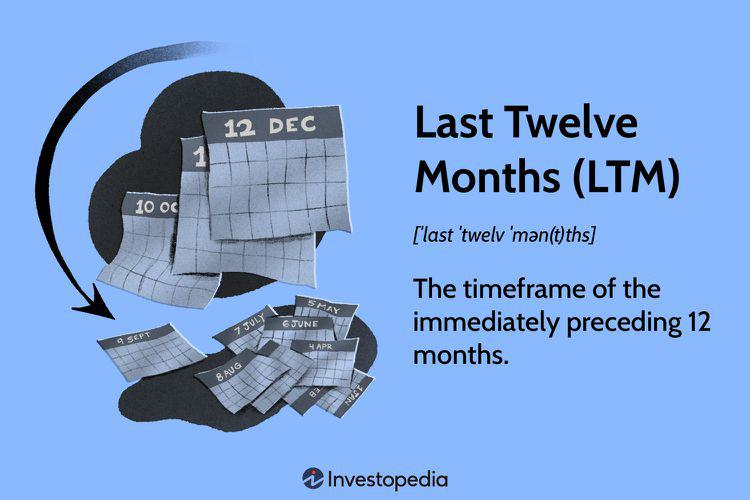

The Last Twelve Months (LTM) analysis is a crucial tool in financial metrics evaluation, offering investors and traders a current view of a company's financial health by focusing on the most recent 12-month period. Unlike traditional fiscal year analyses that may overlook recent financial developments, LTM remains relevant by continuously rolling, thereby providing the most up-to-date financial insights. This approach is instrumental in assessing performance trends, smoothing out seasonal variations, and furnishing a comprehensive financial perspective over a recent and consistent timeframe, in which stakes are high and decisions must be informed by the latest data.

As algorithmic trading gains prominence, leveraging vast datasets to execute trades at unprecedented speed and precision, understanding a company's real-time financial performance becomes imperative. Algorithmic trading systems, driven by complex algorithms and advanced analytics, require accurate and timely data inputs to inform and execute strategies effectively. Here, LTM analysis plays an integral role, serving as a critical input that helps traders and their platforms evaluate a company's trajectory over the past year. By incorporating LTM metrics, traders gain insights not only into the financial health of companies but also into their ongoing financial trends, which are essential for making informed trading decisions.



The increasing intersection between LTM analysis and automated trading systems reflects a broader trend in finance where precision and timeliness of data can significantly influence trading success. These systems utilize LTM data to enhance predictive modeling and identify potential investment opportunities or risks, thereby refining financial analysis and valuation processes. As the digital trading landscape continues to evolve, the synergy between LTM analysis and algorithmic trading persists, underscoring the importance of consistent data evaluation over differing market cycles. This introduction sets the framework for exploring how LTM analysis can be effectively integrated into contemporary trading strategies, enriching them with nuanced financial insights.

## Table of Contents

## Understanding Last Twelve Months (LTM) Analysis

The Last Twelve Months (LTM) analysis is a financial metric that represents the sum of a company's financial data over the most recent twelve-month period. Unlike the traditional fiscal year analysis, which adheres to a company's established financial reporting calendar, LTM offers a continuous, updated view of performance by shifting the period under review with each new month. This approach provides a more relevant and timely perspective on a company's current financial health.

LTM analysis is particularly valued for its ability to incorporate the latest available data, mitigating the lag that can occur with fiscal year-end financial reporting. By focusing on the most current twelve-month window, LTM allows stakeholders to evaluate a company's performance, capturing trends and changes that might not be as visible in older fiscal year data. This is crucial for assessing ongoing operations, as it reflects any recent strategic initiatives or market dynamics that could have significantly impacted financial outcomes.

One of the primary benefits of LTM analysis is its capacity to smooth out seasonal fluctuations. Businesses often experience varying levels of activity depending on the time of year. For example, retail companies typically see higher sales during holiday seasons, while travel industries may peak during summer months. LTM helps to neutralize these seasonal effects by incorporating a full year’s activity, thus providing a more representative picture of “normalized” performance.

Moreover, LTM offers a rolling view of a company's performance, thereby facilitating continuous monitoring and comparison against peers or industry standards. Instead of waiting for the end of a fiscal period to make informed decisions, investors, analysts, and managers can use the rolling nature of LTM metrics to stay updated on financial performance and adapt strategies accordingly.

Calculating LTM figures typically involves summing up the financial data from the past four quarters. For instance, if one were to calculate the LTM revenue, they would take the revenue figures from each of the previous four quarters and aggregate them to form the LTM revenue figure. This methodology ensures that the latest data is always incorporated, maintaining the relevance and accuracy of financial analysis.

## Key Financial Metrics in LTM

In Last Twelve Months (LTM) analysis, several key financial metrics play a crucial role in evaluating a company's recent performance. Among these, revenue, EBITDA (Earnings Before Interest, Taxes, Depreciation, and Amortization), and net income stand out as fundamental indicators.

### Revenue
Revenue, often called sales or turnover, represents the total income generated by a company from its normal business operations. In an LTM analysis, revenue is calculated by summing up the sales figures from each of the last twelve months. This provides a rolling picture of the company's ability to generate income, smoothing out seasonal variations and offering a more current financial snapshot than conventional fiscal year data.

### EBITDA
EBITDA is a key measure of operational performance. It excludes non-operational factors like depreciation, amortization, taxes, and interest expenses, offering a clearer view of a company's operating results. Calculating LTM EBITDA involves aggregating the EBITDA figures from the preceding twelve months. This metric is valuable because it highlights the operational profitability of a company without the noise from accounting and financial deductions, facilitating better comparisons across similar companies or sectors.

### Net Income
Net income, or profit, reflects the total earnings of a company after all expenses, taxes, and costs are deducted from total revenue. For LTM analysis, net income is derived by summing the net profits reported in each of the last twelve months. This metric is crucial as it represents the bottom line and indicates the company's efficiency in converting revenue into actual profit. Tracking LTM net income helps investors and analysts gauge the sustainability of a company’s profitability.

### Importance and Calculation
The calculation of these LTM metrics involves straightforward aggregation:

- **Revenue LTM:** \[ \text{Revenue}_{\text{LTM}} = \sum_{i=1}^{12} \text{Revenue}_{i}
$$
- **EBITDA LTM:** \[ \text{EBITDA}_{\text{LTM}} = \sum_{i=1}^{12} \text{EBITDA}_{i}
$$
- **Net Income LTM:** \[ \text{Net Income}_{\text{LTM}} = \sum_{i=1}^{12} \text{Net Income}_{i}
$$

These LTM metrics are vital because they provide a dynamic view of financial conditions, reducing the impact of seasonal or irregular fluctuations, thereby offering a more stable trend analysis. For instance, a company might experience increased revenue during a particular quarter due to seasonal demand, which can skew fiscal year analysis. LTM analysis mitigates this by considering a complete year in its assessment, presenting a balanced perspective.

### Comparative Evaluation
In comparative evaluations, LTM metrics are exceptionally valuable. Analysts use revenue, EBITDA, and net income from LTM calculations to benchmark against industry peers. This assessment helps determine a company's competitive position and operational efficiency. For instance, an LTM EBITDA margin (EBITDA divided by revenue) can be contrasted with the industry average to assess operational efficiency. Similarly, calculating price-to-earnings (P/E) ratios using LTM net income provides a current valuation tool, ensuring that investors are informed by recent performance data rather than outdated annual reports.

These metrics collectively guide investment decisions, lending evaluations, and strategic planning. They align financial analysis more closely with ongoing market conditions and enable a company’s performance to be assessed against industry standards and peers in real-time. Understanding and employing these LTM metrics is essential for informed decision-making in a rapidly evolving financial landscape.

## Algorithmic Trading and LTM Metrics

Algorithmic trading platforms use Last Twelve Months (LTM) data as a crucial component in developing and refining trading strategies. LTM metrics provide algorithmic traders with the most up-to-date financial information, which is essential for making informed decisions in a fast-paced trading environment. This approach offers several advantages, including the ability to analyze real-time data effectively and enhance decision-making processes.

One of the primary benefits of integrating LTM data into [algorithmic trading](/wiki/algorithmic-trading) lies in its capacity to provide a continuous and current perspective on a company's financial health. Unlike traditional fiscal year analyses, which may become outdated, LTM reflects the most recent 12-month period. This rolling view captures recent shifts and trends in a company's performance, aiding in the identification of trends and investment opportunities that may not be apparent with older data.

Incorporating LTM metrics into algorithmic models allows traders to respond promptly to emerging market trends. Real-time analysis of LTM data can pinpoint shifts in revenue, EBITDA, and net income, facilitating quicker adaptation to new market conditions. With accurate and updated inputs, algorithms can identify potential growth signals or warning signs, offering a competitive edge in making strategic trades.

For example, an algorithm might utilize LTM data to calculate key performance indicators (KPIs) like price-to-earnings (P/E) ratio or debt-to-equity ratio, which are crucial in assessing the valuation and financial stability of a company. Python scripts can be employed to automate these computations, ensuring that the trading model is always working with the latest financial information. Here is a simplified Python code snippet demonstrating how LTM metrics can be computed and used:

```python
import pandas as pd

# Sample data: revenue and net income for each quarter
data = {'Quarter': ['Q1', 'Q2', 'Q3', 'Q4'],
        'Revenue': [200, 220, 250, 275],  # in millions
        'Net Income': [20, 25, 22, 30]}  # in millions

# Create a DataFrame
df = pd.DataFrame(data)

# Calculate LTM Revenue and Net Income
ltm_revenue = df['Revenue'].sum()
ltm_net_income = df['Net Income'].sum()

# Output the results
print(f"LTM Revenue: {ltm_revenue} million")
print(f"LTM Net Income: {ltm_net_income} million")
```

By continuously updating these metrics, algorithmic trading systems can better predict financial trends. This predictive capacity is instrumental in identifying opportunities, such as potential stock price movements resulting from changes in a company's financial health or shifts in market sentiment. Moreover, LTM data can highlight companies that are consistently improving over time, aiding traders in making long-term investment decisions.

In summary, the use of LTM metrics in algorithmic trading enhances the ability to conduct real-time data analysis, improves decision-making, and aids in forecasting market trends. It allows traders to seize opportunities and manage risks more effectively, leveraging the most current financial insights to stay ahead in competitive trading scenarios.

## Challenges and Limitations of LTM in Algorithmic Trading

Incorporating Last Twelve Months (LTM) data into algorithmic trading poses specific challenges. One of the primary issues is the reliance on a backward-looking time frame, which may not adequately account for short-term market anomalies. These anomalies can include sudden market swings due to macroeconomic factors, geopolitical events, or unforeseen market movements that can significantly affect stock prices and trading volumes. As LTM data inherently averages performance over the past year, immediate short-term changes may not be captured, potentially leading to suboptimal trading decisions.

Extraordinary events, such as major corporate restructuring, legal settlements, or unexpected economic shifts, can also skew LTM metrics, affecting algorithmic interpretations. For instance, an unusual increase in revenue due to a one-time event may lead to a misleading portrayal of a company's ongoing performance if not adjusted accurately. Consequently, traders relying on LTM for algorithmic strategies may face challenges if these extraordinary occurrences are not accounted for, resulting in discrepancies between expected and actual performance.

To mitigate these limitations, integrating advanced data analytics and [machine learning](/wiki/machine-learning) techniques can be beneficial. Techniques such as anomaly detection can help identify deviations from typical patterns, allowing algorithms to adjust trading strategies dynamically. Additionally, employing rolling averages and smoothing techniques can offer a more responsive view of recent months' performance trends, helping to counteract the impact of abnormal data points within the LTM framework.

Furthermore, traders should consider incorporating a multi-metric approach, blending LTM data with shorter-term indicators like quarterly results or key weekly metrics. This can provide a more balanced perspective by capturing both the long-term trends and recent shifts in performance. Regularly updating and recalibrating the models at shorter intervals can enhance the reliability of trading signals, ensuring that trading algorithms remain aligned with current market realities.

Ultimately, while LTM analysis provides valuable insights into a company's financial health, it should be complemented with real-time data analysis and context-aware adjustments to maintain the accuracy and effectiveness of algorithmic trading models. By acknowledging and addressing these challenges, traders can enhance their methodologies to better exploit the nuanced data provided by LTM metrics.

## LTM Metrics and Trading Comparables

LTM (Last Twelve Months) metrics play a crucial role in trading comparables and valuations within algorithmic trading models. These metrics are used for assessing a company's financial health over the most recent twelve months, providing an up-to-date and comprehensive view of its performance. In trading comparables, LTM data offers a way to create benchmarks and evaluate trading performance consistently over time.

To understand the application of LTM metrics in trading comparables, one must first recognize their ability to smooth out seasonal variations and short-term fluctuations. By considering performance metrics over the last twelve months, LTM metrics provide a moving annual total that reflects the company's current financial state while mitigating impacts from cyclical trends or extraordinary events in previous fiscal periods.

In valuation models, LTM metrics like revenue, EBITDA, and net income offer a standardized method to compare firms operating in similar industries. The calculations usually involve summing financial data points from each month over the last year, enhancing the accuracy of peer evaluations. This comparability supports traders and analysts in making informed decisions by identifying trends and disparities in performance. It is particularly useful in algorithmic trading, where strategic decision-making requires precise and current data analysis to predict market movements effectively.

For instance, consider a simple Python example to calculate the LTM revenue of a hypothetical company:

```python
monthly_revenues = [10000, 12000, 11500, 13000, 12500, 13500, 14000, 14500, 13000, 12800, 13400, 15000]
ltm_revenue = sum(monthly_revenues)
print(f"LTM Revenue: ${ltm_revenue}")
```

This code snippet demonstrates how to compute LTM revenue using the sum of monthly revenues over the last year, providing a clear benchmark for performance evaluation.

The strategic use of LTM comparables involves leveraging these benchmarks for decision-making and risk assessment. Traders employ LTM metrics to establish industry benchmarks, facilitating the comparison of a company's valuation and performance against its competitors. This can aid in detecting overvalued or undervalued assets, thus shaping investment strategies.

Moreover, LTM data is instrumental in risk assessment, particularly for algorithmic traders. Since LTM analyzes the most recent financial performance, it incorporates any potential market [volatility](/wiki/volatility-trading-strategies) or sudden economic changes into its computations. This helps algorithmic trading systems to adapt rapidly to new trends, enhancing prediction accuracy and mitigating risk.

In conclusion, LTM metrics are invaluable in creating robust trading comparables and valuation models, ensuring that traders can rely on the latest performance indicators for effective strategy development and risk mitigation in competitive financial markets.

## Best Practices for Incorporating LTM into Algorithmic Trading

Incorporating the Last Twelve Months (LTM) analysis into algorithmic trading can significantly enhance the accuracy and effectiveness of trading models. To achieve this, traders should implement several best practices, ensuring that LTM data is embedded effectively within their automated systems.

Firstly, maintaining regular updates and adjustments to LTM figures is crucial for generating accurate trading signals. As financial data is dynamic, failing to update LTM figures can lead to outdated information, reducing the reliability of trading decisions. Traders should automate data inputs at frequent intervals to reflect the most current financial performance. This can be implemented via API integrations that automatically pull the latest financial statements into the trading algorithms.

Consider a Python script example that fetches the latest revenue data from a financial API:

```python
import requests

def update_revenue_data(ticker):
    api_url = f"https://financial-api.com/data/{ticker}/revenue"
    response = requests.get(api_url)
    if response.status_code == 200:
        return response.json()['latest_revenue']
    else:
        return None

latest_revenue = update_revenue_data('AAPL')
print(f"Latest Revenue: {latest_revenue}")
```

This script automatically retrieves the newest revenue data, a critical component of LTM analysis, facilitating timely adjustments in the trading models.

Moreover, incorporating contextual and sector-based analysis is essential when utilizing LTM metrics. Different sectors exhibit distinct seasonal trends and economic cycles that can impact financial performance indicators. As such, traders must adapt LTM analysis to account for these variations. For instance, a trader analyzing the retail sector should consider peak sales periods, like holidays, when interpreting LTM data.

A comprehensive approach would involve creating sector-specific models that adjust weightings and interpretations of LTM metrics based on the characteristics of each industry. For example, the revenue weight might be increased during holiday seasons for a retailer, whereas it might be less significant for a technology company during the same period.

An example of integrating sector-based insights could look like this in a Python function:

```python
def sector_based_weighting(sector, ltm_metric):
    if sector == "retail":
        # Increase importance during holiday season
        return ltm_metric * 1.2
    elif sector == "technology":
        # Less pronounced weight change
        return ltm_metric * 1.05
    else:
        # Default adjustment
        return ltm_metric

adjusted_metric = sector_based_weighting("retail", 500)
print(f"Adjusted LTM Metric: {adjusted_metric}")
```

This method accounts for variable economic conditions within different sectors, enabling a nuanced application of LTM analysis in algorithmic strategies.

In summary, the effective incorporation of LTM metrics into algorithmic trading requires continuous data updating and a profound understanding of sector-specific dynamics. By automating data refreshes and considering contextual factors, traders can leverage LTM analysis to improve strategy accuracy, adapting swiftly to ever-changing market conditions.

## Conclusion

The integration of Last Twelve Months (LTM) analysis into algorithmic trading strategies significantly bolsters traders' capacity to make well-informed decisions. By utilizing LTM metrics, traders can access the most recent financial data, thereby gaining a clearer understanding of a company's current financial health compared to traditional fiscal year analyses. This increased precision enables algorithmic trading models to incorporate real-time data, enhancing predictive accuracy and trend identification.

LTM analysis refines financial valuation efforts by providing a rolling view of performance, smoothing out seasonal fluctuations and anomalies that can distort short-term data. Traders can better assess performance by comparing LTM metrics such as revenue, EBITDA, and net income against industry standards. These comparisons enable traders to form actionable insights into a company's relative standing in its sector. Moreover, incorporating LTM data into algorithmic strategies allows for the creation of robust benchmarks, which are pivotal in measuring trading performance over consistent periods.

Despite its benefits, traders must remain vigilant about the inherent challenges of LTM analysis. Extraordinary events or market anomalies can skew LTM figures, leading to potential misinterpretations. To mitigate such risks, ongoing evaluation and adjustments of LTM data are crucial. Furthermore, emphasizing sector-specific analysis ensures that LTM metrics are interpreted within the appropriate context, avoiding one-size-fits-all assumptions.

In conclusion, the adoption of LTM metrics is a vital tool for traders looking to enhance their algorithmic trading strategies. It offers a comprehensive lens through which financial data can be analyzed while also presenting an opportunity to refine and optimize trading models for greater precision and effectiveness. However, traders should remain aware of the challenges associated with LTM data to ensure that their trading strategies remain robust and adaptive to changing market conditions.

## References & Further Reading

[1]: Avellaneda, M., & Lee, J. H. (2010). ["Statistical Arbitrage in the US Equities Market."](https://papers.ssrn.com/sol3/papers.cfm?abstract_id=1153505) Quantitative Finance.

[2]: Chan, E. P. (2009). ["Quantitative Trading: How to Build Your Own Algorithmic Trading Business."](https://github.com/ftvision/quant_trading_echan_book) John Wiley & Sons.

[3]: Jansen, S. (2020). ["Machine Learning for Algorithmic Trading - Second Edition."](https://www.amazon.com/Machine-Learning-Algorithmic-Trading-alternative/dp/1839217715) Packt Publishing.

[4]: Lopez de Prado, M. (2018). ["Advances in Financial Machine Learning."](https://www.amazon.com/Advances-Financial-Machine-Learning-Marcos/dp/1119482089) John Wiley & Sons.

[5]: Pardo, R. (2008). ["The Evaluation and Optimization of Trading Strategies."](https://onlinelibrary.wiley.com/doi/book/10.1002/9781119196969) John Wiley & Sons.  

[6]: Aronson, D. (2011). ["Evidence-Based Technical Analysis: Applying the Scientific Method and Statistical Inference to Trading Signals."](https://www.amazon.com/Evidence-Based-Technical-Analysis-Scientific-Statistical/dp/0470008741) John Wiley & Sons.

[7]: Tsay, R. S. (2010). ["Analysis of Financial Time Series."](https://onlinelibrary.wiley.com/doi/book/10.1002/9780470644560) John Wiley & Sons.