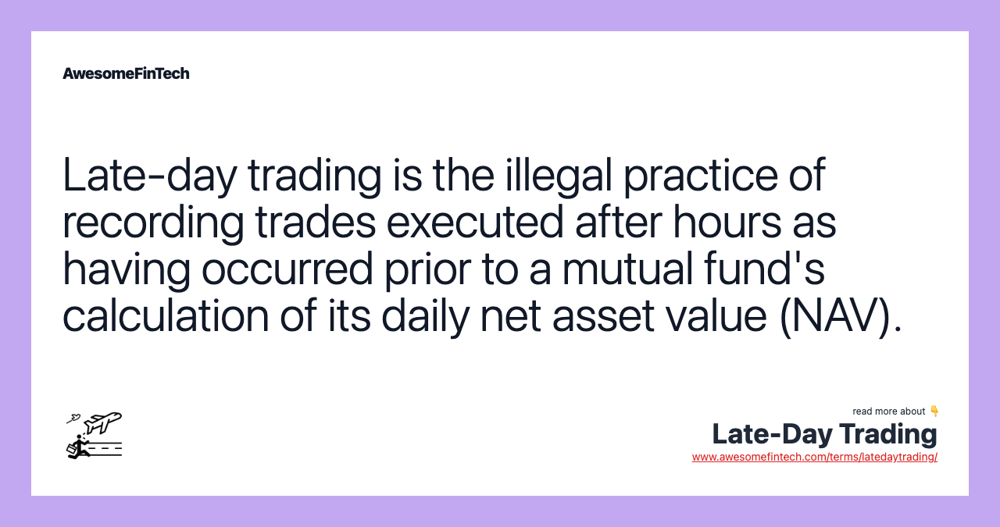

## Table of Contents

## What is late-day trading?

Late-day trading is when people buy and sell stocks near the end of the trading day. The stock market usually closes at 4 PM Eastern Time, so late-day trading happens in the last hour or so before this time. Some traders like to do this because they think they can find good deals or make quick profits as the market is about to close.

However, late-day trading can be risky. Prices can change a lot in a short time, and it can be hard to predict what will happen. If you are thinking about late-day trading, it's important to be careful and know that you might lose money. It's a good idea to learn as much as you can and maybe talk to a financial advisor before you start.

## How does late-day trading differ from regular trading?

Late-day trading is different from regular trading because it happens at the end of the trading day, usually in the last hour before the market closes at 4 PM Eastern Time. Regular trading, on the other hand, can happen anytime during the market's open hours, from 9:30 AM to 4 PM Eastern Time. People who do late-day trading think they can find good deals or make quick profits as the market is closing, while regular trading spreads out the activity over the whole day.

Another difference is that late-[day trading](/wiki/day-trading-spy) can be riskier than regular trading. Prices can change a lot in a short time at the end of the day, making it hard to predict what will happen. In regular trading, there's more time to watch the market and make decisions, which might make it feel less risky. If you're thinking about late-day trading, it's important to know these risks and maybe talk to someone who knows about money before you start.

## What are the potential benefits of late-day trading?

Late-day trading can give you a chance to make quick money. Some people think that the last hour of the trading day is a good time to find deals. Prices can change a lot at the end of the day, so if you're lucky, you can buy low and sell high in a short time. This can be exciting and might help you make more money than if you traded at other times.

Another benefit is that you can see how the market moved all day before you make your move. By waiting until the end of the day, you have more information about what's happening with stocks. This can help you make better choices about which stocks to buy or sell. If you're good at reading the market, late-day trading can be a smart way to use what you know to make money.

## What risks are associated with late-day trading?

Late-day trading can be risky because prices can change a lot in a short time. When the market is about to close, there can be a lot of buying and selling, which can make stock prices go up and down quickly. This means you might buy a stock thinking it will go up, but it could go down instead, and you could lose money. It's hard to predict what will happen at the end of the day, so late-day trading can be more unpredictable than trading at other times.

Another risk is that you might not have enough time to react if things go wrong. If you see that a stock is not doing well, you might not have enough time to sell it before the market closes. This can be stressful and might make you make bad decisions. If you're not careful, you could end up losing more money than you planned. It's important to think about these risks before you start late-day trading.

## What are the common mechanisms used in late-day trading?

In late-day trading, people often use a few common ways to buy and sell stocks. One way is called "[momentum](/wiki/momentum) trading." This means they look at which stocks are going up fast at the end of the day and try to buy them, hoping the price will keep going up so they can sell them for more money. Another way is "[scalping](/wiki/gamma-scalping)," where traders buy and sell stocks very quickly to make small profits from small changes in price. They might do this many times in the last hour of trading.

Another common mechanism is "news-based trading." Traders watch for news that comes out near the end of the day, like earnings reports or economic news, and try to buy or sell stocks based on how they think the news will affect the stock prices. This can be risky because the market can react in ways that are hard to predict. Overall, these methods need quick thinking and good timing, which can be hard to get right but can lead to good profits if done well.

## How do regulations impact late-day trading practices?

Regulations can affect late-day trading by setting rules that traders have to follow. For example, the Securities and Exchange Commission (SEC) has rules about how orders are handled and when they can be placed. These rules help make sure that trading is fair and that no one can cheat. If traders break these rules, they can get in trouble, which might stop them from doing late-day trading.

Also, there are rules about how much the market can move at the end of the day. These are called "circuit breakers," and they can stop trading if prices change too much. This can make late-day trading harder because it might stop you from buying or selling when you want to. So, knowing these rules and how they work is important if you want to do late-day trading.

## What are the specific regulations governing late-day trading in the U.S.?

In the U.S., late-day trading is governed by rules set by the Securities and Exchange Commission (SEC). One important rule is the "Order Protection Rule," which is part of Regulation NMS. This rule says that stock exchanges have to make sure that orders are filled at the best available price, no matter when you place them. This helps keep trading fair, even at the end of the day when things can get busy.

Another set of rules that affect late-day trading are the "circuit breakers." These are rules that can stop trading if stock prices move too much in a short time. For example, if the market drops a lot near the end of the day, trading might stop for a while to calm things down. This can make late-day trading trickier because you might not be able to buy or sell when you want to. Knowing these rules can help you understand how to trade safely and fairly at the end of the day.

## How have these regulations evolved over time?

Over the years, the rules about late-day trading have changed to make the stock market safer and fairer. A big change happened after the stock market crash in 1987. The SEC made new rules called "circuit breakers" to stop trading if prices went crazy. These rules were meant to give everyone time to think and stop big losses. Later, in 2005, the SEC added the Order Protection Rule as part of Regulation NMS. This rule helps make sure that when you buy or sell a stock, you get the best price, no matter what time of day it is.

These changes show how the SEC keeps working to make the market better. They keep an eye on how trading works and change the rules when they see problems. For example, after the "Flash Crash" in 2010, they looked at how fast trading happens and made more rules to stop big, sudden price changes. These rules help make late-day trading safer, but they can also make it harder because you have to follow more rules and be ready for trading to stop if things get too wild.

## What are the penalties for violating late-day trading regulations?

If you break the rules about late-day trading, you can get into big trouble. The Securities and Exchange Commission (SEC) can fine you a lot of money. These fines can be thousands or even millions of dollars, depending on how bad the rule-breaking was. They might also stop you from trading for a while or even ban you from the stock market forever. This can hurt your job and make it hard to make money in the future.

The SEC can also take you to court. If a court finds you guilty of breaking the rules, you could have to pay even more money or go to jail. This is serious and can change your life a lot. So, it's really important to follow the rules when you're doing late-day trading. If you're not sure about the rules, it's a good idea to ask someone who knows about them, like a financial advisor or a lawyer.

## How can traders ensure compliance with late-day trading regulations?

To make sure they follow the rules for late-day trading, traders need to know what the rules are. The Securities and Exchange Commission (SEC) sets these rules, and they can change over time. Traders should read about the rules, like the Order Protection Rule and circuit breakers, and keep up to date with any new rules. They can do this by checking the SEC's website or talking to a financial advisor or a lawyer who knows about these things.

Traders also need to be careful and pay attention to what they are doing. They should use good trading tools that help them follow the rules. For example, they can use software that stops them from trading if the market gets too wild. It's also important to keep good records of all their trades, so if the SEC asks questions, they can show they were following the rules. By being careful and knowing the rules, traders can stay out of trouble and keep trading safely.

## What technological tools are used to facilitate late-day trading?

Traders use different computer programs to help them with late-day trading. These programs can show them what's happening in the market in real-time. This means they can see prices changing and make quick choices. Some programs also have tools that help traders follow the rules, like stopping them from trading if the market gets too crazy. These tools make it easier for traders to buy and sell stocks at the end of the day without breaking any rules.

Another helpful tool is trading algorithms. These are like smart math formulas that can trade for you. They can look at a lot of information very fast and decide when to buy or sell stocks. This can be really useful at the end of the day when things can change quickly. Algorithms can help traders make money by finding good deals and making trades at the right time. But it's important for traders to set up these algorithms carefully so they follow all the rules.

## What advanced strategies can expert traders use to optimize late-day trading?

Expert traders can use a strategy called "momentum trading" to optimize late-day trading. This means they watch which stocks are going up fast at the end of the day and try to buy them. They hope the price will keep going up so they can sell them for more money. To do this well, they use computer programs that show them real-time prices and help them make quick decisions. They also set up trading algorithms that can buy and sell for them based on these fast price changes. But they need to be careful to follow the rules, like not trading if the market gets too wild.

Another strategy is "news-based trading." Expert traders keep an eye on news that comes out near the end of the day, like earnings reports or economic news. They try to guess how this news will change stock prices and make trades based on that. This can be risky because the market can react in ways that are hard to predict, but if they guess right, they can make good profits. They use tools that help them get the news fast and understand how it might affect the market. By combining these strategies with good technology and a deep understanding of the rules, expert traders can do well in late-day trading.

## References & Further Reading

[1]: Malkiel, B. G. (2003). ["The Efficient Market Hypothesis and Its Critics."](https://www.princeton.edu/~ceps/workingpapers/91malkiel.pdf) Journal of Economic Perspectives, 17(1), 59-82.

[2]: Aldridge, I. (2010). ["High-Frequency Trading: A Practical Guide to Algorithmic Strategies and Trading Systems."](https://www.ahmetbeyefendi.com/wp-content/uploads/2020/07/High-Frequency-Trading-Irene-Aldridge.pdf) Wiley Finance.

[3]: Hasbrouck, J., & Saar, G. (2013). ["Low Latency Trading."](https://www.sciencedirect.com/science/article/abs/pii/S1386418113000165) The Review of Financial Studies, 26(9), 2092-2135.

[4]: Securities and Exchange Commission. (1934). ["Securities Exchange Act of 1934."](https://www.sec.gov/rules-regulations/statutes-regulations)

[5]: Financial Stability Board. (2018). ["Crypto-asset markets: Potential channels for future financial stability implications."](https://www.fsb.org/uploads/P101018.pdf)

[6]: Johnson, N., Jefferies, P., & Meng, J. (2013). ["Financial Black Swans Driven by Ultrafast Machine Ecology."](https://arxiv.org/abs/1202.1448) Scientific Reports.

[7]: Securities and Exchange Commission. (2008). ["Compliance Program Management: An SEC Perspective."](https://www.sec.gov/news/speech/2008/spch103008lar.htm)