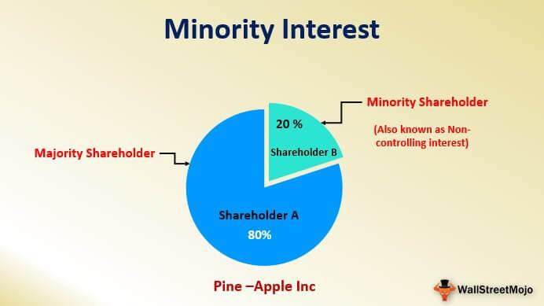

The adoption curve is a sociological model that illustrates the process through which an innovation is adopted by individuals within a social system over time. This model, which was popularized by Everett Rogers in his book "Diffusion of Innovations," is crucial for understanding how new technologies, practices, or ideas spread. The curve is typically divided into five segments: Innovators, Early Adopters, Early Majority, Late Majority, and Laggards. Each group represents a distinct demographic with unique motivations and behaviors influencing their adoption of new technology.

The 'late majority' is a critical segment within the adoption curve. Comprising nearly 34% of the population, individuals in this group adopt an innovation after the average participant does. They tend to be older, less affluent, and less technologically adept, often displaying skepticism towards new advancements. For this group, adoption occurs primarily due to the increasing pressure of prevailing norms and the influence of their peers. Understanding this cohort is essential because their participation shifts an innovation towards broader acceptance and eventual mainstream status.

In the context of financial markets, algorithmic trading represents a contemporary innovation that automates trading decisions and processes based on mathematical models and algorithms. This technology has revolutionized how trading is conducted by increasing efficiency, speed, and accuracy. Initially embraced by Innovators and Early Adopters within the financial sector, algorithmic trading has significantly reshaped market operations.

The aim of this article is to explore the intersection of late majority adoption and algorithmic trading. It focuses on the unique challenges and opportunities associated with engaging this demographic in adopting algorithmic trading technologies. By analyzing their characteristics, the article aims to propose strategies that financial institutions can implement to effectively guide the late majority through the adoption process, ultimately enabling algorithmic trading to reach mainstream status.

## Table of Contents

## Understanding the Adoption Curve

The adoption curve, also known as the technology adoption lifecycle, is a sociological model that outlines the progression of a new product or innovation through its acceptance and adoption by successive segments of the population. This model consists of five segments: Innovators, Early Adopters, Early Majority, Late Majority, and Laggards. Each segment plays a distinct role in the innovation adoption process and exhibits unique characteristics.

**Innovators** are at the forefront of adoption. They constitute approximately 2.5% of the population and are characterized by a high degree of risk tolerance. Innovators are eager to explore new technologies and often possess the technical expertise necessary to understand and implement groundbreaking ideas. Their role is pivotal as they act as testers and catalysts for subsequent adoption phases.

**Early Adopters** represent about 13.5% of the population. This segment is critical because early adopters often set trends and endorse innovations. They are typically more socially influential than innovators and use their networks to spread their findings. Early adopters are motivated by the prospects of gaining a competitive advantage and improved efficiency through early adoption.

**Early Majority** forms approximately 34% of the population and marks the next phase of adoption. Members of this group are more deliberate in their approach, preferring to wait until innovations have been tried and validated by early adopters. They seek assurance and tangible benefits before committing. The early majority is essential for the transition of an innovation from being niche to mainstream.

**Late Majority**, also about 34%, adopts innovations significantly later than the early majority. This segment is characterized by skepticism and a general hesitance towards new technology. The late majority tends to be older, less affluent, and less technologically savvy compared to earlier adopters. Their adoption is often influenced by economic necessity and peer pressure rather than the intrinsic value of the innovation. For this group, the perceived risks often outweigh potential rewards until the innovation has demonstrated widespread acceptance and reliability.

Finally, **Laggards** make up the remaining 16% of the population. This group is highly resistant to change and typically only adopts new technologies when traditional alternatives are no longer available. Laggards prioritize familiarity over innovation and are significant adopters only when the cost of maintaining the status quo becomes too high.

Understanding the adoption curve is crucial for businesses and innovators as it guides them in tailoring strategies to engage each segment effectively. The late majority plays a particularly substantial role in the lifecycle as their entry into the market can signal the transition from majority adoption to mainstream recognition, often driven by practicality and the affirmation of wider societal acceptance.

## Late Majority Characteristics and Behavior

The late majority is often characterized by a pronounced skepticism towards adopting new technology. This group tends to be more conservative, cautious, and methodical in their decision-making process. Their hesitation often stems from a desire to see tangible proof of a technology's efficacy and long-term benefits. They generally require extensive demonstrations of success before they are persuaded to adopt a new innovation.

Several factors influence the decision-making process of the late majority. Primarily, this segment is driven by the need for value. They are typically less affluent than earlier adopters and, as such, place significant emphasis on cost-effectiveness and proven utility. Before embracing a technology, the late majority requires evidence that any investment will result in substantial practical benefits and a favorable cost-benefit ratio.

Moreover, the late majority often seeks confirmation from societal norms and peer recommendations. They look towards friends, family, and the broader community for cues, relying heavily on the adoption behaviors and opinions of others. This societal pressure can either hinder or facilitate their acceptance of new technology, depending on how pervasive and positively regarded the innovation is within their social circles.

For the late majority, peer influence can act as a catalyst for adoption. When trusted peers begin to adopt and advocate for a technology, the late majority is more likely to follow suit. This peer endorsement acts as an informal testimonial, reinforcing the technology's perceived reliability and effectiveness. Thus, societal and peer influences play crucial roles in shaping their adoption behavior, as the late majority tends to favor technologies that have achieved widespread acceptance and acclaim.

## Diffusion of Innovations in Algo Trading

Algorithmic trading, often referred to as algo trading, is a method of executing orders using automated, pre-programmed trading instructions accounting for variables such as timing, price, and [volume](/wiki/volume-trading-strategy). This technology has transformed financial markets by offering increased efficiency, speed, and market accessibility. Its origin dates back to the 1970s with the introduction of electronic trading systems, which marked a significant shift from the traditional open-outcry systems to digital platforms.

The diffusion of [algorithmic trading](/wiki/algorithmic-trading) in financial markets followed a distinct pattern aligned with the broader adoption curve for innovations. Innovators, typically quantitative analysts and technology-driven traders, were among the first to embrace algo trading in the late 20th century. They harnessed early computing power and mathematical models to develop trading algorithms, capitalizing on inefficiencies in financial markets. As the technology matured, early adopters, including hedge funds and proprietary trading firms, started implementing sophisticated algorithms for various strategies, such as statistical [arbitrage](/wiki/arbitrage), market-making, and trend-following.

The early majority comprised larger financial institutions and banks that recognized the competitive advantages offered by algo trading. These organizations invested heavily in technology infrastructure and talent, leading to significant market penetration of algorithmic solutions by the early 2000s. This phase was characterized by increased market efficiency, reduced trading costs, and enhanced [liquidity](/wiki/liquidity-risk-premium).

Despite the evident benefits, the late majority remains hesitant to fully embrace algorithmic trading. This group, often cautious and risk-averse, is typically composed of older investors, smaller brokerage firms, and traditional fund managers. Their reluctance can be attributed to several factors:

1. **Complexity and Understanding:** The intricate nature of algorithmic systems poses a barrier. Potential adopters may lack the technical expertise to comprehend and effectively implement these technologies.

2. **Perceived Risk:** The fear of system failures, algorithmic errors, and market disruptions serve as deterrents. High-profile incidents, such as the 2010 Flash Crash, highlight potential risks, exacerbating skepticism.

3. **Cost Considerations:** Developing and maintaining algorithmic systems requires substantial investment in technology and skill acquisition. The late majority often waits for cost reductions and the demonstration of value before committing to adoption.

As algo trading continues to evolve, addressing the concerns of the late majority is crucial for widespread adoption. Providing educational resources, ensuring robust regulatory frameworks, and demonstrating proven benefits are essential strategies to motivate this segment. Such efforts can foster a conducive environment for algo trading to transition from a relatively niche practice to mainstream financial market infrastructure.

## Factors Affecting Late Majority Adoption of Algo Trading

The late majority group, characterized by their cautious approach to adopting new technologies, faces several barriers when considering algorithmic trading. These barriers are crucial to understand, as they significantly influence the diffusion and eventual mainstream acceptance of such innovations in financial markets.

One of the primary barriers is the lack of understanding and familiarity with algorithmic trading concepts. This group tends to be less technologically savvy, often encountering difficulties in comprehending the mechanics of how algorithmic systems operate. Educational resources play a vital role here, serving as the bridge to demystify these complexities. Comprehensive educational programs can be tailored to highlight the operational fundamentals of algorithmic trading, risk management strategies, and potential financial benefits. Such resources could include online courses, seminars, webinars, and interactive workshops designed to build confidence among potential adopters.

Regulatory policies also greatly impact the late majority's adoption process. Stringent regulations can instill a sense of security by ensuring transparency and minimizing the risks associated with algorithmic trading. However, overly complex regulatory environments might deter the late majority due to the perceived difficulty in compliance. Balancing these regulations to protect investors while not overcomplicating the infrastructure is crucial for encouraging wider participation.

Financial market stability is another [factor](/wiki/factor-investing) that influences adoption among the late majority. This group seeks evidence of proven benefits and assurances of stability before fully committing to new financial technologies. Periods of market [volatility](/wiki/volatility-trading-strategies) or high-profile failures in algorithmic trading systems can reinforce skepticism. Promoting algorithmic trading as a tool that contributes to market efficiency and stability, underpinned by historical data and case studies, could alleviate these concerns. Highlighting the adaptability and resilience of such technologies during varying market conditions is essential.

In summary, overcoming the late majority's hesitation to adopt algorithmic trading involves addressing knowledge gaps through targeted educational resources, ensuring a regulatory environment that offers both protection and simplicity, and demonstrating market stability and resilience. By focusing on these factors, stakeholders can enhance the adoption process, ultimately facilitating the diffusion of algorithmic trading into broader market acceptance.

## Strategies to Engage the Late Majority

To effectively engage the late majority in adopting algorithmic trading, financial institutions must develop a multi-faceted strategy that addresses the unique needs and concerns of this demographic segment. The late majority, characterized by their cautious approach and reliance on proven benefits, can be brought into the fold through tailored initiatives, educational efforts, and strategic marketing.

**Educational Initiatives and Workshops**

Educational initiatives are crucial to demystify algorithmic trading for the late majority, who may lack the technical prowess often seen in earlier adopters. Financial institutions can offer workshops and courses that explain the fundamentals of algorithmic trading, its benefits, and its risks in straightforward terms. These can be delivered through online platforms or in-person sessions, reflecting the learning preferences of the demographic. Such educational programs should focus on:

1. Explaining the basics of algorithmic trading and its mechanisms.
2. Demonstrating the historical performance and success stories of algorithmic trading strategies.
3. Providing hands-on experiences through simulators that allow potential adopters to experiment with algorithmic trading without financial risk.

**Simplified Trading Platforms**

Creating user-friendly and simplified trading platforms is essential to cater to the late majority, who may find existing platforms complex and intimidating. These platforms should feature intuitive interfaces, clear guidance, and robust support to help users navigate the intricacies of algorithmic trading. Key components of such platforms could include:

- Drag-and-drop interfaces for building trading algorithms.
- Risk management tools that offer easy-to-understand analyses of potential trading strategies.
- Customer support services, both automated and human, to assist users in overcoming technical challenges.

**Strategic Marketing**

Marketing strategies should focus on highlighting the proven benefits and rigorous risk management mechanisms inherent in algorithmic trading. The late majority is heavily influenced by testimony and real-world evidence. Thus, showcasing case studies and peer testimonials can significantly impact their decision-making. Marketing campaigns should emphasize:

1. **Proven Benefits**: Highlight the consistent returns and efficiency of algorithmic trading through data-driven evidence. Graphs, charts, and statistical analyses can be powerful tools in conveying these points.

2. **Risk Management**: Assure the late majority of the sophisticated risk management tools that accompany algorithmic trading. Explaining features like stop-loss orders, diversification capabilities, and automated risk assessments can alleviate concerns related to financial exposure.

Moreover, testimonials from individuals or entities similar to the late majority, particularly those who were initially skeptical but later benefited from the adoption, can enhance credibility and relatability.

By integrating educational initiatives, designing user-friendly platforms, and deploying strategic marketing campaigns, financial institutions can effectively engage the late majority, facilitating a smoother transition to broader adoption of algorithmic trading.

## The Future of Algorithmic Trading: From Late Majority to Mainstream

Algorithmic trading, often referred to as algo trading, involves using computer algorithms to execute trading orders at high speeds, based on pre-determined criteria. As the late majority — typically more conservative, risk-averse individuals who adopt technology after it has been proven — increasingly embraces these systems, algorithmic trading is poised to transition to a mainstream practice in financial markets.

**Trends and Potential Growth**

The adoption of algorithmic trading by the late majority signifies an important shift. With advances in data processing and [machine learning](/wiki/machine-learning) algorithms, trading systems are becoming more efficient and accessible. This trend is supported by improvements in computational power and the availability of big data analytics, which enable traders to gain insights and make data-driven decisions more effectively.

As algorithmic strategies become more user-friendly and platforms more intuitive, a wider audience can participate in algo trading. This accessibility is likely to lead to a significant increase in algorithmic trading volume, contributing to market liquidity and potentially reducing transaction costs for all market participants.

**Evolution of Algorithmic Trading Post-Adoption**

Following its adoption by the late majority, algorithmic trading technology is expected to continue evolving. One key development is the integration of [artificial intelligence](/wiki/ai-artificial-intelligence) (AI) and machine learning techniques. These technologies can enhance the adaptability and accuracy of trading algorithms, allowing them to learn and adjust strategies based on real-time market conditions.

Moreover, the future landscape could see greater customization options for individual traders, enabling personalized trading strategies that cater to varied investment goals and risk appetites. This evolution would ensure that algo trading tools are not just the domain of institutional investors but also accessible to individual traders who seek to manage their portfolios actively.

**Emerging Technologies and Adoption Curves**

Looking ahead, blockchain technology and decentralized finance (DeFi) platforms could play influential roles in the future of trading. These innovations offer transparency, security, and potentially lower operational costs. However, their adoption curves may mirror that of algorithmic trading, with innovators and early adopters leading the charge before gaining wider acceptance among the late majority.

Another possible trend is the adoption of quantum computing in trading. Though still in nascent stages, quantum computing promises unprecedented processing power, potentially revolutionizing trading strategies and risk assessment. The adoption curve for quantum computing is likely to be steep, given its complexity and the significant investment required.

**Conclusion**

The full integration of the late majority into algorithmic trading marks a pivotal moment for financial markets. With continuous technological advancements and increasing market accessibility, algo trading is set to become mainstream. Stakeholders in the financial sector must focus on inclusive strategies to ensure that all segments of adopters benefit from these transformative changes, ultimately contributing to a more efficient and equitable trading environment.

## Conclusion

The late majority plays a crucial role in the diffusion of algorithmic trading, marking the transition from niche market practice to a widely accepted norm. Their adoption signifies a critical mass that drives further integration and acceptance of technology within financial markets. Understanding the adoption curve is fundamental to the success of financial innovations like algorithmic trading. It provides insights into how different segments of the population approach new technologies, highlighting the need for tailored strategies to engage each group effectively.

For stakeholders, this understanding is not just academic; it carries significant implications for market penetration and technology proliferation. Engaging the late majority requires addressing their concerns about cost, complexity, and perceived risks. Educational initiatives, simplified platforms, and clear demonstrations of value can help bridge this gap. Furthermore, societal and peer influences should not be underestimated, as recommendations from trusted sources can often sway decision-making in this segment.

A call to action for financial institutions, educators, and policymakers is warranted to facilitate inclusive technology adoption. By fostering an environment that supports easy access to information and resources, stakeholders can empower the late majority to make informed decisions. This inclusivity ensures that innovations like algorithmic trading do not remain the preserve of early adopters and innovators, but are accessible and beneficial to all participants in the financial ecosystem. To this end, concerted efforts to enhance education, improve regulatory clarity, and demonstrate tangible benefits will be vital in transitioning algorithmic trading from a novel innovation to a foundational element of global financial trading practices.

## References & Further Reading

[1]: Rogers, E. M. (2003). ["Diffusion of Innovations, 5th Edition"](https://books.google.com/books/about/Diffusion_of_Innovations_5th_Edition.html?id=9U1K5LjUOwEC) by Everett M. Rogers.

[2]: ["Advances in Financial Machine Learning"](https://www.amazon.com/Advances-Financial-Machine-Learning-Marcos/dp/1119482089) by Marcos Lopez de Prado

[3]: ["Building Algorithmic Trading Systems: A Trader's Journey From Data Mining to Monte Carlo Simulation to Live Trading"](https://www.amazon.com/Building-Winning-Algorithmic-Trading-Systems/dp/1118778987) by Kevin Davey

[4]: ["Quantitative Trading: How to Build Your Own Algorithmic Trading Business"](https://www.amazon.com/Quantitative-Trading-Build-Algorithmic-Business/dp/1119800064) by Ernest P. Chan

[5]: Barberis, N., & Thaler, R. (2003). ["A survey of behavioral finance."](https://www.nber.org/papers/w9222) The Handbook of the Economics of Finance.