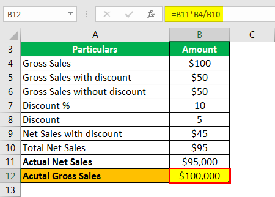

Trade reporting has become increasingly vital in modern financial markets, serving as a cornerstone for market transparency and efficiency. It facilitates the documentation and dissemination of transaction data, which is essential for various market participants, including traders, regulators, and investors. The growing complexity of financial markets, driven by innovations like algorithmic trading, underscores the importance of robust trade reporting mechanisms.

Finance sale reporting, a key component of trade reporting, involves the comprehensive disclosure of transaction details. It includes the price, volume, and time of trades, playing a crucial role in algorithmic trading. Algorithmic trading, which utilizes pre-programmed trading instructions accounting for variables such as time, price, and volume, relies heavily on accurate and timely trade reports. Such reports ensure that trading strategies can be adapted quickly to current market conditions, thereby optimizing both the execution and performance of these automated systems.

The purpose of this article is to explore the multifaceted dimensions of trade reporting within the context of algorithmic trading. We aim to provide a detailed understanding of how trade reporting functions, its significance, and the challenges it faces in today's financial landscape. We will discuss the impact of regulatory bodies on trade reporting, the integration of finance sale reporting in algorithmic trading, and the tools and technologies that support these processes.

Key areas covered in the article include an in-depth examination of the different types and roles of trade reporting, with particular attention to Nasdaq's last-sale reporting. We will discuss the benefits and challenges of implementing effective reporting systems, particularly in reducing errors and ensuring compliance. The article will also address the integration of real-time reporting in algorithmic trading, highlighting its impact on decision-making and strategy optimization.

By examining current practices and future trends, this article seeks to underscore the importance of trade reporting in enhancing the efficacy of algorithmic trading, advocating for the widespread adoption of real-time reporting systems to improve market outcomes.

## Table of Contents

## Understanding Trade Reporting

Trade reporting is a crucial component of the finance industry, serving as the backbone for transparency and informed decision-making. It involves the systematic disclosure of trade details, including the price, volume, and time of transactions. There are several types of trade reporting, primarily categorized into pre-trade, post-trade, and last-sale reporting. Pre-trade reporting provides information about orders before they are finalized, enhancing market depth. Post-trade reporting, on the other hand, involves the disclosure of completed trade details, allowing for the assessment of market trends and liquidity. Last-sale reporting is a subset of post-trade reporting focused on the sale price of the most recent transaction, critical for real-time pricing and valuation.

Nasdaq's last-sale reporting plays a pivotal role in modern financial markets. It provides real-time trade data essential for price discovery and market analysis. Nasdaq's systems ensure that the last traded price is made available to market participants almost instantaneously, thereby facilitating a fair and transparent market environment. For traders and investors, this information is vital for making immediate and accurate trading decisions.

Timely trade reporting is indispensable for market transparency as it fosters an environment where all stakeholders have access to the same set of information simultaneously. This parity prevents information asymmetry, which could disadvantage some traders. Moreover, it enables regulators and market participants to monitor market dynamics effectively, detecting any unusual activity or pricing anomalies that could signal market manipulation.

The impact of regulatory bodies such as the Securities and Exchange Commission (SEC) and the Financial Industry Regulatory Authority (FINRA) on trade reporting is significant. These bodies set strict guidelines and standards to ensure that trade reporting mechanisms are robust, accurate, and timely. The SEC, for instance, requires exchanges to provide comprehensive transaction details to maintain a transparent market structure. FINRA oversees the Trade Reporting Facility (TRF), a database that captures all equities transactions to ensure compliance and market integrity. The collaboration between regulatory entities and financial markets aims to enhance transparency, protect investors, and maintain orderly functioning of the markets.

In summary, trade reporting is a foundational element of financial markets that supports transparency and regulatory compliance. It encompasses various reporting types, with Nasdaq's last-sale reporting being a vital real-time data source. Timely reporting ensures equitable information distribution, thereby preserving market integrity, with regulatory bodies like the SEC and FINRA playing critical roles in enforcing reporting standards.

## Finance Sale Reporting: Key Considerations

Finance sale reporting is crucial in the finance industry, ensuring accuracy, transparency, and compliance in transactions. At its core, finance sale reporting involves a detailed account of each transaction, encompassing several key components. These include the transaction date, security identifier, price, [volume](/wiki/volume-trading-strategy), buyer, seller, and unique transaction ID. Each element plays a vital role in creating a comprehensive report that enhances market reliability and investor confidence.

The significance of accurate finance sale reporting cannot be overstated. It serves to reduce errors that can arise from manual entries or miscommunications, thereby safeguarding the integrity of the markets. Moreover, it is essential for compliance with regulatory frameworks established by bodies like the Securities and Exchange Commission (SEC) and the Financial Industry Regulatory Authority (FINRA). These organizations mandate precise and prompt reporting to uphold market fairness and reinforce investor protection.

Despite its importance, effective reporting systems face several challenges. Data accuracy and consistency are paramount, yet they can be compromised by the sheer volume of transactions in modern markets. Real-time data processing is also a significant hurdle, with latency issues potentially impacting decision-making and regulatory compliance. Additionally, evolving regulations necessitate continuous updates and adaptability in reporting mechanisms, posing a further challenge for financial institutions.

Several tools and technologies have been developed to aid finance sale reporting. Advanced software solutions automate data collection, processing, and dissemination, minimizing human error. Technologies such as blockchain are being explored for their potential to offer immutable, transparent transaction records. Machine learning algorithms provide predictive analytics and anomaly detection, enhancing the accuracy and efficiency of reporting systems. These tools, combined with robust data management practices, enable financial institutions to meet the stringent demands of trade reporting effectively.

In summary, finance sale reporting is a linchpin of market reliability, demanding precision and regulatory compliance. The challenges it presents are met with innovative tools and technologies, ensuring that trading activities remain transparent and verifiable.

## Algorithmic Trading and Real-Time Reporting

Algorithmic trading refers to the use of computer algorithms to automate trading strategies, enabling rapid and high-frequency trades that would be impossible for human traders to execute manually. This practice is becoming increasingly prevalent in financial markets due to its ability to maximize the speed, efficiency, and accuracy of trade executions. Algorithms can analyze massive datasets to identify trading opportunities across various markets and financial instruments.

The integration of real-time trade reporting into algorithmic strategies provides several notable advantages. Firstly, it enhances decision-making capabilities by ensuring that algorithms operate on the most current market data available. This immediacy allows algorithmic systems to adjust to market changes, facilitating more informed and timely execution of trades. Incorporating real-time reporting helps in reducing slippage and mitigating the risks associated with volatile markets. For instance, continuous access to updated trade information allows algorithms to trigger buy or sell orders based on the latest available data, thereby optimizing trade outcomes and managing risks more effectively.

Real-time data plays a paramount role in shaping decision-making processes within [algorithmic trading](/wiki/algorithmic-trading). High-frequency trading ([HFT](/wiki/high-frequency-trading-strategies)) firms, for example, rely on the rapid assimilation of real-time data to make split-second trading decisions. By leveraging this data, algorithms can exploit [arbitrage](/wiki/arbitrage) opportunities, handle complex trades, and implement strategies such as [market making](/wiki/market-making) or [trend following](/wiki/trend-following) with greater precision. Moreover, real-time reporting enables the back-testing of algorithms against live data, refining strategies and improving performance metrics over time.

Case studies exemplify the practical application of real-time trade reporting in algorithmic trading. One notable example is the use of real-time reporting by quantitative firms to detect and respond to [liquidity](/wiki/liquidity-risk-premium) imbalances. These firms use high-frequency data to continuously monitor the depth of the [order book](/wiki/order-book-trading-strategies), adjusting their positions in milliseconds to capture price inefficiencies. Another instance is the deployment of real-time sentiment analysis tools that scrape news feeds and social media platforms, allowing traders to capitalize on new information as it becomes publicly available.

In summary, the integration of real-time trade reporting not only fortifies the operational efficiency of algorithmic trading but also augments its strategic effectiveness. As technology and data analytics advance, the adoption of real-time reporting systems will likely continue to expand, further transforming the landscape of financial trading.

## Overcoming Challenges in Algo Trading with Reporting

Algorithmic trading, or algo trading, is a cornerstone of modern financial markets, offering speed and precision beyond human capabilities. However, it is not without its challenges, primarily concerning data latency and accuracy.

Data latency refers to the delay between the occurrence of a market event and the response time in the trading system. Even milliseconds of latency can lead to significant financial losses, as algorithmic trading typically involves high-frequency transactions where each trade depends on real-time data. Inaccuracies in data can lead to incorrect assessments of market conditions, resulting in flawed trading decisions. Hence, both latency and accuracy are critical factors that need continual addressing.

Real-time trade reporting plays a crucial role in resolving these challenges. By ensuring that trading data is available as soon as transactions occur, real-time reporting decreases latency and boosts the accuracy of the information fed into algo trading systems. This immediacy allows traders to adjust strategies on-the-fly, responding to market changes with minimal delay. Enhanced data accuracy ensures that algorithms are making decisions based on the most current and precise market information, improving overall trading outcomes.

Tools and technologies for effective implementation of real-time reporting are continuously evolving. High-performance data processing frameworks like Apache Kafka and [machine learning](/wiki/machine-learning) platforms can manage large volumes of data efficiently. Software solutions such as Kdb+ and Python libraries like Pandas and Numpy enable the rapid processing and analysis of time-series data, assisting traders in maintaining data integrity and speed.

Regulatory compliance also plays a pivotal role in shaping algorithmic trading practices. Bodies such as the U.S. Securities and Exchange Commission (SEC) and the Financial Industry Regulatory Authority (FINRA) impose stringent requirements for trade reporting to prevent market abuse and ensure fairness. Compliance with these regulations not only shields traders from legal penalties but also mandates the maintenance of robust reporting systems that inherently support more effective algo trading strategies.

In summary, overcoming the challenges in algorithmic trading requires a multi-faceted approach that emphasizes real-time data reporting, cutting-edge technological tools, and strict adherence to regulatory standards. These elements combine to minimize data latency and improve accuracy, bolstering the effectiveness and reliability of algorithmic trading systems.

## Best Practices for Trade Reporting in Algorithmic Trading

Optimizing trade reporting systems in algorithmic trading involves several crucial strategies to enhance their effectiveness and reliability. Continuous monitoring and updates of algorithmic trading strategies with the latest data are essential to maintaining competitiveness. By frequently updating trading algorithms, traders can adapt to market changes swiftly, ensuring that their strategies remain relevant and effective in rapidly evolving markets. Continuous monitoring also enables the identification of anomalies and the quick rectification of any issues, reducing the risk of significant financial losses.

Integrating trade reporting with risk management frameworks is another fundamental practice. This integration allows firms to better manage and mitigate risks by providing real-time insights into trading activities. With integrated systems, risk managers can assess trading exposures more accurately and implement corrective measures promptly. This capability is crucial for maintaining a robust risk management strategy, especially in high-frequency trading environments where the rapid execution of trades can quickly amplify risk exposure.

Emerging trends and technologies are continually shaping the future of trade reporting in algorithmic trading. Automation and machine learning are enhancing the ability to process and analyze vast amounts of trading data efficiently. These technologies enable the creation of more sophisticated reporting systems capable of providing deeper insights and identifying patterns that might not be apparent through traditional analysis methods. Moreover, the advent of blockchain technology presents opportunities for decentralized and transparent trade reporting systems, which could enhance trust and security in financial markets.

Furthermore, the increasing use of Application Programming Interfaces (APIs) is facilitating seamless integration of disparate systems, allowing for more efficient data flow between trading, reporting, and risk management systems. This integration is essential for creating a unified platform that can support real-time decision-making and enhance overall trading strategy performance.

To implement these best practices effectively, traders can consider leveraging cloud-based solutions that offer scalability and flexibility, enabling quick adaptation to changing market conditions and evolving regulatory requirements. The use of big data analytics tools also allows traders to harness vast amounts of data generated during trading activities, providing insights that can inform algorithm adjustments and strategy optimization.

In conclusion, trade reporting in algorithmic trading can be significantly enhanced by adopting strategic best practices. Through continuous monitoring, system integration, and embracing technological advancements, traders can achieve better trading outcomes while mitigating risks effectively.

## Conclusion

In conclusion, the article underscores the indispensable role of trade reporting within the framework of algorithmic trading. Effective trade reporting stands as a cornerstone for market transparency, ensuring that transaction details are recorded accurately and disseminated promptly. This is particularly critical in algorithmic trading, where decisions are made at high speeds, and any delay in data can lead to significant discrepancies and financial losses.

The adoption of real-time reporting systems is encouraged as these tools enhance the overall efficacy of trading strategies. Real-time data allows traders to react swiftly to market changes, optimize their algorithms, and improve decision-making processes. Such systems not only aid in reducing errors and ensuring compliance but also empower traders to manage risks more effectively.

Emphasizing the need for robust reporting mechanisms, the integration of real-time reports with algorithmic strategies helps mitigate challenges like data latency and accuracy issues—common obstacles in algo trading. As regulatory environments continue to evolve, maintaining compliance through diligent reporting practices becomes even more critical, shaping the future landscape of algorithmic trading practices.

To remain competitive and innovative, traders and financial institutions must continuously refine their trade reporting systems, ensuring they are equipped with the latest technologies and trends. Such advancements will undeniably improve trading outcomes, offering a more transparent, efficient, and responsive trading environment.

## References & Further Reading

[1]: Grobys, K., & Junttila, J. (2015). ["Speculative effects of algorithmic trading on the intraday volatility of stock index ETFs."](https://osuva.uwasa.fi/bitstream/handle/10024/13083/Osuva_Grobys_Junttila_2021.pdf?sequence=2) Journal of Financial Markets, 23, 1-35.

[2]: Aldridge, I. (2010). ["High-Frequency Trading: A Practical Guide to Algorithmic Strategies and Trading Systems"](https://www.ahmetbeyefendi.com/wp-content/uploads/2020/07/High-Frequency-Trading-Irene-Aldridge.pdf) by Irene Aldridge

[3]: Biais, B., Foucault, T., & Moinas, S. (2015). ["Equilibrium High-Frequency Trading"](https://www.sciencedirect.com/science/article/abs/pii/S0304405X15000288) Review of Financial Studies, 28(4), 976-999.

[4]: Hasbrouck, J., & Saar, G. (2013). ["Low-latency trading"](https://www.sciencedirect.com/science/article/abs/pii/S1386418113000165) Review of Financial Studies, 26(9), 3275-3316.

[5]: Securities and Exchange Commission (SEC). [Trade Reporting and Compliance Engine (TRACE)](https://www.finra.org/filing-reporting/trace)