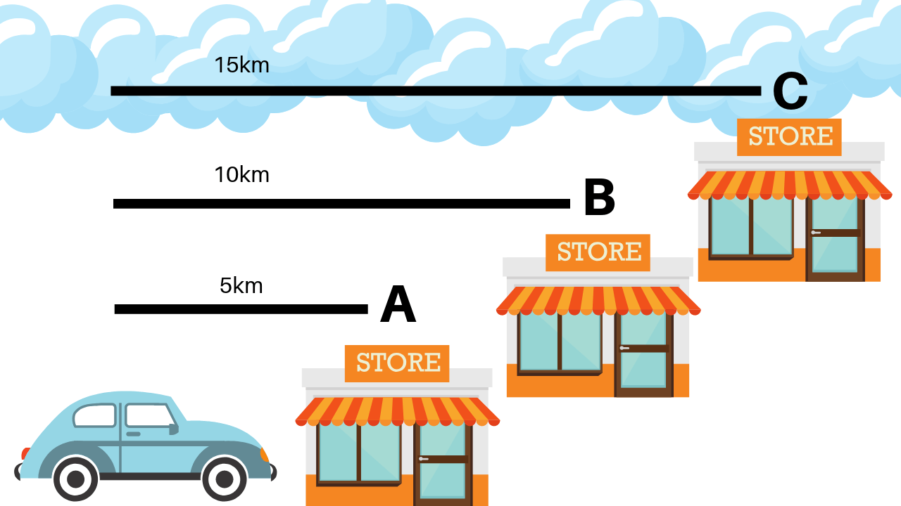

## Table of Contents

## What is latency arbitrage?

Latency arbitrage is a trading strategy used in financial markets where traders take advantage of small differences in the time it takes for information to travel between different locations. This delay, known as latency, can create opportunities for traders to buy and sell assets quickly before the rest of the market catches up. For example, if a trader in New York gets news about a company faster than a trader in London, the New York trader can use this information to make trades before the price changes in London.

This strategy relies heavily on advanced technology, like high-speed internet connections and powerful computers, to minimize the time it takes to receive and act on information. While latency arbitrage can be profitable, it is also controversial because it can be seen as unfair to traders who don't have access to the same technology. It's a practice that highlights how important speed and technology have become in today's financial markets.

## How does latency arbitrage work in financial markets?

Latency arbitrage works by traders using very fast technology to get news or data a tiny bit quicker than other people. Imagine there's news about a company that makes its stock price go up. If a trader in one place gets this news just a few seconds before traders in another place, they can buy the stock quickly before the price goes up everywhere. Then, they can sell it at the higher price and make a profit. This all happens in a very short time, often in milliseconds.

This strategy depends a lot on having the best and fastest technology. Traders need fast internet and powerful computers to get and use the information quickly. But, not everyone thinks latency [arbitrage](/wiki/arbitrage) is fair. Some people say it gives an advantage to those who can afford the expensive technology, leaving others behind. Even though it's a small part of trading, it shows how important speed and technology are in today's financial markets.

## What are the key components needed to execute latency arbitrage?

To do latency arbitrage, you need really fast internet and powerful computers. This helps you get news or data faster than other traders. You also need to be close to where the trading happens, like having your computers near the stock exchange. This cuts down the time it takes for your trades to go through.

You also need special software that can quickly look at the data and make trades without you having to do it yourself. This software needs to be very good at making decisions fast. Lastly, you need to know a lot about the market and be good at finding the right times to trade. All these things together help you make money from the small differences in time it takes for information to spread.

## Can you explain the role of high-frequency trading in latency arbitrage?

High-frequency trading ([HFT](/wiki/high-frequency-trading-strategies)) is a big part of latency arbitrage. HFT uses super fast computers and special programs to trade a lot of stocks, very quickly. In latency arbitrage, HFT helps traders get news or data just a little bit faster than others. This small difference in time can let them buy and sell stocks before the price changes everywhere. So, HFT makes it possible to do latency arbitrage by making trades happen really fast.

But, high-frequency trading can also make things more complicated. Because so many people are trying to get information and trade as fast as they can, it can be hard to keep an edge. Also, some people think HFT can make the market less fair, because only those with the best technology can do it. Still, HFT is a key tool for those trying to make money from the tiny differences in time it takes for information to spread.

## What are the common strategies used in latency arbitrage?

In latency arbitrage, one common strategy is to use high-frequency trading systems to quickly buy and sell stocks based on new information. For example, if a company announces good news, traders with faster access to this news can buy the stock before its price goes up everywhere. They can then sell it at a higher price, making a profit from the small delay in information spreading across the market.

Another strategy involves using different trading locations to their advantage. Traders might set up their computers very close to stock exchanges to reduce the time it takes for their trades to go through. This closeness helps them act on information even faster than others who are farther away. By doing this, they can make trades before the rest of the market reacts, taking advantage of the tiny differences in time it takes for information to travel.

These strategies rely heavily on having the best technology and being in the right place. While they can be profitable, they also raise questions about fairness in the market, as not everyone can afford the high costs of the necessary equipment and locations. Still, for those who can use these strategies effectively, latency arbitrage can be a way to make money from the speed of information in today's fast-paced financial markets.

## How do traders measure and minimize latency in their systems?

Traders measure latency by looking at how long it takes for their trades to go from their computer to the stock exchange and back. They use special tools that can tell them the time it takes in tiny fractions of a second, like milliseconds or even microseconds. By keeping track of this time, traders can see if their system is getting slower or if there's a problem they need to fix. They also compare their latency to other traders to see if they have an advantage or if they need to speed up.

To minimize latency, traders do a few things. First, they put their computers as close as possible to the stock exchange. This is called co-location, and it helps cut down the time it takes for their trades to travel. They also use the fastest internet connections they can get, like fiber-optic cables, to send information quickly. Lastly, traders use special software that can make trades without waiting for them to decide, which saves even more time. All these steps help traders get their trades done faster than others, which is key in latency arbitrage.

## What are the ethical considerations and regulatory challenges associated with latency arbitrage?

Latency arbitrage raises some big ethical questions. Some people think it's not fair because only traders with the best and most expensive technology can do it. This means that traders who can't afford the high costs of fast computers and internet connections are at a disadvantage. It can make the market less equal, where only a few people can make money from the tiny differences in time it takes for information to spread. This has led some to argue that latency arbitrage goes against the idea of a fair and open market where everyone has the same chance to succeed.

Regulators also face challenges when it comes to latency arbitrage. It's hard for them to make rules that stop this kind of trading without slowing down the whole market. If they make the rules too strict, it might hurt the speed and efficiency that many traders rely on. But if the rules are too loose, it might let some traders keep their unfair advantage. Finding the right balance is tough, and regulators are always trying to keep up with the fast-changing technology in financial markets to make sure everyone plays by the same rules.

## How has technology evolution impacted the effectiveness of latency arbitrage?

Technology has made latency arbitrage a lot more effective over time. In the past, traders had to wait for news to come through slower ways like newspapers or TV. Now, with the internet and super fast computers, traders can get news almost instantly. This means they can act on the information much quicker than before. Also, new technology like fiber-optic cables helps send information faster, and special software can make trades without waiting for a person to decide. All these things have made it easier for traders to take advantage of the tiny differences in time it takes for information to spread.

But, as technology gets better, it also makes latency arbitrage harder to do. More traders can now use the same fast technology, so the advantage of being just a little bit faster gets smaller. This means that to keep making money from latency arbitrage, traders need to keep spending on even faster and better tech. It's like a race where everyone is trying to go faster and faster, and it can be really expensive. This has made some people worry that only big traders with a lot of money can keep up, which might not be fair to everyone else in the market.

## What are the risks involved in latency arbitrage and how can they be mitigated?

Latency arbitrage comes with some risks. One big risk is that the technology might fail. If a trader's fast computer or internet connection stops working, they could lose money because they can't make trades quickly enough. Another risk is that the market might change suddenly. If a lot of people start doing latency arbitrage, the small time differences that traders use to make money might go away. This means they might not make as much money as they hoped. Also, there's always a chance that regulators might make new rules that stop latency arbitrage, which could hurt traders who depend on it.

To lower these risks, traders can do a few things. First, they can have backup systems in place. This means having extra computers and internet connections ready to use if the main ones fail. This can help them keep trading even if something goes wrong. Second, traders can keep an eye on the market and be ready to change their strategies if things start to shift. This way, they can try to stay ahead of other traders and keep making money. Lastly, traders should stay informed about any new rules from regulators. By understanding what might change, they can prepare and maybe find new ways to make money if latency arbitrage becomes harder to do.

## Can you provide examples of successful latency arbitrage trades?

One example of a successful latency arbitrage trade happened when a big company announced good news about their profits. A trader in New York got this news just a few seconds before traders in London. The New York trader quickly bought the company's stock before the price went up everywhere. Then, when the price did go up in London, the New York trader sold the stock and made a profit from the small delay in the news reaching London.

Another example involved a trader using high-frequency trading systems. This trader set up their computers very close to the stock exchange to cut down the time it took for their trades to go through. When a piece of important news came out, the trader's system was able to buy and sell stocks in milliseconds, making money before other traders even knew what was happening. This quick action helped the trader take advantage of the tiny differences in time it took for the news to spread across the market.

## How do different market structures affect the potential for latency arbitrage?

Different market structures can change how well latency arbitrage works. In markets where trading happens in one place, like a single stock exchange, it can be easier for traders to use fast technology to get an edge. If a trader can get their computer really close to this exchange, they can make trades faster than others. But in markets spread out over many places, it's harder to do latency arbitrage because the information has to travel to different locations, which can take more time. This means traders might not be able to act on news as quickly.

Also, some markets have rules that can make latency arbitrage harder or easier. For example, if a market has rules that slow down how fast traders can make trades, it can make it tougher to use latency arbitrage. On the other hand, markets with fewer rules might let traders use their fast technology to make money from small time differences. So, the way a market is set up, including where trading happens and what rules are in place, can really affect how well traders can do latency arbitrage.

## What future developments might influence the practice of latency arbitrage?

In the future, technology will keep getting better and faster. This might make latency arbitrage even more effective. New kinds of internet connections, like 5G or even 6G, could help traders get news even quicker. Also, new computer chips and software could make trades happen faster than ever. But as more traders use this fast technology, the small time differences they use to make money might get smaller. This means traders will need to keep spending money on the newest tech to stay ahead.

Regulations might also change how latency arbitrage works. Governments and market regulators might make new rules to make the market more fair for everyone. These rules could limit how fast traders can make trades or make sure everyone gets news at the same time. If this happens, latency arbitrage might become harder to do. But traders might find new ways to make money using different strategies. So, the future of latency arbitrage will depend a lot on both technology and rules.

## References & Further Reading

[1]: Aldridge, I. (2013). ["High-Frequency Trading: A Practical Guide to Algorithmic Strategies and Trading Systems"](https://www.wiley.com/en-us/High+Frequency+Trading%3A+A+Practical+Guide+to+Algorithmic+Strategies+and+Trading+Systems%2C+2nd+Edition-p-9781118343500). Wiley.

[2]: Narang, R. K. (2013). ["Inside the Black Box: A Simple Guide to Quantitative and High Frequency Trading"](https://onlinelibrary.wiley.com/doi/book/10.1002/9781118662717). Wiley.

[3]: Hasbrouck, J., & Saar, G. (2013). ["Low-latency trading"](https://www.sciencedirect.com/science/article/abs/pii/S1386418113000165) in The Review of Financial Studies, 26(9), 2092-2136.

[4]: Johnson, B. (2010). ["Algorithmic Trading and DMA: An introduction to direct access trading strategies"](https://archive.org/details/algorithmictradi0000john). 4Myeloma Press.

[5]: Lewis, M. (2015). ["Flash Boys: A Wall Street Revolt"](https://en.wikipedia.org/wiki/Flash_Boys). W. W. Norton & Company.