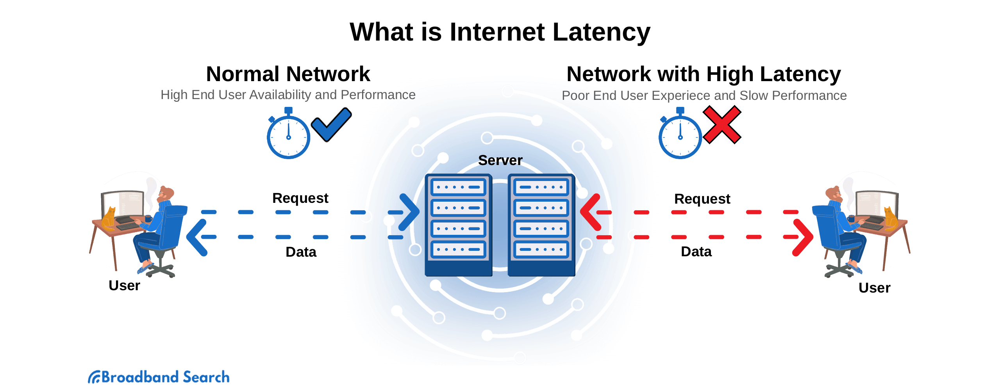

In the fast-paced world of algorithmic trading, even the smallest delays can lead to significant losses. Latency, defined as the delay between the initiation of a trade order and its execution, is a critical factor that can greatly impact trading performance. In high-frequency trading environments, where numerous trades are executed in milliseconds, latency can reduce profits or cause missed trading opportunities.

Understanding latency and its challenges is crucial for traders and firms aiming to optimize their trading outcomes. Latency can occur at various points within the trading process—from the time data is received, through its processing, to the moment an order is executed on the exchange. This invisible barrier to optimal trading performance often goes unnoticed, yet gaining insight into it can offer a competitive edge. 



Identifying latency involves recognizing its potential causes, which can include network delays, hardware limitations, or software inefficiencies. Network delays involve the time taken for data packets to travel between systems and exchanges, which can be influenced by physical distance and network congestion. Hardware limitations arise when outdated or insufficiently powerful equipment cannot process data swiftly enough. Software inefficiencies may occur due to poorly optimized code, which results in increased processing time.

This article aims to provide readers with an understanding of the causes of latency and introduce solutions to handle this challenge effectively. By exploring how traders and firms can identify and mitigate latency issues, the article highlights the importance of managing latency to enhance trading performance and efficiency. Through strategic measures such as upgrading hardware, optimizing code, and improving network conditions, traders can ensure more timely execution of trades, ultimately leading to better trading outcomes. Join us in exploring these critical aspects of algorithmic trading and discover how effectively managing latency can lead to improved trading strategies and results.

## Table of Contents

## What is Latency in the Context of Algorithmic Trading?

Latency, in the context of algorithmic trading, refers to the time delay that occurs between the initiation of a trading command and its execution. This delay can have significant implications for the realization and performance of trading strategies. In high-frequency trading environments, where decisions are made in fractions of a second, even a few milliseconds of latency can lead to missed trades or reduced profitability. Therefore, minimizing latency is a critical objective for traders seeking to enhance execution efficiency and optimize returns.

Latency can be broken down into several components, each contributing to the overall delay experienced in a trading system. These components include network latency, processing latency, and, sometimes, other operational delays. Network latency refers to the time taken for data to travel between trading systems and exchanges. This can be affected by the physical distance between the parties involved and the quality of the network infrastructure. Processing latency, on the other hand, stems from the time taken by a trading system's hardware and software to process incoming data and generate trading orders. This component can be particularly significant if the system is dealing with large volumes of data or conducting complex calculations.

Understanding the nuances of latency is essential for traders because it directly affects the timing and execution quality of trades. For example, consider a high-frequency trading system that identifies [arbitrage](/wiki/arbitrage) opportunities across multiple markets. If latency causes a delay in executing trades, the system may miss out on profitable opportunities that arise and diminish due to the dynamic nature of financial markets. Similarly, a trading algorithm designed to react to news events might underperform if latency causes delayed data processing, resulting in orders being placed after significant price movements have occurred.

Addressing latency involves both measuring and mitigating it. Accurate measurement is crucial for identifying bottlenecks within the trading system and quantifying the effect of various latency sources. Metrics such as round-trip time (RTT), which measures the time taken for a signal to travel to its destination and back, are often used to gauge network latency. Processing latency can be evaluated by analyzing the execution time of specific components within the trading software. 

Practical measures to reduce latency often include upgrading hardware to ensure high processing speeds, optimizing code to increase the efficiency of trading algorithms, and improving network paths for faster data transmission. These efforts can enhance the timeliness of trade executions, potentially leading to better trading outcomes.

In conclusion, latency is an invisible yet powerful [factor](/wiki/factor-investing) that can influence the success of [algorithmic trading](/wiki/algorithmic-trading) strategies. By understanding and addressing latency, traders can refine their systems for faster and more accurate trade execution, thereby maintaining a competitive advantage in a rapidly evolving financial landscape.

## Causes of Latency in Algo Trading

Several factors contribute to latency in algorithmic trading, and each requires specific mitigation strategies. Addressing these issues is crucial for optimizing trading performance and ensuring the timely execution of trades.

### Network Delays
Network delays are a primary source of latency in algorithmic trading. These delays occur due to the time it takes for data to travel between trading systems and exchanges. The physical distance between trading servers and exchanges, as well as the speed and capacity of communication networks, can significantly impact overall latency. To minimize these delays, traders often place servers in close proximity to exchanges in a practice known as co-location. This geographical strategy helps reduce the physical distance data must travel, thus reducing transmission time.

### Hardware Limitations
Hardware limitations can also result in increased latency. Outdated or slow hardware affects data processing and execution speeds. Trading systems relying on older CPUs, memory, or storage solutions are more likely to struggle with high-frequency data processing demands. Upgrading to modern, high-performance hardware can alleviate these bottlenecks. For instance, using low-latency network cards and solid-state drives (SSDs) can improve data read/write times and decrease processing delays.

### Software Inefficiencies
Software inefficiencies, particularly unoptimized code, present another source of latency. Executing complex trading strategies with inefficient algorithms can introduce unnecessary delays. For example, suboptimal algorithm designs or redundant code can lead to slower decision-making processes. To address this, developers should prioritize efficient coding practices, employing optimization techniques and profiling tools to identify and minimize latency. Code can be optimized by using compiled languages like C++ for critical sections to reduce execution time.

### Market Data Feed
Delays in receiving or processing market data can critically affect timely decision-making. Market data feeds provide the information necessary to make informed trading decisions, and any lag in this data can lead to missed opportunities or erroneous trades. Factors contributing to data feed delays include network congestion, data processing inefficiencies, and synchronization issues. Implementing high-throughput data processing solutions and ensuring robust network infrastructures can mitigate these challenges. For example, leveraging multi-threading or parallel processing in data handling routines can enhance the speed and efficiency of data feed processing.

In summary, understanding the causes of latency in algorithmic trading involves examining network delays, hardware limitations, software inefficiencies, and market data feed delays. Each factor interacts with others, potentially compounding overall latency issues, making comprehensive strategies essential for efficient mitigation. By recognizing and addressing these factors, traders can significantly improve their systems' responsiveness and execution performance.

## Measuring Latency in Algorithmic Trading Systems

Accurate measurement of latency in algorithmic trading systems is pivotal for identifying bottlenecks and optimizing performance. Latency, defined as the time delay between the initiation of a trade order and its execution, can be influenced by a variety of factors and must be measured comprehensively to ensure precise identification of inefficiencies.

One of the primary challenges in measuring latency is ensuring that the act of measurement does not itself introduce significant overhead, thereby distorting the metrics. Capturing true latency metrics requires careful design considerations. It involves distinguishing between various types of latency, such as network latency, processing latency, and exchange latency. Each type contributes differently, necessitating a nuanced measurement approach to ensure that the data obtained is both meaningful and actionable.

To practically measure and analyze latency, traders can rely on a combination of timestamping and logging mechanisms. For instance, precise timestamps can be recorded at various stages of the trade lifecycle—from the moment an order is generated to when it is sent to an exchange and ultimately acknowledged. Below is a basic pseudocode example illustrating how such measurements might be implemented:

```python
import time

def measure_latency(order):
    start_time = time.time()  # Record the initial time when the order is generated

    send_order_to_exchange(order)

    # Assuming some mechanism to capture the timestamp of exchange acknowledgment
    acknowledgment_time = receive_exchange_acknowledgment()  

    end_time = time.time()  # Record the time after acknowledgment is received

    total_latency = (acknowledgment_time - start_time)  # Could also incorporate timestamp difference
    processing_latency = (end_time - start_time - network_latency(acknowledgment_time, end_time))

    return total_latency, processing_latency
```

This pseudocode highlights the necessity of measuring both total latency and specific components, such as network and processing latencies. Adopting such detailed measurement strategies aids traders in pinpointing where latency is most impactful and allows for targeted optimization efforts.

Moreover, innovative tools and techniques are available for more sophisticated latency measurement and analysis. Tools like network packet analyzers or specialized software platforms that simulate trading environments can provide deeper insights into latency issues. These platforms help traders model different scenarios and measure their impact on trading performance, allowing for robust testing and iterative improvements.

In summary, measuring latency in algorithmic trading systems involves overcoming challenges related to avoiding overhead while capturing accurate metrics. Through effective use of timestamps, logging, and advanced tools, traders can gain a clear view of their system's performance, enabling them to identify bottlenecks and apply corrective strategies efficiently.

## Solutions to Overcome Latency Issues

In addressing latency issues in algorithmic trading, traders can implement a variety of strategies to optimize system performance and ensure rapid execution of trades. One of the primary solutions involves upgrading hardware. High-performance computing hardware, such as servers equipped with the latest processors, solid-state drives (SSDs), and increased RAM, can significantly reduce the time taken to process trade orders. Additionally, leveraging hardware acceleration through Field Programmable Gate Arrays (FPGAs) or Graphics Processing Units (GPUs) can further decrease latency by offloading computationally intensive tasks from the CPU.

Optimizing network paths is another critical strategy. Traders should ensure that their network connections to exchanges are as direct as possible to minimize the distance data must travel. This can be achieved by colocating servers near exchange data centers, thereby reducing the latency introduced by physical distance. Furthermore, utilizing high-speed network technologies, such as 10-gigabit Ethernet or InfiniBand, can enhance data transfer speeds.

Efficient coding practices are essential for minimizing software-induced delays. This involves writing optimized code that reduces unnecessary data processing and employs multithreading to parallelize tasks. Tools such as Python’s `multiprocessing` module or C++’s threading library can be leveraged to achieve this. Here is an example of how efficient coding can be implemented in Python:

```python
from multiprocessing import Pool

def process_trade_data(data_chunk):
    # Process a chunk of trade data
    return [process_trade(trade) for trade in data_chunk]

if __name__ == '__main__':
    trade_data = load_trade_data()
    with Pool(processes=4) as pool:
        results = pool.map(process_trade_data, split_into_chunks(trade_data))
```

Utilizing specialized trading software that is designed for low-latency environments can also yield positive results. Such software often includes features like low-latency market data feed handlers and fast order routing capabilities.

A comprehensive cost-benefit analysis is crucial when considering upgrades or new strategies. Traders must weigh the costs of new hardware and software solutions against the potential gains in trading efficiency and profit. This involves evaluating the return on investment (ROI) from reduced latency and improved trade execution.

Recent advancements in low-latency technologies, such as quantum computing and [machine learning](/wiki/machine-learning) algorithms designed for rapid decision-making, present new opportunities. Quantum algorithms, for instance, can potentially solve complex calculations at unprecedented speeds, while machine learning can optimize trading strategies in real-time.

By integrating these solutions, traders can significantly mitigate latency, thereby improving the efficiency and profitability of their algorithmic trading systems. Understanding and implementing the latest technologies not only addresses current latency challenges but also prepares traders for future developments in the fast-evolving trading landscape.

## Conclusion

Managing latency is essential for the effective functioning of algorithmic trading strategies. Latency, characterized by the time lapse between the initiation and execution of trade commands, plays a critical role in the execution performance and profitability of trading strategies. Recognizing the causes and effects of latency allows traders to make informed decisions that significantly enhance their competitiveness in the financial markets.

By applying the insights from this analysis, traders can adeptly position their trading systems to swiftly and efficiently handle dynamic market changes. This not only involves understanding the technical aspects that contribute to latency, such as network delays, hardware limitations, and software inefficiencies but also developing strategic solutions to mitigate these issues. For instance, upgrading to high-performance computing resources, optimizing algorithmic codes, and employing advanced network solutions can substantially reduce latency.

Continuous assessment and improvement of trading systems are imperative to maintaining a competitive edge. This involves regular monitoring, measuring latency accurately, and making iterative enhancements based on the latest technological advancements. Employing innovative tools and techniques for latency measurement and reduction ensures that trading systems remain robust and responsive.

Ultimately, this discussion aims to empower algorithmic traders by equipping them with the necessary knowledge to confront latency challenges effectively. Armed with a comprehensive understanding of latency dynamics and equipped with practical solutions, traders can significantly improve their trading outcomes and maintain a lead in high-frequency trading environments.

## References & Further Reading

[1]: Aldridge, I. (2013). ["High-Frequency Trading: A Practical Guide to Algorithmic Strategies and Trading Systems."](https://www.wiley.com/en-us/High+Frequency+Trading%3A+A+Practical+Guide+to+Algorithmic+Strategies+and+Trading+Systems%2C+2nd+Edition-p-9781118343500) Wiley.

[2]: Derman, E. (2016). ["My Life as a Quant: Reflections on Physics and Finance."](https://download.e-bookshelf.de/download/0000/5845/30/L-G-0000584530-0002384412.pdf) Wiley.

[3]: McPartland, J., & Salinger, M. (2016). ["How Centralized Exchange Latency Affects Arbitrage: An Empirical Analysis."](https://scholar.google.com/citations?user=vU7P7WUAAAAJ&hl=en) Federal Reserve Bank of Chicago.

[4]: Duffie, D. (2010). ["Dynamic Asset Pricing Theory."](https://www.semanticscholar.org/paper/Dynamic-Asset-Pricing-Theory-Duffie/baa776c75062e0506a8e739fda10dc409e340aad) Princeton University Press.

[5]: Kissell, R. (2014). ["The Science of Algorithmic Trading and Portfolio Management."](https://www.sciencedirect.com/book/9780124016897/the-science-of-algorithmic-trading-and-portfolio-management) Academic Press.