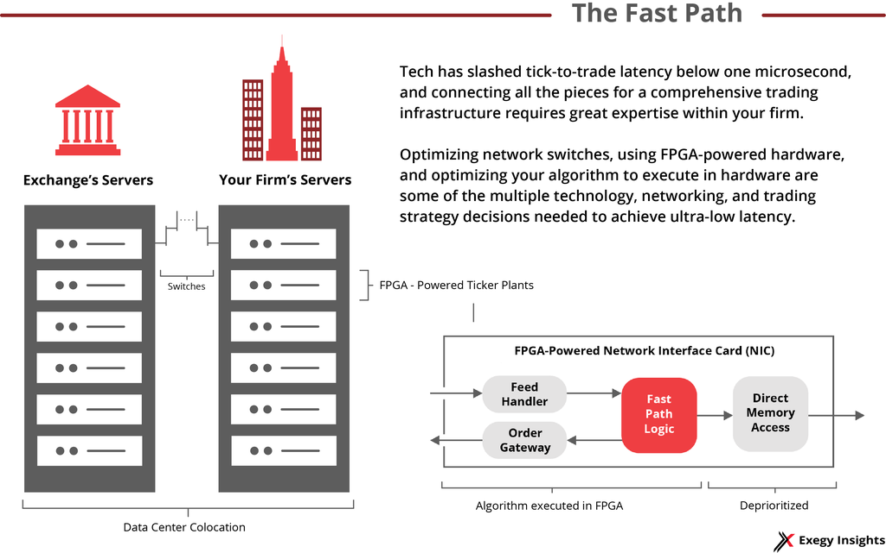

## Table of Contents

## What is latency in the context of trading?

Latency in trading refers to the time it takes for a trade to be executed after an order is placed. This delay can happen because of different reasons, like the speed of the internet, how fast the trading platform works, or how quickly the exchange processes the order. For traders, especially those who trade very quickly, even a small delay can make a big difference in their profits or losses.

In the world of high-frequency trading, where trades are made in milliseconds, latency is super important. Traders use special tools and technology to make their trades as fast as possible. They might even set up their computers very close to the exchange's servers to cut down on latency. This way, they can buy or sell stocks faster than others, which can give them an advantage in the market.

## Why is latency sensitivity important in trading?

Latency sensitivity is important in trading because it can affect how much money traders make or lose. When traders place an order, they want it to happen as fast as possible. If there's a delay, the price of the stock might change before their order goes through. This means they might end up buying or selling at a worse price than they planned. For people who trade a lot and quickly, even a tiny delay can add up to big differences in their profits or losses.

In high-frequency trading, where trades happen in milliseconds, being sensitive to latency is even more crucial. These traders use special computers and technology to make their trades faster than everyone else. They might even put their computers right next to the exchange's servers to cut down on any delays. By being faster, they can get better prices and make more money. So, understanding and reducing latency can give traders a big advantage in the market.

## How does latency affect trading performance?

Latency affects trading performance by causing delays between when a trader places an order and when it gets executed. This delay can make a big difference in how much money a trader makes or loses. If the price of a stock changes quickly, a slow order might mean buying or selling at a worse price than planned. For traders who make a lot of trades in a short time, even a small delay can add up and affect their overall profits.

In high-frequency trading, where trades happen in milliseconds, latency is super important. These traders use special technology to make their trades as fast as possible. They might even put their computers very close to the exchange's servers to cut down on any delays. By being faster, they can get better prices and make more money. So, keeping latency low can give traders a big advantage in the market.

## What are common sources of latency in trading systems?

Latency in trading systems can come from many places. One big source is the internet. When traders send orders over the internet, it takes time for the data to travel from their computer to the exchange's server. If the internet connection is slow or there's a lot of traffic, this can cause delays. Another source of latency is the trading platform itself. If the software is not fast enough or if it's handling a lot of orders at once, it can slow down the process of sending and receiving orders.

Another common source of latency is the exchange's own systems. When an order reaches the exchange, it has to be processed and matched with other orders. If the exchange's computers are busy or not very fast, this can add more delay. Finally, the physical distance between the trader's computer and the exchange's server can also cause latency. The farther apart they are, the longer it takes for data to travel back and forth. Traders who want to reduce latency often try to get as close as possible to the exchange's servers.

## What are the differences between high-frequency trading (HFT) and low-latency trading?

High-frequency trading ([HFT](/wiki/high-frequency-trading-strategies)) and low-latency trading are related but different ideas. HFT is a type of trading where computers make a lot of trades very quickly, often in milliseconds. The goal of HFT is to take advantage of tiny price changes in the market. Traders using HFT rely on fast computers and special algorithms to buy and sell stocks faster than other traders. This means they need to keep latency, or the time it takes for a trade to happen, as low as possible.

Low-latency trading, on the other hand, focuses on reducing the time it takes for trades to happen, no matter what kind of trading strategy is used. It's all about making sure that the time between placing an order and it being executed is as short as possible. Low-latency trading can be important for any trader, not just those doing HFT. While HFT traders need low latency to make their strategies work, other traders might use low-latency systems to get better prices or to react quickly to market changes.

## How can traders measure latency in their trading systems?

Traders can measure latency in their trading systems by looking at how long it takes for their orders to go from their computer to the exchange and back. They can use special tools called latency monitors or ping tools to do this. These tools send a signal from the trader's computer to the exchange's server and then measure how long it takes for the signal to come back. By doing this over and over again, traders can get an average latency number and see if it changes over time.

Another way to measure latency is by using timestamps. When a trader sends an order, they can record the exact time it was sent. Then, when the order is executed, they can record the time it was filled. By comparing these two times, traders can figure out the latency of their system. This method helps them see not just the overall latency but also how it might change during different times of the day or when the market is very busy.

## What technologies are used to reduce latency in trading?

Traders use special technologies to make their trades happen faster. One important technology is called co-location. This means putting the trader's computer very close to the exchange's servers. By doing this, the time it takes for data to travel back and forth is much shorter. Another technology is called FPGA, which stands for Field-Programmable Gate Array. FPGAs are special chips that can be programmed to do trading tasks very quickly, even faster than regular computers.

Another way to reduce latency is by using high-speed networks. These networks can send data very fast, which helps orders get to the exchange quicker. Traders also use special software that's made to be very fast. This software can handle a lot of orders without slowing down. By using all these technologies together, traders can make their trades happen with as little delay as possible, which can help them make more money.

## How do co-location services help in reducing latency?

Co-location services help reduce latency by letting traders put their computers very close to the exchange's servers. When traders are far away, it takes longer for their orders to travel over the internet. By being close, the time it takes for data to go back and forth is much shorter. This means traders can get their orders to the exchange faster and get better prices.

Using co-location is really important for traders who need to be very fast, like those doing high-frequency trading. These traders make a lot of trades very quickly, so even a tiny delay can make a big difference. By being right next to the exchange, they can cut down on the time it takes for their trades to happen, which helps them make more money.

## What are the regulatory considerations related to latency in trading?

Regulators keep an eye on latency in trading because they want to make sure the market is fair for everyone. Some traders use special technology to make their trades faster, which can give them an advantage over others. Regulators worry that if some traders can always be faster, it might not be fair for other traders who don't have the same technology. So, they make rules to try to keep things even.

One big rule that regulators have is about how much information traders can share with each other. They don't want traders to use fast technology to get information before others and then use that to make quick trades. This is called front-running, and it's not allowed. Regulators also check to make sure that trading systems are working properly and not causing problems because of too much speed. They want to make sure that everyone has a fair chance in the market, no matter how fast their computers are.

## How do different market structures impact latency sensitivity?

Different market structures can make a big difference in how important latency is for traders. In some markets, like stock exchanges, there are a lot of traders making trades all the time. These markets are very fast and competitive, so even a tiny delay can mean missing out on a good price. Traders in these markets often use special technology to make their trades as fast as possible. They need to be very sensitive to latency because being faster can help them make more money.

Other markets, like some bond markets, might not be as fast or have as many traders. In these markets, latency might not be as important because trades don't happen as quickly. Traders in these markets might not need to worry as much about being the fastest. But if the market starts to get busier or more competitive, then latency can become more important. So, the type of market and how it works can change how much traders need to care about latency.

## What strategies can traders use to mitigate the effects of latency?

Traders can use different strategies to make sure latency doesn't hurt their trading too much. One way is to use co-location services, where they put their computers very close to the exchange's servers. This makes the time it takes for orders to travel back and forth much shorter. Another strategy is to use special technology like FPGAs, which are fast chips that can handle trading tasks quickly. By using these technologies, traders can make their trades happen faster and reduce the impact of latency.

Another approach is to use smart trading algorithms that can predict and adjust to latency. These algorithms can send out orders in a way that takes into account possible delays, so traders can still get good prices even if there's a bit of latency. Traders can also use high-speed networks to send their orders faster. By combining these strategies, traders can make sure that latency doesn't slow them down too much and they can still make good trades.

## How does latency sensitivity vary across different asset classes?

Latency sensitivity can be different for different types of things that people trade, like stocks, bonds, or cryptocurrencies. For stocks, especially in big markets like the New York Stock Exchange, latency is really important. A lot of traders are trying to buy and sell stocks very quickly, so even a tiny delay can mean missing out on a good price. That's why traders in these markets use special technology to make their trades as fast as possible. They need to be very sensitive to latency because being faster can help them make more money.

In other markets, like some bond markets, latency might not be as important. These markets might not have as many traders or as much competition, so trades don't happen as quickly. Traders in these markets might not need to worry as much about being the fastest. But if the market starts to get busier or more competitive, then latency can become more important. So, the type of thing being traded and how the market works can change how much traders need to care about latency.

## References & Further Reading

[1]: Aldridge, I. (2013). ["High-Frequency Trading: A Practical Guide to Algorithmic Strategies and Trading Systems"](https://www.amazon.com/High-Frequency-Trading-Practical-Algorithmic-Strategies/dp/1118343506). Wiley.

[2]: Cartea, Á., Jaimungal, S., & Penalva, J. (2015). ["Algorithmic and High-Frequency Trading"](https://assets.cambridge.org/97811070/91146/frontmatter/9781107091146_frontmatter.pdf). Cambridge University Press.

[3]: Lopez de Prado, M. (2018). ["Advances in Financial Machine Learning"](https://www.amazon.com/Advances-Financial-Machine-Learning-Marcos/dp/1119482089). Wiley.

[4]: Harris, L.E. (2003). ["Trading and Exchanges: Market Microstructure for Practitioners"](https://www.amazon.com/Trading-Exchanges-Market-Microstructure-Practitioners/dp/0195144708). Oxford University Press.

[5]: Vayanos, D., & Wang, J. (2012). ["Market Liquidity: Theory and Empirical Evidence"](http://web.mit.edu/wangj/www/pap/VayanosWang12Empirical.pdf). Journal of Financial Economics.

[6]: Laruelle, S., & Pagès, G. (2013). ["High Frequency Trading"](https://books.google.com/books/about/Market_Microstructure_In_Practice.html?id=Y0i7CgAAQBAJ). ISTE Press - Elsevier.

[7]: Hasbrouck, J., & Saar, G. (2013). ["Low-latency Trading"](https://www.sciencedirect.com/science/article/abs/pii/S1386418113000165). Review of Financial Studies.