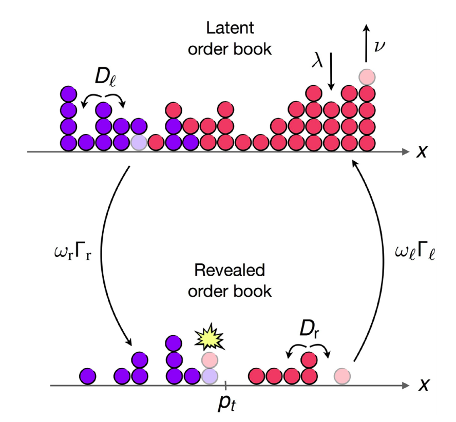

## Table of Contents

## What is latent liquidity?

Latent liquidity refers to the potential for buying and selling assets that isn't immediately visible in the market. It's like having money or assets that you could use to trade, but you haven't used them yet. For example, if you own a valuable painting but haven't put it up for sale, that's latent liquidity. It becomes actual liquidity when you decide to sell the painting and it enters the market.

This concept is important because it can affect how markets work. If a lot of people have assets they could sell but haven't, it means the market could change quickly if they all decide to sell at once. This can make prices go up or down suddenly. Understanding latent liquidity helps investors and traders make better decisions by knowing how much more trading could happen if these hidden assets enter the market.

## How does latent liquidity differ from visible liquidity?

Latent liquidity is like money or things you can sell that are not yet in the market. It's hidden because people haven't decided to sell them yet. For example, if you have a gold coin at home but haven't listed it for sale, that's latent liquidity. It's all about what could happen if people start selling these hidden assets.

Visible [liquidity](/wiki/liquidity-risk-premium), on the other hand, is what you can see right now in the market. It's the money and assets that are already being bought and sold. If you look at a stock market and see how many shares are being traded, that's visible liquidity. It's easy to see and measure because it's already happening.

The main difference is that latent liquidity is potential, while visible liquidity is actual. Latent liquidity can change the market if it becomes visible, but until then, it's just a possibility. Visible liquidity is what's driving the market right now, and it's what traders and investors can count on when making decisions.

## What are the common sources of latent liquidity in financial markets?

One common source of latent liquidity in financial markets is the holdings of institutional investors like pension funds, insurance companies, and mutual funds. These big investors often have large amounts of money and assets that they could sell if they wanted to, but they usually keep them for a long time. For example, a pension fund might own a lot of stocks but not trade them often, so those stocks are part of the market's latent liquidity.

Another source is individual investors who own assets but aren't actively trading them. For instance, someone might have a bunch of shares in a company they believe in, but they're not selling them right now. These shares could enter the market if the owner decides to sell, adding to the market's liquidity. Also, people who own things like real estate or art that could be sold but aren't currently on the market contribute to latent liquidity.

Lastly, companies themselves can be a source of latent liquidity. A company might have extra cash or assets that it could sell if needed, but it's not doing so at the moment. This potential to sell adds to the overall latent liquidity in the market. Understanding these sources helps traders and investors predict how the market might change if these hidden assets start being traded.

## Can you explain the impact of latent liquidity on market dynamics?

Latent liquidity can have a big impact on how the market works. Imagine a lot of people have stocks they could sell but haven't yet. If something big happens, like a company announces good news, these people might decide to sell their stocks all at once. This sudden selling can make the stock price go down quickly, even if the news was good. So, latent liquidity can make the market more unpredictable because it's hard to know when all these hidden assets might start moving.

On the flip side, latent liquidity can also help keep the market stable. If the market starts to go down, people with extra money or assets might decide to buy, which can stop the price from falling too much. For example, if a stock starts to drop, big investors with lots of cash might see it as a good deal and start buying, which can help bring the price back up. So, latent liquidity can act like a safety net, making the market less likely to crash because there's always potential buying power waiting in the wings.

## How can traders identify latent liquidity in a market?

Traders can spot latent liquidity by looking at how much big investors like pension funds and mutual funds are holding. These big investors often own a lot of stocks or other assets but don't trade them often. By checking public reports or financial statements, traders can get a sense of how much of these assets are just sitting there, not being traded. This gives them an idea of how much extra buying or selling power could come into the market if these big investors decide to make a move.

Another way to identify latent liquidity is by watching how the market reacts to big news or events. If a company announces something important and the stock price doesn't move much, it might mean there's a lot of latent liquidity. That's because big investors with lots of shares might be holding onto them, waiting for the right time to sell. If the price stays steady even when it should move, it's a sign that there's hidden buying or selling power in the market that could change things quickly if it starts to move.

## What tools or indicators are used to measure latent liquidity?

Traders use different tools to measure latent liquidity. One common tool is the [order book](/wiki/order-book-trading-strategies), which shows all the buy and sell orders that haven't been filled yet. By looking at the order book, traders can see if there are a lot of big orders waiting to be filled. This can tell them if there's a lot of money or assets that could start moving in the market. Another tool is [volume](/wiki/volume-trading-strategy) analysis, which looks at how many shares or assets are being traded over time. If the trading volume suddenly jumps a lot, it might mean that latent liquidity is turning into visible liquidity.

Another indicator is the market depth, which shows how many buy and sell orders there are at different price levels. If there are a lot of orders at prices far away from the current price, it might mean there's a lot of latent liquidity waiting to come into the market. Traders also use price impact analysis, which measures how much the price moves when big trades happen. If the price doesn't move much even after big trades, it might mean there's a lot of latent liquidity ready to step in and keep the price stable.

## What are the risks associated with relying on latent liquidity?

Relying on latent liquidity can be risky because it's hard to predict when and if it will turn into actual trading. Imagine you think a lot of people have stocks they could sell, but they never do. If you make trading decisions based on this idea, you might be wrong, and your trades could lose money. For example, if you think a stock won't drop much because big investors will buy it, but they don't, the stock could fall more than you expected.

Another risk is that if everyone with latent liquidity decides to trade at the same time, it can cause big, sudden changes in the market. This can make prices go up or down really fast, which is hard to handle. If you're not ready for these quick changes, your trading plans could fail, and you might lose money. So, while latent liquidity can help keep the market stable, it can also make things very unpredictable if it suddenly becomes visible liquidity.

## How does latent liquidity affect price discovery and market efficiency?

Latent liquidity can make it harder for the market to figure out the right price for things. When a lot of people have stocks or other assets they could sell but haven't yet, it's like having a bunch of hidden money in the market. If these people start selling all at once, it can make prices change quickly. This means that the price you see in the market might not be the real price because it doesn't show all the buying and selling that could happen. So, latent liquidity can make it tough for the market to find the true value of things.

On the other hand, latent liquidity can help make the market work better by keeping things stable. If the market starts to go down, people with extra money or assets might start buying, which can stop the price from falling too much. This can make the market more efficient because it helps keep prices from swinging too wildly. But it's a tricky balance because if too much latent liquidity turns into real trading at the same time, it can still cause big price changes. So, while latent liquidity can help the market find the right price by smoothing things out, it can also make the process more complicated.

## Can you discuss any historical examples where latent liquidity played a significant role?

One historical example where latent liquidity played a big role was during the 2008 financial crisis. Before the crisis hit, a lot of banks and financial institutions had investments in things like mortgage-backed securities. These were seen as safe investments, so many big investors held onto them without trading them much. This was latent liquidity because these assets could be sold but weren't. When the housing market started to crash, everyone realized these securities weren't as safe as they thought. Suddenly, all these big investors wanted to sell their securities at the same time, turning latent liquidity into real selling pressure. This sudden flood of selling made prices drop fast and helped make the crisis even worse.

Another example happened in the stock market crash of 1987, known as Black Monday. Before the crash, many investors had a lot of stocks they could sell but weren't selling. They were waiting for the right time. On October 19, 1987, the market started to drop, and all these investors decided to sell their stocks at once. This turned all that latent liquidity into real selling, and the market fell a lot in one day. It showed how dangerous it can be when a lot of hidden selling power comes into the market all at once.

## What strategies can be employed to effectively tap into latent liquidity?

One strategy to tap into latent liquidity is to watch big investors like pension funds and mutual funds. These big investors often have lots of stocks or other assets they could sell but usually don't trade them much. By keeping an eye on their public reports or financial statements, you can get a sense of what they're holding. If you think they might start selling or buying soon, you can make your trades before they do, hoping to benefit from the price changes that could happen when their latent liquidity turns into real trading.

Another way is to use tools like the order book and volume analysis. The order book shows all the buy and sell orders that haven't been filled yet. If you see a lot of big orders waiting, it might mean there's a lot of latent liquidity ready to move. Volume analysis can help too. If the trading volume suddenly jumps a lot, it could mean that latent liquidity is starting to become visible. By using these tools, you can try to predict when latent liquidity might turn into real trading and make your moves at the right time.

## How do regulatory frameworks address the issue of latent liquidity?

Regulatory frameworks try to keep markets fair and safe, and they do this by making rules about how much information people have to share. For example, big investors like pension funds and mutual funds have to report what they own and how much they're trading. This helps everyone see some of the latent liquidity in the market. By making this information public, regulators hope to reduce surprises and make the market more predictable. It's like shining a light on the hidden money and assets, so people can make better trading decisions.

Sometimes, regulators also make rules to stop big investors from suddenly selling a lot of their assets at once, which could cause big price changes. They might set limits on how much can be sold in a short time or require more time between big trades. These rules aim to keep the market stable by slowly turning latent liquidity into visible liquidity. This way, the market can adjust more smoothly to big changes, and it's less likely to crash because of sudden selling.

## What are the current research trends and future directions in the study of latent liquidity?

Researchers are looking into how to better predict when latent liquidity will turn into real trading. They're using new tools like [machine learning](/wiki/machine-learning) and big data to study patterns in the market. They want to understand how big investors behave and what makes them decide to buy or sell their hidden assets. By doing this, they hope to create better models that can help traders and investors make smarter decisions. They're also studying how different types of assets, like stocks, bonds, and cryptocurrencies, have different levels of latent liquidity and how this affects the market.

In the future, research might focus on how global events and technology changes affect latent liquidity. For example, things like economic policies, world news, and new trading platforms can change how much latent liquidity is out there and when it turns into real trading. Researchers will keep working on making their models more accurate and useful. They also want to find ways to use this information to make markets more stable and fair for everyone. By understanding latent liquidity better, they hope to help prevent big market crashes and make trading safer.

## What are the Mechanics of Liquidity-Taking Strategies?

Liquidity-taking strategies in [algorithmic trading](/wiki/algorithmic-trading) are executed primarily through the use of market orders. These strategies focus on immediate execution, capitalizing on the current liquidity available in the market. Market orders do not specify a price; they instruct the broker to buy or sell a specific quantity at the best available price, ensuring swift execution. This immediacy is essential in environments where price movements can occur in fractions of a second, a characteristic of high-frequency trading ([HFT](/wiki/high-frequency-trading-strategies)).

The success of liquidity-taking strategies is heavily influenced by the accuracy of market data and the system's ability to process this data with minimal latency. Market data accuracy ensures traders have a precise understanding of the current market state, including price levels and order book depths. Latency, the delay between receipt of market data and the execution of a trading decision, is another critical [factor](/wiki/factor-investing). Low latency enables traders to respond more rapidly to market changes, thus enhancing their capacity to extract liquidity before prices shift.

High-frequency trading algorithms, crucial to the mechanics of liquidity-taking strategies, are designed to monitor market data streams continuously and execute trades in microseconds. These algorithms often employ sophisticated signal processing and statistical models to identify and act on fleeting opportunities. For instance, they might utilize order book data to gauge liquidity levels, anticipating how an incoming market order might impact the market.

The foundation of these strategies can be represented by the formula for the expected impact cost of executing a market order, which can be approximated as:

$$
\text{Impact Cost} = \frac{\alpha \cdot V}{D}
$$

where $\alpha$ represents the trader's aggressiveness, $V$ is the order volume, and $D$ signifies market depth. This formula indicates that higher aggressiveness and order volumes increase the impact cost, while greater market depth can mitigate it.

In practice, implementing such strategies in Python might involve using libraries and APIs that provide real-time market data and trading functionalities. The following is a simple illustration:

```python
import requests
import time

# Pseudo-function for market data retrieval
def get_market_data():
    response = requests.get('https://api.marketdata.provider/markets')
    return response.json()

# Pseudo-function to place a market order
def place_market_order(side, quantity):
    order_details = {
        'side': side,
        'quantity': quantity
    }
    response = requests.post('https://api.marketdata.provider/orders', json=order_details)
    return response.json()

while True:
    market_data = get_market_data()
    # Logic to identify trading signals
    if condition_met(market_data):
        place_market_order('buy', 100)  # Example market order
    time.sleep(0.001)  # 1 millisecond loop delay
```

This code segment highlights the continuous cycle of acquiring market data, assessing conditions, and executing market orders. It emphasizes low-latency execution, a cornerstone for exploiting latent liquidity effectively.

In conclusion, the core mechanics of liquidity-taking strategies involve precise execution using market orders, driven by accurate market data and low latency infrastructure, often supported by high-frequency trading algorithms designed for quick decision-making and execution in competitive financial environments.

## References & Further Reading

### Academic Papers and Books

1. **"Algorithmic Trading and DMA: An Introduction to Direct Access Trading Strategies"** by Barry Johnson: This book provides a comprehensive guide on the mechanics and strategy development for algorithmic trading, covering both theory and practical implementation.

2. **"High-Frequency Trading: A Practical Guide to Algorithmic Strategies and Trading Systems"** by Irene Aldridge: This book delves into high-frequency trading systems and strategies, offering insights into the technology and tools necessary for success in the fast-paced trading environment.

3. **"Quantitative Trading: How to Build Your Own Algorithmic Trading Business"** by Ernie Chan: This book is an essential resource for understanding the process of developing and running quantitative trading strategies, including risk management and system design.

4. **"The Science of Algorithmic Trading and Portfolio Management"** by Robert Kissell: A detailed exploration into the quantitative methods used in algorithmic trading and portfolio management, with an emphasis on statistical techniques and computational tools.

5. **Research Paper: "Market Microstructure: A Survey" by Ananth Madhavan**: This paper provides a thorough overview of market microstructure theory and its application in understanding the dynamics of liquidity and price formation.

### Online Resources

1. **Quantitative Finance Courses on Coursera and edX**: These platforms offer numerous courses on algorithmic trading, financial markets, and quantitative methods, often in partnership with leading universities.

2. **Khan Academy - Finance and Capital Markets**: A free resource offering courses on the basics of financial markets, including key concepts that underpin algorithmic strategies.

3. **QuantInsti's Executive Program in Algorithmic Trading (EPAT)**: A specialized program designed to provide in-depth knowledge and skills in algorithmic trading, including topics such as machine learning, technical analysis, and risk management.

### Data Providers and Tools

1. **Databento**: A data provider offering real-time and historical market data with an emphasis on ease of access and integration into algorithmic trading systems. It supports Python for seamless data handling and analysis.

2. **QuantConnect**: A platform for algorithmic trading that allows testing and deployment of trading strategies using Python. It provides vast historical data and a robust backtesting environment.

3. **Alpaca**: A commission-free trading platform with API access for building and testing algorithmic trading strategies. Alpaca provides both real-time and historical data, ideal for implementing liquidity-taking strategies.

By exploring these resources, traders and researchers can enhance their understanding of algorithmic trading and liquidity strategies, equipping themselves with the knowledge to develop and refine their trading systems.

