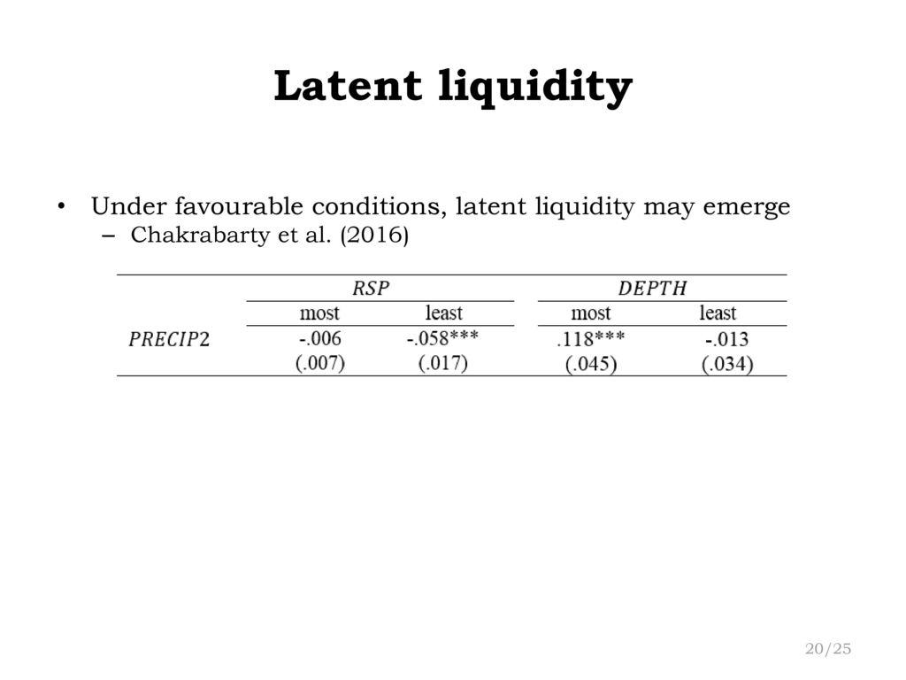

Algorithmic trading has significantly transformed the landscape of financial markets by utilizing advanced computational and mathematical models to make informed trading decisions. In particular, liquidity-taking strategies have emerged as vital components within the sphere of high-frequency trading (HFT). These strategies rely on the execution of market orders designed to seize available liquidity, doing so with remarkable speed and precision. As a consequence, they have become integral tools for traders seeking to capitalize on fleeting opportunities in the market.

A central concept in this context is latent liquidity, which pertains to the hidden layers of liquidity that can be uncovered and exploited through sophisticated algorithmic strategies. The ability to access and utilize latent liquidity can substantially enhance the efficacy of trading operations by facilitating rapid and efficient execution. Thus, understanding the intricacies of latent liquidity and its integration into algorithmic trading is crucial for traders aiming to achieve a competitive edge.



By exploring the dynamics and implications of latent liquidity, this article seeks to provide insights into its role within financial markets. It will examine key elements such as how these strategies are implemented, their impact on trading outcomes, and the technological advancements that continue to shape their evolution. Through this exploration, the article aims to underscore the strategic advantages offered by liquidity-taking strategies and to highlight their significant contribution to the ongoing development of algorithmic trading practices.

## Table of Contents

## Understanding Latent Liquidity

Latent liquidity represents the underlying, unseen potential within financial markets that can be tapped into through the application of sophisticated algorithmic trading strategies. Unlike visible liquidity, which is immediately apparent through current market orders, latent liquidity resides in the orders that are not visible in the order book, such as those that have not yet been submitted or are conditional on specific market conditions being met. The ability to identify and exploit latent liquidity enables traders to execute orders with greater speed and efficiency, often yielding a competitive edge in fast-paced trading environments.

Understanding latent liquidity is of paramount importance for market participants, particularly those engaged in high-frequency trading (HFT), as it enhances their ability to execute trades at optimal prices while minimizing market impact. HFT strategies, such as liquidity-taking algorithms, often seek to capture this concealed liquidity by implementing data-driven approaches to predict and act on these hidden market opportunities. 

A fundamental aspect of leveraging latent liquidity involves the analysis of market microstructure elements, like order book dynamics and trade flow patterns. Through sophisticated statistical models and machine learning techniques, traders can predict the availability and behavior of latent liquidity. These models often incorporate historical data and real-time feeds to improve the accuracy of predictions. For example, machine learning models might analyze the temporal correlation between visible and latent orders or detect patterns that precede the emergence of latent liquidity.

Algorithmic trading strategies targeting latent [liquidity](/wiki/liquidity-risk-premium) also consider factors like [order book](/wiki/order-book-trading-strategies) depth and [volume](/wiki/volume-trading-strategy) at various price levels. Here, computational techniques are employed to estimate the probability of hidden orders being executed when specific price points are breached. This probability can be mathematically modeled using techniques such as stochastic calculus, where the likelihood of order fulfillment is derived from price movement data and [volatility](/wiki/volatility-trading-strategies) estimates.

A Python implementation may involve using libraries such as NumPy or pandas to process large datasets efficiently, while [machine learning](/wiki/machine-learning) frameworks like TensorFlow or PyTorch can model and predict latent liquidity patterns. Here is a simplified example of how one might use Python to explore latent liquidity:

```python
import pandas as pd
import numpy as np
from sklearn.linear_model import LinearRegression

# Sample data loading
order_data = pd.read_csv('order_book_data.csv')

# Feature engineering
order_data['price_change'] = order_data['ask_price'] - order_data['bid_price']
order_data['volume_imbalance'] = order_data['ask_volume'] - order_data['bid_volume']

# Define predictors and response variable
X = order_data[['price_change', 'volume_imbalance']]
y = order_data['latent_liquidity_signal']

# Modeling latent liquidity
model = LinearRegression()
model.fit(X, y)

# Predict potential latent liquidity
predictions = model.predict(X)

print(f"Predicted latent liquidity signals:\n{predictions}")
```

This approach emphasizes the integration of statistical analysis with [algorithmic trading](/wiki/algorithmic-trading) to uncover and utilize the hidden liquidity present within markets, ultimately striving for improved trade execution. By mastering the concept of latent liquidity, traders can significantly enhance their trading performance and capitalize on opportunities that remain invisible to less sophisticated market participants.

## Types of Algorithmic Trading Strategies

Algorithmic trading strategies are generally categorized into two groups: aggressive and passive. Aggressive strategies are aimed at taking advantage of temporary inefficiencies or opportunities in the market, often prioritizing speed and precision. In contrast, passive strategies focus on minimizing market impact and achieving optimal execution prices over a longer timeframe.

Within aggressive strategies, liquidity-taking strategies are paramount. These involve placing market orders to rapidly seize available liquidity. By design, they aim to capitalize on short-lived opportunities by executing trades immediately at the current market price. This requires not only speed but also robust systems capable of handling large volumes of data with minimal latency. The intensive nature of these strategies typically positions them as high-frequency trading ([HFT](/wiki/high-frequency-trading-strategies)) techniques, often employed to exploit minute price discrepancies.

Comparatively, liquidity-providing strategies involve placing limit orders that add liquidity to the market. These orders wait to be matched with incoming market orders, essentially offering liquidity to other traders. This type of strategy is beneficial in markets where the trader anticipates slight price movements or aims to earn a spread between the bid and ask prices. While liquidity-taking strategies are generally considered more aggressive due to their immediate execution nature, liquidity-providing strategies can be viewed as more conservative, focusing on the accumulation of small profits over a more extended period.

The fundamental difference between liquidity-taking and liquidity-providing strategies lies in their approach to market interaction. Liquidity-taking strategies actively consume existing market liquidity, while liquidity-providing strategies contribute to it. Each approach carries unique risk profiles and requires distinct technological and analytical capabilities to optimize execution and manage costs effectively.

## Mechanics of Liquidity-Taking Strategies

Liquidity-taking strategies in algorithmic trading are executed primarily through the use of market orders. These strategies focus on immediate execution, capitalizing on the current liquidity available in the market. Market orders do not specify a price; they instruct the broker to buy or sell a specific quantity at the best available price, ensuring swift execution. This immediacy is essential in environments where price movements can occur in fractions of a second, a characteristic of high-frequency trading (HFT).

The success of liquidity-taking strategies is heavily influenced by the accuracy of market data and the system's ability to process this data with minimal latency. Market data accuracy ensures traders have a precise understanding of the current market state, including price levels and order book depths. Latency, the delay between receipt of market data and the execution of a trading decision, is another critical [factor](/wiki/factor-investing). Low latency enables traders to respond more rapidly to market changes, thus enhancing their capacity to extract liquidity before prices shift.

High-frequency trading algorithms, crucial to the mechanics of liquidity-taking strategies, are designed to monitor market data streams continuously and execute trades in microseconds. These algorithms often employ sophisticated signal processing and statistical models to identify and act on fleeting opportunities. For instance, they might utilize order book data to gauge liquidity levels, anticipating how an incoming market order might impact the market.

The foundation of these strategies can be represented by the formula for the expected impact cost of executing a market order, which can be approximated as:

$$
\text{Impact Cost} = \frac{\alpha \cdot V}{D}
$$

where $\alpha$ represents the trader's aggressiveness, $V$ is the order volume, and $D$ signifies market depth. This formula indicates that higher aggressiveness and order volumes increase the impact cost, while greater market depth can mitigate it.

In practice, implementing such strategies in Python might involve using libraries and APIs that provide real-time market data and trading functionalities. The following is a simple illustration:

```python
import requests
import time

# Pseudo-function for market data retrieval
def get_market_data():
    response = requests.get('https://api.marketdata.provider/markets')
    return response.json()

# Pseudo-function to place a market order
def place_market_order(side, quantity):
    order_details = {
        'side': side,
        'quantity': quantity
    }
    response = requests.post('https://api.marketdata.provider/orders', json=order_details)
    return response.json()

while True:
    market_data = get_market_data()
    # Logic to identify trading signals
    if condition_met(market_data):
        place_market_order('buy', 100)  # Example market order
    time.sleep(0.001)  # 1 millisecond loop delay
```

This code segment highlights the continuous cycle of acquiring market data, assessing conditions, and executing market orders. It emphasizes low-latency execution, a cornerstone for exploiting latent liquidity effectively.

In conclusion, the core mechanics of liquidity-taking strategies involve precise execution using market orders, driven by accurate market data and low latency infrastructure, often supported by high-frequency trading algorithms designed for quick decision-making and execution in competitive financial environments.

## Trading Rules and Execution Logic

Formulating trading rules aimed at capturing latent liquidity involves designing strategies that can effectively identify and exploit hidden market capacity. The process can be intricate, focusing on several key aspects like order book analysis and managing latency, both critical in high-frequency trading environments.

Order book analysis forms the backbone of understanding market liquidity. Traders leverage sophisticated models to detect order book imbalances, indicative of latent liquidity. These imbalances occur when there's a discrepancy between buy and sell orders at various price levels, suggesting potential price movements. By evaluating bid-ask spreads and depth, traders can devise rules that target these liquidity pockets. For example, if there is a substantial volume of buy orders at a given price with significantly fewer sell orders, a liquidity-taking strategy might formulate a market order to capitalize on the anticipated price rise.

Latency considerations are paramount in executing liquidity-taking strategies efficiently. Minimal delay in data acquisition and order execution ensures that the intended strategy is deployed before market conditions shift. High-frequency traders often rely on state-of-the-art technology to monitor and act upon market data with minimal lag.

Python has emerged as a preferred tool for implementing trade logic due to its rich ecosystem of libraries and ease of integration with data tools. Databento, a data platform offering comprehensive market data, can be utilized to streamline the data feeding process critical for real-time decision-making.

For instance, a simple Python script might use a websocket connection to continuously stream order book data. Utilizing libraries such as `pandas` and `numpy`, traders can process this data to identify patterns indicative of latent liquidity. Here's a basic example of how one might implement a strategy that reacts to order book imbalances:

```python
import pandas as pd
import numpy as np
import websocket

# Placeholder function to connect to a streaming data source
def connect_to_market_data():
    # Establish connection
    pass

# Function to process incoming market data
def process_order_book_data(data):
    order_book = pd.DataFrame(data)
    # Example calculation of order book imbalance
    imbalance = order_book['bid_size'].sum() - order_book['ask_size'].sum()
    return imbalance

def execute_trade(imbalance, threshold=100):
    if imbalance > threshold:
        # Logic for placing market order
        print("Executing buy order due to high order book imbalance")
    elif imbalance < -threshold:
        # Logic for placing sell order
        print("Executing sell order due to high order book imbalance")

# Example WebSocket usage to continuously receive data
ws = websocket.WebSocketApp("wss://example.dataprovider",
                            on_message=lambda ws, msg: execute_trade(process_order_book_data(msg)))

ws.run_forever()
```

This script highlights a simplistic approach to identifying order book imbalances and executing a corresponding trade. Real-world applications would include more sophisticated decision-making algorithms, improved latency handling mechanisms, and comprehensive risk management strategies. Using platforms like Databento facilitates access to high-quality data, enabling more precise and efficient algorithmic strategies.

## Real-World Application and Case Studies

In the fast-paced environment of financial markets, liquidity-taking strategies have proven to be a formidable component of algorithmic trading. Various case studies have showcased the potential of these strategies, highlighting their capacity to unlock hidden market liquidity and deliver competitive advantages to traders. 

One notable example involves the use of liquidity-taking strategies during periods of market volatility. During such times, traditional liquidity providers might retract from the market due to increased uncertainty, resulting in wider spreads and reduced visible liquidity. In these scenarios, advanced algorithms that execute liquidity-taking strategies can identify and capitalize on latent liquidity—orders that are not immediately visible in the order book—by rapidly placing market orders to match these hidden reserves.

A study conducted on U.S. equity markets found that traders employing sophisticated liquidity-taking algorithms achieved substantial returns compared to their peers who relied solely on visible liquidity. This success was attributed to the algorithms' ability to quickly interpret market signals and adapt to evolving market conditions, allowing for rapid execution even during price fluctuations.

However, real-world deployments of these strategies are not without challenges. Key among these is the continual evolution of market microstructure. As market participants become more sophisticated, the ability to discern and capture latent liquidity requires continual advancements in algorithmic capabilities. Additionally, periods of extreme market stress, such as during sudden market crashes, can pose significant risks. The congestion of trading systems and increased latencies can hinder the effectiveness of liquidity-taking strategies, potentially leading to execution errors and increased slippage.

To mitigate these challenges, continuous refinement of algorithms is paramount. This includes enhancing data processing speeds and reducing latencies in decision-making processes. Moreover, cross-asset analysis and machine learning techniques are increasingly being integrated to better predict latent liquidity across different market conditions.

Thus, liquidity-taking strategies remain a vital element of modern algorithmic trading, providing a mechanism to uncover hidden liquidity and secure competitive advantages. The ongoing development and adaptation of these strategies are essential in responding to the dynamic nature of financial markets.

## Handling Commissions and Risk

High-frequency trading (HFT) is susceptible to a range of costs that influence its profitability, prominently featuring transaction costs. These expenses include commissions, taxes, and the spread between bid and ask prices. Each component of transaction costs can significantly erode the margins gained from trades, which are often razor-thin in HFT.

To minimize trading expenses, traders employ various strategies. One effective approach is order optimization, where algorithms are designed to execute trades at optimal times and sizes to minimize the bid-ask spread. Another strategy involves co-location services, which place trading servers closer to the exchange to reduce latency, thereby allowing for more timely price execution and a reduced likelihood of unfavorable price movements. Additionally, routing algorithms can be employed to choose the most cost-effective venues for trade execution, thereby minimizing fees associated with specific exchanges.

Risk management is also crucial for maintaining the profitability of HFT strategies. One of the primary techniques involves implementing position limits, which restrict the size of holdings in any single asset to mitigate potential losses from adverse price movements. This can be enforced by algorithmic checks embedded within trading systems that automatically prevent trades from exceeding predefined risk thresholds.

Another risk management method is the use of stop-loss orders, which automatically execute a trade when an asset reaches a specific price, thus limiting potential losses. Moreover, dynamic hedging can be employed to adjust the portfolio's exposure to risk factors in real-time, ensuring that the strategy remains aligned with the trader's risk appetite.

Incorporating sophisticated analytical tools can further enhance these strategies. For instance, traders might use Python libraries such as `Pandas` and `NumPy` for real-time data analysis to fine-tune algorithms for cost minimization and risk management. Moreover, machine learning algorithms can predict market conditions and adjust strategies dynamically to maintain a balance between minimizing costs and managing risks effectively. 

In summary, the careful handling of commissions and risk is essential for the success of high-frequency trading strategies. By employing efficient cost-reduction techniques and robust risk management protocols, traders can preserve their competitive edge in fast-paced financial markets.

## Technological Enhancements for Latent Liquidity

Advancements in technology have significantly enhanced the ability to capture and manage latent liquidity in financial markets, where the speed and precision of execution are paramount. Cutting-edge data processing tools now allow for real-time execution and analysis, reducing latency, and enhancing decision-making capabilities. The integration of machine learning models has further transformed trading strategies by predicting market dynamics and discovering latent liquidity opportunities that were previously inaccessible.

Machine learning algorithms are increasingly integral in predicting and capturing latent liquidity. Through the analysis of historical trade data, these algorithms identify patterns and correlations that may indicate potential liquidity pockets. Techniques such as supervised learning, where models are trained on labeled data to predict outcomes, and unsupervised learning, which is employed to identify hidden structures in data, play crucial roles.

Python has emerged as a dominant language due to its extensive libraries tailored for machine learning and quantitative analysis. Libraries such as TensorFlow and scikit-learn provide robust frameworks for implementing machine learning algorithms. For example, a simple Python implementation for predicting latent liquidity could use a [neural network](/wiki/neural-network) model:

```python
from sklearn.model_selection import train_test_split
from sklearn.neural_network import MLPRegressor
import numpy as np

# Generate synthetic data for demonstration
X = np.random.rand(1000, 10)  # features
y = np.random.rand(1000)      # target

# Split data into training and test sets
X_train, X_test, y_train, y_test = train_test_split(X, y, test_size=0.2)

# Initialize and train the model
model = MLPRegressor(hidden_layer_sizes=(50, 50), max_iter=1000)
model.fit(X_train, y_train)

# Predict latent liquidity
predictions = model.predict(X_test)
```

Looking to the future, algorithmic strategies are expected to become increasingly sophisticated through the combination of machine learning and advanced processing capabilities. As data availability grows and processing technology continues to improve, the use of real-time predictive analytics will become more prevalent. Future directions might include the integration of [reinforcement learning](/wiki/reinforcement-learning), where algorithms learn optimal trading strategies through trial and error interactions with the market, further enhancing the ability to access latent liquidity efficiently.

Moreover, advancements such as quantum computing hold the promise to revolutionize data processing speeds and complexities involved in predicting market behaviors. As these technologies mature, they are likely to unlock unprecedented capabilities in identifying and utilizing latent liquidity, offering significant competitive advantages to traders and institutions that invest in these innovations.

## Conclusion

Latent liquidity is a pivotal concept in algorithmic trading, particularly in the context of high-frequency trading (HFT). It involves the hidden capacity of markets that can be uncovered and utilized through advanced algorithms. This latent liquidity, when identified and accessed effectively, allows traders to execute large orders without significantly impacting the market price, thus preserving the order's execution cost.

Liquidity-taking strategies form the backbone of aggressive algorithmic trading approaches. By capitalizing on latent liquidity, these strategies enable traders to swiftly execute market orders, taking immediate advantage of available market depth. The strategic advantage of these approaches lies in their ability to reduce slippage and exploit favorable market conditions efficiently. Particularly, in volatile markets, the quick action facilitated by liquidity-taking strategies can be the difference between profit and loss.

Looking forward, the landscape of algorithmic trading and liquidity strategies continues to evolve, driven by technological advancements. Machine learning and [artificial intelligence](/wiki/ai-artificial-intelligence) are increasingly being deployed to better predict market movements and uncover hidden liquidity pockets. The development of faster data processing capabilities and the adoption of more sophisticated predictive models are set to further enhance the efficacy of liquidity-taking strategies.

As algorithmic trading systems become more advanced, the ability to adapt to changing market conditions will be essential. Traders who can effectively integrate technological enhancements with liquidity-taking strategies will likely gain a competitive edge. Furthermore, as financial markets continue to evolve, maintaining robust risk management protocols alongside strategic advancements will be crucial in sustaining long-term profitability.

## References & Further Reading

### Academic Papers and Books

1. **"Algorithmic Trading and DMA: An Introduction to Direct Access Trading Strategies"** by Barry Johnson: This book provides a comprehensive guide on the mechanics and strategy development for algorithmic trading, covering both theory and practical implementation.

2. **"High-Frequency Trading: A Practical Guide to Algorithmic Strategies and Trading Systems"** by Irene Aldridge: This book delves into high-frequency trading systems and strategies, offering insights into the technology and tools necessary for success in the fast-paced trading environment.

3. **"Quantitative Trading: How to Build Your Own Algorithmic Trading Business"** by Ernie Chan: This book is an essential resource for understanding the process of developing and running quantitative trading strategies, including risk management and system design.

4. **"The Science of Algorithmic Trading and Portfolio Management"** by Robert Kissell: A detailed exploration into the quantitative methods used in algorithmic trading and portfolio management, with an emphasis on statistical techniques and computational tools.

5. **Research Paper: "Market Microstructure: A Survey" by Ananth Madhavan**: This paper provides a thorough overview of market microstructure theory and its application in understanding the dynamics of liquidity and price formation.

### Online Resources

1. **Quantitative Finance Courses on Coursera and edX**: These platforms offer numerous courses on algorithmic trading, financial markets, and quantitative methods, often in partnership with leading universities.

2. **Khan Academy - Finance and Capital Markets**: A free resource offering courses on the basics of financial markets, including key concepts that underpin algorithmic strategies.

3. **QuantInsti's Executive Program in Algorithmic Trading (EPAT)**: A specialized program designed to provide in-depth knowledge and skills in algorithmic trading, including topics such as machine learning, technical analysis, and risk management.

### Data Providers and Tools

1. **Databento**: A data provider offering real-time and historical market data with an emphasis on ease of access and integration into algorithmic trading systems. It supports Python for seamless data handling and analysis.

2. **QuantConnect**: A platform for algorithmic trading that allows testing and deployment of trading strategies using Python. It provides vast historical data and a robust backtesting environment.

3. **Alpaca**: A commission-free trading platform with API access for building and testing algorithmic trading strategies. Alpaca provides both real-time and historical data, ideal for implementing liquidity-taking strategies.

By exploring these resources, traders and researchers can enhance their understanding of algorithmic trading and liquidity strategies, equipping themselves with the knowledge to develop and refine their trading systems.