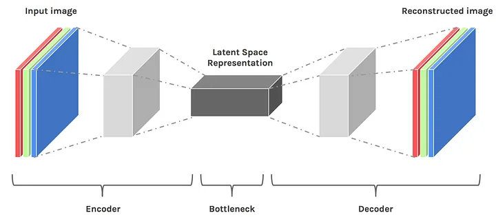

## Table of Contents

## What is Latent Space in the context of machine learning?

In machine learning, a latent space is a hidden layer within a model where data is represented in a simpler, more compact form. Imagine you have a lot of pictures of different animals. Each picture has a lot of details like color, shape, and size. In the latent space, these pictures are turned into a set of numbers that capture the important features of the animals, but in a way that's easier for the computer to understand and work with.

This process of transforming data into a latent space is often used in techniques like autoencoders and generative models. For example, in an autoencoder, the model learns to compress the input data into a latent space and then reconstruct it back to its original form. This helps the model to find patterns and relationships that might not be obvious in the original data. By working in the latent space, machine learning models can perform tasks like generating new data or finding similarities between different pieces of data more efficiently.

## How does Latent Space relate to dimensionality reduction?

Latent space and dimensionality reduction are closely related concepts in machine learning. Dimensionality reduction is a technique used to reduce the number of variables in a dataset while keeping as much important information as possible. This is often done because high-dimensional data can be hard to work with and analyze. When we apply dimensionality reduction, we're essentially trying to find a simpler way to represent our data. The result of this process is often a latent space, where the data is represented in fewer dimensions but still captures the essential features.

Think of it like this: if you have a bunch of pictures, each picture can be thought of as a point in a high-dimensional space where each dimension represents a pixel. Dimensionality reduction techniques like Principal Component Analysis (PCA) or t-SNE can take these high-dimensional points and project them onto a lower-dimensional space. This lower-dimensional space is the latent space. In this space, the data points are easier to handle and analyze, but they still represent the original pictures in a meaningful way. So, the latent space is where the reduced data lives, making it a key part of dimensionality reduction.

## Can you explain the concept of Latent Variables?

Latent variables are hidden factors that we can't directly see or measure but still influence the things we can observe. Imagine you're trying to figure out why some students do better in school than others. You can measure things like test scores and attendance, but there might be other things at play that you can't see directly, like motivation or home environment. These unseen factors are what we call latent variables.

In [machine learning](/wiki/machine-learning), latent variables are used to make models that can understand and predict data better. For example, in a model that tries to recognize faces, the actual pixels of the images are what we can see, but the model might use latent variables to represent things like the shape of the face or the expression, which are not directly visible but help the model work better. By figuring out these hidden factors, the model can do a better job at tasks like recognizing different faces or even creating new ones.

## What are some common techniques used to map data into Latent Space?

One common technique to map data into latent space is using autoencoders. An autoencoder is a type of [neural network](/wiki/neural-network) that learns how to efficiently compress and encode data, then decode it to reproduce the original input as closely as possible. The middle part of the autoencoder, where the data is compressed into a lower-dimensional form, is the latent space. By training the autoencoder to minimize the difference between the input and the output, it learns to capture the most important features of the data in the latent space. This makes autoencoders useful for tasks like data denoising or generating new data similar to the training set.

Another technique is Principal Component Analysis (PCA). PCA is a statistical method that transforms a set of observations of possibly correlated variables into a set of values of linearly uncorrelated variables called principal components. The first principal component accounts for as much of the variability in the data as possible, and each succeeding component accounts for as much of the remaining variability as possible. The result is a new set of dimensions, which can be thought of as the latent space, where the original data is represented in a way that highlights its most important features while reducing its dimensionality.

A third technique is Variational Autoencoders (VAEs). VAEs are similar to regular autoencoders but with an added twist: they use probabilistic methods to map the data into the latent space. Instead of directly mapping to a specific point in the latent space, VAEs map to a distribution over the latent space. This means that for any given input, there's a range of possible latent representations. This approach allows VAEs to not only reconstruct data but also generate new data by sampling from the latent space distribution. By doing so, VAEs can create new, realistic data points that are similar to the ones in the training set.

## How does Principal Component Analysis (PCA) contribute to understanding Latent Space?

Principal Component Analysis (PCA) helps us understand latent space by finding the most important features in our data and turning them into a simpler form. Imagine you have a bunch of pictures, and each picture has lots of details like colors and shapes. PCA looks at all these details and finds a way to describe the pictures using fewer, but still important, pieces of information. These pieces of information are called principal components, and they make up the latent space. By using PCA, we can see the main patterns in our data in a way that's easier to work with.

For example, if you have pictures of different animals, PCA can help you see that some animals are big and some are small, or that some have long legs and others have short ones. These features become the principal components, and they form the axes of the latent space. When you plot your data in this space, you can see how the animals are grouped based on these important features. This makes it easier to understand and work with the data, because you're looking at a simpler version that still captures what's important.

## What role does Latent Space play in Generative Models like VAEs and GANs?

In generative models like Variational Autoencoders (VAEs) and Generative Adversarial Networks (GANs), latent space is super important because it's where the magic happens. Think of latent space as a special room where the model keeps the important parts of the data in a simple way. For VAEs, the model learns to take the data, like pictures, and turn it into numbers in the latent space. These numbers can then be used to make new pictures that look a lot like the ones the model learned from. The cool thing about VAEs is they use a special trick to make sure the numbers in the latent space are organized in a way that makes sense, so if you change the numbers a little bit, the new picture changes in a predictable way.

GANs work a bit differently but still use latent space in a big way. In a GAN, there are two parts: a generator that makes new data and a discriminator that tries to tell if the data is real or fake. The generator starts with random numbers from the latent space and turns them into fake data, like pictures. The discriminator then looks at these pictures and says if they look real or not. Over time, the generator gets better at making pictures that look real because it's learning how to use the numbers in the latent space to create things that the discriminator can't tell apart from the real data. So, in both VAEs and GANs, the latent space is like the secret ingredient that helps the models make new, cool stuff.

## How can Latent Space be visualized and interpreted?

To visualize and interpret latent space, we often use techniques that can show high-dimensional data in a way that's easier to understand. One popular way is to use dimensionality reduction methods like t-SNE or PCA to turn the high-dimensional latent space into a 2D or 3D space that we can plot. Imagine you have a bunch of pictures of animals, and you want to see how they're grouped based on their features. By plotting them in a 2D space after using t-SNE, you might see that similar animals like cats and dogs are close together, while different animals like elephants and birds are further apart. This helps us see patterns and relationships in the data that might not be obvious when looking at the original high-dimensional space.

Interpreting the latent space can be a bit trickier, but it's all about understanding what the different dimensions or axes represent. In a model like a Variational Autoencoder (VAE), each dimension in the latent space might capture a specific feature of the data, like the size or color of an animal in our example. By changing the values along these dimensions, we can see how the generated images change. For example, if we increase the value along a dimension that represents size, the generated animal might get bigger. This helps us understand what the model has learned and how it's using the latent space to represent and generate new data.

## What are the challenges associated with working in Latent Space?

Working in latent space can be tricky because it's hard to understand what the different parts of the space mean. When we use techniques like autoencoders or PCA to turn our data into a simpler form, we end up with numbers that represent important features, but it's not always clear what those features are. For example, if we're working with pictures of animals, one dimension in the latent space might represent the size of the animal, but figuring out which dimension that is can be tough. This makes it hard to know how changing the numbers in the latent space will affect the data we get back, like making the animal bigger or smaller.

Another challenge is that the latent space can be sensitive to small changes. In models like Variational Autoencoders (VAEs), the latent space is set up so that small changes in the numbers should lead to small changes in the output. But sometimes, even a tiny change can make a big difference, like turning a picture of a cat into a picture of a dog. This can make it hard to control what the model does when we're trying to generate new data or understand how the model works. So, while latent space is really useful for simplifying and working with data, it takes a lot of care and understanding to use it well.

## How do Autoencoders utilize Latent Space for data reconstruction?

Autoencoders use latent space to take in data, like pictures, and turn it into a simpler form. Imagine you have a picture of a cat. The autoencoder looks at all the details in the picture and finds a way to describe it using fewer numbers. These numbers are stored in the latent space. The autoencoder learns to do this by trying to make the picture it gets back from the latent space as close to the original picture as possible. This means the numbers in the latent space have to capture the most important parts of the picture, like the shape of the cat's ears or the color of its fur.

Once the autoencoder has turned the picture into numbers in the latent space, it can use those numbers to rebuild the picture. The part of the autoencoder that does this is called the decoder. The decoder takes the numbers from the latent space and turns them back into a picture. If the autoencoder has done a good job, the new picture will look a lot like the original cat picture. By using the latent space, the autoencoder can find patterns in the data and use them to reconstruct it, even if the data is complicated.

## What is the significance of Latent Space in feature extraction and representation learning?

Latent space plays a crucial role in feature extraction and representation learning by helping to find and use the most important parts of data in a simpler way. When we have lots of data, like pictures or sounds, it can be hard to work with because it's so complicated. Latent space helps by turning this complicated data into a set of numbers that capture the key features. For example, if we're looking at pictures of animals, the latent space might use numbers to show how big the animal is or what color it is. By doing this, we can understand the data better and use it for things like recognizing different animals or even making new pictures of animals.

In representation learning, the goal is to teach a computer to understand data in a way that's useful for different tasks. Latent space helps with this by giving the computer a simpler way to think about the data. When the computer learns to use the latent space, it can find patterns and relationships that might not be easy to see in the original data. This makes it easier for the computer to do things like telling different animals apart or making new pictures that look real. By working in the latent space, the computer can learn to represent data in a way that's both simple and powerful, making it better at understanding and using the data.

## How can manipulating Latent Space vectors affect the output in generative models?

In generative models like Variational Autoencoders (VAEs) and Generative Adversarial Networks (GANs), changing the numbers in the latent space can have a big impact on what the model makes. Think of the latent space as a special room where the model keeps the important parts of the data in a simple way. When you change the numbers in this room, you're telling the model to make something a bit different. For example, if you're making pictures of animals and you change a number that controls the size, the animal in the picture might get bigger or smaller. This is how you can control what the model makes by playing with the numbers in the latent space.

But, it's not always easy to know exactly what will happen when you change the numbers. Sometimes, a small change can make a big difference. For instance, if you change a number just a little bit, the picture might change a lot, like turning a cat into a dog. This happens because the latent space is set up to capture the most important features of the data, and even small changes can affect those features in big ways. So, while playing with the numbers in the latent space can be a fun way to make new things, it takes a lot of care and understanding to do it well.

## What advanced techniques exist for exploring and optimizing Latent Space in deep learning?

One advanced technique for exploring and optimizing latent space in [deep learning](/wiki/deep-learning) is using techniques like t-SNE (t-Distributed Stochastic Neighbor Embedding) or UMAP (Uniform Manifold Approximation and Projection) to visualize high-dimensional latent spaces in 2D or 3D. These methods help us see how different data points are grouped together based on their features. For example, if we're working with pictures of animals, t-SNE can show us that cats and dogs are close together in the latent space while birds are further away. This visualization can help us understand what the model has learned and how it's using the latent space to represent the data. By seeing these patterns, we can make better decisions about how to improve the model or use the latent space for tasks like generating new data.

Another technique is using adversarial training to optimize the latent space. This is often done in models like Generative Adversarial Networks (GANs), where a generator tries to make new data and a discriminator tries to tell if it's real or fake. By making the generator and discriminator compete, the model can learn to use the latent space in a way that makes the generated data look more realistic. For example, if the generator is making pictures of animals, the discriminator might push it to use the latent space to capture more details like the texture of fur or the shape of eyes. This back-and-forth helps the model find the best way to represent the data in the latent space, making the generated data better and better over time.

A third technique involves using techniques like latent space interpolation and traversal. Latent space interpolation means taking two points in the latent space and creating new points that are between them. This can help us see how the model changes the data as we move from one point to another. For example, if we have two pictures of animals in the latent space, interpolating between them might show us how the model changes the animal's features as we go from one picture to the other. Latent space traversal, on the other hand, involves changing one dimension of the latent space at a time to see how it affects the output. This can help us understand what each dimension represents and how to use them to control the model's output. By exploring the latent space this way, we can learn more about what the model has learned and how to use it to make new, interesting data.

## References & Further Reading

[1]: Goodfellow, I., Bengio, Y., & Courville, A. (2016). [Deep Learning](https://link.springer.com/article/10.1007/s10710-017-9314-z). MIT Press.

[2]: Kingma, D. P., & Welling, M. (2013). [Auto-Encoding Variational Bayes](https://arxiv.org/abs/1312.6114). arXiv preprint arXiv:1312.6114.

[3]: van der Maaten, L., & Hinton, G. (2008). [Visualizing Data using t-SNE](https://jmlr.org/papers/v9/vandermaaten08a.html). Journal of Machine Learning Research 9(Nov): 2579-2605.

[4]: Goodfellow, I., Pouget-Abadie, J., Mirza, M., Xu, B., Warde-Farley, D., Ozair, S., ... & Bengio, Y. (2014). [Generative Adversarial Nets](https://arxiv.org/abs/1406.2661). Advances in Neural Information Processing Systems 27.

[5]: Bishop, C. M. (2006). [Pattern Recognition and Machine Learning](https://www.cs.uoi.gr/~arly/courses/ml/tmp/Bishop_book.pdf). Springer.