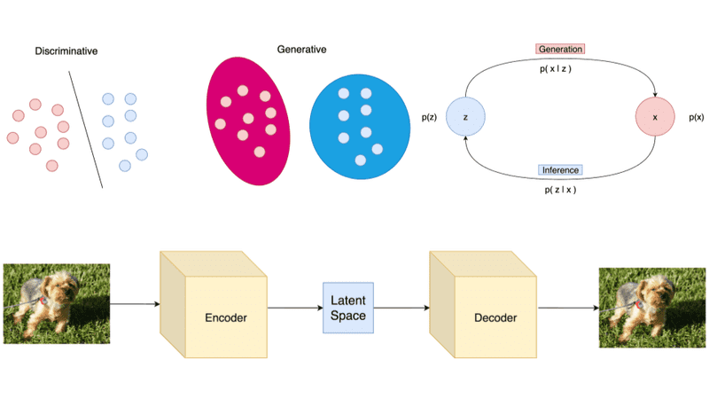

## Table of Contents

## What is a latent variable in the context of machine learning?

In machine learning, a latent variable is a variable that we can't observe directly but can infer from other observable variables. Think of it like trying to guess the weather outside by looking at how people are dressed. You can't see the temperature directly, but you can make a good guess based on whether people are wearing coats or shorts. In machine learning, these latent variables help models understand and predict things better by filling in the gaps where direct data is missing.

For example, in a recommendation system, a latent variable might represent a user's preference for certain types of movies. We don't know exactly what these preferences are, but we can infer them from the movies the user has watched and rated. By using these latent variables, the system can suggest new movies that the user might enjoy, even if they haven't seen anything similar before. This makes the recommendations more personalized and accurate.

## How does latent variable sampling contribute to machine learning models?

Latent variable sampling helps machine learning models by adding a way to deal with things we can't see directly. Imagine you're trying to understand why certain students do well in school. You can see their grades, but you can't see how much they study at home or how much they enjoy the subject. These hidden factors are latent variables. By sampling these latent variables, we can create a fuller picture of what's going on. This helps the model make better predictions because it's not just looking at what's easy to see but also trying to guess what's hidden.

For example, in a model that predicts customer behavior, latent variables might represent things like customer satisfaction or brand loyalty. We can't measure these directly, but we can sample them based on observable data like purchase history or survey responses. By doing this, the model can better understand why customers behave the way they do and make more accurate predictions about future behavior. This makes the model more useful for businesses trying to improve their customer experience or increase sales.

## What is the truncation trick and how is it used in latent variable sampling?

The truncation trick is a clever way to simplify the process of sampling from complex distributions, especially when dealing with latent variables. In [machine learning](/wiki/machine-learning), we often need to sample from distributions that are hard to work with directly. The trick involves breaking down the sampling into two easier steps: first, we sample from a simpler distribution, and then we adjust those samples to match the complex distribution we're interested in. This makes it much easier to generate samples that accurately represent the latent variables we're trying to understand.

For example, imagine you're trying to sample from a distribution that only has values between 0 and 1, but it's really hard to sample directly from this distribution. The truncation trick would let you first sample from a normal distribution, which is easy to sample from, and then adjust those samples to fall between 0 and 1. This way, you can still get good samples from the complex distribution without having to deal with all its complexities directly. This technique is particularly useful in algorithms like Markov Chain Monte Carlo (MCMC), where sampling from complex distributions is a key part of the process.

## Can you explain the process of latent optimisation in the context of latent variable models?

Latent optimisation in latent variable models is like trying to find the best hidden settings that make our model work better. Imagine you're trying to tune a radio to get the clearest signal. You can't see the radio waves, but by turning the dial, you can hear when the signal is strongest. In latent variable models, we do something similar. We adjust the latent variables, which we can't see directly, to make our predictions or classifications as accurate as possible. We do this by using an optimisation algorithm that tries different settings for the latent variables and sees which ones give the best results.

The process usually involves defining a loss function, which measures how well our model is doing. If our model's predictions are close to the actual results, the loss function will be low. We want to find the settings for the latent variables that make this loss function as small as possible. To do this, we might use gradient-based methods, like gradient descent, to slowly adjust the latent variables in the direction that reduces the loss. For example, if our loss function is $$ L(\theta) $$, where $$\theta$$ represents the latent variables, we would update $$\theta$$ using the gradient of $$L$$ with respect to $$\theta$$. This iterative process continues until we find the best settings for our latent variables, making our model as accurate as it can be.

## What are the advantages of using the Polya-Gamma augmentation in latent variable sampling?

The Polya-Gamma augmentation is a smart trick that makes sampling from certain tricky distributions easier. Imagine you're trying to guess how many jelly beans are in a jar, but you can't see them all. The Polya-Gamma method helps by breaking down this hard problem into simpler parts. It uses special variables called Polya-Gamma variables to help us sample from distributions that are tough to work with directly. This makes it easier to understand and predict things in models where the hidden factors are important.

One big advantage of using the Polya-Gamma augmentation is that it speeds up the sampling process. When you're dealing with complex models, sampling can take a long time. But with the Polya-Gamma trick, you can sample faster and more efficiently. This is especially helpful in models like logistic regression where the hidden factors play a big role. By using Polya-Gamma variables, we can make our models run quicker and still get accurate results. This makes it easier for researchers and data scientists to use these models in real-world problems.

## How does the truncation trick help in simplifying complex distributions in latent variable models?

The truncation trick is like a clever shortcut that makes it easier to sample from hard-to-handle distributions in latent variable models. Imagine you're trying to guess the number of marbles in a jar, but you can only see a few of them. The trick helps by letting you first sample from a simpler distribution, like guessing the number of marbles in a smaller, easier-to-see jar. Then, you adjust those guesses to fit the bigger, more complex jar. This way, you can still get good guesses about the number of marbles without having to deal with the complexity of the big jar directly.

This method is especially useful in algorithms like Markov Chain Monte Carlo (MCMC), where you need to sample from tricky distributions to understand hidden factors in your model. For example, if you're trying to sample from a distribution that only has values between 0 and 1, you might first sample from a normal distribution, which is easy to work with. Then, you adjust those samples to fall between 0 and 1 using the truncation trick. This makes the sampling process much simpler and more efficient, helping you get better results from your latent variable model without getting bogged down in the complexities of the original distribution.

## What are some common challenges faced when implementing latent optimisation techniques?

One common challenge in implementing latent optimisation techniques is dealing with the complexity of the loss function. In many latent variable models, the loss function can be hard to work with because it depends on hidden variables that we can't see directly. This makes it tough to figure out how to adjust these hidden variables to make the loss function smaller. For example, if we're using gradient descent to optimise our model, we need to calculate the gradient of the loss function with respect to the latent variables, which can be tricky if the relationship between the loss and the latent variables is complicated.

Another challenge is the computational cost of optimisation. Latent optimisation often involves running many iterations of an algorithm to find the best settings for the hidden variables. Each iteration can take a lot of time, especially if the model is big or if we're working with a lot of data. This means that optimising latent variables can be slow and might require powerful computers to finish in a reasonable amount of time. For instance, if we're using a method like MCMC to sample from the latent variables, each step of the sampling process can be time-consuming, making the overall optimisation process even slower.

Finally, there's the issue of getting stuck in local optima. When we're trying to find the best settings for our latent variables, we want to find the global minimum of the loss function. But sometimes, the optimisation process can get stuck in a local minimum, which is a good solution but not the best one. This can happen if the loss function has many bumps and valleys, making it hard for the optimisation algorithm to explore all the possible settings for the latent variables. For example, if we're using a simple gradient descent method, it might follow the steepest path down the loss function and end up in a local minimum instead of continuing to search for the global minimum.

## How can Polya-Gamma augmentation improve the efficiency of sampling in Bayesian models?

Polya-Gamma augmentation makes sampling in Bayesian models easier and faster by turning hard problems into simpler ones. Imagine you're trying to guess how many candies are in a big jar, but you can only see a few of them. Polya-Gamma augmentation helps by breaking this big problem into smaller, easier pieces. It uses special variables called Polya-Gamma variables to help you sample from tricky distributions. This way, you can get good guesses about the candies without having to deal with the whole jar at once. In Bayesian models, this means you can sample from complex distributions more efficiently, which makes the whole process quicker and easier.

This method is especially helpful in models like logistic regression where the hidden factors are important. By using Polya-Gamma variables, you can speed up the sampling process a lot. This is because the Polya-Gamma trick lets you sample from simpler distributions first and then adjust those samples to fit the more complex ones. This makes your model run faster and still gives you accurate results. So, if you're working with a big dataset and need to understand hidden factors, Polya-Gamma augmentation can make your job a lot easier.

## What are the key differences between the truncation trick and other methods of handling latent variables?

The truncation trick is a clever way to simplify sampling from complex distributions in latent variable models. It works by first sampling from a simpler, easier-to-handle distribution and then adjusting those samples to fit the more complex distribution you're interested in. For example, if you're trying to sample from a distribution that only has values between 0 and 1, you might first sample from a normal distribution and then use the truncation trick to make sure those samples fall between 0 and 1. This method makes it easier to work with hard-to-sample distributions, which is especially useful in algorithms like Markov Chain Monte Carlo (MCMC) where sampling from complex distributions is a key part of the process.

Other methods of handling latent variables, like variational inference or Gibbs sampling, approach the problem differently. Variational inference, for instance, tries to find an approximate distribution that's close to the true distribution of the latent variables. It does this by minimizing a divergence measure, like the Kullback-Leibler divergence, between the approximate and true distributions. Gibbs sampling, on the other hand, involves sampling each latent variable one at a time, conditioned on the current values of the other variables. This method can be more computationally intensive but can provide exact samples from the true distribution. Each method has its own strengths and weaknesses, and the choice of method depends on the specific needs of the model and the problem at hand.

## In what scenarios would you recommend using latent optimisation over other sampling methods?

Latent optimisation is particularly useful when you want to find the best settings for hidden factors in your model to make it work better. Imagine you're tuning a radio to get the clearest signal. You can't see the radio waves, but by adjusting the dial, you can hear when the signal is strongest. In latent variable models, we do something similar. We adjust the hidden variables, which we can't see directly, to make our predictions or classifications as accurate as possible. This is especially helpful in models where the loss function depends on these hidden variables, and we want to minimize it to get the best results. For example, if we're using gradient descent to optimise our model, we would update the latent variables $$ \theta $$ using the gradient of the loss function $$ L(\theta) $$ to make the loss as small as possible.

On the other hand, if you're more interested in understanding the full range of possible settings for the hidden variables rather than just finding the best ones, other sampling methods like Markov Chain Monte Carlo (MCMC) might be better. MCMC can give you a more complete picture of the hidden variables by sampling from their full distribution. This is useful if you want to see how different settings affect your model's performance or if you're trying to understand the uncertainty in your predictions. However, MCMC can be slower and more computationally intensive than latent optimisation. So, if speed and efficiency are more important to you, and you just need to find the best settings for your model, latent optimisation would be the better choice.

## How can the effectiveness of Polya-Gamma augmentation be measured in practical applications?

The effectiveness of Polya-Gamma augmentation in practical applications can be measured by looking at how much it speeds up the sampling process in Bayesian models. Imagine you're trying to guess how many candies are in a big jar, but you can only see a few of them. Polya-Gamma augmentation helps by breaking this big problem into smaller, easier pieces. By using special variables called Polya-Gamma variables, you can sample from tricky distributions more quickly. This means your model runs faster, which is really important when you're working with big datasets. You can measure this speed-up by comparing the time it takes to run your model with and without Polya-Gamma augmentation. If the model runs much faster with Polya-Gamma augmentation, it's a sign that it's working well.

Another way to measure the effectiveness of Polya-Gamma augmentation is by checking how accurate your model's predictions are. In Bayesian models, the goal is often to make the best guesses about hidden factors that affect your predictions. Polya-Gamma augmentation helps by making it easier to sample from complex distributions that represent these hidden factors. You can see if Polya-Gamma augmentation is helping by looking at how close your model's predictions are to the actual results. If your predictions are more accurate when you use Polya-Gamma augmentation, it means the method is doing a good job of helping your model understand the hidden factors better.

## What advanced techniques can be combined with latent variable sampling to enhance model performance?

Combining latent variable sampling with variational inference can really boost model performance. Variational inference tries to find an easy-to-handle distribution that's close to the true distribution of the hidden factors in your model. It does this by minimizing a measure called the Kullback-Leibler divergence between the easy and the true distributions. By using variational inference with latent variable sampling, you can get the best of both worlds: the speed and simplicity of variational methods and the accuracy of sampling from the true distribution. This can make your model run faster and still give you good results, which is really helpful when you're working with big datasets or complex models.

Another advanced technique to try is Markov Chain Monte Carlo (MCMC) with adaptive proposals. MCMC is a way to sample from complex distributions by creating a chain of samples that slowly explore the whole distribution. Adaptive proposals mean that the method learns from past samples to make better guesses about where to sample next. This can make the sampling process more efficient and help you find the best settings for your hidden factors more quickly. For example, if you're using a method like the Metropolis-Hastings algorithm, you can adjust the proposal distribution $$ q(x'|x) $$ based on the history of the chain to improve the acceptance rate and get better samples. Combining this with latent variable sampling can help you understand the hidden factors in your model more accurately and make better predictions.

## References & Further Reading

[1]: Murphy, K. P. (2012). ["Machine Learning: A Probabilistic Perspective."](https://www.cs.ubc.ca/~murphyk/MLbook/pml-toc-1may12.pdf) The MIT Press.

[2]: Blei, D. M., Kucukelbir, A., & McAuliffe, J. D. (2017). ["Variational Inference: A Review for Statisticians."](https://arxiv.org/abs/1601.00670) Journal of the American Statistical Association, 112(518), 859-877.

[3]: Holmes, C. C., & Held, L. (2006). ["Bayesian Auxiliary Variable Models for Binary and Multinomial Regression."](https://projecteuclid.org/journals/bayesian-analysis/volume-1/issue-1/Bayesian-auxiliary-variable-models-for-binary-and-multinomial-regression/10.1214/06-BA105.pdf) Bayesian Analysis, 1(1), 145-168.

[4]: Polson, N. G., Scott, J. G., & Windle, J. (2013). ["Bayesian Inference for Logistic Models Using Pólya–Gamma Latent Variables."](https://www.tandfonline.com/doi/full/10.1080/01621459.2013.829001) Journal of the American Statistical Association, 108(504), 1339-1349.

[5]: Neal, R. M. (2011). ["MCMC Using Hamiltonian Dynamics."](https://arxiv.org/abs/1206.1901) In Handbook of Markov Chain Monte Carlo (pp. 113-162). CRC Press.

[6]: Gelman, A., Carlin, J. B., Stern, H. S., Dunson, D. B., Vehtari, A., & Rubin, D. B. (2013). ["Bayesian Data Analysis."](https://www.taylorfrancis.com/books/mono/10.1201/b16018/bayesian-data-analysis-david-dunson-donald-rubin-john-carlin-andrew-gelman-hal-stern-aki-vehtari) CRC Press.

[7]: Wainwright, M. J., & Jordan, M. I. (2008). ["Graphical Models, Exponential Families, and Variational Inference."](https://people.eecs.berkeley.edu/~jordan/papers/wainwright-jordan-fnt.pdf) Foundations and Trends® in Machine Learning, 1(1-2), 1-305.