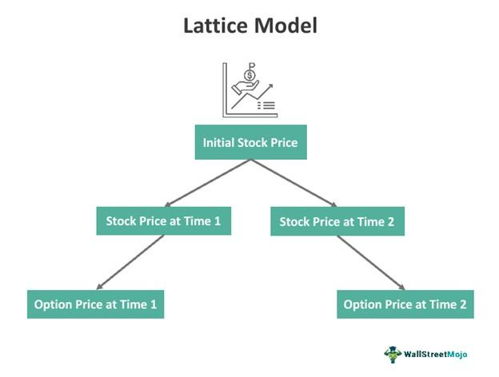

Algorithmic trading has significantly transformed the landscape of financial markets by employing advanced mathematical models to inform and execute trading decisions. A fundamental component of these mathematical frameworks is the lattice-based model, which serves a pivotal role in the valuation of complex financial derivatives. Historically, the challenge in financial markets has been to accurately price derivatives, which are financial instruments that derive their value from the performance of underlying assets, such as stocks, bonds, commodities, currencies, interest rates, or market indices.

Lattice-based models distinguish themselves by modeling the probabilistic evolution of asset prices over time, utilizing a discrete grid of possible price paths. This approach involves constructing a binomial or trinomial tree that represents all potential price movements of an asset at different time intervals, up to the maturity of the derivative. By deploying these models, traders and financial engineers can simulate numerous scenarios efficiently, making precise determinations about derivative pricing and risk management.

The practical importance of lattice models in algorithmic trading is underscored by their adaptability and accuracy, especially in the context of American-style options, which can be exercised at any time before expiration. Understanding how these models operate and their applicability to different types of financial derivatives equips financial professionals with the means to optimize trading strategies, manage risk exposure, and make data-driven decisions that can navigate the complexities of volatile markets.

The exploration of lattice-based models encompasses various types, including binomial, trinomial, and multinomial trees, each offering distinctive features and uses. Furthermore, the discussion extends to the advantages and limitations inherent to these models, setting the stage for comparisons with other prevalent financial models such as the Black-Scholes model and Monte Carlo simulations. 

This article aims to guide readers through the intricate workings of lattice-based models, highlighting not only their current applications in algorithmic trading but also projecting their future significance as advancements in machine learning and artificial intelligence offer new avenues for their integration and enhancement. As financial markets continue to evolve, a profound understanding of lattice-based models remains crucial for those seeking to harness algorithmic trading's full potential.

## Table of Contents

## What is a Lattice-Based Model?

A lattice-based model utilizes a binomial tree structure to represent multiple possible paths that an asset's price may follow over time. These models are particularly effective for valuing options and other financial derivatives that have a range of potential price trajectories, allowing traders to make informed decisions based on various future scenarios.

### Fundamental Principles of Lattice-Based Models

Lattice models are based on discrete time and state-space frameworks. The binomial model forms the foundation, employing a simple yet powerful method to approximate the continuous price movement of an asset. The asset price is assumed to follow a stochastic process, where at each step, it can move to an "up" state or a "down" state, creating a branching tree structure.

Consider the price of an asset $S$ at time $t$ can move to $S_u = S \times u$ (up state) or $S_d = S \times d$ (down state) at time $t+1$, where $u$ and $d$ are multiplicative factors. Typically, these factors are defined by:

$$
u = e^{\sigma \sqrt{\Delta t}}
$$
$$
d = \frac{1}{u} = e^{-\sigma \sqrt{\Delta t}}
$$

where $\sigma$ is the volatility of the asset and $\Delta t$ is the time step. The likelihood of an up move $p$ or a down move $(1-p)$ depends on the risk-neutral measure, calculated as:

$$
p = \frac{e^{r \Delta t} - d}{u - d}
$$

where $r$ is the risk-free interest rate.

### Key Components of Lattice-Based Models

1. **Nodes**: Each node in the lattice represents a possible price of the asset at a given time. Starting from the initial price, nodes branch out in subsequent time steps to depict possible future prices.

2. **Transition Probabilities**: The movement between nodes is governed by transition probabilities, which reflect the likelihood of price changes based on the risk-neutral measure. This ensures that the expected return of the asset under the model aligns with the risk-free rate, fulfilling arbitrage-free conditions.

3. **Backward Induction**: This is the primary computational technique used in lattice-based models to evaluate derivatives, specifically options. The process begins with known payoff values at the terminal nodes (expiration of the option) and works backward through the lattice to determine the present value at earlier nodes.

For an option, the value at any node is determined by the expected payoff in the next step, discounted at the risk-free rate:

$$
C = e^{-r \Delta t} (pC_u + (1-p)C_d)
$$

where $C$ represents the option value, and $C_u$ and $C_d$ are the values at the up and down nodes, respectively. If the model supports American options, decisions are made at each step regarding the optimal time to exercise the option, adding an additional layer to the computational challenge.

### Differentiation from Black-Scholes

Unlike the continuous Black-Scholes model, which assumes a log-normal distribution of prices and provides a closed-form solution for European options, lattice models operate in discrete time and can accommodate American options due to their flexible and iterative nature. They are advantageous in scenarios where flexibility and the ability to model early exercise are critical, despite possibly being more computationally intensive than the Black-Scholes formula for a comparable scenario.

In conclusion, lattice-based models are an integral part of financial engineering, offering a detailed outlook on potential market behaviors and facilitating informed decision-making in option pricing and risk management.

## Types of Lattice Models

Lattice models are pivotal tools in financial modeling, particularly for valuing derivatives. They use a discrete-time framework to model the evolution of asset prices and interest rates over time. Several types of lattice models have been developed, each offering distinct features and applications.

### Binomial Tree Model
The binomial tree model is the simplest lattice model, widely used for valuing American options. This model divides the time to expiration into $N$ intervals and assumes that in each time interval, the asset price can move up or down by specific factors $u$ and $d$. The risk-neutral valuation is achieved by adjusting the probabilities $p$ and $1-p$ of the upward and downward movements, where $p$ is derived from the risk-free rate $r$, the upward [factor](/wiki/factor-investing) $u$, and the downward factor $d$:

$$
p = \frac{e^{r\Delta t} - d}{u - d}
$$

The model's simplicity and intuitive framework make it well-suited for American options, which can be exercised at any time before expiration.

### Trinomial Tree Model
The trinomial tree model extends the binomial tree by incorporating an additional potential price movement, allowing for three possible outcomes at each node: an upward movement, a downward movement, or remaining unchanged. This added flexibility increases the model’s accuracy in approximating continuous price movements. The trinomial model divides the time to maturity into smaller intervals and assigns transition probabilities $p_u$, $p_m$, and $p_d$ for upward, unchanged, and downward movements, respectively.

The trinomial tree model is particularly advantageous for options with features sensitive to [volatility](/wiki/volatility-trading-strategies) changes and large price fluctuations, as it accommodates the possibility of static prices, which the binomial model does not.

### Multinomial Tree Models
Further enhancements lead to multinomial tree models, which provide even more branches at each node, enabling more refined simulations of asset paths. These models converge faster to continuous-time models like Black-Scholes with increasing computational power. However, implementing multinomial trees can be computationally intensive due to the complex calculations required for determining probabilities and asset prices at each node. These models are typically used when high precision is required for valuing complex derivatives with path-dependent features or for stress-testing portfolios under various scenarios.

### Interest Rate Lattice Models
Specialized lattice models exist for [interest rate](/wiki/interest-rate-trading-strategies) derivatives, such as the Hull-White and Black-Derman-Toy models. These models are crucial in finance for pricing instruments sensitive to interest rate movements, like bonds and interest rate swaps. The Hull-White model, for instance, modifies the short rate model to allow for mean reversion, allowing a more accurate reflection of observed market yields:

$$
dr_t = (\theta(t) - a r_t)dt + \sigma dW_t
$$

Where $r_t$ is the short rate, $a$ represents the speed of mean reversion, $\theta(t)$ adjusts the level to fit current observed rates, $\sigma$ is the volatility, and $dW_t$ denotes a Wiener process. The Black-Derman-Toy model, another notable approach, uses a binomial framework to model the evolution of short rates over time, providing essential insights for practitioners handling interest-sensitive financial derivatives.

In conclusion, lattice models are a versatile toolset in financial engineering, offering structured methodologies to model asset prices and interest rates. Their adaptability to various market instruments ensures their continued relevance and application in quantitative finance.

## Applications in Algorithmic Trading

Lattice models have become indispensable tools in [algorithmic trading](/wiki/algorithmic-trading) and finance, primarily due to their ability to handle the dynamic aspects of pricing derivatives and managing risk. These models leverage their structured framework to capture various possible paths for asset prices, thereby providing a comprehensive view of potential market movements. 

One of the primary applications of lattice models is in the pricing of options and complex derivatives. Unlike the simpler Black-Scholes model, which assumes a continuous-time log-normal distribution of asset prices, lattice models offer a discrete-time framework that can accommodate American-style options. This is crucial for derivatives that can be exercised at any point before expiration, as lattice models like the binomial and trinomial trees can simulate multiple paths an asset's price might take, accommodating early exercise features effectively.

In risk management, lattice models facilitate the estimation of risk metrics such as Value at Risk (VaR). By constructing a probability distribution of returns within the lattice, firms can assess the potential loss in the value of an asset or portfolio over a specified time period under normal market conditions. This capability supports firms in maintaining regulatory compliance and optimizing their risk-return profiles.

Furthermore, lattice models serve as robust frameworks for portfolio optimization under uncertain market conditions. They enable traders and portfolio managers to simulate a range of possible future states of the world, assessing how different trading strategies might perform in each scenario. This facilitates more informed decision-making by allowing traders to evaluate the impacts of various strategies on portfolio returns and risks.

Moreover, they are integral in the simulation of market scenarios, essential for the development and testing of algorithmic trading strategies. By allowing traders to model how assets might behave under different conditions, lattice models enable the development of algorithms that can adapt to varying market environments, enhancing the resilience and profitability of trading strategies.

The adaptability and efficiency of lattice models make them a staple in institutional settings, where they are employed not only for pricing and risk estimation but also for strategic planning and compliance. As algorithmic trading evolves to incorporate more sophisticated technologies, the role of lattice models is expected to expand further, providing a scalable and reliable method for integrating complex derivatives pricing and risk management into automated trading systems.

## Advantages and Limitations

Lattice-based models provide several notable advantages in the quantitative finance domain, particularly in valuing derivatives and optimizing trading strategies. Their flexibility is one of the key benefits; lattice models can accommodate various option features, such as American exercise features, path dependencies, and dividend payments, which might complicate the pricing when using other models like Black-Scholes. The structured framework of lattice models allows for easy modification to include complex product characteristics, making them highly adaptable.

In terms of computational efficiency, lattice models strike a balance between simplicity and precision. For instance, binomial and trinomial trees can offer precise option valuations with fewer computational resources than Monte Carlo simulations, particularly for shorter time horizons and fewer underlying variables. This efficiency makes them suitable for real-time trading systems where quick decision-making is crucial.

Despite these advantages, lattice-based models have inherent limitations. One significant drawback is that they assume discrete time steps, introducing potential discretization errors. As a result, these models can sometimes oversimplify the continuous nature of price paths, leading to inaccuracies, especially in high-volatility environments or when long-term predictions are required. Moreover, the limited number of discrete paths can be a constraint when modeling derivatives with complex payoff structures, compared to the continuous framework of the Black-Scholes model or the vast path variability in Monte Carlo methods.

Compared to Monte Carlo simulations, which rely on the law of large numbers to achieve accuracy through countless random samples, lattice models are often more restrictive. Monte Carlo models can capture a wide array of market dynamics due to their stochastic nature, but they require much more computational power and time to achieve similar precision, especially for scenarios involving multiple factors or when seeking solutions to non-linear problems.

Lattice models also differ from the Black-Scholes approach, which uses a closed-form solution assuming constant volatility and interest rates. While Black-Scholes provides quick results and is analytically elegant, it lacks the flexibility of lattice models in handling early exercise options and varying market conditions, unless modified or extended.

Integrating lattice models with advanced technologies like [machine learning](/wiki/machine-learning) can enhance their accuracy and applicability. Machine learning algorithms can optimize parameter calibration, such as determining the optimal step length or transition probabilities, by learning from historical data. This hybrid approach can help in overcoming some traditional limitations, offering a way to capture market irregularities more effectively. For instance, [reinforcement learning](/wiki/reinforcement-learning) techniques could adjust the lattice structure dynamically based on market conditions, improving real-time adaptability and decision-making.

In conclusion, while lattice-based models have clear strengths in terms of flexibility and computational efficiency, their limitations in terms of discretization and path complexity constrain their standalone applicability. By leveraging modern computational techniques, these models can evolve to meet the more intricate demands of contemporary algorithmic trading.

## Future of Lattice Models in Algo Trading

Lattice models are poised to evolve significantly as technological advancements reshape algorithmic trading. These models, which traditionally rely on structured binomial or trinomial trees, are increasingly integrated with [artificial intelligence](/wiki/ai-artificial-intelligence) (AI) and machine learning technologies to optimize parameter calibration and enhance trading strategies. This integration allows for rapid analysis and adjustment of model parameters, enabling more accurate predictions and effective decision-making in dynamic financial environments.

AI algorithms can analyze vast datasets more efficiently than traditional methods, offering capabilities for identifying patterns and trends that humans might miss. Machine learning, particularly in its supervised and unsupervised forms, can be used to refine the parameters within lattice models, such as transition probabilities and volatility estimates. For instance, supervised learning can be used to train models on historical data, optimizing predictions of price movements. Unsupervised learning methods can detect unpredicted patterns, which can then inform alterations in model structure or parameters.

As high-frequency trading ([HFT](/wiki/high-frequency-trading-strategies)) becomes more prevalent, the demands for speed and accuracy in trading models also increase. Lattice models, with their discrete-time framework, complement high-frequency trading systems by allowing for rapid computation of potential price paths and option valuations. They provide a robust framework for real-time risk management and decision support. In combination with machine learning, these models can quickly adapt to new information, maintaining a trading edge.

Potential innovations in lattice models include the development of hybrid models that combine the strengths of lattice and stochastic models. These hybrids may offer enhanced precision in estimating option prices and assessing risk under uncertain conditions. Moreover, the use of reinforcement learning, a subset of machine learning, is gaining traction. In this context, lattice models can be employed to simulate market environments where learning algorithms iteratively improve trading strategies based on feedback from virtual trades.

Real-life applications showcase lattice models' potential in stress testing and scenario analysis within financial institutions. By simulating various market conditions, they provide insights into the robustness of trading strategies, helping traders to anticipate and mitigate potential market shocks. The use of advanced computing techniques, such as parallel processing, can further expeditate these simulations, making them more feasible for real-time applications.

In conclusion, the integration of AI and machine learning with lattice models represents a significant leap forward in algorithmic trading. As these models continue to evolve, they are expected to offer increasingly sophisticated solutions for the complex challenges of modern financial markets, supporting both speed and precision crucial in high-frequency trading environments.

## Conclusion

Lattice-based models remain an essential component of financial modeling and algorithmic trading strategies. These models utilize a structured, discrete framework, which offers substantial accuracy and adaptability for the pricing of derivatives and the management of risk. The binary and sometimes multinomial branching paths within lattice models enable detailed simulations of asset price movements, providing precise evaluations that can accommodate American-style options and interest rate derivatives.

As financial markets continue to evolve, the role of lattice models in enhancing algorithmic trading capabilities remains crucial. Their intrinsic ability to model a breadth of economic scenarios with varying degrees of market volatility ensures that traders and financial engineers can tailor strategies to meet specific risk profiles and market conditions. The adaptability of these models also plays a pivotal role in risk management by allowing for dynamic recalibration based on new market information or changing economic forecasts.

Looking toward the future, significant developments are expected in the integration of lattice models with emerging technologies. Advancements in artificial intelligence (AI) and machine learning offer promising avenues for enhancing parameter calibration and increasing the precision of these models. For instance, machine learning algorithms can be applied to optimize the selection of model parameters, improving accuracy without significantly boosting computational requirements. This fusion of technologies is likely to yield more robust and efficient trading strategies, providing traders with a competitive edge in increasingly automated markets.

The continued sophistication of lattice-based models, particularly in high-frequency trading (HFT), will open new opportunities for traders. The capacity to rapidly process and respond to market movements in near real-time is invaluable, especially as latency continues to decrease and trading volumes rise.  Exploring these possibilities can lead to innovations in market simulations, where extensive data can inform better decision-making and strategy optimization.

In conclusion, lattice models have firmly established themselves as invaluable tools in financial modeling and algorithmic trading. Their continuing evolution and integration with cutting-edge technologies will undoubtedly offer new opportunities, fostering more nuanced and dynamic trading strategies in an ever-changing financial landscape.

## References & Further Reading

[1]: Cox, J. C., Ross, S. A., & Rubinstein, M. (1979). ["Option Pricing: A Simplified Approach."](https://www.sciencedirect.com/science/article/pii/0304405X79900151) Journal of Financial Economics, 7(3), 229-263.

[2]: Hull, J. C. (2017). ["Options, Futures, and Other Derivatives"](https://www.semanticscholar.org/paper/Options%2C-Futures%2C-and-Other-Derivatives-Hull/89bdee500c8623864fc9eb7a471546aa713acc44). Pearson.

[3]: Black, F., & Scholes, M. (1973). ["The Pricing of Options and Corporate Liabilities."](https://www.cs.princeton.edu/courses/archive/fall09/cos323/papers/black_scholes73.pdf) Journal of Political Economy, 81(3), 637-654.

[4]: Jarrow, R., & Subramanian, A. (1995). ["Merging Binomial and Trinomial Approaches to Derivative Pricing Using Copulas."](https://www.jstor.org/stable/pdf/2329239.pdf) The Review of Financial Studies, 8(2), 455-479.

[5]: Glasserman, P. (2004). ["Monte Carlo Methods in Financial Engineering."](https://archive.org/details/montecarlomethod0000glas) Springer. 

[6]: Shreve, S. E. (2004). ["Stochastic Calculus for Finance I: The Binomial Asset Pricing Model"](https://www.archive.org/download/derivatives_books/Stochastic%20Calculus%20for%20Finance%20I%20-%20S.%20E.%20Shreve.pdf). Springer.