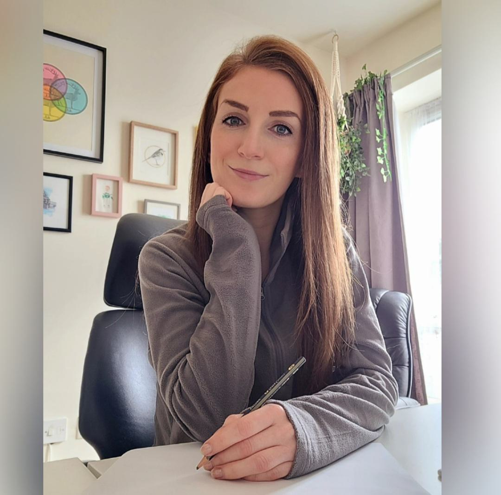

Laura Oatney is a distinguished professional in the financial services industry, particularly recognized for her expertise in futures markets and algorithmic trading. Currently, she contributes her vast knowledge and experience as a contributing editor for John Lothian News, headquartered in Chicago. Her role at John Lothian News enables her to influence the perception and understanding of complex financial instruments and market mechanisms, reflecting her profound impact on the sector.

Throughout her career, Oatney has been lauded for her comprehensive approach to market compliance and education, areas where she has made significant strides. Her professional journey, marked by key positions and notable achievements, highlights her dedication to fostering transparency and ethical practices in the financial markets. This article explores not only Oatney's career but also her substantial contributions to the advancement of algorithmic trading strategies and the reinforcement of market compliance standards, ensuring a legacy of integrity and knowledge in the financial industry.

## Table of Contents

## Early Career and Background

Laura Oatney's early career in the financial services sector commenced in the late 1970s at the Chicago Board of Trade (CBOT). Here, she took on the role of managing the member library, an essential resource for market participants seeking information on trading practices, market regulations, and historical data. This position provided her with an in-depth understanding of the futures markets and their operational intricacies.

Oatney's career trajectory witnessed significant advancement when she joined the National Futures Association (NFA). Over nearly two decades of service at the NFA, she accumulated extensive experience, particularly in the areas of market compliance and education. Securing the position of Director of Communications and Education, she played a pivotal role in shaping the public's understanding of futures markets and in promoting compliance with regulatory standards. Her efforts were instrumental in educating market participants about the importance of adhering to guidelines set by governing bodies to ensure fair and transparent trading practices.

Oatney's work in these early roles was crucial in developing her expertise in market compliance, an area that would underpin her future accomplishments in the industry. Her focus on educating traders and improving communication channels within the financial services sector established a foundation for her ongoing contributions to market education and integrity. Through her efforts, she helped lay the groundwork for a more informed trading community, ultimately supporting the industry’s growth and sustainability.

## Role at CME Group and MarketWiki

During her tenure at the CME Group, Laura Oatney was entrusted with the responsibility of delivering Webcast programming, a role that involved creating and disseminating online content to enhance understanding of complex financial markets. The CME Group, a leading global derivatives marketplace, utilized these webcasts to educate traders, investors, and other stakeholders about the intricacies of futures contracts, options, and other financial instruments. Oatney's ability to communicate these complex topics in an accessible manner greatly contributed to the CME Group's educational outreach efforts.

Laura Oatney's influence extended significantly through her role in the MarketsWiki Development Team from 2007 to 2010. MarketsWiki serves as an extensive knowledge base for information on financial markets, trading exchanges, and the global trading community. Her contributions were pivotal in expanding the platform's reach and accessibility, thereby enhancing its reputation as a go-to resource for financial market participants.

The work at MarketsWiki involved curating, organizing, and presenting information to ensure that both novice and seasoned professionals could navigate the complexities of financial markets. By incorporating multimedia elements and engaging presentations, Oatney made difficult concepts more digestible. Her dedication to education and communication fostered a deeper understanding of [algorithmic trading](/wiki/algorithmic-trading), market compliance, and futures trading among her audience, aligning with her long-standing commitment to financial literacy and market integrity.

Through these roles, Laura Oatney demonstrated her prowess in leveraging digital platforms for educational purposes, greatly benefiting the financial community by simplifying and clarifying advanced financial subjects.

## Significant Contributions and Publications

Laura Oatney has made noteworthy contributions to the financial services industry, particularly in tackling telemarketing fraud and enhancing the transparency and accessibility of futures trading knowledge. Her involvement in combating telemarketing fraud included active participation in discussions that fostered crucial organizational alliances, which were pivotal in developing strategies to address this widespread issue. These efforts helped lay the groundwork for improved regulatory measures and education programs aimed at protecting investors from fraudulent practices.

Additionally, Oatney's editorial work is exemplified by her role in 'The Complete Guide to Futures Trading: What You Need to Know About the Risks and Rewards.' This publication serves as a comprehensive resource for understanding the intricacies of futures trading, covering the inherent risks and potential rewards involved. Oatney contributed a significant chapter titled 'The Business of Futures, Who Does What,' which clarifies the roles and responsibilities within the futures market ecosystem. By demystifying these complex dynamics, the book aids investors and professionals in making informed decisions, thereby enhancing their strategic engagement with futures markets.

Oatney's efforts in education and communication have been crucial in advancing market integrity and fostering a deeper understanding of financial markets among professionals and laypersons alike. Her editorial acumen and proactive stance against fraud underscore her commitment to the integrity and education within the financial sector.

## Recent Work and Return to John Lothian News

Laura Oatney rejoined John Lothian News in 2021 as a contributing editor, continuing to share her extensive expertise in the futures markets and algorithmic trading sectors. Her current work is heavily focused on enhancing understanding and application of market compliance and communication. Oatney's role involves breaking down complex financial concepts into digestible insights for professionals across the industry, ensuring that they have access to reliable and practical information.

In her efforts to promote market compliance, Oatney addresses key regulatory issues and best practices, facilitating discussions that bridge the gap between financial institutions and regulatory bodies. Her experience positions her to provide an authoritative voice on evolving market regulations, an area that is crucial for maintaining integrity and transparency in financial markets.

Oatney's commitment to education is evident as she continues to create content that supports professional development within trading communities. Her focus is on developing materials that not only inform but also enable financial professionals to apply learned knowledge effectively in their operations.

Through her contributions at John Lothian News, Laura Oatney remains an influential figure, dedicated to demystifying complex topics and fostering an environment of informed engagement within the financial services industry. Her work ensures that insights into algorithmic trading strategies and market dynamics are both accessible and actionable, thereby supporting industry growth and compliance.

## Education and Professional Development

Laura Oatney's educational journey has been pivotal to her successful career in financial services, particularly in the areas of market compliance and communications. She holds a Bachelor’s degree in Spanish, obtained from Indiana University, laying the groundwork for her proficiency in language and communication. In pursuit of a more specialized skill set, Oatney furthered her education by obtaining a Master of Library Science degree, also from Indiana University. This academic pursuit provided her with a robust foundation in information management and research, skills that are essential in the financial services industry.

Her commitment to professional development is further evidenced by her pursuit of a Master of Science in Communications from Northwestern University. This degree enhanced her understanding of strategic communication, a critical competence in her roles involving market education and compliance. Oatney's educational repertoire is complemented by a non-profit leadership training program completed at the University of Notre Dame. This program equipped her with leadership and organizational skills, emphasizing her dedication to professional growth and sector-wide influence.

Her educational background significantly supports her comprehensive experience in communications and compliance roles within the financial industry. It has enabled her to navigate complex regulatory environments and effectively communicate financial concepts to broad audiences. This foundation has been crucial in her capacity to craft educational materials, serve as a director of communications, and contribute as an editor in various institutions, amplifying her impact across the sector.

## Conclusion

Laura Oatney's career is a testament to her unwavering dedication to maintaining market integrity and advancing education in the financial sector. Her in-depth understanding of algorithmic trading has positioned her as a pivotal figure in this rapidly evolving landscape. Through her extensive experience and insightful communications, she has played a crucial role in ensuring that financial professionals are equipped with accurate and valuable information essential for informed decision-making.

Oatney's work at various renowned institutions has highlighted her commitment to ethical practices and transparent communication. Her role as a contributing editor at John Lothian News exemplifies her continued influence and impact on the industry, as she leverages her expertise to share critical insights on market compliance and education. By emphasizing the importance of clarity and accessibility in financial information, she aids professionals in navigating complex market dynamics.

Her efforts have undoubtedly contributed to enhancing professionals' understanding of the nuances of futures markets and the intricacies of algorithmic trading. Laura Oatney remains a beacon of knowledge and reliability, supporting the growth and integrity of financial markets through her esteemed career. Her contributions ensure that market participants remain well-informed and prepared to address the challenges and opportunities inherent in today's financial landscape.

## References & Further Reading

[1]: ["The Complete Guide to Futures Trading: What You Need to Know about the Risks and Rewards"](https://archive.org/details/completeguidetof0000unse_d6n1) by Refco Private Client Group

[2]: ["MarketsWiki"](https://www.marketswiki.com/wiki/Main_Page) - A comprehensive knowledge base for the global financial markets, where Laura Oatney contributed.

[3]: ["Algorithmic Trading and DMA: An Introduction to Direct Access Trading Strategies"](https://archive.org/details/algorithmictradi0000john) by Barry Johnson

[4]: National Futures Association (NFA) - [Official Website](https://www.nfa.futures.org/), where Laura Oatney served, focusing on market compliance and education.

[5]: ["Trading and Exchanges: Market Microstructure for Practitioners"](https://www.amazon.com/Trading-Exchanges-Market-Microstructure-Practitioners/dp/0195144708) by Larry Harris

[6]: CME Group - [Official Website](https://www.cmegroup.com/), a key platform where Laura Oatney worked to deliver educational content through webcasts.

[7]: ["The Essentials of Risk Management"](https://lemdoeundaloem.files.wordpress.com/2013/08/1-the-essentials-of-risk-management-2005.pdf) by Michel Crouhy, Dan Galai, and Robert M. Mark