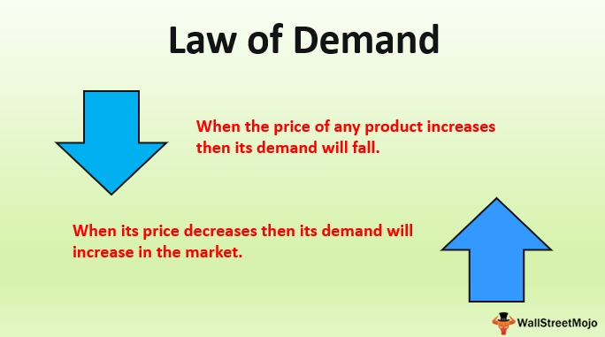

The demand curve and the law of demand are central to economic theory, serving as fundamental concepts that describe how the quantity of a good demanded by consumers varies with its price. The demand curve typically slopes downward, reflecting the inverse relationship dictated by the law of demand: as the price of a good decreases, the quantity demanded generally increases, and conversely, as the price increases, the quantity demanded tends to decrease. This relationship is typically expressed as $Q_d = f(P)$, where $Q_d$ is the quantity demanded and $P$ is the price. The significance of these economic principles lies in their ability to elucidate market dynamics and consumer behavior, offering insights into how individuals and institutions make purchasing decisions based on price changes.

Understanding these principles is crucial for analyzing markets, as they help predict how shifts in prices can influence overall demand within an economy. Various factors, such as income levels, consumer preferences, and the availability of substitute goods, can cause shifts in the demand curve. For instance, an increase in consumer income might increase demand, shifting the curve to the right, while a rise in the price of a substitute good can increase demand for the original good.



Algorithmic trading, or algo trading, utilizes these economic principles by employing mathematical models and algorithms to make financial trading decisions at high speed. Algorithms can incorporate demand curve relationships and economic indicators, allowing them to predict market movements and exploit inefficiencies or anomalies in the market. Examples of these might include rapid adaptations to new price equilibria due to shifts in demand or identifying arbitrage opportunities where the predicted demand hasn't yet been reflected in market prices. Through the integration of demand analysis, algorithmic trading systems can enhance the precision and speed of trading decisions, adapting to complex market dynamics.

## Table of Contents

## Understanding the Demand Curve and the Law of Demand

The demand curve is a graphical representation of the relationship between the price of a good and the quantity demanded by consumers. Typically plotted with price on the vertical axis and quantity on the horizontal axis, the demand curve usually exhibits a downward slope. This negative slope reflects the fundamental principle of the law of demand: as the price of a good decreases, the quantity demanded by consumers generally increases, and vice versa. This inverse relationship is a staple of economic theory, aiming to illustrate consumer purchasing behavior concerning price changes.

The law of demand operates under the assumption of ceteris paribus, a Latin phrase meaning "all other things being equal." This assumption is crucial as it isolates the effect of price changes on the quantity demanded by keeping all other influencing factors constant. In real-world scenarios, it is rare to hold all other factors fixed, but the ceteris paribus assumption allows economists to simplify and analyze complex market behavior in isolation.

The demand curve can shift due to several factors beyond price changes, which violate the ceteris paribus condition. These factors include:

1. **Income Changes**: An increase in consumer income generally shifts the demand curve to the right, indicating a higher quantity demanded at each price level. Conversely, a decrease in income shifts the demand curve to the left.

2. **Prices of Substitute Goods**: If the price of a substitute good rises, the demand for the original good may increase, shifting its demand curve to the right. Conversely, if the substitute good becomes cheaper, the demand for the original good may decrease.

3. **Consumer Preferences**: Changes in tastes or preferences can significantly affect demand. For instance, a product becoming more popular due to successful marketing campaigns can shift the demand curve to the right, while a fall in popularity may shift it to the left.

Understanding these dynamics is crucial for analyzing how the market operates and predicting how changes in external conditions might affect demand for various goods and services. Accurate interpretation of the demand curve and the law of demand is essential for businesses, policymakers, and economists in making informed decisions.

## Interplay Between the Law of Demand and Algo Trading

The demand curve serves as a crucial tool in formulating [algorithmic trading](/wiki/algorithmic-trading) strategies by providing insights into how price changes might influence trading volumes. Understanding the relationship between price and quantity demanded assists traders in predicting market movements and optimizing their trading algorithms.

Algorithmic models often incorporate elements of the demand curve alongside economic indicators to make informed trading decisions. These models use historical price and [volume](/wiki/volume-trading-strategy) data to simulate how shifts in the demand curve could affect asset prices. For instance, if a particular economic indicator suggests an increase in consumer income, algorithms might adjust to forecast a rightward shift in the demand curve, anticipating higher demand at existing prices. This anticipation can lead to buying decisions before the market fully adjusts, thereby capitalizing on expected price increases.

Python or other programming languages enable the development of such algorithmic models. By leveraging libraries like pandas for data analysis and NumPy for numerical operations, developers can write scripts that respond to changes in economic indicators. An example script may look like this:

```python
import pandas as pd
import numpy as np

# Load historical data
data = pd.read_csv('historical_price_data.csv')

# Calculate moving averages
data['Moving_Average'] = data['Price'].rolling(window=5).mean()

# Determine shifts in demand
def demand_curve_shift(price, indicator_change):
    return price * (1 + indicator_change)

# Simulate a demand increase
indicator_change = 0.05  # 5% income increase
data['Adjusted_Price'] = data['Price'].apply(lambda x: demand_curve_shift(x, indicator_change))

# Generate trading signals
data['Signal'] = np.where(data['Adjusted_Price'] > data['Moving_Average'], 'Buy', 'Sell')
```

Moreover, algorithmic trading exploits potential misalignments or market anomalies. These anomalies often arise when actual market behavior deviates from the predicted outcomes based on classic economic principles. For instance, in cases of sudden market news or black swan events, demand may not react as expected, creating temporary inefficiencies. Algorithmic systems can rapidly identify and capitalize on these inefficiencies, executing trades within milliseconds to benefit from price discrepancies.

Traders can also utilize [machine learning](/wiki/machine-learning) algorithms to adaptively adjust to new data. Techniques like [reinforcement learning](/wiki/reinforcement-learning) are particularly useful, as they allow trading systems to learn from the market environment and improve decision-making over time. By continually updating their understanding of the demand curve and related variables, algorithmic trading systems strive to maintain an edge in increasingly competitive markets.

## Practical Applications and Examples

Shifts in demand are pivotal in shaping market prices, directly influencing trading strategies. These shifts can be attributed to various factors such as changes in consumer preferences, income fluctuations, and the introduction of substitute goods. In commodity and stock trading, understanding these dynamics is essential for anticipating market movements and formulating effective trading strategies.

A classic example of demand shifts impacting market prices is seen in the oil market. For instance, during economic expansions, the demand for oil typically increases, leading to higher prices. Conversely, during recessions, demand drops, causing prices to fall. Traders monitor these patterns and adjust their trading strategies accordingly. Algorithmic trading systems, in this context, can be programmed to identify and act on signals of rising or declining demand, optimizing buy and sell decisions.

Similarly, in stock markets, the demand for technological goods often fluctuates based on innovation cycles and consumer trends. A surge in demand for new technology can drive up the stock prices of companies in that sector. Algorithms that detect changes in demand levels, possibly through analysis of consumer sentiment or pre-market indicators, can execute trades to capitalize on these price movements.

Algorithmic trading systems utilize sophisticated models to respond to changes in demand. They incorporate a variety of economic indicators and data sources, such as real-time sales data, consumer trend analyses, and news feeds, to predict shifts in demand curves. These systems can quickly adapt to new information, allowing for rapid adjustments in trading positions. For example, a sudden increase in demand for electric vehicles might prompt an algo trading system to increase holdings in stocks of battery manufacturers or lithium suppliers.

Consider an example in the world of commodities trading using Python:

```python
import numpy as np
import pandas as pd

# Sample data: Demand indices for a commodity over a period
demand_data = {
    'Day': range(1, 11),
    'Demand_Index': [100, 105, 102, 110, 112, 108, 115, 120, 118, 125],
    'Price_per_Unit': [50, 52, 53, 55, 56, 54, 57, 59, 58, 60]
}

df = pd.DataFrame(demand_data)

# Calculate correlation between demand index and price
correlation = np.corrcoef(df['Demand_Index'], df['Price_per_Unit'])[0, 1]

print(f'Correlation between Demand Index and Price: {correlation:.2f}')

# Trading signal: Buy when demand index increases significantly
buy_signals = df[df['Demand_Index'].diff() > 5]

print("Buy signals based on demand increase:")
print(buy_signals)
```

In this example, the demand indices are analyzed to find significant increases, providing buy signals. These signals are critical for traders who use algorithmic systems to optimize trades based on demand fluctuations.

Trading strategies need to account for real-world complexities, such as sudden geopolitical events affecting commodities or unexpected technological advancements influencing stock demand. Algorithms help mitigate the uncertainty by employing predictive models but must be continuously refined to maintain accuracy and effectiveness.

These practical applications highlight the intrinsic link between shifts in demand and market prices. Accurate demand analysis helps traders in maximizing returns and minimizing risks, underscoring the critical role of demand principles in strategic trading.

## Challenges and Limitations

In the context of algorithmic trading, the law of demand faces significant challenges due to market conditions such as [volatility](/wiki/volatility-trading-strategies) and unpredictability. While the law of demand traditionally assumes that a decrease in price will lead to an increase in the quantity demanded, financial markets often deviate from this expectation due to rapid changes and external shocks. Market volatility can cause price fluctuations that are not directly related to changes in demand but rather to speculative trading, geopolitical events, or unexpected economic data.

A classic example where the law of demand may not hold is with Giffen goods, which are inferior goods for which demand increases as the price rises due to the income effect outweighing the substitution effect. In algorithmic trading, recognizing these anomalies is critical, yet challenging. Giffen goods are rare, but they represent how traditional economic theories can encounter exceptions. Similarly, during market panics, fear and uncertainty can lead to herd behavior where prices fall precipitously without a proportional or logical increase in demand, thereby 'breaking' the law of demand.

In algorithmic trading, the reliability of trading algorithms is affected when these deviations occur. Algorithms built on traditional economic models might misinterpret or fail to predict movements if they do not account for abnormal market conditions. For example, during sudden financial crises or speculative bubbles, prices may respond erratically to non-fundamental influences, challenging the algorithm's ability to execute trades based on expected demand conditions.

To mitigate these challenges, algorithmic trading systems often incorporate machine learning models and predictive analytics to adapt to changing market dynamics. These systems can analyze large volumes of data quickly to detect patterns and anomalies that may indicate deviations from the law of demand. However, even advanced models face difficulties in accounting for extreme events or unprecedented market behavior, which can still impact their performance.

Overall, while the law of demand provides a foundational framework for understanding market dynamics, in practice, its application in algorithmic trading is fraught with complexities requiring sophisticated tools and methodologies to navigate effectively. The integration of big data and AI continues to evolve, offering potential solutions to enhance the adaptability and precision of trading algorithms amidst these inherent challenges.

## Future Trends and Innovations

The integration of economics with technology, particularly through the rise of [artificial intelligence](/wiki/ai-artificial-intelligence) (AI) in trading systems, marks a transformative phase in financial markets. AI, paired with machine learning algorithms, is increasingly capable of analyzing intricate economic indicators, including those represented by the demand curve. This promises to enhance predictive analytics, providing traders with advanced tools to interpret demand fluctuations and anticipate market trends more accurately.

Predictive analytics stands at the forefront, potentially utilizing vast datasets to model consumer behaviors and demand patterns. These models apply machine learning techniques to historical market data, aiming to predict future demand shifts. By leveraging the law of demand—where price inversely influences quantity demanded—traders can refine their strategies for better outcomes. For instance, a model could be trained to recognize patterns not evident in traditional data analyses, thus offering innovative insights into market dynamics.

Big data plays a crucial role in this evolution. The sheer volume and variety of data involved offer a more comprehensive view of market behaviors than ever possible with conventional economic models. Advanced algorithms can process transactional data, consumer sentiment analysis, and even macroeconomic indicators to refine understanding of the demand curve. This data-driven approach allows algorithmic trading systems to adjust strategies more dynamically, responding to market signals with increased precision.

In terms of implementation, AI-driven trading platforms could utilize Python, a preferred language due to its extensive libraries and frameworks for data analysis and machine learning, such as Pandas and TensorFlow. A Python model for predictive analytics might involve:

```python
import pandas as pd
from sklearn.model_selection import train_test_split
from sklearn.ensemble import RandomForestRegressor

# Load market data
data = pd.read_csv('market_data.csv')

# Preprocess data
features = data.drop('target', axis=1)
target = data['target']

# Split into training and testing sets
X_train, X_test, y_train, y_test = train_test_split(features, target, test_size=0.2, random_state=42)

# Train a Random Forest model
model = RandomForestRegressor(n_estimators=100, random_state=42)
model.fit(X_train, y_train)

# Predict demand
predictions = model.predict(X_test)
```

This code snippet demonstrates a basic structure for training a machine learning model to predict market outcomes based on various input factors, offering a glimpse into how algorithmic trading systems could leverage computational power to interpret economic principles like the demand curve.

As technology progresses, the synergy between AI and economics may lead to more nuanced interpretations of market data, potentially yielding trading strategies that are not only more reliable but also adaptive to rapid changes. This could reshape financial markets, offering a competitive edge to those who can integrate these disciplines effectively.

## Conclusion

The demand curve is a fundamental element of economics, providing insights into how price variations impact consumer purchasing behavior. In algorithmic trading, understanding the intricacies of the demand curve allows traders to devise strategies that anticipate market fluctuations. The consistent analysis of demand patterns helps in deciphering market trends, enabling successful trading by aligning strategies with consumer behavior dynamics.

Market trends and consumer behavior are crucial for formulating effective trading strategies. Recognizing shifts in demand and price responsiveness aids algorithmic traders in optimizing their models to predict and respond to market changes. Such precision enables them to capitalize on opportunities, maximize returns, and mitigate potential losses.

As financial markets continue to evolve, economic principles such as the demand curve will maintain their central role. Innovations in AI and predictive analytics promise to further refine demand curve analysis, making trading algorithms more robust. The integration of big data will enhance the accuracy of demand predictions, fostering a more nuanced understanding of market dynamics. This continuous evolution underscores the enduring relevance of economic fundamentals in shaping the future of financial markets, supporting sophisticated and informed trading decisions.

## References & Further Reading

[1]: Bergstra, J., Bardenet, R., Bengio, Y., & Kégl, B. (2011). ["Algorithms for Hyper-Parameter Optimization."](https://dl.acm.org/doi/10.5555/2986459.2986743) Advances in Neural Information Processing Systems 24.

[2]: ["Advances in Financial Machine Learning"](https://www.amazon.com/Advances-Financial-Machine-Learning-Marcos/dp/1119482089) by Marcos Lopez de Prado

[3]: ["Evidence-Based Technical Analysis: Applying the Scientific Method and Statistical Inference to Trading Signals"](https://www.amazon.com/Evidence-Based-Technical-Analysis-Scientific-Statistical/dp/0470008741) by David Aronson

[4]: ["Machine Learning for Algorithmic Trading"](https://github.com/stefan-jansen/machine-learning-for-trading) by Stefan Jansen

[5]: ["Quantitative Trading: How to Build Your Own Algorithmic Trading Business"](https://www.amazon.com/Quantitative-Trading-Build-Algorithmic-Business/dp/1119800064) by Ernest P. Chan

[6]: Varian, H. R. (1992). ["Microeconomic Analysis."](https://archive.org/details/microeconomicana00vari_0) (3rd ed.). W.W. Norton & Company.

[7]: Cournot, A. A. (1838). "Researches into the Mathematical Principles of the Theory of Wealth." Reprinted in 1927. Macmillan, New York.

[8]: Fama, E. F. (1970). ["Efficient Capital Markets: A Review of Theory and Empirical Work."](https://onlinelibrary.wiley.com/doi/abs/10.1111/j.1540-6261.1970.tb00518.x) The Journal of Finance, 25(2), 383-417. 

[9]: McKinsey Global Institute. (2018). ["The New Dynamics of Financial Markets."](https://www.mckinsey.com/mgi/overview/in-the-news/2018)