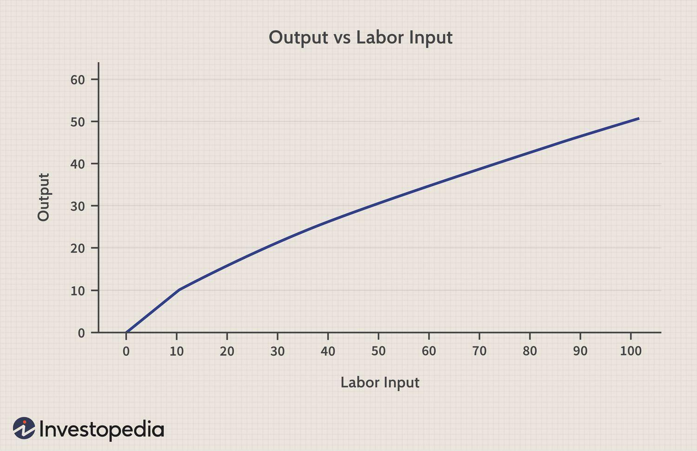

In economics and finance, comprehending key concepts is fundamental to optimizing productivity and making informed investment decisions. Economic theories like marginal productivity and diminishing returns play a significant role in understanding how resources can be efficiently allocated to maximize output. These concepts are not only pivotal in traditional economics but also find essential applications in modern financial practices, particularly algorithmic trading, where the objective is to maximize returns by leveraging technology and data-driven strategies.

Algorithmic trading, a sophisticated method of executing pre-programmed trading orders, relies heavily on the logic of marginal productivity and diminishing returns. By examining how small changes in input, such as trade volume or algorithmic parameters, affect output, traders can optimize their strategies. For instance, algorithms can be tuned to ensure that they generate the highest possible returns before the effects of diminishing returns start to erode profit margins, which is a critical consideration for maintaining efficiency and profitability.



Understanding these economic principles allows traders to better navigate market complexities, enhancing the efficacy of their trading strategies. It connects theoretical frameworks with practical applications, enabling traders to utilize algorithmic systems efficiently. As financial markets become increasingly competitive, the ability to integrate economic insights with technological advancements is essential for maintaining a competitive edge. This article provides a comprehensive overview of these intersections, aiming to equip traders and financial analysts with the knowledge to adapt and thrive in the ever-evolving landscape of algorithmic trading.

## Table of Contents

## Understanding Marginal Productivity and Diminishing Returns

Marginal productivity plays a pivotal role in understanding the efficiency of resource allocation in various production processes. It is defined as the additional output produced as a result of the use of one more unit of input, holding all other inputs constant. This concept is instrumental in determining how effectively resources are utilized to maximize output, thereby optimizing productivity.

The law of diminishing marginal productivity is an essential principle in economic theory. It asserts that as more units of a variable input, such as labor or capital, are added to a fixed input, the resulting increases in output will eventually decline. Initially, the addition of inputs may lead to an increased rate of production; however, beyond a certain point, the marginal gains begin to decrease. Mathematically, this can be expressed as:

$$
\Delta Q = MP \times \Delta L
$$

where $\Delta Q$ is the change in output, $MP$ is the marginal productivity of labor, and $\Delta L$ is the change in labor input. As $\Delta L$ increases, the $\Delta Q$ starts to decrease if the law of diminishing returns sets in.

Understanding these principles is critical for both production managers and financial analysts. In the context of automated trading, where algorithms swiftly execute trades based on predefined criteria, the efficient allocation of computing resources and capital is essential. As trades increase, the incremental benefit of each trade diminishes, necessitating a strategic approach to resource allocation.

By recognizing the point of diminishing returns, traders can adjust their strategies to avoid inefficiencies and optimize the use of resources. This is particularly relevant when scaling [algorithmic trading](/wiki/algorithmic-trading) systems, where both computational and financial inputs must be managed judiciously to maintain a balance between input costs and output benefits.

Furthermore, an analytical approach that incorporates marginal productivity and diminishing returns helps in making informed decisions about scaling operations and managing resources efficiently. For instance, when developing a trading algorithm, it is crucial to determine the optimal amount of data and computational power that maximizes returns without incurring excessive costs or inefficiencies.

Understanding these economic principles provides a robust foundation for traders and financial analysts, enabling them to make strategic decisions that align with their productivity and performance goals. By applying the concept of marginal productivity alongside the law of diminishing returns, one can optimize trading strategies, enhance performance, and ultimately achieve a more efficient and profitable trading operation.

## The Law of Diminishing Returns in Algorithmic Trading

Algorithmic trading has become a cornerstone of modern financial markets, characterized by the use of computer algorithms to execute trading orders at speeds and frequencies that humans cannot achieve. This field is significantly influenced by the principles of marginal productivity and diminishing returns, both of which have crucial implications for trading efficiency and profitability.

In the context of algorithmic trading, the law of diminishing marginal returns manifests as a decrease in the additional profit or benefit gained from each subsequent trade when a certain [volume](/wiki/volume-trading-strategy) threshold is exceeded. This can be mathematically described by considering the profit function, $P(x)$, where $x$ represents the number of trades. Initially, as $x$ increases, $P(x)$ also increases, but at a decreasing rate. This phenomenon occurs because factors such as market impact costs, [liquidity](/wiki/liquidity-risk-premium) constraints, and bid-ask spreads start playing a larger role as trading frequency intensifies. 

To illustrate, consider a scenario where a trading algorithm executes a high-frequency strategy. Initially, trades are profitable due to opportunities for [arbitrage](/wiki/arbitrage) or market inefficiencies. However, as the algorithm continues to execute more trades, it encounters increased market impact, where the sheer volume of orders begins to affect the market prices themselves, thus eroding the profitability of subsequent trades. This is the essence of diminishing returns in this context.

Traders can leverage this understanding to optimize their trading strategies. By recognizing the point at which increasing trade volume results in diminishing returns, algorithms can be programmed to either reduce trading intensity or alter the trading strategy to maintain optimal returns. This dynamic adjustment can be achieved through various methods, such as implementing a feedback mechanism within the algorithm that monitors the profitability metrics and adjusts the trading frequency accordingly.

In Python, such a mechanism could be implemented as follows:

```python
class TradingAlgorithm:
    def __init__(self, initial_frequency, profit_threshold):
        self.trade_frequency = initial_frequency
        self.profit_threshold = profit_threshold

    def evaluate_trade(self, current_profit):
        if current_profit < self.profit_threshold:
            self.adjust_trading_strategy()

    def adjust_trading_strategy(self):
        self.trade_frequency *= 0.9  # Reduce frequency by 10%

    def simulate_trading(self, trade_data):
        for profit in trade_data:
            self.evaluate_trade(profit)

# Example usage:
trade_data = [5, 4.5, 4, 3.5, 3, 2.5]  # Simulated profits per trade
algo = TradingAlgorithm(initial_frequency=10, profit_threshold=3)
algo.simulate_trading(trade_data)
```

This pseudo-code initializes a trading algorithm with a specified trade frequency and a profit threshold. The algorithm evaluates each trade's profitability and adjusts the strategy if the profit falls below the threshold, demonstrating how diminishing returns can be integrated into algorithmic trading systems.

By integrating the insights from marginal productivity and diminishing returns, traders can enhance their algorithmic trading systems, potentially increasing profitability and market adaptability, thus fostering efficient trading environments.

## Examples of Diminishing Returns in Trading Strategies

In the context of trading strategies, diminishing returns are a crucial concept, notably for operations involving algorithmic trading and high-frequency trading ([HFT](/wiki/high-frequency-trading-strategies)). A typical example encompasses a trading bot executing a high-frequency trading strategy. Initially, such bots can achieve significant returns by capitalizing on minor price discrepancies; however, as the trading volume escalates, the marginal benefit from each trade tends to decline. This phenomenon can be expressed through the law of diminishing returns, which posits that adding more of a single input will result in smaller increases in output, holding all else constant.

Consider a hypothetical scenario where a [hedge fund](/wiki/hedge-fund-trading-strategies) implements an algorithmic trading strategy designed to execute thousands of transactions in a short timeframe. Initially, the strategy may generate notable profits due to the quick execution and favorable market movements. Over time, however, as transaction volume increases, the competition from similar high-volume trading strategies intensifies, resulting in reduced profit margins per transaction. This reality is exacerbated by market conditions where fluctuations that offered earlier profit opportunities have stabilized under competitive pressures.

Moreover, the application of [machine learning](/wiki/machine-learning) models in trading, while potentially advantageous, also exemplifies diminishing returns under certain circumstances. Utilizing overly sophisticated models can lead to overfitting, where the model performs exceptionally well on training data but poorly on unseen data, thereby reducing its predictive accuracy and, consequently, its effectiveness in real-world trading. Complexity beyond a certain threshold yields diminishing rewards regarding improvements in model accuracy and often necessitates increased computational resources.

For instance, a trading strategy designed to predict market movements might employ a complex [neural network](/wiki/neural-network) architecture. Initially, as layers and neurons are added, the performance on historical data might improve. However, past a certain point, additional layers lead to minimal gains in predictive performance and may even degrade model generalizability due to overfitting, represented mathematically by:

$$
\text{Training Error} = \frac{1}{n}\sum_{i=1}^n (y_i - \hat{y}_i)^2
$$

where $y_i$ denotes actual outcomes and $\hat{y}_i$ are the predictions. Furthermore, the complexity of the model can be reflected in the complexity parameter $\lambda$ intended to penalize complex models, expressed in a loss function:

$$
\text{Total Loss} = \text{Training Error} + \lambda \times \text{Complexity Penalty}
$$

These examples underscore the imperative for traders to remain cognizant of the law of diminishing returns when scaling up trading strategies. A balanced approach, where strategies are periodically reassessed and recalibrated, can mitigate the risks associated with declining efficiency and help maintain optimal performance levels.

## Marginal Analysis in Risk Management and Pricing

Marginal analysis is a crucial tool in financial decision-making, particularly in the areas of risk management and pricing strategies. Its application allows traders and financial analysts to evaluate the additional benefits and costs associated with incremental changes in their portfolios or trading activities.

In risk management, marginal analysis is employed to quantify the impact of additional units of risk on the overall performance of a portfolio. This involves assessing the incremental effect of new investments or trading decisions on risk-adjusted returns, which are a measure of the returns on an investment adjusted for the level of risk taken. A key aspect of this process is determining the marginal risk, which is the additional risk associated with a small increase in investment. The goal is to maintain a balance where the marginal benefit of taking on extra risk is equal to the marginal cost, thereby optimizing the portfolio's performance. 

$$
\text{Marginal Risk} = \frac{\partial \text{Total Risk}}{\partial \text{Investment}}
$$

Pricing strategies in financial markets also utilize marginal analysis to set optimal pricing levels. This involves examining the relationship between marginal cost and marginal revenue to ensure that each unit price is aligned with the costs and returns associated with it. If the marginal cost of producing a financial product (such as an option, bond, or other derivatives) is lower than the marginal revenue obtained from selling it, the pricing strategy is deemed effective. Equilibrium is achieved when marginal cost equals marginal revenue, maximizing profit.

$$
\text{Optimal Pricing Condition: } \text{MC} = \text{MR}
$$

Here, $\text{MC}$ stands for marginal cost, and $\text{MR}$ represents marginal revenue. By aligning these metrics, financial professionals can set prices that reflect market conditions and cost structures, maintaining competitive advantage.

Furthermore, financial professionals can apply insights from marginal analysis to enhance investment portfolios and trading operations. By continuously evaluating the marginal changes in their strategies, they can adjust their tactics to respond to new information or shifts in market dynamics. This proactive approach helps in mitigating risks while exploring opportunities for growth and returns, thereby increasing the efficiency and profitability of financial activities. These applications underscore the importance of marginal analysis as an indispensable tool in the optimization of financial strategies.

## Economies of Scale and Diseconomies in Algorithmic Trading

Economies of scale describe the cost advantages that entities achieve due to an increase in the scale of production, leading to a reduction in average costs per unit. In the context of algorithmic trading, this concept translates to reduced per-trade costs as the volume of trades increases. This is primarily due to the ability to spread fixed costs, such as infrastructure and software development, over a larger number of trades. Additionally, large-scale trading can lead to negotiation leverage for better commissions and fees with brokers, further enhancing cost efficiency.

Mathematically, economies of scale can be expressed as a decrease in the average cost $AC$ as output $Q$ increases:

$$
AC = \frac{TC}{Q}
$$

where $TC$ is the total cost.

However, as trading volumes continue to grow, firms may encounter diseconomies of scale. This phenomenon occurs when increased volume results in rising per-trade costs due to inefficiencies. These inefficiencies can stem from factors such as market impact costs, which increase with transaction size, and operational complexities that arise with scaling, such as data processing bottlenecks and latency issues, that can adversely affect trading performance.

Algorithmic traders must adeptly manage the balance between these economies and diseconomies of scale to optimize market efficiency and ensure profitability. Advanced algorithms are key in this balancing act. They can dynamically adjust trading strategies to current market conditions, identifying optimal trading volumes that minimize costs while maximizing returns. 

One method to address this dynamically in Python might involve monitoring real-time trading data to adjust trade sizes, using a feedback loop to determine the impact of trades on costs and modify strategies accordingly. Here is a basic conceptual framework for how such an algorithm might be structured:

```python
def optimize_trade_size(trade_data):
    initial_size = calculate_initial_size(trade_data)
    cost_impact = calculate_market_impact(trade_data)

    while cost_impact > threshold:
        initial_size *= adjustment_factor
        cost_impact = calculate_market_impact(trade_data)

    return initial_size

def calculate_initial_size(trade_data):
    # Logic to determine initial trade size based on historical data
    pass

def calculate_market_impact(trade_data):
    # Logic to calculate market impact costs based on current trade size and market conditions
    pass
```

This framework underscores the importance of a responsive trading system that can adapt to both internal company limits and external market shifts, thereby allowing algorithmic traders to exploit economies of scale while minimizing the risks associated with diseconomies.

## Conclusion

In the ever-evolving landscape of finance, comprehending the nuances of marginal productivity and diminishing returns is essential for traders and financial analysts committed to enhancing their performance through algorithmic trading. These economic theories are not just abstract principles but serve as practical tools that can significantly refine trading strategies and inform decision-making processes.

Integrating economic theories with algorithmic strategies provides a robust framework for traders aiming to optimize their operations. By acknowledging that additional units of input, such as data points or trades, yield decreasing returns beyond a certain threshold, market participants can avoid unnecessary risks and resource misallocation. This understanding helps in designing algorithms that dynamically adjust trading volumes, thereby maintaining efficiency and profitability.

As financial markets grow in complexity, the ability to apply these concepts becomes increasingly indispensable. The rapid pace of technological advancement requires traders to continually adapt their strategies to remain competitive. Algorithmic trading systems can incorporate models that predict and respond to market changes efficiently, taking full advantage of economies of scale while cautiously avoiding the pitfalls of diseconomies.

Ultimately, the strategic application of marginal productivity and diminishing returns principles enables traders to craft more effective strategies, optimize resources, and secure a sustainable edge in financial markets. By internalizing and utilizing these economic principles, market practitioners can not only enhance their returns but also contribute to a more stable and efficient market environment.

## References & Further Reading

[1]: Bergstra, J., Bardenet, R., Bengio, Y., & Kégl, B. (2011). ["Algorithms for Hyper-Parameter Optimization."](https://dl.acm.org/doi/10.5555/2986459.2986743) Advances in Neural Information Processing Systems 24.

[2]: ["Advances in Financial Machine Learning"](https://www.amazon.com/Advances-Financial-Machine-Learning-Marcos/dp/1119482089) by Marcos Lopez de Prado

[3]: ["Evidence-Based Technical Analysis: Applying the Scientific Method and Statistical Inference to Trading Signals"](https://www.semanticscholar.org/paper/Evidence-Based-Technical-Analysis%3A-Applying-the-and-Aronson/3b33df8737f1772e9e14d66a08c9696f140a2ee1) by David Aronson

[4]: ["Machine Learning for Algorithmic Trading"](https://github.com/PacktPublishing/Machine-Learning-for-Algorithmic-Trading-Second-Edition) by Stefan Jansen

[5]: ["Quantitative Trading: How to Build Your Own Algorithmic Trading Business"](https://books.google.com/books/about/Quantitative_Trading.html?id=j70yEAAAQBAJ) by Ernest P. Chan