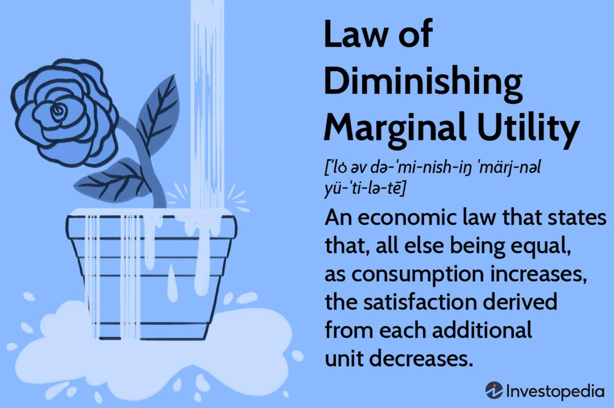

Understanding consumer behavior is fundamental in both economics and the rapidly evolving domain of algorithmic trading. At the heart of this understanding lies the economic principle of diminishing marginal utility, which provides crucial insights into consumer decision-making processes. This principle posits that as a person consumes additional units of a good or service, the added satisfaction or utility derived from each successive unit tends to decrease. Thus, the concept of diminishing marginal utility is pivotal in explaining consumer purchasing behavior and preference formation.

In algorithmic trading, where decisions are made based on complex data analysis and predefined criteria, uncovering patterns in consumer behavior is integral for making informed trading decisions. By understanding how and why consumers make certain choices, traders can anticipate market movements and improve their trading strategies. This connection between consumer behavior and algorithmic trading highlights the significance of integrating economic principles into financial models to enhance performance.



This article aims to explore the intersections between diminishing marginal utility, consumer behavior, and algorithmic trading. By examining these concepts, we can better understand their impact on market trends and decision-making processes in financial markets. This exploration aids in the development of trading algorithms that are not only data-driven but also contextually aware of economic and consumer behavior principles, offering an opportunity to navigate the complexities of modern markets effectively.

## Table of Contents

## The Principle of Diminishing Marginal Utility

Diminishing Marginal Utility is a critical concept in economics that characterizes how the incremental satisfaction, or utility, gained from consuming an additional unit of a good or service diminishes as the quantity consumed increases. This principle stems from the observation that as individuals consume more of a product, the subjective value or enjoyment derived from each additional unit tends to decrease. For instance, the first slice of pizza may provide substantial satisfaction, but by the sixth or seventh slice, the additional pleasure diminishes considerably.

This principle serves as a fundamental explanation for consumer buying behavior and decision-making processes. Consumers aim to maximize their overall satisfaction or utility when making purchasing decisions, often subjected to budget constraints. The diminishing marginal utility influences how they allocate their financial resources among various goods and services. Suppose the marginal utility per dollar spent on one good falls below that of another good; rational consumers would reallocate their spending to maximize total utility, often purchasing less of goods with lower marginal utility.

Real-world examples abound in illustrating how diminishing marginal utility affects consumer choices. Consider a mobile phone service plan offering unlimited data; initial usage provides significant value, but beyond a certain point, additional consumption does not increase satisfaction proportionately. This understanding helps marketers design tiered product offerings and personalized promotions to match different levels of consumer preferences and willingness to pay.

Predicting market demand and assessing consumer trends rely heavily on the concept of diminishing marginal utility. By understanding this phenomenon, businesses and policymakers can anticipate changes in demand as they adjust pricing strategies or introduce new products. An increase in the price of a frequently consumed good with diminishing returns can lead to substantial demand elasticity, prompting consumers to reduce consumption proportionately more than if marginal utility remained constant.

Economists leverage this principle extensively to analyze a wide range of economic activities, extending beyond consumer goods to encompass investment decisions. In investment, the concept helps investors understand the utility of risk and return, influencing asset diversification strategies. This principle also conceives marginal analysis, a core method in economic theory and practice used to evaluate the benefits and costs associated with incremental changes in economic variables.

Understanding diminishing marginal utility provides a critical lens through which both theoretical economic models and practical market strategies can be refined, contributing significantly to our grasp of consumption patterns and economic behavior.

## Consumer Behavior in Economics

Consumer behavior in economics refers to the study of how individuals make decisions regarding the allocation of their resources, specifically time and money. This complex decision-making process is influenced by a multitude of factors, including psychological, social, and economic variables. These factors interplay in diverse ways to shape consumer choices, with psychological aspects often involving perceptions, motivations, attitudes, and beliefs that drive behaviors. Social factors might include cultural norms, family influences, and social status, which contribute to how consumers perceive products and services. Economic variables encompass income levels, price changes, and broader economic conditions that impact consumer purchasing power and consumption patterns.

By analyzing consumer behavior, economists and businesses can identify patterns that help predict market dynamics. This analysis involves the application of various models and theories to anticipate shifts in consumer preferences and spending habits. One common approach is the use of utility theory, which posits that consumers aim to maximize their satisfaction or utility from consumption subjects to their budget constraints. The utility maximization problem can be expressed mathematically as:

$$
\max U(x_1, x_2, \ldots, x_n)
$$
$$
\text{subject to } \sum_{i=1}^{n} p_i x_i \leq M
$$

where $U$ represents the utility function, $x_i$ are the quantities of goods, $p_i$ are the prices of these goods, and $M$ is the consumer's income. Understanding how consumers adjust their consumption in response to changes in these variables can offer insights into future market trends.

Economists also employ behavioral models that integrate insights from psychology to better capture the nuances of human decision-making. For example, the concept of bounded rationality suggests that while consumers try to make rational decisions, their cognitive limitations can lead to systematic biases. Analyzing these behaviors can uncover opportunities for improving transaction efficiency and designing more customer-centric business strategies.

For businesses and policymakers, a thorough understanding of consumer behavior is invaluable. It enables companies to tailor their products and marketing efforts to meet consumer needs more effectively, thereby enhancing competitiveness. At the same time, policymakers can formulate economic policies that better align with consumer welfare, ensuring that market regulations support sustainable economic growth and consumer protection.

In summary, consumer behavior in economics is a multifaceted study that encompasses the psychological, social, and economic influences on decision-making. Through sophisticated modeling and analysis, economists and businesses gain critical insights into how consumers allocate resources, providing a foundation for strategic planning and policy development.

## Algorithmic Trading and Market Behavior

Algorithmic trading employs automated systems to execute trades based on a set of pre-defined criteria, which are typically informed by data analysis and statistical modeling. Originally the domain of institutional investors due to its requirement for sophisticated technology and access to vast quantities of data, [algorithmic trading](/wiki/algorithmic-trading) has increasingly become accessible to retail investors. This democratization is largely due to advances in technology and the availability of public trading platforms that offer algorithmic capabilities.

The core advantage of algorithmic trading is its ability to process vast amounts of data far beyond human capability, uncovering patterns and making decisions within fractions of a second. These patterns may be subtle or entirely invisible to human traders. For instance, algorithms can monitor and analyze price movements, trading volumes, and historical data to detect trends or anomalies that might indicate favorable buying or selling opportunities.

Integrating consumer behavior data into algorithmic trading strategies provides an additional layer of insight into market movements. For instance, by understanding consumption trends or shifts in consumer preferences, traders can anticipate demand changes for certain asset classes or sectors. This can be particularly useful in trading commodities or stocks of companies with consumer-centric products.

The application of economic principles, such as diminishing marginal utility, can enrich these algorithmic models. The principle of diminishing marginal utility, which suggests that as a consumer consumes more of a good, the additional satisfaction (utility) derived from each additional unit decreases, can influence market pricing and consumer demand. By incorporating such concepts, algorithms can be tweaked to account for potential slowdowns in demand growth or shifts in consumer priorities, leading to more accurate predictions and optimized trading strategies.

For practical implementation, Python is often used for developing algorithmic trading strategies due to its robust libraries like NumPy, pandas, and scikit-learn, which facilitate data handling and statistical analysis. Here's a basic example of how Python might be used to implement a simple trend-following strategy:

```python
import pandas as pd
import numpy as np

# Sample data
data = pd.read_csv('stock_prices.csv')
data['moving_average'] = data['price'].rolling(window=20).mean()

# Define trading signal
data['signal'] = 0
data['signal'][20:] = np.where(data['price'][20:] > data['moving_average'][20:], 1, 0)

# Define positions
data['position'] = data['signal'].diff()

# Display results
print(data[['price', 'moving_average', 'signal', 'position']])
```

In this code snippet, the algorithm calculates a 20-day moving average of stock prices and generates buy signals (1) when the stock price exceeds the moving average. The `position` column then reflects changes in the trading signal. This simplistic model could be expanded using consumer behavior data to refine predictions and responses.

Algorithmic trading continues to evolve, and its intersection with economic theories and consumer data insight is increasingly valuable. This integration allows for more nuanced strategies that not only react to market changes but anticipate them, optimizing performance in ever-changing financial markets.

## Intersections of Economics, Consumer Behavior, and Algo Trading

Understanding consumer behavior and the principle of diminishing marginal utility can significantly enhance the development of more effective trading algorithms. Diminishing marginal utility, a concept that explains how the incremental benefit from consuming additional units of a good decreases as consumption increases, can be applied to algorithmic trading to improve model precision and adaptability. By incorporating insights from consumer behavior, algorithmic models can better predict market fluctuations and changes in asset valuations, presenting a robust framework for financial decision-making.

Algorithmic trading, driven largely by sophisticated software that executes trades based on data analysis and pre-defined criteria, benefits tremendously from consumer trend analyses. These algorithms can process massive datasets, which include consumer behavior patterns, allowing traders to anticipate shifts in market dynamics more efficiently. For instance, the diminishing marginal utility concept can be integrated into predictive models. Python code, for example, could implement this via a utility function that decreases as the consumption of an asset increases:

```python
def diminishing_marginal_utility(units):
    base_utility = 100  # base utility value
    decay_rate = 0.1    # rate at which utility decreases
    return base_utility * (1 - decay_rate)**units

for units in range(1, 11):
    print(f"Utility for {units} units: {diminishing_marginal_utility(units)}")
```

The synergy between economic theory and technology facilitates strategic decision-making in financial markets. Economic principles provide a theoretical foundation, while algorithmic trading offers a practical application of these theories. This intersection enables the creation of dynamic and sophisticated trading strategies that consider both quantitative data and nuanced market behaviors. 

Case studies illustrate how firms leverage consumer economics insights to refine their algorithms. Companies actively analyze purchasing behaviors, sentiment analyses, and market consumables to align their algorithmic models with real-world conditions. For example, retail traders, influenced by social media trends, may impact stock prices differently than institutional investors. Recognizing these nuances, firms can adjust their trading methods, potentially yielding better outcomes and reduced risks.

As technology evolves, the role of economic theories in shaping algorithmic strategies is projected to grow. Machine learning and [artificial intelligence](/wiki/ai-artificial-intelligence) (AI) are increasingly employed to interpret complex consumer data, automate decision-making processes, and enhance predictive accuracy. This ongoing integration signifies an advanced frontier in trading, wherein economic theories not only guide but also transform algorithmic methodologies in finance, paving the way for potentially groundbreaking advancements in market operations.

## Conclusion

The principle of diminishing marginal utility, alongside insights into consumer behavior, plays a pivotal role in both economics and trading. In economics, understanding why and how additional units of a product or service yield progressively less satisfaction is essential for evaluating consumer choices and optimizing resource allocation. This principle helps explain the diversity in consumer purchasing patterns and assists businesses in setting competitive pricing strategies and predicting demand.

In trading, particularly in algorithmic trading, applying the principle of diminishing marginal utility allows for more nuanced models that can anticipate subtle shifts in market behavior. Algorithmic trading systems leverage this knowledge via sophisticated algorithms to analyze extensive datasets, thereby identifying market trends and making decisions autonomously. This approach enhances the efficiency and precision of trading by preempting market movements based on verified economic principles.

The continual advancement of technology further enriches the capabilities of algorithmic trading, providing new opportunities to integrate complex economic theories into trading strategies. As we progress, leveraging this synergy between economic insights and technological tools promises to unlock further potential within financial markets.

Traders, economists, and policymakers stand to gain significantly from ongoing research that bridges these domains. By refining our understanding and methodologies, stakeholders can better navigate the dynamic environment of financial markets. Ultimately, a comprehensive grasp of diminishing marginal utility and consumer behavior facilitates a more accurate interpretation of market intricacies, fostering informed and strategic decision-making.

## References & Further Reading

[1]: Peter, R., & Tsiotras, J. (2003). ["Application of Diminishing Marginal Utility Theory to Portfolio Selection."](https://link.springer.com/referenceworkentry/10.1007/978-0-387-74759-0_513) Journal of Economic Behavior & Organization.

[2]: ["Algorithmic Trading: Winning Strategies and Their Rationale"](https://www.wiley.com/en-us/Algorithmic+Trading%3A+Winning+Strategies+and+Their+Rationale-p-9781118460146) by Ernie Chan

[3]: Varian, H. R. (1992). ["Microeconomic Analysis"](https://archive.org/details/microeconomicana0000vari_g1b1). W.W. Norton & Company.

[4]: ["Advances in Financial Machine Learning"](https://www.amazon.com/Advances-Financial-Machine-Learning-Marcos/dp/1119482089) by Marcos Lopez de Prado

[5]: Kahneman, D., & Tversky, A. (1979). ["Prospect Theory: An Analysis of Decision under Risk."](http://web.mit.edu/curhan/www/docs/Articles/15341_Readings/Behavioral_Decision_Theory/Kahneman_Tversky_1979_Prospect_theory.pdf) Econometrica.

[6]: Samuelson, P. A. (1938). ["A Note on the Pure Theory of Consumer's Behaviour."](https://www.jstor.org/stable/2548836) Economica.