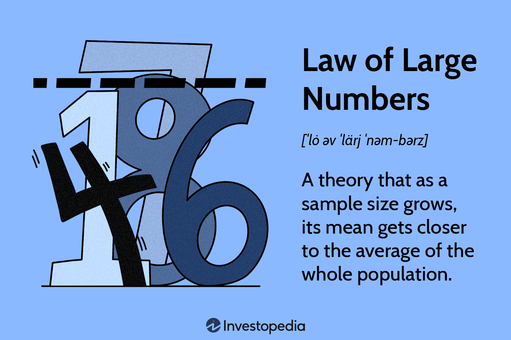

## Table of Contents

## What is the Law of Large Numbers?

The Law of Large Numbers is a basic idea in probability and statistics. It says that if you repeat an experiment many times, the average of your results will get closer and closer to the expected value. For example, if you flip a fair coin many times, the percentage of heads you get will be close to 50%.

This law is important because it helps us understand how reliable our predictions can be. When we have a lot of data, we can be more confident that our average will be close to the true value. This is why big surveys or experiments are more trustworthy than small ones. The Law of Large Numbers is used in many fields, like insurance, gambling, and scientific research, to make better predictions and decisions.

## Who developed the Law of Large Numbers?

The Law of Large Numbers was first developed by a mathematician named Jacob Bernoulli in the late 1600s and early 1700s. Bernoulli was a Swiss mathematician who worked on many problems in probability. He wrote a book called "Ars Conjectandi," which was published after he died in 1713. In this book, he explained the Law of Large Numbers and showed how it works with math.

Later, other mathematicians like Simeon Denis Poisson and Andrey Markov made the Law of Large Numbers even stronger. They came up with new ways to prove it and showed that it could be used in more situations. Today, the Law of Large Numbers is a key part of statistics and is used in many different fields to help make better predictions and decisions.

## What are the two types of the Law of Large Numbers?

There are two types of the Law of Large Numbers: the Strong Law of Large Numbers and the Weak Law of Large Numbers. The Strong Law of Large Numbers says that if you do an experiment over and over again, the average of your results will not just get close to the expected value, but it will actually get to that value eventually. It's like saying that if you flip a coin many, many times, the percentage of heads will not just be close to 50%, but it will actually reach 50% at some point.

The Weak Law of Large Numbers is a bit different. It says that the average of your results will get close to the expected value, but it doesn't promise that it will actually reach that value. Instead, it says that the average will be close enough to the expected value most of the time. For example, if you flip a coin many times, the percentage of heads will be close to 50% most of the time, but it might not actually be exactly 50%. Both types of the Law of Large Numbers are important and are used in different situations to help understand how reliable our predictions can be.

## How does the Law of Large Numbers apply to probability?

The Law of Large Numbers is a key idea in probability. It helps us understand what happens when we do an experiment many times. Imagine flipping a coin. If you flip it just a few times, you might get more heads than tails, or more tails than heads. But if you flip it a lot of times, say a thousand times, the number of heads and tails will be about the same. This is because the Law of Large Numbers says that as you do more and more trials, the average result will get closer to the true probability. For a fair coin, that true probability is 50% heads and 50% tails.

In probability, this law is important because it lets us make better predictions. When we have a lot of data, we can be more sure that our average will be close to the real probability. This is why big studies or experiments are more reliable than small ones. For example, if you want to know how many people like a certain type of food, you would ask a lot of people, not just a few. The more people you ask, the closer your results will be to the true percentage of people who like that food. So, the Law of Large Numbers helps us trust our predictions more when we have a lot of data.

## Can you explain the difference between the Strong and Weak Law of Large Numbers?

The Strong Law of Large Numbers says that if you do an experiment over and over again, the average of your results will not just get close to the expected value, but it will actually reach that value eventually. Imagine you're flipping a coin many times. The Strong Law says that if you flip it enough times, the percentage of heads you get will not just be close to 50%, but it will actually be 50% at some point. This law is very strong because it promises that the average will get to the true value, not just near it.

The Weak Law of Large Numbers is a bit different. It says that the average of your results will get close to the expected value, but it doesn't promise that it will actually reach that value. It's like saying that if you flip a coin many times, the percentage of heads will be close to 50% most of the time, but it might not actually be exactly 50%. The Weak Law is still useful because it tells us that our average will be close enough to the true value most of the time, which helps us make good predictions even if we can't be sure it will be exactly right.

## What are some common misconceptions about the Law of Large Numbers?

One common misconception about the Law of Large Numbers is that it means the results of individual trials will balance out quickly. People might think that if they flip a coin and get heads a few times in a row, tails is "due" to come up soon to even things out. But the Law of Large Numbers doesn't work that way. It says that over a very large number of trials, the average will get close to the expected value, not that individual results will balance out in the short term.

Another misconception is that the Law of Large Numbers applies to small samples. Some people might think that if they only flip a coin 10 times, the results should be close to 50% heads and 50% tails. But the Law of Large Numbers needs a lot of trials to work well. With only a few trials, the results can be far from the expected value. It's only when you do the experiment many, many times that the average starts to get close to the true probability.

## How can the Law of Large Numbers be demonstrated using a simple experiment?

Imagine you have a coin and you want to see the Law of Large Numbers in action. Start by flipping the coin just 10 times and count how many times you get heads. You might get 7 heads or 3 heads, or any other number. It won't be exactly 50% heads because 10 flips is not enough to show the Law of Large Numbers. Now, flip the coin 100 times. You'll probably get a number of heads closer to 50, like 48 or 52 heads. But it still might not be exactly 50% because 100 flips is still not a huge number.

Keep going and flip the coin 1,000 times. This time, you'll find that the number of heads you get is very close to 500, which is 50% of the total flips. The more you flip the coin, the closer the percentage of heads gets to 50%. This simple experiment shows the Law of Large Numbers at work. It tells us that as the number of trials gets bigger, the average result gets closer and closer to the expected value. In this case, the expected value for a fair coin is 50% heads, and the more you flip, the closer your results get to that number.

## What role does the Law of Large Numbers play in statistical sampling?

The Law of Large Numbers is very important in statistical sampling because it helps us understand how reliable our samples are. When we take a sample from a big group, like asking a few people their opinions instead of everyone, we want to know if our sample is a good reflection of the whole group. The Law of Large Numbers tells us that if we take a big enough sample, the average of our sample will be close to the average of the whole group. So, if we want to know what percentage of people like a certain type of food, a big sample will give us a result that's close to the true percentage.

This law is why bigger samples are better than smaller ones. If you only ask a few people, your results might be far from the truth. But if you ask a lot of people, your results will be much closer to the real answer. This is why companies and researchers try to use big samples when they do surveys or experiments. The Law of Large Numbers gives them confidence that their results are accurate and can be trusted.

## How is the Law of Large Numbers used in insurance and risk management?

The Law of Large Numbers helps insurance companies a lot. They use it to predict how much they will have to pay out in claims. If an insurance company insures a lot of people, they can be pretty sure that the number of claims they get will be close to what they expect. For example, if they know that 1% of people usually have car accidents each year, and they insure 100,000 people, they can predict that about 1,000 people will have accidents. This helps them set their prices right so they can cover the costs of the claims and still make a profit.

In risk management, the Law of Large Numbers is also important. It helps companies understand the risks they face when they do a lot of the same thing. For example, a bank that gives out a lot of loans can use the Law of Large Numbers to predict how many people will not pay back their loans. If they have data on a lot of loans, they can be more sure about their predictions. This helps them manage their risks better and make safer decisions. The more data they have, the better they can predict and manage their risks.

## Can you discuss any limitations or criticisms of the Law of Large Numbers?

The Law of Large Numbers is a great tool, but it has some limitations. One big problem is that it needs a lot of data to work well. If you don't have enough data, your results might not be close to the true value. For example, if you only flip a coin a few times, you might not get close to 50% heads. You need to flip it many, many times to see the Law of Large Numbers in action. Also, the Law of Large Numbers assumes that each trial is independent, meaning that one trial doesn't affect the next one. If the trials are not independent, the law might not work as expected.

Another criticism is that the Law of Large Numbers can be misunderstood. Some people think it means that if something happens a lot, the opposite is more likely to happen soon to balance things out. But that's not true. The Law of Large Numbers doesn't change the probability of individual events; it just says that over a lot of trials, the average will get close to the expected value. This misunderstanding can lead to wrong predictions and decisions, especially in things like gambling or investing.

## How does the Law of Large Numbers relate to the Central Limit Theorem?

The Law of Large Numbers and the Central Limit Theorem are both important ideas in statistics, but they talk about different things. The Law of Large Numbers says that if you do an experiment many times, the average of your results will get closer and closer to the true value. For example, if you flip a coin a lot, the percentage of heads will get close to 50%. This helps us know that big samples are more reliable than small ones.

The Central Limit Theorem is different. It says that if you take many samples from a group and find the average of each sample, those averages will follow a normal distribution, even if the original data doesn't. This means that if you take a lot of samples and find their averages, those averages will look like a bell curve. The Central Limit Theorem is useful because it helps us make predictions and understand how likely certain results are, even when we don't know much about the original data. Both the Law of Large Numbers and the Central Limit Theorem help us understand how to work with data, but they focus on different parts of it.

## What are some advanced applications of the Law of Large Numbers in fields like finance or machine learning?

In finance, the Law of Large Numbers helps with things like managing risk and making investment decisions. When a bank gives out a lot of loans, they can use the Law of Large Numbers to predict how many people might not pay back their loans. This helps the bank set aside enough money to cover those losses and still make a profit. Also, when people invest in the stock market, they often buy many different stocks to spread out their risk. The Law of Large Numbers tells them that if they invest in a lot of different stocks, the overall return will be close to what they expect, even if some stocks do badly.

In [machine learning](/wiki/machine-learning), the Law of Large Numbers is used to train models. When you're teaching a computer to recognize things, like pictures of cats, you need to show it a lot of examples. The more examples you show it, the better the computer gets at recognizing cats. This is because the Law of Large Numbers says that with a lot of data, the average result will be close to the true value. So, if you have a lot of cat pictures, the computer's guesses about new pictures will be more accurate. This is why big data is so important in machine learning; it helps the models learn better and make better predictions.

## What is the Law of Large Numbers and how can it be understood?

The Law of Large Numbers (LLN) is a key theorem within probability theory and [statistics](/wiki/bayesian-statistics), articulating the behavior of averages calculated from random samples. The core idea is that, as the number of observations from a population increases, the sample mean tends to converge to the population mean. This principle underlies many statistical processes and supports more accurate predictions.

More specifically, the LLN is formulated in two distinct types: the Weak Law and the Strong Law. The Weak Law of Large Numbers suggests that for any positive number $\epsilon$, the probability that the absolute difference between the sample average $\bar{X}_n$ and the expected value $\mu$ exceeds $\epsilon$ approaches zero as the sample size $n$ increases, formally expressed as:

$$
P(|\bar{X}_n - \mu| \geq \epsilon) \rightarrow 0 \quad \text{as} \quad n \rightarrow \infty
$$

On the other hand, the Strong Law of Large Numbers states that the sample averages almost surely converge to the expected value. In mathematical terms, it can be expressed as:

$$
P\left(\lim_{n \to \infty} \bar{X}_n = \mu \right) = 1
$$

A critical aspect of applying the LLN is the assumption that random variables are independent and identically distributed (i.i.d.). This assumption means that each observation must be drawn from the same probability distribution and be statistically independent from one another—characteristics essential for accurate statistical modeling.

Implementing the LLN in practical scenarios allows analysts to draw more reliable inferences as datasets grow larger. As sample sizes increase, variability diminishes, and statistical estimations become more accurate, reflecting true population parameters. Here's a simple Python example demonstrating LLN with a simulation of dice rolls:

```python
import numpy as np
import matplotlib.pyplot as plt

# Simulate rolling a fair six-sided die
np.random.seed(42)  # for reproducibility
n_trials = 10000
rolls = np.random.randint(1, 7, n_trials)
cumulative_average = np.cumsum(rolls) / np.arange(1, n_trials + 1)

# Plotting the cumulative average of dice rolls
plt.figure(figsize=(10, 6))
plt.plot(cumulative_average, label='Cumulative Average')
plt.axhline(y=3.5, color='r', linestyle='--', label='Expected Value 3.5')
plt.title('Law of Large Numbers Demonstration with Dice Rolls')
plt.xlabel('Number of Trials')
plt.ylabel('Cumulative Average')
plt.legend()
plt.show()
```

This code simulates the rolling of a fair dice and calculates the cumulative average, illustrating how, over many trials, the average converges to the expected value of 3.5, which is the mean outcome of a uniform distribution over the numbers 1 to 6. This exemplifies the Law of Large Numbers and its pivotal role in achieving more precise statistical outcomes as the sample size increases.

## What are the LLN and the Central Limit Theorem?

The Law of Large Numbers (LLN) and the Central Limit Theorem (CLT) are two fundamental concepts in probability theory that often work in tandem to provide insights into statistical analysis. The LLN ensures that as the size of a sample increases, the sample mean approaches the population mean. This convergence is crucial for making reliable inferences about a population based on sample data.

On the other hand, the Central Limit Theorem explains an essential phenomenon related to the distribution of sample means. According to the CLT, regardless of the original distribution of the data, the distribution of sample means approaches a normal distribution as the sample size becomes large enough. This normality holds true even if the original data itself is not normally distributed, provided that the samples are sufficiently large (commonly n > 30 is used as a rule of thumb).

Mathematically, let $X_1, X_2, \ldots, X_n$ be a sequence of independent and identically distributed random variables with mean $\mu$ and variance $\sigma^2$. According to the CLT, the standardized sample mean:

$$
Z = \frac{\bar{X} - \mu}{\sigma/\sqrt{n}}
$$

approaches a standard normal distribution $N(0,1)$ as $n$ increases.

These two theorems play a pivotal role in financial analytics, particularly in risk modeling. In practical applications, analysts often use the LLN to assure that estimates of market parameters become stable as more data is collected. Meanwhile, the CLT provides the theoretical foundation that justifies the use of normal distribution models to approximate the behavior of market portfolios or to perform hypothesis testing.

In financial markets, for instance, the understanding provided by LLN helps traders and analysts gauge the expected returns of their portfolios by reinforcing confidence in the long-run stability of averages. Simultaneously, the CLT's implication allows risk managers to assess the probability of extreme events occurring by modeling returns and other financial metrics as normally distributed in large samples. Hence, both LLN and CLT are essential tools for making informed and statistically sound predictions in various domains, particularly in finance where data-driven decision making and risk assessment are critical.

## References & Further Reading

[1]: ["Probability and Statistics"](https://ocw.mit.edu/courses/18-05-introduction-to-probability-and-statistics-spring-2022/) by Morris H. DeGroot and Mark J. Schervish

[2]: ["The Concepts and Practice of Mathematical Finance"](https://archive.org/download/quant_books/Concepts%20_%20Practice%20of%20Mathematical%20Finance%20-%20M.%20S.%20Joshi.pdf) by Mark S. Joshi

[3]: Breiman, L. (1968). ["Probability"](https://archive.org/details/probability0000unse_s2l6) Addison-Wesley series in statistics.

[4]: ["An Introduction to Statistical Learning"](https://www.statlearning.com/) by Gareth James, Daniela Witten, Trevor Hastie, and Robert Tibshirani

[5]: Williams, D. (1991). ["Probability with Martingales"](https://books.google.com/books/about/Probability_with_Martingales.html?id=e9saZ0YSi-AC) Cambridge University Press.  

[6]: ["High-Frequency Trading: A Practical Guide to Algorithmic Strategies and Trading Systems"](https://www.amazon.com/High-Frequency-Trading-Practical-Algorithmic-Strategies/dp/0470563761) by Irene Aldridge

[7]: Billingsley, P. (1995). ["Probability and Measure"](https://openlibrary.org/books/OL1103491M/Probability_and_Measure) Wiley Series in Probability and Statistics.