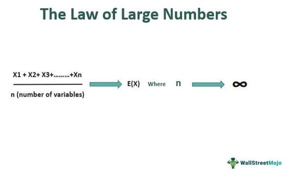

The Law of Large Numbers (LLN) is a foundational element in the field of probability theory and statistics, essential for understanding the behavior of averages over numerous trials. The LLN posits that as the number of trials in a probability experiment increases, the average of the observed outcomes converges towards the expected value. This phenomenon is mathematically expressed as:

$$
\lim_{n \to \infty} \frac{1}{n} \sum_{i=1}^{n} X_i = \mu
$$



where $X_i$ are independent and identically distributed random variables with expected value $\mu$. This principle not only underpins a wide range of statistical analyses but also finds application in various practical contexts, such as automated trading systems in financial markets.

Automated trading relies on the LLN by executing a large number of trades to smooth out the randomness of individual outcomes, allowing the aggregate results to mirror theoretical expectations more closely. The LLN enables traders to enhance the accuracy of their models by ensuring that their calculations and predictions are statistically sound as the volume of transactions increases.

This article will explore the definitions of the LLN, illustrate its applications in trading, and provide several pertinent examples to elucidate its significance. The discussion will extend to examining the relationship between the LLN and the Central Limit Theorem, as well as the influence of LLN on algorithmic trading strategies. Understanding these concepts is crucial for anyone involved in statistical analysis and financial modeling, as they provide the framework for interpreting large data sets and making informed decisions based on probabilistic outcomes.

## Table of Contents

## Understanding the Law of Large Numbers

The Law of Large Numbers (LLN) is a key theorem within probability theory and [statistics](/wiki/bayesian-statistics), articulating the behavior of averages calculated from random samples. The core idea is that, as the number of observations from a population increases, the sample mean tends to converge to the population mean. This principle underlies many statistical processes and supports more accurate predictions.

More specifically, the LLN is formulated in two distinct types: the Weak Law and the Strong Law. The Weak Law of Large Numbers suggests that for any positive number $\epsilon$, the probability that the absolute difference between the sample average $\bar{X}_n$ and the expected value $\mu$ exceeds $\epsilon$ approaches zero as the sample size $n$ increases, formally expressed as:

$$
P(|\bar{X}_n - \mu| \geq \epsilon) \rightarrow 0 \quad \text{as} \quad n \rightarrow \infty
$$

On the other hand, the Strong Law of Large Numbers states that the sample averages almost surely converge to the expected value. In mathematical terms, it can be expressed as:

$$
P\left(\lim_{n \to \infty} \bar{X}_n = \mu \right) = 1
$$

A critical aspect of applying the LLN is the assumption that random variables are independent and identically distributed (i.i.d.). This assumption means that each observation must be drawn from the same probability distribution and be statistically independent from one another—characteristics essential for accurate statistical modeling.

Implementing the LLN in practical scenarios allows analysts to draw more reliable inferences as datasets grow larger. As sample sizes increase, variability diminishes, and statistical estimations become more accurate, reflecting true population parameters. Here's a simple Python example demonstrating LLN with a simulation of dice rolls:

```python
import numpy as np
import matplotlib.pyplot as plt

# Simulate rolling a fair six-sided die
np.random.seed(42)  # for reproducibility
n_trials = 10000
rolls = np.random.randint(1, 7, n_trials)
cumulative_average = np.cumsum(rolls) / np.arange(1, n_trials + 1)

# Plotting the cumulative average of dice rolls
plt.figure(figsize=(10, 6))
plt.plot(cumulative_average, label='Cumulative Average')
plt.axhline(y=3.5, color='r', linestyle='--', label='Expected Value 3.5')
plt.title('Law of Large Numbers Demonstration with Dice Rolls')
plt.xlabel('Number of Trials')
plt.ylabel('Cumulative Average')
plt.legend()
plt.show()
```

This code simulates the rolling of a fair dice and calculates the cumulative average, illustrating how, over many trials, the average converges to the expected value of 3.5, which is the mean outcome of a uniform distribution over the numbers 1 to 6. This exemplifies the Law of Large Numbers and its pivotal role in achieving more precise statistical outcomes as the sample size increases.

## Applications in Algorithmic Trading

Algorithmic trading significantly benefits from the Law of Large Numbers (LLN) due to its emphasis on statistical predictability and risk minimization. As the frequency of trades increases, the LLN indicates that the average outcome converges to the expected value, thus leading to more consistent portfolio performance. This principle is crucial because as trading systems execute a higher [volume](/wiki/volume-trading-strategy) of trades, the aggregate of these transactions tends to stabilize around the market's true expected value, reducing the effect of randomness.

In automated trading, implementing the LLN helps diminish the impact of anomalous outliers. For instance, an [algorithmic trading](/wiki/algorithmic-trading) model that executes a substantial number of trades over time can expect that any errors or deviations from expected returns will average out. This results in a clear path to more stable financial outcomes. The strategic advantage here lies in minimizing risk; by harnessing the law's principles, traders can design algorithms that focus on systematic patterns within the market, utilizing large data sets to iron out [volatility](/wiki/volatility-trading-strategies).

LLN also aids traders in refining entry and [exit](/wiki/exit-strategy) strategies for trades by aligning predictions with long-term market trends. A fundamental aspect of algorithmic trading is accurate prediction of price movements, where LLN ensures that with more transactions, the predictions become progressively reliable. Traders craft algorithms around this notion, enhancing their ability to predict market movements by studying historical data patterns that align closely with expected averages.

Python is frequently used to implement these algorithmic strategies. Below is a simplified example showing how one might simulate convergence to an expected value using Python:

```python
import numpy as np

# Simulate random variables (e.g., stock returns)
num_trials = 10000
returns = np.random.normal(loc=0.05, scale=0.1, size=num_trials)

# Calculate cumulative averages
cumulative_averages = np.cumsum(returns) / np.arange(1, num_trials + 1)

# Plotting to illustrate convergence
import matplotlib.pyplot as plt

plt.plot(cumulative_averages)
plt.axhline(y=0.05, color='r', linestyle='--', label="Expected Mean")
plt.xlabel('Number of Trials')
plt.ylabel('Cumulative Average')
plt.title('Illustration of LLN in Algorithmic Trading')
plt.legend()
plt.show()
```

This simulation represents the application of LLN where the mean of these trials converges to the expected value as the number of trials increases, mirroring the behavior of a trading model predicting returns over an extended period. By capitalizing on this law, algorithmic trading not only becomes a methodology to predict trends more accurately but also becomes a risk-averse strategy that can scale effectively with larger datasets and increased transaction frequency.

## Statistical Analysis Example

A common example to illustrate the Law of Large Numbers (LLN) involves the simple experiment of flipping a fair coin, where the probability of obtaining heads is 0.5. According to the LLN, as the number of coin flips increases, the observed proportion of heads will converge to the theoretical probability of 0.5. Mathematically, if $X_1, X_2, \ldots, X_n$ are independent Bernoulli random variables where $X_i = 1$ if the ith flip is heads and $X_i = 0$ otherwise, then the sample mean $\bar{X}_n = \frac{1}{n}\sum_{i=1}^{n} X_i$ will converge to the expected value $E(X) = 0.5$ as $n$ approaches infinity.

In stock markets, this principle is similarly applicable to analyzing price movements. By increasing the volume of historical data analyzed, investors can generate more reliable estimates of an asset's average price movement. This convergence towards a true average enables investors to make more informed decisions, reduce uncertainty, and potentially improve returns by minimizing stochastic noise inherent in smaller datasets. 

Insurance companies also leverage the LLN by pooling data from numerous policyholders to estimate risk more accurately. For example, an insurer assessing the likelihood of a claim being filed can rely on the LLN by collecting a larger number of observations. As the number of policies increases, the average claim rate across all policyholders will converge to the expected claim rate. This enables insurers to set premiums that are commensurate with the risk, thereby ensuring financial stability and fairness in pricing.

In summary, the Law of Large Numbers provides a powerful tool for statistical analysis across various domains, allowing for more accurate predictions and decisions based on extensive data, including contexts such as financial markets and risk assessment in insurance.

## LLN and Central Limit Theorem

The Law of Large Numbers (LLN) and the Central Limit Theorem (CLT) are two fundamental concepts in probability theory that often work in tandem to provide insights into statistical analysis. The LLN ensures that as the size of a sample increases, the sample mean approaches the population mean. This convergence is crucial for making reliable inferences about a population based on sample data.

On the other hand, the Central Limit Theorem explains an essential phenomenon related to the distribution of sample means. According to the CLT, regardless of the original distribution of the data, the distribution of sample means approaches a normal distribution as the sample size becomes large enough. This normality holds true even if the original data itself is not normally distributed, provided that the samples are sufficiently large (commonly n > 30 is used as a rule of thumb).

Mathematically, let $X_1, X_2, \ldots, X_n$ be a sequence of independent and identically distributed random variables with mean $\mu$ and variance $\sigma^2$. According to the CLT, the standardized sample mean:

$$
Z = \frac{\bar{X} - \mu}{\sigma/\sqrt{n}}
$$

approaches a standard normal distribution $N(0,1)$ as $n$ increases.

These two theorems play a pivotal role in financial analytics, particularly in risk modeling. In practical applications, analysts often use the LLN to assure that estimates of market parameters become stable as more data is collected. Meanwhile, the CLT provides the theoretical foundation that justifies the use of normal distribution models to approximate the behavior of market portfolios or to perform hypothesis testing.

In financial markets, for instance, the understanding provided by LLN helps traders and analysts gauge the expected returns of their portfolios by reinforcing confidence in the long-run stability of averages. Simultaneously, the CLT's implication allows risk managers to assess the probability of extreme events occurring by modeling returns and other financial metrics as normally distributed in large samples. Hence, both LLN and CLT are essential tools for making informed and statistically sound predictions in various domains, particularly in finance where data-driven decision making and risk assessment are critical.

## Business Growth and the Law of Large Numbers

In business contexts, the Law of Large Numbers (LLN) plays a crucial role in understanding growth dynamics, especially for large-scale companies. As businesses expand, the initial high growth rates observed in early stages become increasingly difficult to maintain. This is primarily due to the mathematical constraints implied by LLN. The principle suggests that as the scale of a business increases, the opportunities for proportionate growth diminish, causing growth rates to stabilize.

For blue-chip companies, which are typically well-established and financially sound, LLN explains the natural deceleration in growth. These companies often experience rapid expansion during their nascent stages, driven by innovation or market penetration breakthroughs. However, as their base of operations expands and becomes more entrenched, replicating the same percentage growth becomes challenging. Investors, therefore, need to be mindful of the initial growth rates, understanding that they may not be indicative of long-term trends.

Analysts use the insights from LLN to construct more accurate financial forecasts. By recognizing that a rapid expansion rate is often unsustainable as a company matures, they can adjust their models to better predict future performance. This approach helps in setting realistic expectations among stakeholders, aligning investment strategies with anticipated growth patterns. The law underscores the importance of scale when assessing long-term investment opportunities, cautioning against overestimating a company's potential to perpetuate its early success.

## Conclusion

The Law of Large Numbers stands as a cornerstone of statistical methodology, bridging the gap between theoretical probability and practical applications in trading, business, and investment. By ensuring that sample means converge to the population mean as the number of observations increases, the LLN empowers analysts and traders to make informed decisions based on accumulated data. This statistical principle reduces uncertainty, allowing for improved risk management and optimized decision-making processes as datasets grow. With algorithmic trading, the LLN is particularly valuable, providing traders with enhanced accuracy in predicting market behavior and refining trading strategies against the backdrop of complex, real-world data distributions. 

As data volumes expand and transaction speeds accelerate in financial markets, the importance of comprehending and applying the LLN becomes increasingly evident. In algorithmic contexts, where precision and responsiveness are paramount, the LLN aids in the development of robust trading algorithms that adapt to evolving market conditions. The ability to predict market performance and make data-driven decisions with confidence is crucial, and the Law of Large Numbers offers a mathematical foundation to support such endeavors. As financial technology continues to evolve, the principles of the LLN will remain an essential tool for analysts and traders seeking to harness the potential of large datasets and fast-paced market environments.

## References & Further Reading

[1]: ["Probability and Statistics"](https://ocw.mit.edu/courses/18-05-introduction-to-probability-and-statistics-spring-2022/) by Morris H. DeGroot and Mark J. Schervish

[2]: ["The Concepts and Practice of Mathematical Finance"](https://archive.org/download/quant_books/Concepts%20_%20Practice%20of%20Mathematical%20Finance%20-%20M.%20S.%20Joshi.pdf) by Mark S. Joshi

[3]: Breiman, L. (1968). ["Probability"](https://archive.org/details/probability0000unse_s2l6) Addison-Wesley series in statistics.

[4]: ["An Introduction to Statistical Learning"](https://www.statlearning.com/) by Gareth James, Daniela Witten, Trevor Hastie, and Robert Tibshirani

[5]: Williams, D. (1991). ["Probability with Martingales"](https://books.google.com/books/about/Probability_with_Martingales.html?id=e9saZ0YSi-AC) Cambridge University Press.  

[6]: ["High-Frequency Trading: A Practical Guide to Algorithmic Strategies and Trading Systems"](https://www.amazon.com/High-Frequency-Trading-Practical-Algorithmic-Strategies/dp/0470563761) by Irene Aldridge

[7]: Billingsley, P. (1995). ["Probability and Measure"](https://openlibrary.org/books/OL1103491M/Probability_and_Measure) Wiley Series in Probability and Statistics.