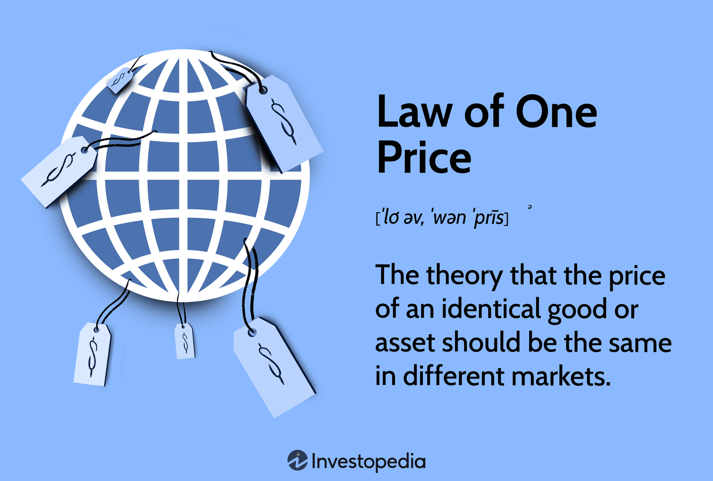

## Table of Contents

## What is the Law of One Price?

The Law of One Price is a simple idea in economics. It says that if there are no barriers or costs to moving goods, the same item should cost the same everywhere. Imagine you can buy a toy in New York and in London. If there are no extra costs like shipping or taxes, the toy should have the same price in both places. If it doesn't, people might buy it where it's cheaper and sell it where it's more expensive until the prices become the same.

However, in the real world, things are not always this simple. There can be many reasons why prices are different in different places. For example, there might be shipping costs, taxes, or even different levels of demand in different areas. These factors can make it hard for the Law of One Price to work perfectly. Still, it's a useful idea that helps economists understand how markets should work if everything was equal.

## How does the Law of One Price relate to arbitrage?

The Law of One Price and arbitrage are closely connected. Arbitrage is when someone buys something in one place where it's cheaper and sells it in another place where it's more expensive. This is done to make a profit from the price difference. The Law of One Price says that if there are no barriers, the same thing should cost the same everywhere. If prices are different, arbitrage can happen, which helps to make the prices the same over time.

For example, if a book costs $10 in the US but $15 in Canada, someone might buy the book in the US and sell it in Canada. By doing this, they make a $5 profit per book. As more people do this, the supply of books in Canada goes up, which can lower the price there. At the same time, the demand for books in the US goes up, which can raise the price there. Eventually, the prices in both places should get closer to each other, which is what the Law of One Price predicts.

## What are the basic assumptions of the Law of One Price?

The Law of One Price assumes that there are no barriers to trade. This means that goods can move freely from one place to another without any extra costs like shipping or taxes. It also assumes that information about prices is available to everyone. If people know the prices in different places, they can make smart choices about where to buy and sell things.

Another important assumption is that there are no differences in the goods themselves. This means that the same product is the same everywhere, no matter where you buy it. If all these things are true, then the Law of One Price says that the price of the same item should be the same in all places. But in the real world, these assumptions often don't hold, so prices can be different in different places.

## Can you explain the Law of One Price with a simple example?

Imagine there are two stores, one in Town A and one in Town B. Both stores sell the same brand of chocolate bar. If there are no extra costs like shipping or taxes, the Law of One Price says that the chocolate bar should cost the same in both stores. For example, if the chocolate bar costs $1 in Town A, it should also cost $1 in Town B.

But let's say the chocolate bar costs $1 in Town A and $1.50 in Town B. If people can easily move the chocolate bars between the towns without any extra costs, someone might buy the chocolate bars in Town A for $1 and sell them in Town B for $1.50. This is called arbitrage. As more people do this, the price in Town B might go down, and the price in Town A might go up, until both stores are selling the chocolate bar for the same price.

## What factors can cause deviations from the Law of One Price?

Several things can make the price of the same thing different in different places, which goes against the Law of One Price. One big reason is the cost of moving goods from one place to another. If it costs a lot to ship something, the price in the place where it's shipped to will be higher than in the place where it's shipped from. Another reason is taxes. If one place has higher taxes on a product, the price there will be higher. Also, if information about prices is not easy to get, people might not know where to buy things cheaper, so prices stay different.

Another factor is that the same product might not be exactly the same everywhere. For example, a brand of soda might taste a bit different in one country because of local ingredients or laws. This can make people willing to pay different prices for what they think is the same thing. Finally, the demand for a product can be different in different places. If more people want something in one place, the price there might be higher than in a place where fewer people want it. All these things can make prices different and cause the Law of One Price not to work perfectly.

## How does the Law of One Price apply to international trade?

In international trade, the Law of One Price says that if there are no barriers, the same thing should cost the same in every country. For example, if a toy costs $10 in the United States, it should also cost $10 in Japan, if there are no extra costs like shipping or taxes. But in the real world, it's hard for this to happen because there are many barriers to moving goods between countries.

One big barrier is the cost of shipping. It can be expensive to send things across oceans, so the price of a product might be higher in a country far away from where it's made. Another barrier is taxes. Different countries have different taxes on products, which can make the price higher in one place than another. Also, the demand for a product can be different in different countries. If more people want a product in one country, the price there might be higher than in a country where fewer people want it. All these things can make the Law of One Price not work perfectly in international trade.

## What role does transportation cost play in the Law of One Price?

Transportation costs are a big reason why the Law of One Price doesn't always work. The Law of One Price says that if there are no barriers, the same thing should cost the same everywhere. But moving goods from one place to another can be expensive. For example, if it costs $5 to ship a toy from New York to Los Angeles, the price of the toy in Los Angeles will be higher than in New York because the seller needs to cover the shipping cost.

These extra costs mean that even if the toy is the same, its price will be different in different places. If people in Los Angeles are willing to pay the higher price, the toy will cost more there than in New York. This goes against the Law of One Price, which says the prices should be the same if there are no barriers. So, transportation costs are one of the main things that can make prices different in different places.

## How do tariffs and trade barriers affect the Law of One Price?

Tariffs and trade barriers are like big walls that stop the Law of One Price from working well. Tariffs are taxes that countries put on goods coming from other countries. If a country puts a big tariff on a product, like a car, it makes the car more expensive in that country than in the country where it was made. This means the price of the car won't be the same everywhere, which goes against the Law of One Price.

Trade barriers are other ways countries make it hard to move goods across their borders. These can be rules about safety, health, or the environment that make it harder or more expensive to sell things in another country. Because of these barriers, the cost of goods can be different in different places. So, even if a product is the same, tariffs and trade barriers can make its price different, which stops the Law of One Price from working perfectly.

## What is the impact of market imperfections on the Law of One Price?

Market imperfections are things that make it hard for the Law of One Price to work. The Law of One Price says that if there are no barriers, the same thing should cost the same everywhere. But in the real world, there are many things that can make prices different in different places. For example, if it costs a lot to move goods from one place to another, the price will be higher in the place where the goods are sent. Also, if there are taxes or rules that make it hard to sell things in another country, this can make prices different.

Another thing that can make the Law of One Price not work is if people don't know the prices in different places. If information is hard to get, people might not know where to buy things cheaper, so prices stay different. Also, if the same product is a bit different in different places, like a drink that tastes different because of local ingredients, people might be willing to pay different prices for what they think is the same thing. All these market imperfections can make it hard for the Law of One Price to work the way it should.

## How can the Law of One Price be tested empirically?

To test the Law of One Price, researchers look at prices of the same product in different places. They compare these prices to see if they are the same or different. For example, they might check the price of a certain brand of shoes in New York and Tokyo. If the prices are the same, it supports the Law of One Price. But if the prices are different, it shows that something is stopping the law from working, like shipping costs or taxes.

Researchers often use something called the "Big Mac Index" to test the Law of One Price. This index looks at the price of a Big Mac in different countries. Since a Big Mac is the same everywhere, its price should be the same if the Law of One Price works perfectly. But if a Big Mac costs more in one country than another, it shows that there are barriers like different costs or demand that make prices different. By looking at these differences, researchers can learn more about what stops the Law of One Price from working in the real world.

## What are the criticisms of the Law of One Price?

Some people think the Law of One Price is too simple. It says that if there are no barriers, the same thing should cost the same everywhere. But in the real world, there are many things that can make prices different in different places. For example, it can cost a lot to move goods from one place to another. Also, different countries have different taxes and rules that can make prices higher or lower. These things make it hard for the Law of One Price to work perfectly.

Another problem is that the same product might not be exactly the same everywhere. For example, a drink might taste a bit different in one country because of local ingredients or laws. This can make people willing to pay different prices for what they think is the same thing. Also, the demand for a product can be different in different places. If more people want something in one place, the price there might be higher than in a place where fewer people want it. All these things show that the Law of One Price might not be very useful in understanding how prices work in the real world.

## How does the Law of One Price integrate with other economic theories?

The Law of One Price is connected to other big ideas in economics, like the theory of purchasing power parity (PPP) and the idea of arbitrage. Purchasing power parity says that if you can buy the same things in different countries, the exchange rate between those countries should make the prices the same. This is like the Law of One Price, but it looks at prices in different countries and how they should be the same when you change the money from one country to another. Arbitrage is when someone buys something where it's cheap and sells it where it's more expensive to make a profit. This helps make prices the same over time, which is what the Law of One Price says should happen.

The Law of One Price also fits with the idea of perfect competition. In perfect competition, there are many buyers and sellers, and everyone knows the prices. This means that if the same thing costs different amounts in different places, people will buy it where it's cheaper and sell it where it's more expensive until the prices are the same. But in the real world, there are many things that stop perfect competition from happening, like costs to move goods, taxes, and rules that make it hard to sell things in other places. These things make it hard for the Law of One Price to work perfectly, but it's still a useful idea that helps economists understand how markets should work if everything was equal.

## What is Understanding Market Equilibrium?

Market equilibrium occurs when the quantity of a good or service supplied is equal to the quantity demanded, resulting in a stable market price. This concept is foundational in economics as it signifies a state where market forces are balanced and there is no inherent tendency for change. Equilibrium price and quantity are determined where the supply and demand curves intersect in a graph. Mathematically, market equilibrium can be expressed in the equation:

$$
Q_d(P) = Q_s(P)
$$

where $Q_d(P)$ is the quantity demanded at price $P$, and $Q_s(P)$ is the quantity supplied.

### Characteristics of Market Equilibrium

1. **Price Stability**: At market equilibrium, there is no shortage or surplus of goods, leading to stable prices.
2. **Efficient Resource Allocation**: Resources are allocated optimally, as producers supply exactly what consumers are willing to purchase.
3. **Economic Efficiency**: Both consumer and producer surplus are maximized, indicating no waste of resources.

### Balancing Supply and Demand

The interaction of supply and demand is a dynamic process. When a market is not in equilibrium, forces are set into motion to move towards it. For instance, if the price is too high, supply exceeds demand, creating a surplus. This surplus pressures sellers to reduce prices, increasing demand and lowering supply until equilibrium is achieved. Conversely, if the price is too low, demand exceeds supply, leading to a shortage, which drives prices upward.

### Factors Impacting Market Equilibrium

1. **Consumer Preferences**: Changes in preferences shift the demand curve, altering equilibrium. For example, a rise in demand for electric cars can shift the equilibrium price and quantity upward.
2. **Technological Changes**: Improvements in technology can increase supply by making production more efficient, shifting the supply curve to the right, potentially decreasing prices and increasing equilibrium quantity.
3. **Market Dynamics**: External factors, such as regulatory changes or entry of new competitors, can influence equilibrium. Regulations might shift costs, affecting supply, while competition can alter both supply and demand dynamics.

### Impact on Pricing and Resource Allocation

Market equilibrium significantly affects pricing and resource allocation, ensuring that goods and services are produced in quantities that meet consumer needs without excess. It helps in determining the most efficient distribution of resources, as producers align their output with consumer demands. Changes in equilibrium result in adjustments in production and consumption patterns, which are essential for responding to shifts in economic conditions. This constant adjustment mechanism ensures that markets remain responsive to the needs and wants of society, promoting overall economic welfare.

## References & Further Reading

[1]: Fama, E. F. (1965). ["Random Walks in Stock Market Prices."](https://www.semanticscholar.org/paper/Random-Walks-in-Stock-Market-Prices-Fama/12ad140d72c416c63a559b32c476501c3a9febd7) Financial Analysts Journal, 21(5), 55-59.

[2]: Lo, A. W. (2004). ["The Adaptive Markets Hypothesis: Market Efficiency from an Evolutionary Perspective."](https://papers.ssrn.com/sol3/papers.cfm?abstract_id=602222) The Journal of Portfolio Management, 30(5), 15-29.

[3]: Shleifer, A. (1986). ["Do Demand Curves for Stocks Slope Down?"](https://www.jstor.org/stable/2328486) The Journal of Finance, 41(3), 579-590. 

[4]: Ross, S. A. (1976). ["The Arbitrage Theory of Capital Asset Pricing."](https://www.sciencedirect.com/science/article/pii/0022053176900466) Journal of Economic Theory, 13(3), 341-360.

[5]: Malkiel, B. G. (2003). ["The Efficient Market Hypothesis and Its Critics."](https://pubs.aeaweb.org/doi/10.1257/089533003321164958) Journal of Economic Perspectives, 17(1), 59-82.