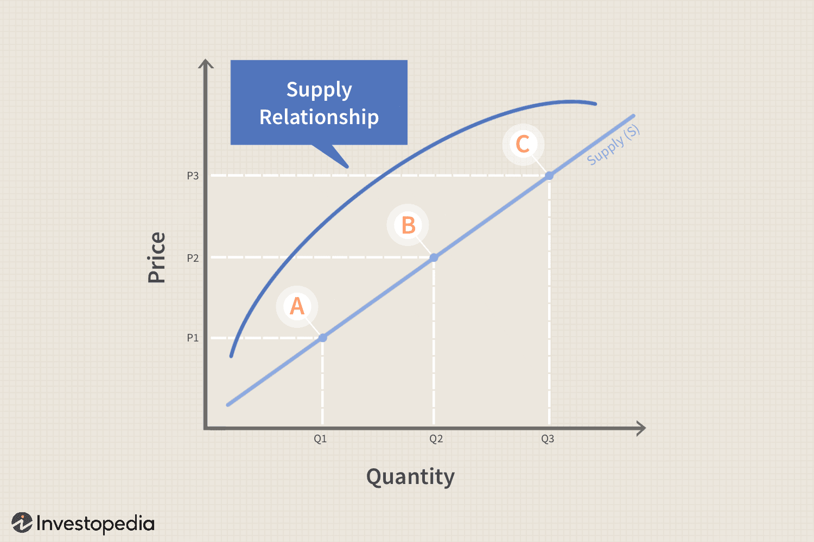

Supply is a cornerstone of economic theory, embodying the various quantities of a good or service that producers are willing and able to offer at different price levels over a specific period. Its significance in economics cannot be overstated, as it directly influences market dynamics, pricing strategies, and economic equilibrium. The comprehensive understanding of supply is critical to navigating and interpreting the complexities of market behavior.

The law of supply is a fundamental concept which states that, ceteris paribus, an increase in the price of a good will result in an increase in the quantity supplied. This relationship is typically depicted using the supply curve, a graphical representation illustrating how quantity supplied varies with price. The curve typically slopes upwards from left to right, reflecting the direct relationship between price and quantity supplied.

There are different types of supply to consider: market supply, which aggregates individual supply levels within a market; individual supply, representing the amount one firm is willing to sell; and composite supply, which combines supply levels of substitute goods or services. Each type plays a unique role in economic interaction, affecting decision-making processes of firms and outcomes in competitive markets.

The emergence of algorithmic trading has introduced new dimensions to supply concepts. By utilizing algorithms to make trading decisions, it blends traditional economic theories with advanced computational techniques to execute trades at speeds and volumes unattainable by human traders. Understanding the basic principles of supply is essential in developing effective algorithmic trading strategies, particularly as these algorithms rely on supply data to predict market trends, optimize pricing models, and improve decision-making capabilities.

This article aims to provide a detailed exploration of these essential economic concepts: the types of supply, the law of supply, and the supply curve, while also examining the intersection between supply dynamics and algorithmic trading. This topic is increasingly relevant in today's fast-paced economic and trading environments, where technological advancements continuously reshape market landscapes. Understanding the supply-related concepts not only strengthens foundational economic knowledge but also enhances one's ability to engage with modern financial technologies.

## Table of Contents

## Understanding the Types of Supply

Supply in economics refers to the total amount of a specific good or service that is available to consumers. The concept of supply is fundamental in understanding market operations and plays a critical role in determining prices and quantities traded in the market. Supply is influenced by factors such as production costs, technological advancements, and market conditions, and it interacts closely with demand to shape market dynamics.

### Types of Supply

1. **Market Supply**: Market supply is the aggregate of individual supplies of all producers in the market for a particular good or service. It is typically represented by a supply curve, which illustrates the relationship between price and quantity supplied. An increase in price generally leads to an increase in quantity supplied, assuming other factors remain constant. For instance, in the oil industry, the market supply is the sum of oil supplied by all producers worldwide. Competition, production technology, and resource availability are some factors affecting market supply.

2. **Individual Supply**: This represents the supply of goods or services that a single seller offers in the market. Individual supply is influenced by the producer's cost of production, pricing strategies, and production capacity. For example, a local farmer selling tomatoes at a market is an individual supplier. The farmer's decision on how much to supply depends on input costs, weather conditions affecting harvests, and market prices for tomatoes.

3. **Composite Supply**: Composite supply occurs when multiple components or products are combined to fulfill a demand for a composite product. It highlights the interdependence of different goods in producing a final product. An example is the supply of cars, which depends on the availability of steel, rubber, glass, and electronic components. The composite nature of car supply means that disturbances in the supply of any input can affect the overall market supply of cars.

### Role in Economic Interactions

Each type of supply plays a distinctive role in economic interactions. Market supply influences overall market prices and balances demand to stabilize markets. Individual supply decisions affect microeconomic conditions, impacting local market activities and pricing. Composite supply ties various sectors together, emphasizing the importance of supply chain management in maintaining economic stability.

### Real-world Implications

The different types of supply have profound implications for markets. Market supply shifts can lead to price changes, affecting consumer purchasing power and inflation rates. Individual supply adjustments can create competitiveness, innovation, and efficiency improvements. Composite supply disruptions can cause bottlenecks, evident in global events such as the semiconductor shortage affecting electronics and automotive industries.

In summary, understanding the types of supply provides valuable insights into how markets function and respond to various internal and external influences. Recognizing these dynamics helps policymakers, businesses, and consumers make informed decisions in an interconnected economic landscape.

## Exploring the Law of Supply

The law of supply is a fundamental principle in economics that describes the direct relationship between the price of a good or service and the quantity supplied. The basic principle asserts that, ceteris paribus (all other factors being equal), as the price of a good increases, producers are willing to supply more of it; conversely, if the price decreases, the quantity supplied tends to decrease. This positive correlation is driven by the incentive for producers to generate greater revenue as prices rise.

The relationship between price and quantity supplied can be mathematically expressed using a supply function: 

$$
Q_s = f(P)
$$

where $Q_s$ is the quantity supplied and $P$ is the price. A simple linear supply function may take the form:

$$
Q_s = c + dP
$$

Here, $c$ represents the intercept, and $d$ (positive) indicates the slope or the rate at which the quantity supplied responds to price changes.

Shifts in the supply curve, which graphically represents the law of supply, occur when factors other than price affect supply. Some key factors leading to shifts include:

1. **Production Costs**: Increases in costs of inputs like raw materials or labor can decrease supply, shifting the curve leftward. Conversely, reductions in production costs can increase supply, shifting the curve rightward.

2. **Technological Advances**: Enhancements in technology often make production more efficient, leading to increased supply.

3. **Number of Suppliers**: An increase in the number of suppliers in the market typically raises the total market supply, shifting the supply curve to the right.

4. **Government Policies**: Taxes, subsidies, and regulations can significantly impact the cost of production and supply.

5. **Expectations of Future Prices**: If producers expect higher future prices, they might reduce current supply to sell more later, causing the current supply to decrease.

Graphically, the supply curve is usually upward-sloping, reflecting the direct relationship between price and quantity supplied:

In real-world scenarios, the law of supply can be observed across various industries. For example, during oil price escalations, oil companies tend to increase production to capitalize on the higher prices, illustrating the positive price-supply relationship. Similarly, in agriculture, crop producers adjust the quantity of produce supplied based on changes in market prices, often influenced by demand fluctuations and harvest yields.

Understanding the nuances of the law of supply is crucial for businesses in planning production levels and for policymakers designing economic interventions. As markets and external factors evolve, continuously analyzing supply dynamics remains vital for effective economic decision-making.

## Analyzing the Supply Curve

The supply curve is a fundamental concept in economics, offering a visual representation of the relationship between the price level of a good or service and the quantity supplied over a given period. It is typically upward sloping, reflecting the law of supply, which posits that, all else being equal, an increase in price results in an increase in the quantity supplied.

### Visual Representation of the Law of Supply

The supply curve graphically illustrates the law of supply. When price increases, the quantity supplied typically increases, and vice versa. Consider the basic equation for a straight-line supply curve:

$$
Q_s = c + dP
$$

where $Q_s$ is the quantity supplied, $P$ is the price, $c$ represents the intercept, and $d$ reflects the slope of the supply curve. A positive $d$ indicates that as price ($P$) increases, the quantity supplied ($Q_s$) also increases, demonstrating the direct relationship central to the law of supply.

### Factors Influencing the Supply Curve

Several factors can influence the shape and position of the supply curve:

1. **Production Costs:**
   Changes in the cost of production, such as labor or raw materials, directly impact the supply curve. A rise in production costs can decrease supply, shifting the supply curve to the left, while a decrease can increase supply, shifting the curve to the right.

2. **Technological Advancements:**
   Improved technology can enhance production efficiency, leading to an increase in supply and a rightward shift in the supply curve.

3. **Number of Suppliers:**
   An increase in the number of suppliers in the market generally increases the market supply, shifting the curve to the right. Conversely, a decrease in the number of suppliers shifts the curve left.

4. **Government Policies:**
   Taxes, subsidies, and regulations can significantly affect supply. For instance, higher taxes on production can reduce supply, shifting the curve left, while subsidies can increase supply, shifting the curve right.

5. **Expectations of Future Prices:**
   If suppliers expect higher future prices, they might hold back current supply, reducing present supply and shifting the curve left.

### Movements Along vs. Shifts of the Supply Curve

Understanding the differences between movements along the supply curve and shifts of the curve is crucial:

- **Movements Along the Curve:**
  Movements occur when there is a change in price, leading to a change in the quantity supplied. This results in a move along the existing supply curve.

- **Shifts of the Curve:**
  Shifts occur when factors other than price affect supply, such as changes in production cost or technology. These lead to a new supply curve either to the right (increase in supply) or to the left (decrease in supply).

### Impact of Government Policies and Market Changes

Government interventions and market dynamics can cause substantial shifts in the supply curve. For instance:

- **Policies such as taxes and subsidies**: As previously mentioned, taxes can discourage production, while subsidies encourage it. An example is the effect of subsidies in the agricultural sector, where subsidies can lead to increased output and a rightward shift in the supply curve.

- **Regulatory Changes**: Stringent regulations may increase the costs of production, thus reducing supply.

- **Market Entry or Exit**: The entry of new firms increases supply, while the exit of firms reduces supply.

These shifts and movements are pivotal for policymakers and businesses in forecasting supply trends and aligning production strategies with market demands. Understanding the supply curve's nuances facilitates more informed decision-making in economic and trading environments.

## Algorithmic Trading and Its Connection to Supply Concepts

Algorithmic trading, often abbreviated as algo trading, refers to the use of computer algorithms to execute trades at speeds and frequencies that human traders cannot achieve. These algorithms follow pre-set rules and formulas to place trades based on price, timing, [volume](/wiki/volume-trading-strategy), and other market conditions. Algorithmic trading has revolutionized financial markets by increasing efficiency and [liquidity](/wiki/liquidity-risk-premium), and it now accounts for a significant portion of all trading activities globally.

Supply data is a crucial component of [algorithmic trading](/wiki/algorithmic-trading) strategies, providing insights into market dynamics that influence trading decisions. By analyzing supply data, algorithms can detect patterns, anticipate market movements, and adjust trading strategies accordingly. The law of supply, which outlines the relationship between price and the quantity of goods producers are willing to supply, plays a fundamental role in shaping these strategies. A supply curve, typically upward-sloping, illustrates this relationship and can be used by algorithms to predict price changes in response to shifts in supply.

Algorithms integrate supply concepts to optimize trade execution. For example, an algorithm might adjust its purchase or sale orders based on anticipated changes in supply due to factors like production schedules, regulatory changes, or natural disasters. By incorporating supply curves, algorithms can better anticipate market reactions to these shifts, executing trades that maximize profit or minimize risk.

Numerous case studies have demonstrated the influence of supply dynamics on trading algorithms. For example, an analysis of agricultural markets might reveal how seasonal supply changes affect commodity prices. An algorithm equipped with this knowledge could optimize trading strategies around agricultural outputs, ensuring purchases are made before supply decreases drive prices up.

Furthermore, the continuous development of [machine learning](/wiki/machine-learning) and [artificial intelligence](/wiki/ai-artificial-intelligence) technologies is paving the way for more sophisticated algorithms. These algorithms can process vast amounts of supply and market data, learning and adapting trading strategies over time. The integration of advanced predictive analytics with supply economics holds significant potential for the future of algorithmic trading.

In conclusion, the interplay between supply concepts and algorithmic trading underscores the importance of supply data in developing robust trading strategies. As technology evolves, the ability to predict and respond to market changes based on supply dynamics will become increasingly important, heralding new innovations in financial markets.

## Conclusion

In conclusion, this article has explored the intricate dynamics of supply in economics, emphasizing the types of supply, the law of supply, and the supply curve. A clear understanding of these concepts is essential as they form the foundation upon which supply interacts with economic markets. Types of supply, including market supply, individual supply, and composite supply, play unique roles in shaping market behaviors and economic outcomes. Recognizing how these types function can provide valuable insights into market fluctuations and strategic decision-making.

The law of supply, which illustrates the relationship between price and quantity supplied, underpins economic theory and practice. It is depicted graphically through the supply curve, which shifts based on various factors, including technological changes, input costs, and policy interventions. Familiarity with these concepts allows for a deeper comprehension of market responses and aids in predicting future trends.

The intersection of supply economics and algorithmic trading highlights the profound impact of supply data in contemporary trading strategies. Algorithmic trading harnesses these supply concepts to enhance trading efficiencies, exemplifying the critical role that supply dynamics play in modern financial systems. As technology continues to advance, the integration of supply economics with algorithmic trading is likely to evolve, shaping novel innovations and methodologies.

Understanding these supply dynamics is not only essential for economists and traders but also for policymakers and business leaders who navigate the complexities of global markets. As such, there is substantial value in further research and study of these topics, which will likely yield new insights and tools for economic analysis and strategy.

In closing, the intricate relationship between supply concepts and trading technologies offers a fertile ground for ongoing exploration, promising continued advancements and opportunities within economic and trading frameworks.

## References

1. **Academic Papers and Books on Supply Economics:**

   - Pindyck, R. S., & Rubinfeld, D. L. (2012). *Microeconomics* (8th ed.). Pearson Education. This book provides foundational knowledge on various microeconomic concepts, including the law of supply and demand, market mechanisms, and equilibrium.
   - Varian, H. R. (2014). *Intermediate Microeconomics: A Modern Approach*. W.W. Norton & Company. This text investigates into the principles of microeconomics with a clear focus on supply and demand dynamics across different market structures.
   - Marshall, A. (1890). *Principles of Economics*. Macmillan. A classical reference that details the original conceptualization of supply and demand principles.

2. **Citations of Industry Reports and Case Studies on Algorithmic Trading:**

   - Finance Magnates (2023). "Algorithmic Trading: Trends and Insights." This report analyzes the latest developments and future prospects of algorithmic trading in relation to supply chain data.
   - JPMorgan (2022). "The Impact of High-Frequency Trading on Market Supply and Demand Cycles." A study on how algorithmic trading affects market dynamics, specifically regarding liquidity and supply adjustments.
   - Bloomberg (2021). "Algorithmic Trading and Market Supply: Case Studies from the Stock Exchange." This resource includes case studies illustrating real-world applications of supply theories within trading algorithms.

3. **Resources for Further Reading on Economic Theories and Trading Strategies:**

   - Khan Academy: Offers free courses on supply and demand in economics. [Khan Academy Economics](https://www.khanacademy.org/economics-finance-domain).
   - Investopedia: Provides numerous articles on trading strategies, including those related to algorithmic trading. [Investopedia Trading](https://www.investopedia.com/trading-4427786).
   - Coursera: Online learning platform offering courses on economic theories and trading algorithms from top universities.

4. **Online Platforms and Tools for Learning More About Supply in Economics:**

   - EconTalk Podcast: Hosted by Russ Roberts, this podcast covers various economic topics, including in-depth discussions on the supply dynamics.
   - TradingView: A platform offering advanced charting tools for monitoring supply and demand trends in financial markets.
   - MIT OpenCourseWare: Free courses available on Supply Chain Economics and related subjects. [MIT Economics Courses](https://ocw.mit.edu/courses/economics/).

## References & Further Reading

[1]: Varian, H. R. (2014). ["Intermediate Microeconomics: A Modern Approach."](https://archive.org/details/intermediatemicr0000vari_z9edo2) W.W. Norton & Company.

[2]: Pindyck, R. S., & Rubinfeld, D. L. (2012). ["Microeconomics."](https://archive.org/details/microeconomics0007pind) Pearson Education.

[3]: Finance Magnates. (2023). ["Algorithmic Trading: Trends and Insights."](https://www.financemagnates.com/fm-events/algorithmic-trading-the-unveiling-of-pros-and-cons/) Retrieved from Finance Magnates website.

[4]: J.P. Morgan. (2022). ["The Impact of High-Frequency Trading on Market Supply and Demand Cycles."](https://www.jpmorgan.com/insights/global-research/outlook/mid-year-outlook)

[5]: Investopedia. ["Algorithmic Trading."](https://www.investopedia.com/terms/a/algorithmictrading.asp)

[6]: Coursera. ["Algorithmic Trading and Stocks Essential Training."](https://www.linkedin.com/learning/algorithmic-trading-and-stocks-essential-training-16977513) Available Courses from top universities.

[7]: Khan Academy. ["Economics and Finance Domain."](https://en.khanacademy.org/economics-finance-domain/ap-macroeconomics/economic-iondicators-and-the-business-cycle)

[8]: Bloomberg. (2021). ["Algorithmic Trading and Market Supply: Case Studies from the Stock Exchange."](https://www.researchgate.net/publication/378548435_Algorithmic_Trading_and_AI_A_Review_of_Strategies_and_Market_Impact)

[9]: Lopez de Prado, M. (2018). ["Advances in Financial Machine Learning."](https://www.amazon.com/Advances-Financial-Machine-Learning-Marcos/dp/1119482089) Wiley.